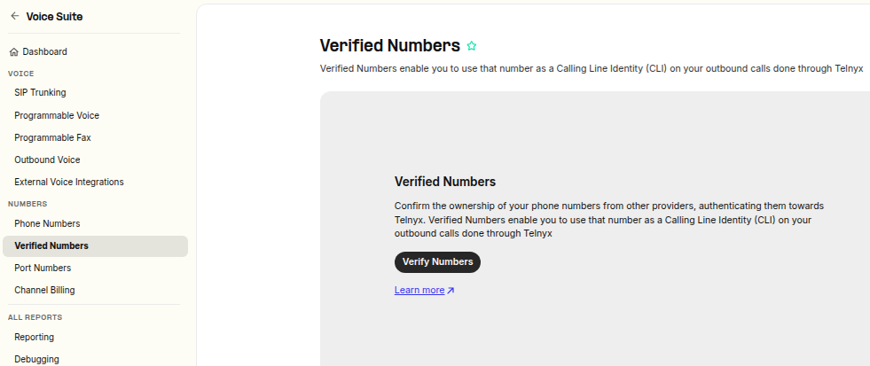
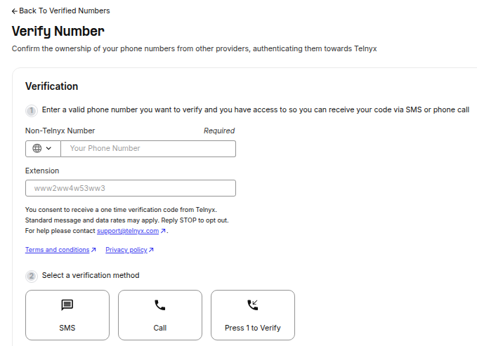
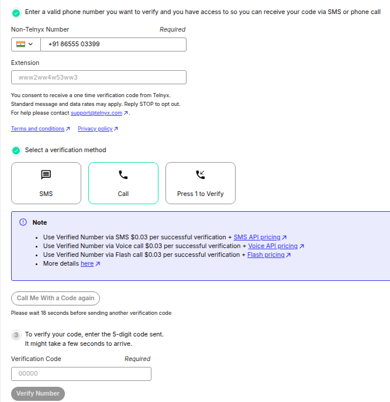
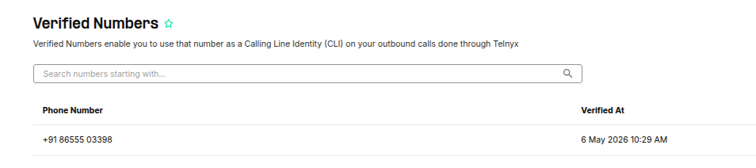

Verified Numbers | Telnyx Help Center

[Skip to main content](#main-content)

# Verified Numbers

Discover the benefits of verifying your phone number on Telnyx, ensuring the CLI is accurate to boost professionalism and trust.

Written by Dillin

May 6, 2026

Table of contents

# **Introduction**

Verified Numbers are phone numbers that have been confirmed to belong to the user and are authorized to display as the CLI on calls made through the Telnyx platform.

This verification process helps to ensure that the number being used as the CLI is accurate and belongs to the user, which can improve the caller's trustworthiness and professionalism.

Verifying a phone number on Telnyx is a simple process that allows non-Telnyx numbers to display as the calling line identification (CLI) on calls made through the Telnyx platform.

This document provides a step-by-step guide to verifying a phone number on Telnyx.

Step-by-Step Guide:

1. Log into the Mission Control Portal and select "Phone Numbers" in the Voice Suite from the navigation menu.
2. Choose "My Numbers" to view all Telnyx numbers associated with your account.
3. Back to the navigation menu, select "Verified Numbers" to access the "Verified Numbers" section.
4. Choose either SMS or Call as the method for verification.

   * If you choose SMS, a validation code will be sent to your non-Telnyx number via SMS.
   * If you choose Call, a voice call will be placed to your non-Telnyx number and an IVR will play the validation code twice.
5. Enter the verification code and press the "Verify Number" button.
6. Your number will now appear on the list of Verified Numbers and will be authorized to display as the CLI on calls made through the Telnyx platform.

## Using a Non-Telnyx Number as the Caller ID for Outgoing Calls

Using a phone number obtained from a different provider, not Telnyx, as the Caller ID for your outgoing calls is simple.

A verified number is a phone number that has been confirmed to belong to the user and is authorized to display as the calling line identification (CLI) on calls made through the Telnyx platform.

This verification process helps to ensure that the number being used as the CLI is accurate and belongs to the user, which can improve the caller's trustworthiness and professionalism.

Verifying your phone number is straightforward with Telnyx, as Telnyx offers two methods for doing so.

See the following instructions and information for a step-by-step guide.

## Verify non-Telnyx numbers using Mission Control Portal

To access your Verified Numbers, go to the Mission Control Portal, select "Verified Numbers" from the Voice Suite navigation menu.

### Section: Verified Numbers



This will take you to the "Verified Numbers" section where you can verify and manage your non-Telnyx phone numbers.

Verifying a non-Telnyx number is straightforward.

Simply enter the non-Telnyx number you want to verify and select your preferred method, either SMS for SMS-capable devices or a voice call.



If you opt for SMS, a validation code will be sent to your non-Telnyx number via SMS.

If you choose the Call option, a voice call will be placed to your non-Telnyx number and an IVR will play the validation code twice.  
​

## Section: Verification



After entering the Verification Code, simply press the "Verify Number" button, and your number will appear on the list of Verified Numbers.



Once completed, your phone number will be verified and authorized to display as the calling line identification on calls made through the Telnyx platform.

**Verify Using DTMF (Press 1 to Verify)**

Telnyx also supports DTMF-based verification. An automated call is placed to the phone number, and the recipient simply presses **\*\*1\*\*** to authorize — no verification code needed.

This is useful when coordinating verification with a third party who controls the number, or when verifying numbers in bulk.

​

**API Request**

​

```
bash  
curl --location 'https://api.telnyx.com/v2/verified_numbers' \  
  --header 'Content-Type: application/json' \  
--header 'Authorization: Bearer YOUR_API_KEY' \  
  --data '{  
"phone_number": "+15412345678",  
"verification_method": "dtmf"  
  }'
```

**Receiving Verification Events via Webhooks**

You can also register a webhook to receive verification events automatically, instead of polling the API for status. Simply include a `verification\_webhook\_url` in your request:  
​

```
POST /v2/verified_numbers  
{  
  "phone_number": "+1541234567",  
  "verification_method": "dtmf",  
  "verification_webhook_url": "https://your-api.com/api/verification_webhook"  
}
```

Verification events will be pushed to your webhook URL in the following format:

```
json  
{  
"data": {  
"event_type": "caller_id_verification.completed",  
"id": "evt_abcd-effg",  
"occurred_at": "YYYY-MM-DDT14:22:07.123456Z",  
"payload": {  
"phone_number": "+1245456784",  
"record_type": "caller_id_verification",  
"verification_method": "outbound_call",  
"verified_at": "YYYY-MM-DDT14:21:58.654321Z"  
},  
"record_type": "event"  
}  
}
```

For bulk verification examples and full details, see: [How to Verify Phone Numbers Using DTMF](https://support.telnyx.com/en/articles/13854980-beta-how-to-verify-phone-numbers-using-dtmf-press-1-to-verify)

## Notes

A call attempt using a non-Telnyx number that has not been verified will be rejected with a "**403 Unverified Caller Origination Number D51**" SIP error.

You can find more information on our [SIP Responses](https://support.telnyx.com/en/articles/4409457-telnyx-sip-response-codes) here and an [FAQ](https://support.telnyx.com/en/articles/6790265-verified-numbers-faq).

Please take note once numbers are verified and you make outbound calls from them, our [caller ID policy](https://support.telnyx.com/en/articles/3546251-caller-id-number-policy) will apply.

Specifically:

Which headers from the SIP INVITE can carry the Caller ID Number?

Below listed is the following SIP headers that are accepted for Caller ID, ordered by priority *(1 highest and 4 lowest priority)*

```
1. P-Preferred-Identity User  
2. P-Asserted-Identity User  
3. Remote-Party-Id User  
4. FROM User
```

You need to make sure that you send the now verified number in one of these headers and take into account the order priority.

## Pay as you go

Pay only for every successful Number verification, when an end-user's token matches the OTP code generated by Telnyx.   
​  
All Verified Number requests incur a separate charge based on the user destination and channel used to send the verification request.

|  |  |
| --- | --- |
| Use Verified Number via SMS | $0.03 per successful verification + [SMS API pricing](https://telnyx.com/pricing/messaging) |
| Use Verified Number via Voice call | $0.03 per successful verification + [Voice API pricing](https://telnyx.com/pricing/call-control) |
| Use Verified Number via Flash call | $0.03 per successful verification + [Flash pricing](https://telnyx.com/pricing/call-control) |

## Numbers behind an IVR

To verify Numbers behind an IVR, follow the instructions in the article [here](https://support.telnyx.com/en/articles/12386088-how-to-verify-phone-numbers-behind-an-ivr).  
​

---

Related Articles

[Introducing the Verify API](https://support.telnyx.com/en/articles/5367966-introducing-the-verify-api)[Telnyx Verify: 2FA made easy](https://support.telnyx.com/en/articles/5701653-telnyx-verify-2fa-made-easy)[Verified Numbers FAQ](https://support.telnyx.com/en/articles/6790265-verified-numbers-faq)[How to Verify Phone Numbers behind an IVR](https://support.telnyx.com/en/articles/12386088-how-to-verify-phone-numbers-behind-an-ivr)[[BETA] How to Verify Phone Numbers Using DTMF (Press 1 to Verify)](https://support.telnyx.com/en/articles/13854980-beta-how-to-verify-phone-numbers-using-dtmf-press-1-to-verify)

Did this answer your question?

😞😐😃

Table of contents
