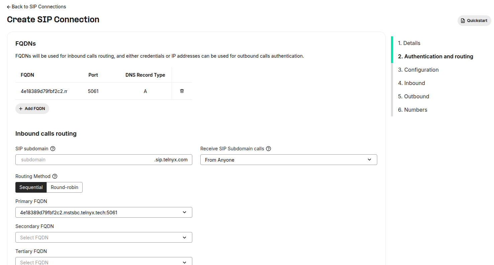
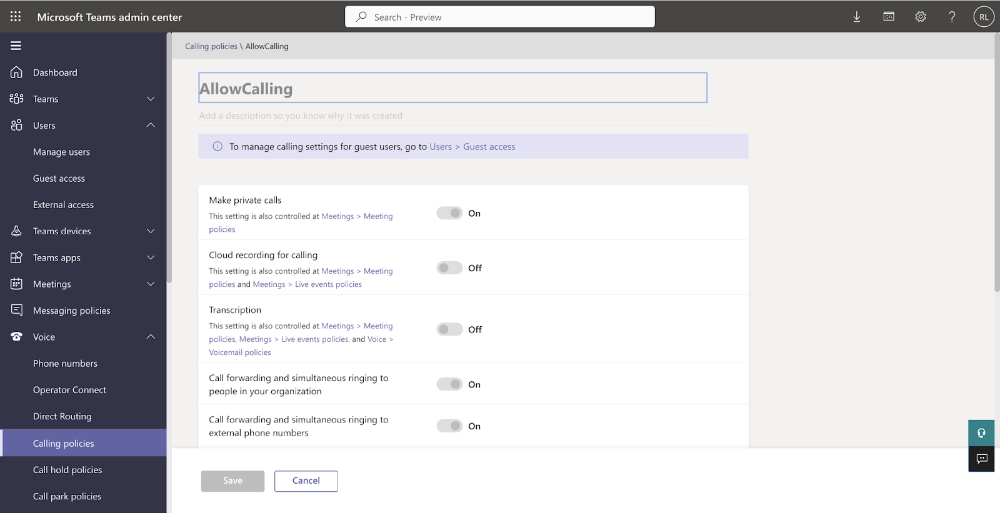
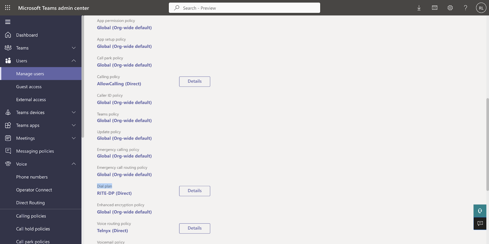

TLS & SIP Warnings for Teams | Telnyx Help Center

[Skip to main content](#main-content)

# TLS & SIP Warnings for Teams

Fix warnings related to TLS connectivity and SIP Options in your existing Microsoft Teams Direct Routing SBC setup.

Written by Telnyx Engineering

January 29, 2026

Table of contents

# TLS Connectivity and SIP Options Warnings for Existing Microsoft Teams Direct Routing SBC Setup

If you already have Microsoft Teams Direct Routing configured with an SBC, you may encounter warnings related to TLS connectivity and SIP Options status.

While these warnings do not impact call quality or reliability, we recommend implementing the following setup to address any potential configuration issues and ensure an optimal experience.

First, you will need to have PowerShell installed.

You will be performing all the configurations there.

To install Powershell on your Microsoft Windows computer follow [this](https://learn.microsoft.com/en-us/powershell/scripting/install/install-powershell-on-windows?view=powershell-7.4&viewFallbackFrom=powershell-7.3) article.

To install Powershell on your Mac follow [this](https://learn.microsoft.com/en-us/powershell/scripting/install/install-powershell-on-macos?view=powershell-7.4&viewFallbackFrom=powershell-7.3) article.

## Run PowerShell in Microsoft Windows

Run *cmd.exe* and execute the following command:

```
PowerShell
```

## Run PowerShell in Mac

Run Mac Terminal and execute the following command:  
​

```
pwsh
```

In Powershell, import the Microsoft Teams module if you don’t already have it by running the following command:

```
Import-Module MicrosoftTeams
```

Connect to the Customer tenant using the Teams module:

```
Connect-MicrosoftTeams
```

A window will pop up for the credentials to be inserted as any other time we login into the desired account.

### **Add a new Online PSTN Usage**:

Execute the following command:  
​

```
Set-CsOnlinePstnUsage -Identity Global -Usage @{Add="Telnyx"}
```

Verify that the usage was created by entering:

```
Get-CSOnlinePSTNUsage
```

Which returns a list of names that may be truncated:


### **Add a new voice profile**

Which uses the subdomain previously verified on the account

In this step, we are going to associate the existing subdomain auto-generated in the Telnyx SIP connection to the new Voice Profile.



In order to do that, you should run the following command (tailored to your configuration):

```
New-CsOnlineVoiceRoute -Name "Multi-Tenant" -Priority 1 -OnlinePSTNUsage "Telnyx" -OnlinePSTNGatewayList <string_from_the_telnyx_portal_connection>.mstsbc.telnyx.tech -NumberPattern '^(\+1[0-9]{10})$' -Description "Telnyx"
```

You should get an output similar to the one below:


From now on, on the customer tenant there are no OPTIONS to check, just the voice route.

### **Add a new Routing Policy**

To add a new Routing Policy run the following command (tailored to your configuration):  
​

```
New-CsOnlineVoiceRoutingPolicy "Telnyx" -OnlinePstnUsages "Telnyx"
```

```
Grant-CsOnlineVoiceRoutingPolicy -Identity "<user_email>" -PolicyName "Telnyx"
```

To verify the Voice Routing Policy was correctly created and attached to the user you specified, run the following command:

```
Get-CsOnlineUser "<your_user>@<string_from_the_telnyx_portal_connection>.mstsbc.telnyx.tech" | select OnlineVoiceRoutingPolicy
```

You should get an output similar to the one below:


Then, the final steps required to start making calls are all on the user level.  
The necessary changes are on the user:

### **User Policy**

* #### **CallingPolicy: Allow Calling**

  This can be done in the Teams Admin center (Teams UI). Create a new Calling Policy in **Voice** > **Calling Policies** according to your needs.



To associate a calling policy to a user go to **Users** > Select the user you want to allow to make calls > **Policies** > **Assigned** **policies** > **Calling policy** > <**Name\_of\_your\_Calling\_Policy**>.


* #### **DialPlan:**

Create a new Dialplan in **Voice** > **Dial** **Plans** according to your needs.


Then associate it to the desired user in **Users** > Select the user you want to allow to make calls > **Policies** > **Assigned policies** > **Dial plan** > <**Your\_Dial\_Plan\_Name**>



* #### **Voice routing policy:**

This one is the one we created in PowerShell, which can also be consulted in **Voice** > **Voice Routing Policies**

Associate it to the user in **Users** > Select the user you want to allow to make calls > **Policies** > **Assigned policies** > **Voice Routing Policy** > <**Your\_Voice\_Routing\_Policy\_Name**>


#### Ensure the user is enabled for Enterprise Voice with a Direct Routing Phone Number.

#### To ensure that the user which you intend to make calls over Direct Routing has all the proper configurations in place, run the following command in Powershell:

```
Get-CsOnlineUser -Identity "<user_email>"
```

#### Below you can find an example of an expected output is:

```
PS /Users/rita> Get-CsOnlineUser -Identity "rabbani@rita.mstsbc.telnyx.tech"  
AccountEnabled                         : TrueAlias                                  : rabbaniApplicationAccessPolicy                :AssignedPlan                           : {MCOProfessional, MCOMEETADD, MCOEV, Teams}CallingLineIdentity                    :City                                   :Company                                :Country                                :CountryAbbreviation                    :Department                             :DialPlan                               : PTDisplayName                            : RabbaniEnterpriseVoiceEnabled                 : TrueExternalAccessPolicy                   :FeatureTypes                           : {AudioConferencing, PhoneSystem, Teams}GivenName                              : RabbaniHideFromAddressLists                   :   
FalseHostingProvider                        : sipfed.online.lync.comIdentity                               : 34eac5d7-a18b-41b6-853d-c3432252654cInterpretedUserType                    : PureOnlineTeamsOnlyUserIsSipEnabled                           : TrueLastName                               :LastSyncTimeStamp                      : 31/01/2023 09:32:28LineUri                                : tel:+18772404795LocationPolicy                         :OnPremEnterpriseVoiceEnabled           : FalseOnPremHostingProvider
```

#### #

```
     :
```

#### #

```
FalseTeamsUpgradeOverridePolicy             :TeamsUpgradePolicy                     : UpgradeToTeamsTeamsUpgradePolicyIsReadOnly           : ModeAndNotificationsTeamsVdiPolicy                         :TeamsVerticalPackagePolicy             :TeamsVideoInteropServicePolicy         :TenantDialPlan                         : RITE-DPTenantId                               : 0fb5c7fa-614f-4ab2-b4b7-37d99c515524Title                                  :UsageLocation                          : PTUserDirSyncEnabled                     :UserPrincipalName                      : rabbani@rita.mstsbc.telnyx.techUserValidationErrors                   : {}WhenChanged                            : 31/01/2023 09:32:29WhenCreated                            : 23/01/2023 13:04:17LastProvisionTimeStamps                : {[UserAuthoredProps, 2023-01-31T09:32:03.1286014+00:00]}LastPublishTimeStamps                  : {[ProvisionedPlanPublishAuthoredProps, 2023-01-23T13:04:36.7381079+00:00],                                         [UserEventDistributionProcessor, 2023-01-23T13:04:45.8365073+00:00],                                         [PublishUserCloudAttributesProcessor, 2023-01-31T09:32:04.0575536+00:00],                                         [UpdateBvdUserProcessor, 2023-01-31T09:32:06.9756276+00:00]…}
```

#### **If you encounter a similar output (with the appropriate names, times, and regions), please note that it may take up to 30 minutes for the changes to be fully implemented and take effect.**

#### **After this period, everything should be working as intended.**

---

Related Articles

[SIP Connection: Settings](https://support.telnyx.com/en/articles/4351104-sip-connection-settings)[Telnyx SIP Response Codes](https://support.telnyx.com/en/articles/4409457-telnyx-sip-response-codes)[Configuring Telnyx with Microsoft Teams Direct Routing](https://support.telnyx.com/en/articles/5253876-configuring-telnyx-with-microsoft-teams-direct-routing)[Grandstream UCM6xxx: SIP Trunks](https://support.telnyx.com/en/articles/5748258-grandstream-ucm6xxx-sip-trunks)[Operator Connect Guide - Microsoft Teams](https://support.telnyx.com/en/articles/7260976-operator-connect-guide-microsoft-teams)

Did this answer your question?

😞😐😃

Table of contents
