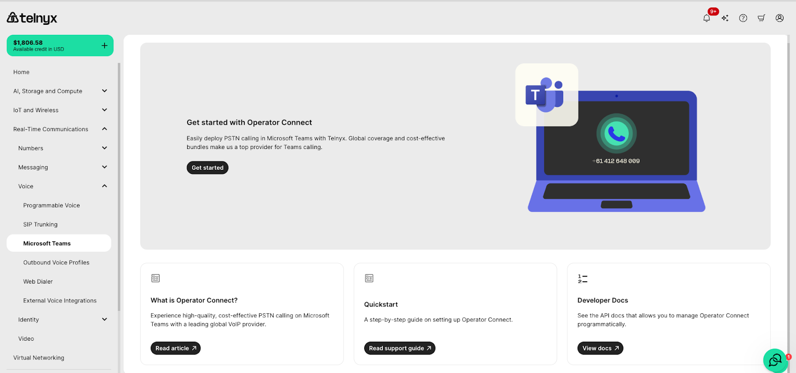
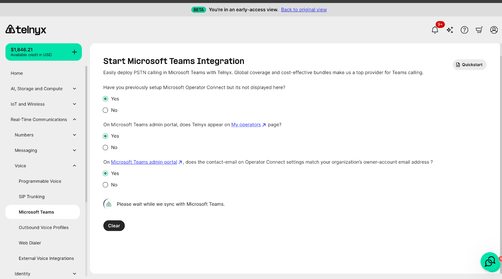
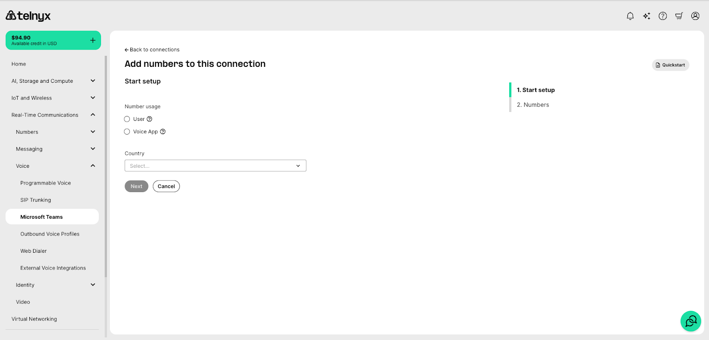
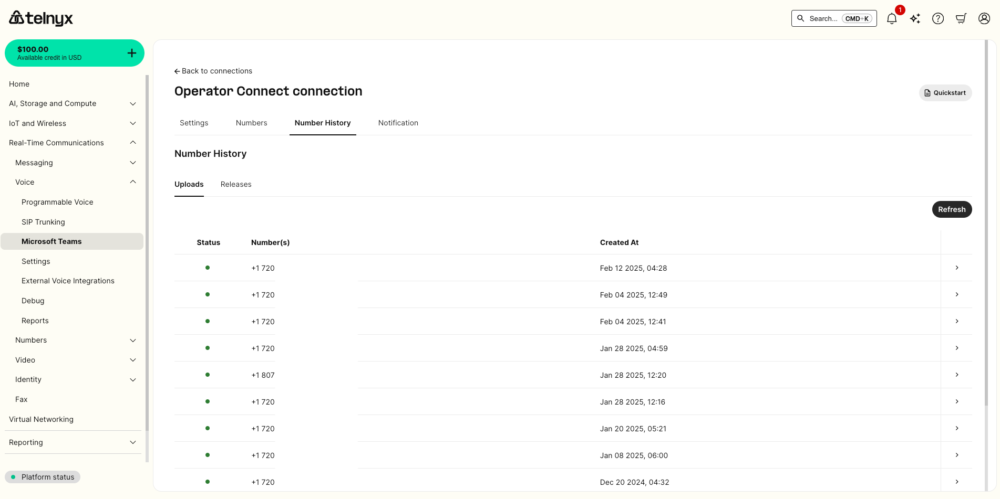

# Operator Connect Guide - Microsoft Teams

See how you can use Telnyx as your provider for Microsoft Teams with Operator… See Telnyx guidance and requirements.

Use Telnyx Operator Connect to connect Microsoft Teams Phone users to PSTN calling through Telnyx.

Operator Connect lets you enable Telnyx as an operator in the Microsoft Teams admin center, synchronize your Microsoft tenant with Telnyx, add or port phone numbers, and assign those numbers to Teams users.

Unlike Direct Routing, Operator Connect does not require you to configure or manage your own SBC, voice routes, or PSTN usage records in Microsoft Teams. Telnyx provides the operator-managed PSTN connectivity.

### Contents:

* [Requirements](#h_1e962d3919)
* [Video Demo](#h_276d6313a8)
* [Step by Step Guide](#h_a8d36fde6d)
* [Pricing Help](#h_3a395e9bb2)

---

## Minimum Requirements

Before you begin, make sure you have:

* A Telnyx portal account. If you don't have one you can [sign up](https://telnyx.com/sign-up) here.
* Access to the Telnyx Microsoft Teams or Operator Connect setup flow.
* Microsoft 365 administrator access with permission to manage Teams voice settings.
* Access to the Microsoft Teams admin center.
* Users who are licensed for Teams Phone.
* At least one Telnyx number available for Operator Connect, or a porting plan for numbers you want to move to Telnyx.
* Emergency address information for numbers that require emergency-service configuration.

Microsoft 365 E5 or Office 365 E5 is not the minimum requirement for Operator Connect. E5 is sufficient because it includes Teams Phone, but Operator Connect users only need the required Microsoft Teams and Teams Phone entitlements for their plan.
​
​
References:

* [Microsoft Operator Connect planning requirements](https://learn.microsoft.com/en-us/microsoftteams/operator-connect-plan)
* [Microsoft Operator Connect configuration](https://learn.microsoft.com/en-us/microsoftteams/operator-connect-configure)
* [Microsoft Teams Phone licensing](https://learn.microsoft.com/en-us/microsoftteams/teams-add-on-licensing/microsoft-teams-add-on-licensing)

## Video Demo;

### Step 1: Log in to Telnyx and the Microsoft Teams admin portals

* Log into the [Mission Control Portal](https://portal.telnyx.com)
* Log into your [Microsoft Teams account](https://admin.teams.microsoft.com/) with a valid admin account. and note the email associated with your Telnyx account. This will be needed when setting up the integration between Telnyx and Microsoft.

### Step 2: **Navigate to the Microsoft Teams section**

* On the left hand menu, navigate to the Microsoft Teams tab.
* Check if you have already configured Operator Connect in your environment. If not, follow the setup wizard in the Admin Dashboard by clicking “Get Started”.

### Step 3: **Verify your email address**

* In the Microsoft Teams Admin, navigate to the [Operator Connect](https://admin.teams.microsoft.com/operators) tab under the Voice section on the left-hand menu. Verify that **Telnyx** is listed among your available operators.

* Ensure the contact email in the Operator Setting page in the Microsoft Teams Admin Portal matches the email address associated with your Telnyx portal account.
* When you have confirmed the email address in both systems, select ‘Yes’ in the set up Wizard in the Mission Control Portal. This will start a synchronization of your Telnyx and Microsoft Teams account.
* If your accounts don’t immediately sync, wait 24 hours and check again before reaching out to support.

## **Troubleshooting**

* If **any** of the steps above are a “**No**”, you will receive specific instructions on how to resolve the issue from the wizard.Step 5: Associate your Telnyx numbers to your Microsoft integration

* Ensure you have entered the correct details in both the Microsoft Teams Admin Dashboard and your Telnyx portal account to avoid setup errors.
  ​
* Following these steps should help you successfully set up and use Operator Connect with Telnyx in Microsoft Teams.

### **Assigning A Number**

Now that you have your Operator connect set up, let us add some numbers which will will be used in your Teams

In your connections on the teams Page, click the edit button (Pencil Icon), it will open the on the settings tab, Select the Next “Numbers” tab.

If you don't have some numbers already added, select the “**Add Numbers**” button.

Select which Agent will be using the app, (Human or Voice App), and select the country your number will be used from and hit **Next**

If you have already purchased your numbers they will show up in the list of numbers. Otherwise select the “Buy Numbers” button which will redirect you to the Buy Numbers Page. There you can Search and purchase numbers.

Move back to the “Add numbers to this connection” under Teams and add numbers to your Operator Connect setup. Add an Emergency address from the drop-down and hit **Submit**.

Confirm Charges and on the next page your numbers will appear in the **Number History** tab list with the Status of the connection. Orange - Not yet ready, Green - Ready to use. Use the refresh button on the right to check status updates.
​

You can find your available numbers in the **Numbers** Tab.

Now that you have your numbers connected, go to the [Phone Numbers](https://admin.teams.microsoft.com/phone-numbers) page on the Teams Admin and assign a number to a User. Select Number, Click Edit then search for a user to assign and click **Apply.**

Now Finally, you can test your App by calling from [Teams](https://teams.microsoft.com/v2/) and back. Your Assigned number will show up below the dial pad.

### Tips- Emergency Address in shared calling policies in Teams.

When setting emergency addresses for MSFT teams, make sure these steps are followed to ensure they are properly routed when users call emergency services are called or when users are called back.

* Ensure emergency calling policy is set and assigned to users.
* Dynamic emergency calling is set to on. This will ensure the actual address is always sent when the emergency call is placed.
* Static Emergency address in Teams settings is correctly set, as Microsoft will fall back to it if the dynamic address is not available.

## Pricing

Customers can find pricing for our Operator Connect bundles on the [Bundles Pricing Page](https://portal.telnyx.com/#/bundles/order) in the portal.

---

Related Articles

[SIP Connection: Fail-over and Retries](https://support.telnyx.com/en/articles/4320364-sip-connection-fail-over-and-retries)[SIP Connection: Inbound & Outbound Settings](https://support.telnyx.com/en/articles/4404448-sip-connection-inbound-outbound-settings)[Port your Microsoft MS Teams Numbers](https://support.telnyx.com/en/articles/5104103-port-your-microsoft-ms-teams-numbers)[Configuring Telnyx with Microsoft Teams Direct Routing](https://support.telnyx.com/en/articles/5253876-configuring-telnyx-with-microsoft-teams-direct-routing)[MS Teams: Call2Teams & Telnyx](https://support.telnyx.com/en/articles/6133589-ms-teams-call2teams-telnyx)

Did this answer your question?

😞😐😃
