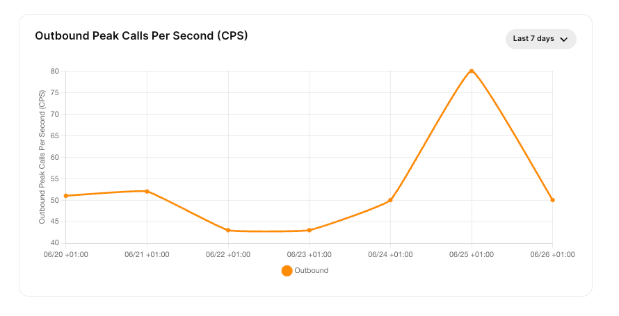

# Calls per second (CPS) surcharge

Understanding CPS surcharges, their impact, and how Telnyx manages high CPS rates. See Telnyx guidance and requirements.

Outbound Peak Calls Per Second (CPS) Surcharge

This article explains how Telnyx measures **Outbound Peak Calls Per Second (CPS)** usage for SIP Trunking and how the monthly surcharge is calculated.

## **Overview**

Calls Per Second (CPS) measures the number of outbound call attempts initiated within a single second.

High CPS bursts can create sudden load on the voice network, even when the total number of calls for the month is relatively low.

Telnyx uses CPS in two related but separate ways:

* **Real-time Outbound CPS limits** — Protect the network by limiting excessive outbound SIP call attempts in real time.
* **Monthly Outbound Peak CPS surcharge** — Applies charges for sustained or recurring high outbound CPS usage based on the customer’s monthly 95th percentile peak CPS value.

## **Real-time Outbound CPS Limits**

Real-time Outbound CPS limits are applied by traffic source, not by account. Standard SIP Trunking traffic is limited to **20 CPS per source IP address or SIP username** by default.

Traffic that exceeds the applicable limit is rejected with SIP response code **503 CPS Limit Reached (P05)**.

Calls rejected because they exceed the real-time CPS limit are **not included** in the Monthly Outbound Peak CPS surcharge calculation.

For more details, see: **[CPS limits article](https://support.telnyx.com/en/articles/15668484-calls-per-second-cps-limits)***.*

## **Monthly Outbound Peak CPS Surcharge**

The Monthly Outbound Peak CPS surcharge is calculated independently of the real-time CPS limits. It is based only on outbound SIP Trunking call attempts that were **accepted**, and is measured at the **account level**, not by IP address or SIP username.

The Monthly Outbound Peak CPS represents the highest number of outbound SIP Trunking call attempts initiated during the same second throughout the month, as derived from SIP Trunking CDRs.

The following traffic is excluded from the surcharge calculation:

* Programmable Voice / Call Control traffic
* Telnyx internal retry attempts
* SIP Trunking attempts blocked by CPS limits

As a result, the CPS Peak reflects only customer-generated outbound SIP Trunking call attempts.

## **Monitoring outbound CPS usage**

The Mission Control Portal includes an **Outbound Peak Calls Per Second (CPS)** [dashboard](https://portal.telnyx.com/#/voice/dashboard) to help you monitor your traffic patterns.

This dashboard displays outbound peak call attempts over time, making it easier to identify high-CPS bursts and determine when they occur.

Monitoring outbound CPS usage can help you distribute traffic more evenly throughout the day, reducing the likelihood of real-time CPS rejections or a higher monthly CPS Peak surcharge.

##

## **How monthly CPS Peak usage is measured**

For each active hour during the billing month, Telnyx identifies the highest outbound SIP Trunking CPS value recorded within that hour.

These hourly peak values form the dataset used to calculate the monthly CPS Peak.

Hours with no outbound SIP Trunking call attempts are excluded from the calculation rather than being counted as **0 CPS**.

The monthly CPS Peak surcharge is based on the **95th percentile** of the active hourly peak CPS values. This approach reflects sustained or recurring periods of high outbound CPS usage, rather than a single exceptional burst or the customer’s average CPS throughout the month.

## **How Telnyx calculates the CPS Peak value**

Each month, Telnyx calculates the CPS Peak value as follows:

1. For each active hour, determine the highest outbound CPS value recorded during that hour.
2. Exclude hours with no outbound CPS activity.
3. Calculate the 95th percentile of the remaining hourly peak CPS values.
4. Use the resulting 95th percentile CPS value to calculate the monthly surcharge.

For example, if a customer has **100 active hours** in a month and only **5 hours** contain unusually high CPS peaks, those hours are treated as outliers and have little effect on the 95th percentile calculation.

If elevated CPS levels occur across many more active hours, the monthly CPS Peak value increases because the pattern represents sustained usage rather than isolated events.

## **CPS Peak pricing model**

CPS Peak surcharges use a graduated pricing model:

* First 5 CPS = free
* Any additional CPS up to 25 = $12/CPS
* Any additional CPS up to 200 = $16/CPS
* Any additional CPS up to 250 = $24/CPS
* Any additional CPS 251+ = $30/CPS

For example, if the monthly 95th percentile peak CPS value is 163, the surcharge is calculated as:

(5 CPS x $0) + (20 CPS x $12) + (138 CPS x $16) = $2,448

## **How CPS surcharges appear on invoices**

CPS surcharges appear on the monthly invoice as an **Outbound Calls-Per-Second Peak Usage Surcharge**.

The invoice line item is based on the monthly 95th percentile outbound peak CPS value for SIP Trunking traffic.

---

Related Articles

[Sansay: SBC VSXi Setup](https://support.telnyx.com/en/articles/4301888-sansay-sbc-vsxi-setup)[PBXes: Connecting a PBXes Trunk to Telnyx](https://support.telnyx.com/en/articles/5798240-pbxes-connecting-a-pbxes-trunk-to-telnyx)[Surcharge for High Abandoned Call Rates](https://support.telnyx.com/en/articles/12805746-surcharge-for-high-abandoned-call-rates)[How to configure Yeastar P-series](https://support.telnyx.com/en/articles/13375115-how-to-configure-yeastar-p-series)[Calls Per Second (CPS) Limits](https://support.telnyx.com/en/articles/15668484-calls-per-second-cps-limits)

Did this answer your question?

😞😐😃
