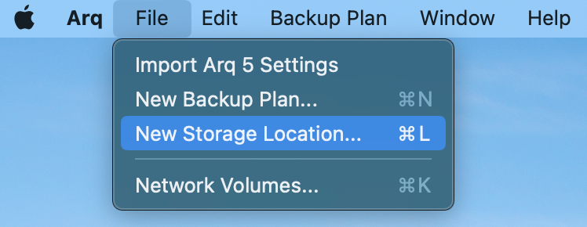
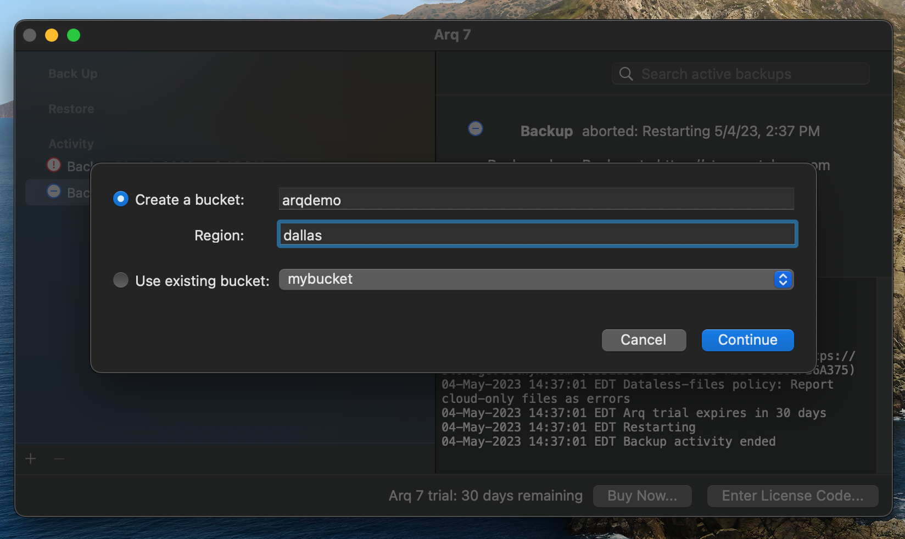
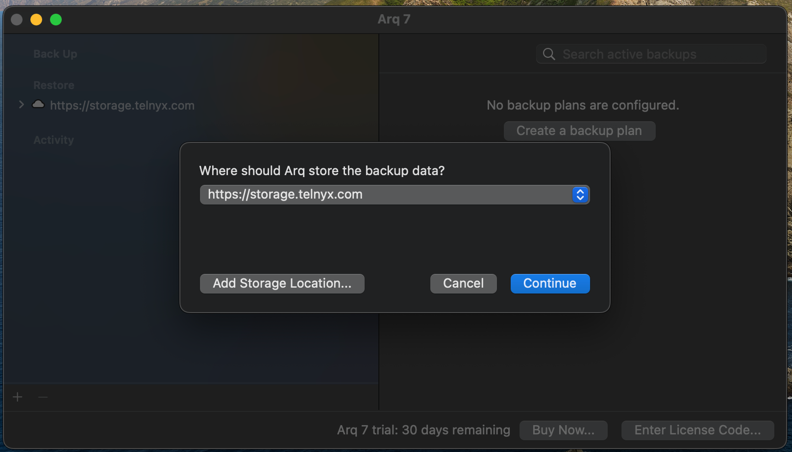

Use Arq Backup with Telnyx Storage | Telnyx Help Center

[Skip to main content](#main-content)

# Use Arq Backup with Telnyx Storage

Discover how to set up Arq Backup with Telnyx Storage for secure and efficient file backup and storage management.

Written by Telnyx Engineering

June 19, 2024

Table of contents

Arq Backup is a backup software designed for developers that securely backs up their important files and data to various storage providers. It offers features such as incremental backups, versioning, compression, and encryption, as well as customizable backup schedules and a backup health monitor.

---

# How to configure Arq Backup to work with Telnyx Storage

1. Download and install the latest version of Arq backup [here](https://www.arqbackup.com/)!
2. Open the Arq Backup application. Then, click on the button to create a **New Storage Location**

## Select the option for **S3-Compatible Server**

1. In the window, enter in the following information and then click **Connect**:

   1. **Server URL:** Copy and paste one of our available [API Endpoints](https://developers.telnyx.com/docs/cloud-storage/api-endpoints).
   2. **Access Key ID:** Copy and paste your [Telnyx API Key](https://portal.telnyx.com/#/app/api-keys) in this field
   3. **Secret Access Key:** The secret access key is not used by Telnyx Storage, but Arq will complain if it doesn’t exist. Type out anything you want here, as long as it doesn't include spaces, quoting, or special characters of any kind.
   4. **Region:** Copy and paste the matching region from [API Endpoints](https://developers.telnyx.com/docs/cloud-storage/api-endpoints). For example, if you chose the [https://us-central-1.telnyxstorage.com](https://us-central-1.telnyxstorage.com/) endpoint, you will use us-central-1 as the region.

      
2. Finally, decide which bucket you would like to store your backups in. You can either create a brand new bucket, or use one of your existing buckets.

## **Completed**

And that’s all there is to it! Now, you can create new backup plans with Telnyx Storage as your storage location using Arq.

---

**Additional Resources**

For more information on how to use Arq Backup, check out their [knowledge base here](https://www.arqbackup.com/learn/).

---

Related Articles

[Use Backup4all with Telnyx Storage](https://support.telnyx.com/en/articles/7869264-use-backup4all-with-telnyx-storage)[Use Duplicati with Telnyx Storage](https://support.telnyx.com/en/articles/7873510-use-duplicati-with-telnyx-storage)[Use WinSCP with Telnyx Storage](https://support.telnyx.com/en/articles/7903390-use-winscp-with-telnyx-storage)[Use GoodSync with Telnyx Storage](https://support.telnyx.com/en/articles/8047898-use-goodsync-with-telnyx-storage)[Use AirExplorer with Telnyx Storage](https://support.telnyx.com/en/articles/8048045-use-airexplorer-with-telnyx-storage)

Did this answer your question?

😞😐😃

Table of contents
