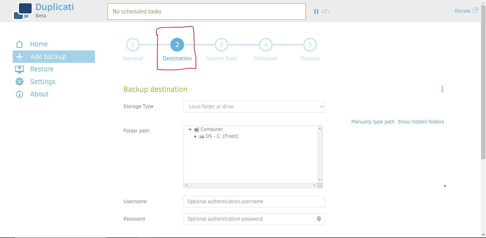
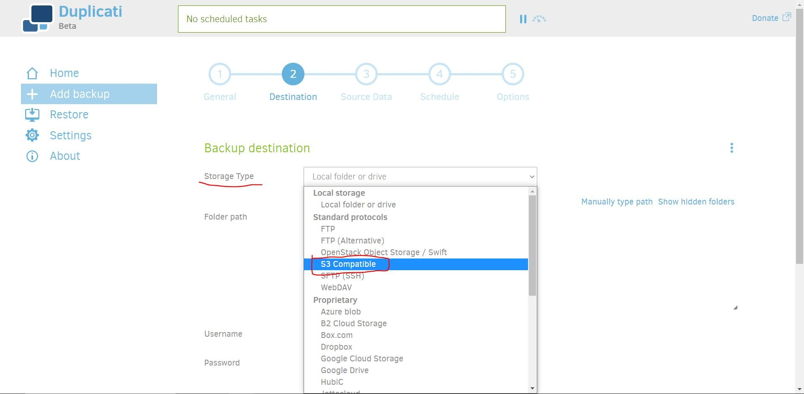
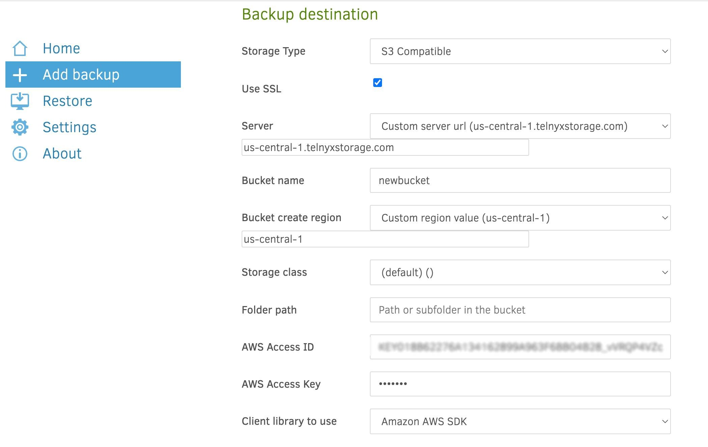

# Use Duplicati with Telnyx Storage

Discover how to set up Duplicati, an open-source backup solution, with Telnyx Storage for secure and automated backup… See Telnyx guidance and requirements.

Duplicati is an open-source backup software that provides users with a simple and reliable way to back up their files and data to various cloud storage providers, including Amazon S3, Google Drive, Dropbox, and now Telnyx Storage. It features strong encryption, incremental and full backups, versioning, and scheduling, as well as options for customization and automation.

---

## How to configure Duplicati to work with Telnyx Storage

1. Download and install the latest version of Duplicati [here](https://duplicati.com/)!
2. Open the Duplicati application.
3. Click on **Add Backup**, select **Configure a new backup** and click **Next** to continue

## Telnyx Storage Configuration

There are 5 steps to creating a new backup. This guide will only focus on Step 2: Destination, where we will configure Telnyx Storage as the backup destination.

In the **Storage Type** dropdown menu, select **S3 Compatible**

For the remaining fields, enter the following information:

1. **Use SSL**: toggled on
2. **Server:** in the dropdown menu, select `Custom Server URL ( )` and then enter copy and paste one of our available [API Endpoints](https://developers.telnyx.com/docs/cloud-storage/api-endpoints).
3. **Bucket Name:** either type the name of an existing bucket, or enter the name for a bucket you want to create
4. **Bucket Create Region:** Copy and paste the matching region from [API Endpoints](https://developers.telnyx.com/docs/cloud-storage/api-endpoints). For example, if you chose the [https://us-central-1.telnyxstorage.com](https://us-central-1.telnyxstorage.com/) endpoint, you will use us-central-1 as the region.
5. **Storage class**: (default) ( )
6. **AWS Access ID:** copy and paste your [Telnyx API Key](https://portal.telnyx.com/#/app/api-keys) in this field
7. **AWS Access Key:** The secret access key is not used by Telnyx Storage, but Duplicati will complain if it doesn’t exist. Type out anything you want here, as long as it doesn't include spaces, quoting, or special characters of any kind.
8. **Client library to use**: Amazon AWS SDK
   ​

   

And that's all there is to it! You can complete the other remaining steps for configuring a new backup. Once the new backup is created, your data will be stored on Telnyx Storage.

---

## **Additional Resources**

For more information on how to use Duplicati, check out their [manuals here](https://duplicati.readthedocs.io/en/latest/).

---

Related Articles

[Use WAL-G with Telnyx Storage](https://support.telnyx.com/en/articles/6966381-use-wal-g-with-telnyx-storage)[Use Arq Backup with Telnyx Storage](https://support.telnyx.com/en/articles/7869213-use-arq-backup-with-telnyx-storage)[Use Backup4all with Telnyx Storage](https://support.telnyx.com/en/articles/7869264-use-backup4all-with-telnyx-storage)[Use Syncovery with Telnyx Storage](https://support.telnyx.com/en/articles/8047874-use-syncovery-with-telnyx-storage)[Use GoodSync with Telnyx Storage](https://support.telnyx.com/en/articles/8047898-use-goodsync-with-telnyx-storage)

Did this answer your question?

😞😐😃
