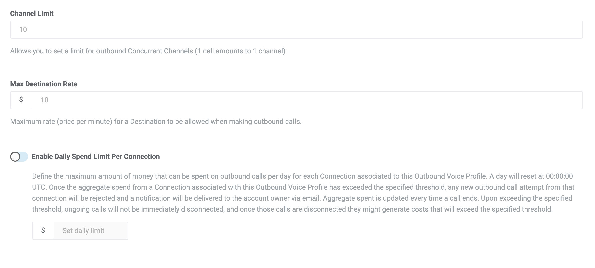

# Chiro8000 and Telnyx Integration

Connecting the practice management software Chiro8000 with the text messaging capabilities of… See Telnyx guidance and requirements.

K

## Chiro8000 and Telnyx Integration

Connecting the practice management software Chiro8000 with the text messaging capabilities of Telnyx. Chiro8000 is a top notch practice management software used by chiropractors, it is commonly paired with Telnyx to give the software connectivity to the American telephone network.

## Costs to start testing

* It is free to sign up and there is no monthly minimum. To send to/from American Local numbers it costs less than a penny per message plus some small taxes and fees, The average chiropractor spends $5-$10 per month for all-in costs for appointment reminder text messages to all their clients. You can check up to date [pricing](https://portal.telnyx.com/#/app/pricing) once you have [created](https://telnyx.com/sign-up) your free account.
* You can lease a phone number from us and the standard phone number costs $1 per month and a $1 one time activation charge. Pricing is subject to change. Depending on your volume most chiropractors only need one phone number.
* We are a prepaid platform so you add funds before you use them to send messages and pay for number leases.

## Step by Step Integration of Chiro8000 with Telnyx

Process flows like this:

1. Sign up at <https://telnyx.com/sign-up> or log in at <https://portal.telnyx.com/> if you already have a Telnyx account.
2. Add funds using the green plus icon at the top of the page.
3. [Purchase a number](https://support.telnyx.com/en/articles/4380325-search-and-buy-numbers). Most chiropractors use a Local number type because it makes sense for the volume and regionality of their business. We suggest you test with a purchased number before porting any numbers to Telnyx. Toggle the button for “Try Improved Search” and please make sure the Feature has “SMS” enabled like this screenshot:

Image description: This is a screenshot of the number search tool which shows the search parameters to finding a phone number that will work for your business. Highlighted is the "Features" parameter where you must select the features you need such as "SMS" enabled with your phone number.

4. [Create a messaging profile](https://support.telnyx.com/en/articles/3562059-setting-up-a-messaging-profile)

5. Assign the messaging profile to your phone number under "My Numbers"

6. Now switch to your Chiro8000 system and go to the upper row of menus and select the drop down that has "Options" as a selection. Then from Options > Calendar > click the little box that says "Enable Telnyx". Then there will be a box that says "Telnyx Configuration" select that and enter your Telnyx API key and the phone number you purchased from your Telnyx portal and hit "Ok" twice. Then you go to your Chiro8000 Calendar, select "Reminders"" and choose your appointment reminder settings. Make sure you have enough funds to support the number of texts you will be sending out and you are good to go. On December 1, 2024 you will also have to go through a compliance process called 10DLC if you want to send from a Local US Phone Number. Alternatively you can use a Toll-Free Phone Number but it also has a compliance process to go through but it is a less expensive less time consuming process. Please search our Support Center for any questions you have about 10DLC compliance or Toll-Free Verification if you need more info or you can reach out to the Telnyx Messaging Compliance team at [10DLCquestions@telnyx.com](mailto:10DLCquestions@telnyx.com).

### Optional steps:

1. [Set up low balance notifications](https://support.telnyx.com/en/articles/4277896-notification-settings). Change the settings following this path: Account Settings>Advanced Features>Notifications.
2. Set Auto Recharge settings after your first payment at <https://portal.telnyx.com/#/billing/payment>. You must have made at least one payment manually for this setting to appear.
3. Set up 2 Factor Authentication if you want additional security. Follow the path: My Account>General>Security>Two-Factor Authentication.
4. Set up daily spend limits in your outbound voice profile settings.

   

   Image description: This image shows the 3 limits you can set for your outbound voice profile: Channel limit, Max Destination Rate, and Enable Daily Spend Limit per Connection.

---

Related Articles

[Bring Campaigns to Telnyx](https://support.telnyx.com/en/articles/6339158-bring-campaigns-to-telnyx)[Telnyx Messaging Error Codes](https://support.telnyx.com/en/articles/6505121-telnyx-messaging-error-codes)[Easy Text Marketing and Telnyx Integration](https://support.telnyx.com/en/articles/6986625-easy-text-marketing-and-telnyx-integration)[Bulk Messaging with Sheets](https://support.telnyx.com/en/articles/8268223-bulk-messaging-with-sheets)[Telnyx 10DLC Process](https://support.telnyx.com/en/articles/10646301-telnyx-10dlc-process)

Did this answer your question?

😞😐😃
