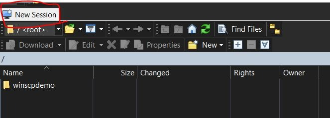
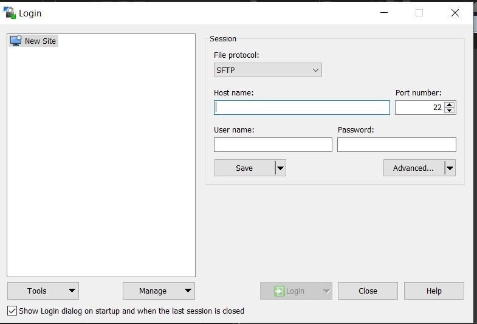
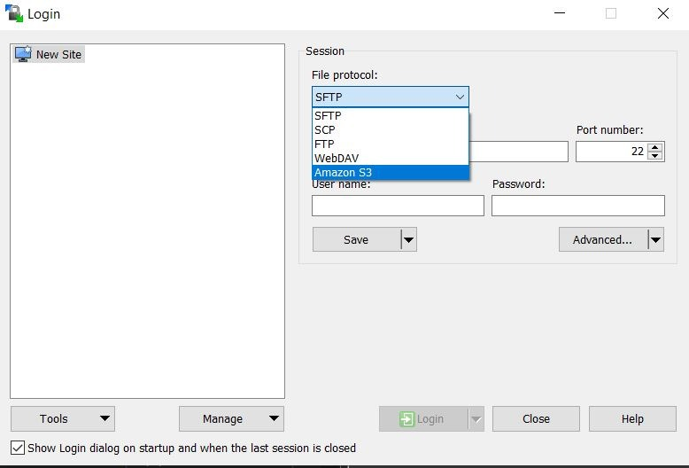
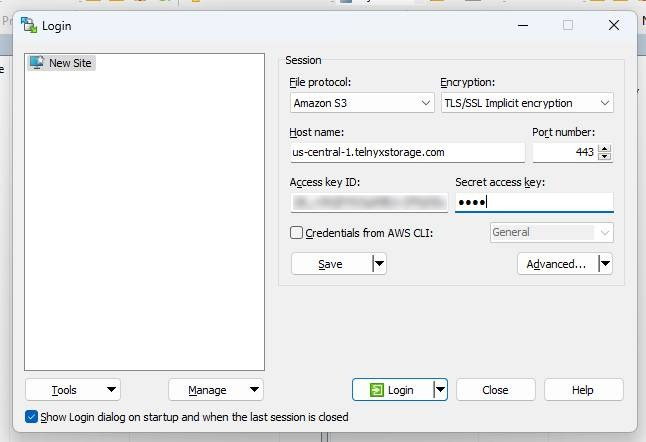

# Use WinSCP with Telnyx Storage

Discover how to set up WinSCP with Telnyx Storage for effortless file transfer and efficient storage management. See Telnyx guidance and requirements.

WinSCP is a popular open-source SFTP, FTP, and SCP client for Windows, providing users with a secure and intuitive way to transfer files between local and remote servers. It offers a user-friendly interface, supports various protocols and encryption methods, and includes features such as file synchronization, scripting, and remote editing for efficient and seamless file management.

---

## How to configure WinSCP to work with Telnyx Storage

1. Download and install the latest version of WinSCP [here](https://winscp.net/eng/index.php)!
2. If you have used WinSCP before, click on the `New Session` button.

   

   A modal for configuring your new session will pop up

   
3. For the **File Protocol** setting, select `Amazon S3` from the dropdown menu

   
4. Enter the following information in the remaining fields, and then click **Login:**

   1. **Host name:** Copy and paste one of our available [API Endpoints](https://developers.telnyx.com/docs/cloud-storage/api-endpoints).
   2. **Port number:** 443
   3. **Access key ID:** copy and paste your [Telnyx API Key](https://portal.telnyx.com/#/app/api-keys) in this field
   4. **Secret access key:** The secret access key is not used by Telnyx Storage, but Arq will complain if it doesn’t exist. Type out anything you want here, as long as it doesn't include spaces, quoting, or special characters of any kind.

      

And that's all there is to it! You can now use WinSCP to store and retrieve your files from Telnyx Storage.

---

**Additional Resources**

For more information on how to use WinSCP check out their support documentation [here](https://winscp.net/eng/docs/start).

---

Related Articles

[Use Cyberduck with Telnyx Storage](https://support.telnyx.com/en/articles/6964207-use-cyberduck-with-telnyx-storage)[Use Arq Backup with Telnyx Storage](https://support.telnyx.com/en/articles/7869213-use-arq-backup-with-telnyx-storage)[Use CrossFTP with Telnyx Storage](https://support.telnyx.com/en/articles/8047941-use-crossftp-with-telnyx-storage)[Use WebDrive with Telnyx Storage](https://support.telnyx.com/en/articles/8047969-use-webdrive-with-telnyx-storage)[Use AirExplorer with Telnyx Storage](https://support.telnyx.com/en/articles/8048045-use-airexplorer-with-telnyx-storage)

Did this answer your question?

😞😐😃
