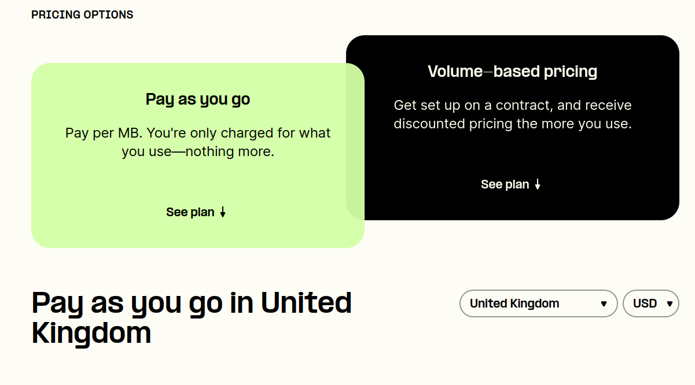

# Telnyx IoT SIM Data Usage Zone Mapping

Here you will find the mapping of each Country to their relevant Zone which is used to calculate Telnyx IoT SIM data… See Telnyx guidance and requirements.

K

## Telnyx Wireless Zone Pricing: Choose Your Country

Wireless Pricing Here: <https://telnyx.com/pricing/iot-data-plans>

To explore pricing for our Wireless Zone tiers and services, simply choose your country from the dropdown menu. You also have the option to view charges in either US dollars or Euros.

For more info, see our [Wireless IoT SIM Card](https://telnyx.com/products/iot-sim-card) product page.

---

Related Articles

[International IoT SIM Coverage](https://support.telnyx.com/en/articles/3270106-international-iot-sim-coverage)[IoT SIM Card Pricing](https://support.telnyx.com/en/articles/3296669-iot-sim-card-pricing)

Did this answer your question?

😞😐😃
