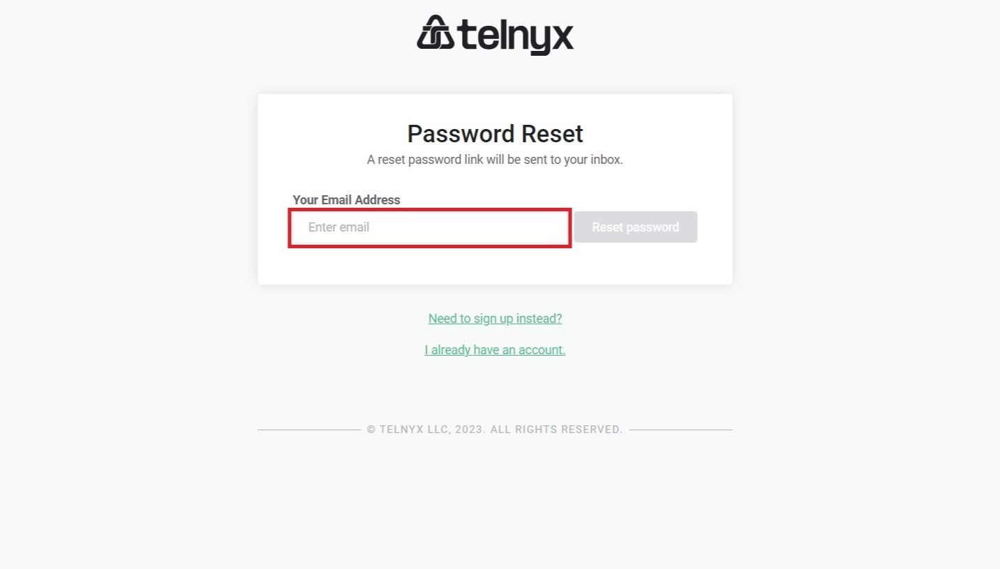
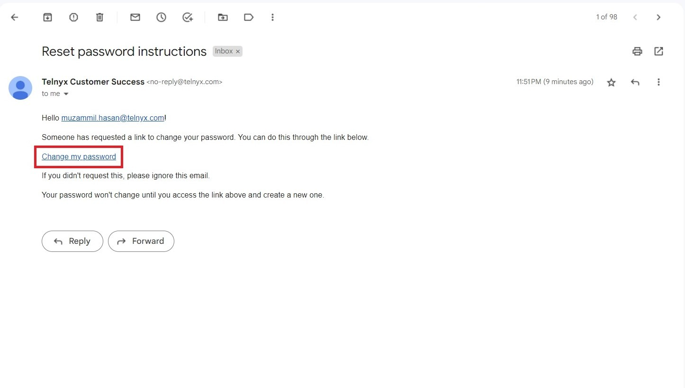
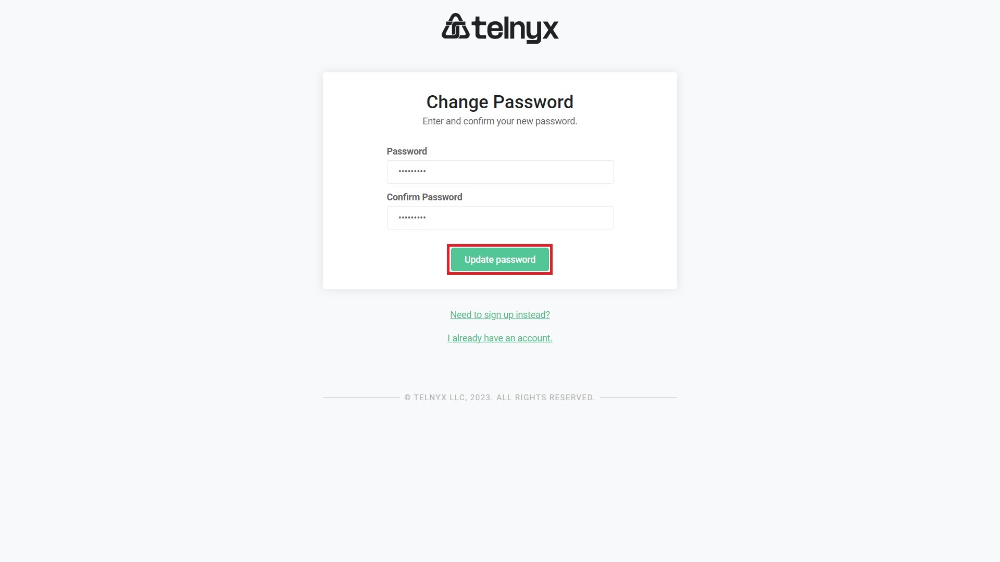
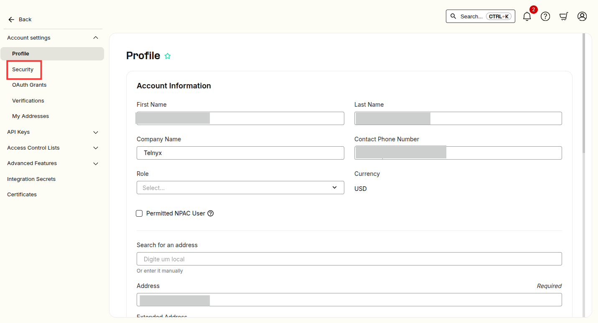
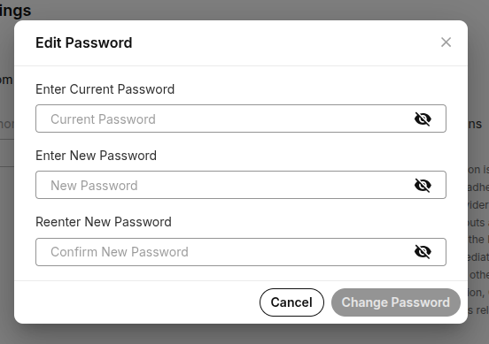

# How To Reset Your Password

In this guide you will cover how you can reset/update your Telnyx account… See Telnyx guidance and requirements.

## Recover Telnyx Account Password

**Your password must contain at least one punctuation mark or symbol, must contain at least one upper-case letter and may not be any shorter than 12 characters.**

If you have forgotten your Telnyx account password or the account has been locked due to the number of unsuccessful attempts, then you can exercise the option to recover the password.

In this guide, you will find step-by-step instructions to recover/update the password to get back the access to your account.

Let’s get started.

You can recover/reset the Telnyx password by two methods:
1. Reset the Password Via Sign-In Page
2. Reset the Password from Account Settings

## Method 1:

### Reset the Password Via Sign-In Page

**Step 1:** Navigate to the Telnyx [portal](https://portal.telnyx.com) and click the “**Forgot your password**” link.

**Step 2:** Enter your registered email address which is linked to your Telnyx account and click on the “**Reset password**” button.

A reset password link will be sent to your inbox

**Step 3:** Check your inbox and open the email from Telnyx with the subject line: “**Reset password instructions**” email and click on the “**Change my password**” link.

**Step 4:** You will be navigated to the “Change Password” page. Enter the new password twice (for confirmation) and click on the “**Update password**” button to set a new password.

Your password has been successfully changed.

## Method 2:

### Reset the Password from Account Settings

You can change your account password by navigating to the account settings, provided that you’re already logged in to your Telnyx account.

**Step 1:** Navigate to the Telnyx [portal](https://portal.telnyx.com) and click the profile icon in the top right corner of the screen, then click the "**Account Settings**" option.

**Step 2:** Select the “**Security**” option from the left sidebar.

**Step 3:** On the Security page, click the “**Change Password**” button.

**Step 4:** Request a verification code to be sent to your email, then enter the code when prompted.

**Step 5:** Enter the current password and the new password twice for confirmation and click on the “**Change Password**” button.

Your password has been successfully Changed.

---

Related Articles

[What is my SIP Account Connection password?](https://support.telnyx.com/en/articles/1130713-what-is-my-sip-account-connection-password)[Textable Setup Guide](https://support.telnyx.com/en/articles/3685327-textable-setup-guide)[How to Sign Up for a Telnyx account](https://support.telnyx.com/en/articles/5295540-how-to-sign-up-for-a-telnyx-account)[CounterPath Bria Teams: Setup](https://support.telnyx.com/en/articles/5772825-counterpath-bria-teams-setup)[Positron IP Phone](https://support.telnyx.com/en/articles/5811761-positron-ip-phone)

Did this answer your question?

😞😐😃
