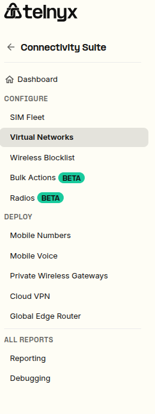
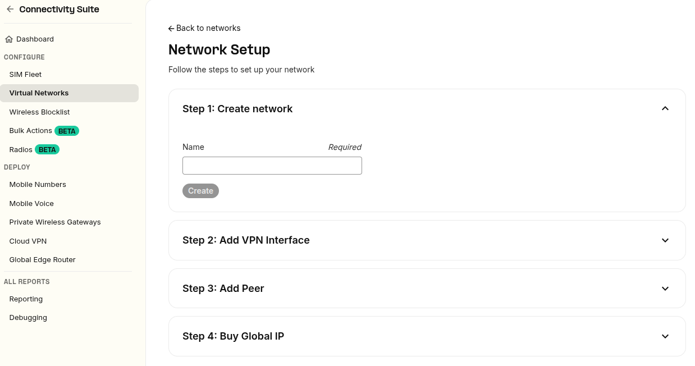

How to configure Global Edge Router with Telnyx | Telnyx Help Center

[Skip to main content](#main-content)

# How to configure Global Edge Router with Telnyx

Get access to your global edge network in minutes. Start building on Telnyx today.

Written by Telnyx Engineering

May 14, 2026

Table of contents

Our latest product, Global Edge Router, gives business access to a global edge network of 25+ points of presence to decrease latency for nightly-available applications and services. Global Edge Router also provides redundancy across cloud providers thanks to [BGP](https://telnyx.com/resources/what-is-bgp)-anycast.

# Telnyx Global Edge Router: Setup Guide

See how you can get started:

## **Step 1: Create your network**

[Sign-up](https://telnyx.com/sign-up) to the Mission Control Portal and navigate to the Networking tab on the left-side menu. In the “Networks” section, click “Create Network”.

Give your new network a name and click “Create”.

## **Step 2: Create a Wireguard**® **interface**

Next, select [Cloud VPN](https://telnyx.com/products/cloud-vpn) in the top menu, and click “Create VPN Interface”. Enter a name for your VPN interface and select a Network and region for your new VPN.

## **Step 3: Wait for the Wireguard**® **interface to provision**

Once you have created your VPN Interface it should take just a few minutes to provision (you might need to refresh the page to see the ‘provisioned’ status).

## **Step 4: Create a Wireguard**® **Peer**

Once the VPN interface is provisioned, you can create a Wireguard® Peer by clicking on the edit icon on your VPN interface.

Within the VPN interface, scroll down to the “Peers” section and select “Add new peer”.

Name your new peer and choose to use your own public key. Click “Create Peer”.

## **Step 5: Copy your new Private Key**

After Peer creation, copy the private key and close the pop-up.

## **Step 6: Acquire a Global IP**

Back in the Networking tab, select “Global IP” in the top menu.

Click on “Buy Global IP” in the top right-hand corner. Name your new global IP and add a description before selecting your Tier.

Global IP prices are based on port capacity—not egress fees—view our pricing here.

When you’ve selected your Tier click “Buy Global IP”.

## **Step 7: Assign Wireguard Peer to your new Global IP**

In the Global IPs tab, click on your new IP, and select “Assign new peer” at the bottom of the page.

If you have multiple, choose the Wireguard® Peer you would like to associate with the IP and click “Assign Peer”.

## **Step 8: Copy and paste Wireguard**® **configuration to service VM**

Using the Private Key in Step 5, paste your Wireguard® configuration to service your VM.

Now you have configured a Global IP and are ready to use Global Edge Router from Telnyx to help keep your services online and quickly accessible.

---

Related Articles

[Telnyx Networking on Ubuntu](https://support.telnyx.com/en/articles/8104274-telnyx-networking-on-ubuntu)[Telnyx Networking on AWS VPC](https://support.telnyx.com/en/articles/8104309-telnyx-networking-on-aws-vpc)[Telnyx Networking on Azure Linux VMs](https://support.telnyx.com/en/articles/8104343-telnyx-networking-on-azure-linux-vms)[Intro to Telnyx Edge Router](https://support.telnyx.com/en/articles/8126141-intro-to-telnyx-edge-router)[Telnyx Networking on PfSense](https://support.telnyx.com/en/articles/8201852-telnyx-networking-on-pfsense)

Did this answer your question?

😞😐😃

Table of contents
