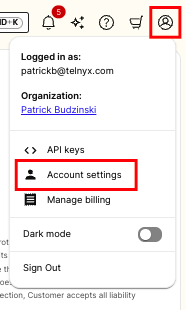
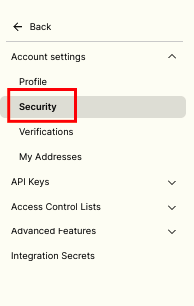
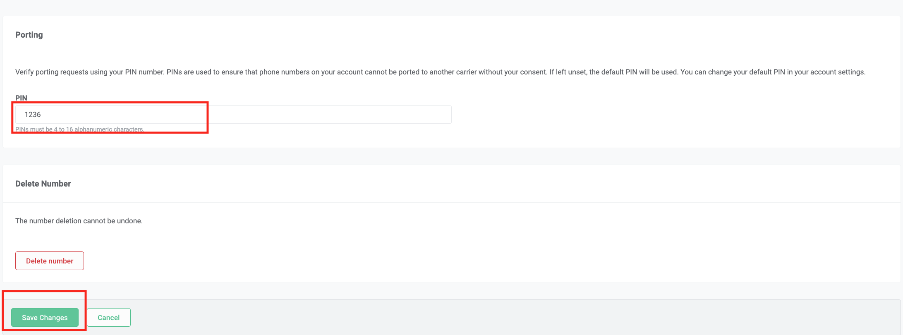
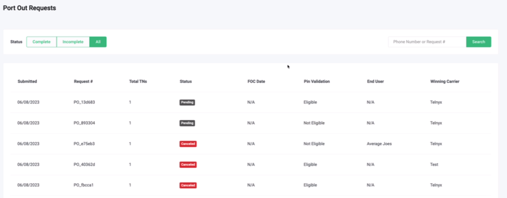

Port Out PIN Protection | Telnyx Help Center

[Skip to main content](#main-content)

# Port Out PIN Protection

This article explains how to properly set up Port Out PIN protection on your account

Written by Patrick Budzinski

March 20, 2025

Table of contents

The purpose of this article is to provide an overview of the Port Out PIN Settings found in the [Telnyx Portal](https://portal.telnyx.com/#/app/home) along with a brief description of all the options available:

* What happens if I enable Port Out PIN Protection?
* Enabling PIN Protection and Setting Your Default PIN for Phone Numbers
* Individual PIN Settings
* Applicable Port Out Orders vs. Non-applicable Port Out Orders

# **What happens if I enable Port Out PIN Protection?**

When a Port Out request is created, the PIN provided by the losing carrier will be validated against your account settings. If the PIN matches your Port Out PIN, the order will be successfully created and sent to you, exactly like before, for review. If the Port Out PIN does not match your settings (or is not provided), the order will be automatically rejected. You will be able to view auto-rejected orders on the [Port Out Requests](https://portal.telnyx.com/#/app/numbers/port-outs) page in the Mission Control Portal.

By default, this feature is turned off for your account. If you leave this feature toggled off, no PIN validation will occur on your Port Out Requests.

## **Enabling PIN Protection and Setting Your Default PIN for Phone Numbers**

In the top right, select your profile, and select `Account Settings` (link [here](https://portal.telnyx.com/#/app/account/general)).

Once the web page updates, please ensure that you select `Security`

Scroll down to the `Security` section on the page. You should see:

* `Default PIN for Phone Numbers`: This is the account level port out pin. Assuming you have port out pins enabled and you do not have a unique Port Out PIN associated with a phone number (more on that in the `Individual PIN Settings` section of this guide), this pin will apply for Port Out PIN validation.
* `Enable Port out Pins`: You can toggle on or off Port Out PIN validation for your account. By default, this feature is toggled off for all accounts.

**NOTE:** Port-out PIN protection is available for on-net US numbers only. Customers that use PIN protection must adhere to all Telnyx and FCC rules related to PINS, including that any service provider must provide the PIN to its end users/resellers, to ensure that legitimate port outs are not blocked. Accordingly, Customer agrees to immediately provide the PIN to its customers/end-user/resellers. PIN Protection service may be immediately revoked by Telnyx if Customer does not follow these rules, or if Customer otherwise abuses the process to prevent legitimate port-outs. By using PIN protection, Customer accepts all liability for any claims that Customer has violated any rules relating to port-outs or the law.

## **Individual PIN Settings**

You can specify Port Out PINs for individual phone numbers. To update the Port Out PIN for a particular phone number:

1. Go to the [My Numbers](https://portal.telnyx.com/#/app/numbers/my-numbers-beta) page in the Portal
2. On the right side of the table underneath the `Actions` header, click on the `Edit` icon for the phone number you wish to update  
   ​

   
3. On the `Settings` tab, scroll down to the `Porting` section. If there is no value for `PIN`, then the default account PIN is applied (see section above `Setting your Default PIN for Phone Numbers`  
   ​

   
4. To update the PIN for that specific phone number, enter in the code in the `PIN` field and click `Save Changes` at the bottom of the page  
   ​

   

**Note**: This will only update the PIN for the currently selected number. If nothing is provided, the default account level Port Out PIN will be used.

## **Applicable Port Out Orders vs. Non-applicable Port Out Orders**

Please note that Port Out PIN protection is available for on-net US numbers only. As a Port Out request is created for your account, you will notice a new column titled `PIN Validation` listing either `Eligible` or `Non-Eligible`. PIN validation will only occur on `Eligible` Port Out requests.

---

Related Articles

[Porting Error Messages](https://support.telnyx.com/en/articles/1618776-porting-error-messages)[I Received a Port-Out Notification](https://support.telnyx.com/en/articles/2030667-i-received-a-port-out-notification)[Port your Microsoft MS Teams Numbers](https://support.telnyx.com/en/articles/5104103-port-your-microsoft-ms-teams-numbers)[Port away from voip.ms](https://support.telnyx.com/en/articles/5595770-port-away-from-voip-ms)[Porting Numbers Away from Aircall to Telnyx](https://support.telnyx.com/en/articles/14708128-porting-numbers-away-from-aircall-to-telnyx)

Did this answer your question?

😞😐😃

Table of contents
