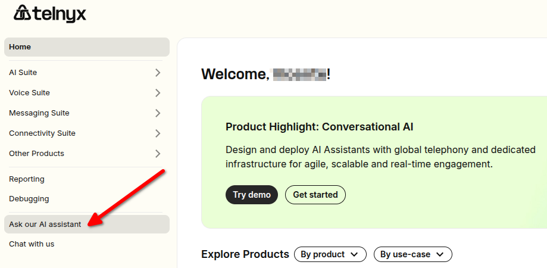
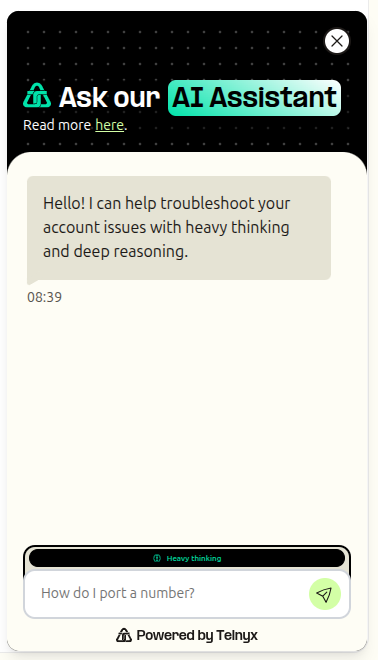
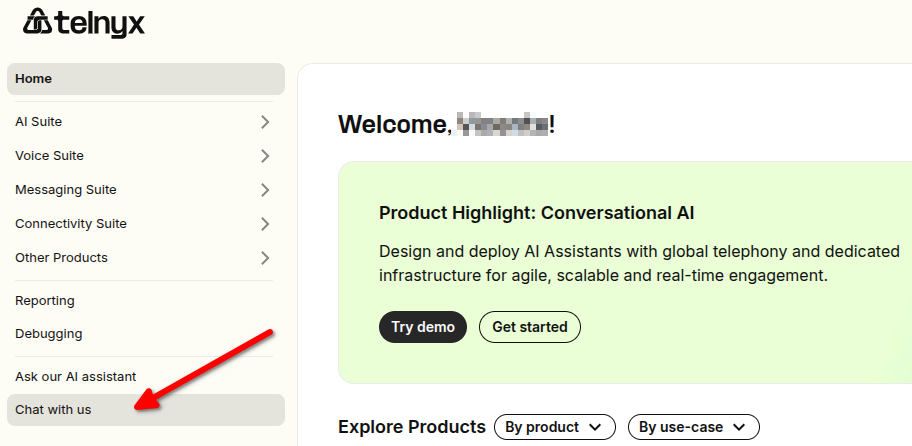
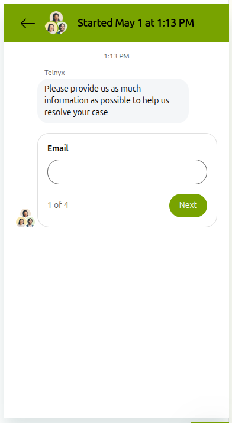
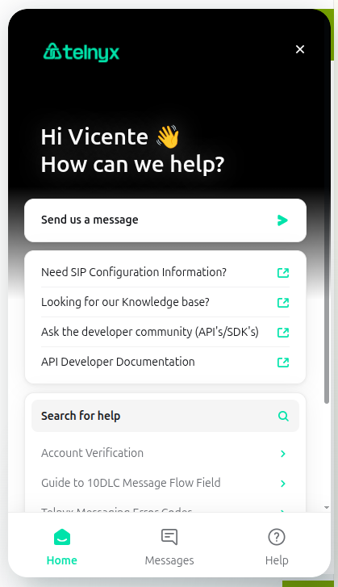

Mission Control Portal - AI Chat Support Assistant | Telnyx Help Center

[Skip to main content](#main-content)

# Mission Control Portal - AI Chat Support Assistant

Your new Telnyx AI Assistant here to help provide 24/7 support.

Written by Dillin

May 1, 2026

Table of contents

# Mission Control Portal - AI Chat Support Assistant

We are delighted to introduce our latest digital offering, designed to enhance your customer service experience, while providing more efficient and personalised support. The advent of our new AI Assistant accessible through our [Mission Control Portal](https://portal.telnyx.com), marks another evolution in our service provision, complimenting our existing chat support service.

You can access the AI Assistant on the left hand side navigation bar, as seen in the image below. Simply click "Ask our AI Assistant" and the widget will pop up from the bottom right hand side of your mission control portal account.

## How to Interact with the AI Assistant

**Ask our AI Assistant:** Your go-to tool for answers about Telnyx products always at your fingertips.

It pulls from our **Support Center** (support.telnyx.com), **Developer Docs** (developers.telnyx.com), and **main website** (telnyx.com) to deliver the most relevant info instantly.

Whether it’s a simple question or a more technical one, the Assistant uses our documentation and has read-only access to your portal account resources that can help troubleshoot.

Get instant support anytime. And if the Assistant can’t solve it, you can still connect directly with a live agent from the widget or by clicking "**Chat with us**" on the left-hand side navigation.

If you select "Ask our AI Assistant" and once you have asked a question and the assistant has responded you will be given two buttons: **"Chat to Support"** or **"That helped"**. If you want to speak with an agent then select "Chat to Support". If the response resolved your question then you select "That helped". If you want to ask another question then simply type into the chat box and enter your next question.

## What can the AI Assistant cover?

We list example topics the AI Assistant can cover below, and you can see common questions in the placeholder text box. To get the best out of the assistant it is of course recommended to provide context when asking questions. Otherwise, a few keywords may not be specific enough to provide you the answer you may be looking for.

Example Questions:

1. Hosted SMS?
2. Making calls?
3. How can I place an order for Hosted SMS?
4. How do I make calls with Call Control Voice API?

The first and second question will likely match a reference article across our websites but not specifically give you an answer to the information you may need for setup and configuration.

Instead, the third and fourth question will result in a specific set of instructions that can help you with the process on how to place an order for hosted SMS.

Elaborating on and mentioning the specific Telnyx products will help guide our assistant to providing you with the right answer!

In cases where the questions are considered to technical for the assistant to answer, you will be guided to our human support.

**General Customer Support**

* The assistant can provide answers to common questions about our services form our Support Center documentation.

#### **Developer Support**

* Developers can ask about our APIs, coding questions, SDKs, and much more. Our AI can provide code snippets (specify this in your question) and recommend relevant documentation.

#### **Self-Service Support**

* It's designed to provide first-level support. For more complex inquiries, our AI Assistant can guide you through the process of creating a support ticket or giving you the option to start a chat with our agents.

#### **24/7 Availability**

* Just like our Support team, our AI Assistant is available around the clock. However, as we're relying on a third party provider, it's possible it may experience degradation from time to time. We'll clearly display when the assistant is not performing at it's expected levels. It's important to note that while our AI assistant is highly capable, it's not currently designed to replace human interaction. Instead, it complements our human support team by handling more routine inquiries. However, Telnyx does have plans to continue to improve the assistant and user experience. The best way to provide feedback is by selecting the thumbs up and thumbs down buttons on a per message basis.

## Limitations and Complementary Use

While our AI Assistant is a powerful it may not be able to handle complex queries or requests that require human intervention. In such cases, we encourage you to use the "Chat to Support" feature to get in touch with our live support team but the goal is to continue to iterate.

Remember, our AI Assistant and our chat support system, work in synergy. They are designed to complement each other and ensure you receive efficient, accurate, and swift assistance whenever you need it. Conversation history is not stored in the widget at this time so if you refresh your portal or log out of your account, the conversation you had will not be retrieved.

## By using our AI Assistant

* You agree to the processing of [personal data](https://telnyx.com/privacy-policy), which is necessary for the provision of our chat services.
* You acknowledge and consent to have your data stored and processed by Telnyx in the United States.
* You agree to have your data transferred to OpenAI, a subprocessor located in the United States, who assists in processing interactions with our AI Assistant and generating answers based on our publicly accessible documentation.
* We retain personal data as long as necessary to provide our services or as required by law, rule or regulation.
* Please note that our services involve automated decision-making, including the use of artificial intelligence to process interactions with our AI Assistant.
* It is possible that our assistant may return incorrect our outdated information, please do not hesitate to contact a member of our support team to have your queries clarified.

---

Related Articles

[Do I have to sign a contract?](https://support.telnyx.com/en/articles/1130644-do-i-have-to-sign-a-contract)[Messaging in Mission Control](https://support.telnyx.com/en/articles/8219294-messaging-in-mission-control)[Get Started with Telnyx Storage & Inference Guide](https://support.telnyx.com/en/articles/8344129-get-started-with-telnyx-storage-inference-guide)[Comprehensive AI Assistants Configuration Walk-Through](https://support.telnyx.com/en/articles/12232444-comprehensive-ai-assistants-configuration-walk-through)[Bot-to-Bot Support API: Ask Telnyx Knowledge Agent](https://support.telnyx.com/en/articles/15455646-bot-to-bot-support-api-ask-telnyx-knowledge-agent)

Did this answer your question?

😞😐😃

Table of contents
