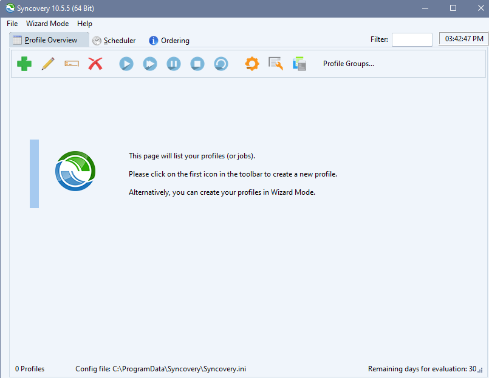
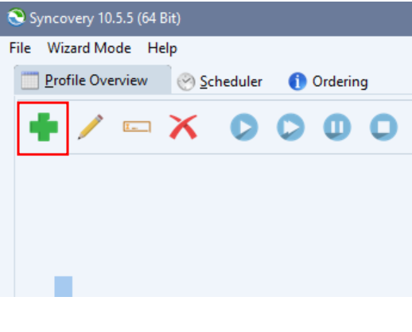
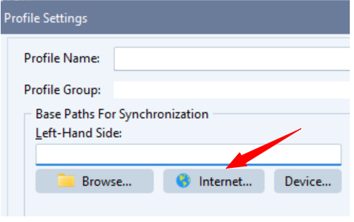
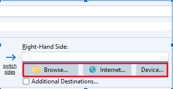
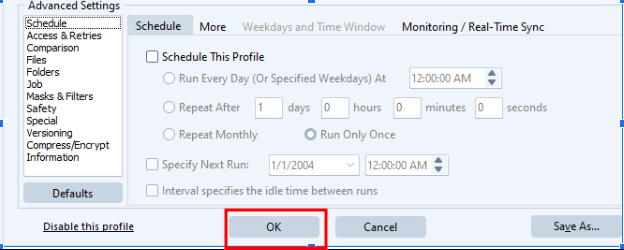

# Use Syncovery with Telnyx Storage

Explore how to configure Syncovery with Telnyx Storage for seamless file transfer, synchronization, See Telnyx guidance and requirements.

[Syncovery](https://www.syncovery.com/) is a versatile file synchronization and backup software that provides users with a range of powerful features for managing their data. By integrating Syncovery with [Telnyx Storage](https://telnyx.com/products/cloud-storage), you can take advantage of Telnyx's reliable and scalable storage solution to ensure the safety and accessibility of your files.

---

## How to configure Syncovery to work with Telnyx Storage

## Step 1

**Download and Install Syncovery:** Start by downloading and installing the latest version of Syncovery from the official website. You can find the download link [here!](https://www.syncovery.com/)

## Step 2

**Launch Syncovery:** Once Syncovery is installed, launch the application on your computer.

## Step 3

**Create a New Profile:** click on the ‘green plus button’ to create a new synchronization or backup profile.
​

## Step 4

**Select Source and Destination:** In the profile configuration window, click on the “Internet” button
​

## Step 5

**Enter Telnyx Storage Details:** In the Internet Protocol Settings window, enter the following information and then click on `OK`:

1. **Protocol:** Select **S3** from the dropdown menu
2. **Access ID:** Copy your API key from your account settings in the [Telnyx portal.](https://portal.telnyx.com/#/app/api-keys)
3. **Secret key:** Input your Access ID - the access ID is not used by Telnyx Storage, but is needed by Syncovery. Type out anything you want here, as long as it doesn't include spaces, quoting, or special characters of any kind.
4. **Provider:** Select the “custom” option from the dropdown
5. **Bucket:** Copy and paste one of our available [API Endpoints](https://developers.telnyx.com/docs/cloud-storage/api-endpoints).
6. **Folder:** Select the folder to backup on your PC
   ​

   

## Step 6

Select the path you are synchronizing to from the options below; it can be from your local storage - **Browse…, Internet…** or a **Device**
​

## Step 7

To save your new profile, click on **OK**
​

And that’s all there is to it! You are now ready to use Syncovery with Telnyx Storage to back up and synchronize your files.

Enjoy the convenience and reliability of Syncovery combined with the scalability and security of Telnyx Storage for effective data management.

---

**Additional Resources**

For more information on Syncovery and its features, refer to the official [documentation](https://www.syncovery.com/category/documentation/).
​

---

Related Articles

[Use Backup4all with Telnyx Storage](https://support.telnyx.com/en/articles/7869264-use-backup4all-with-telnyx-storage)[Use Duplicati with Telnyx Storage](https://support.telnyx.com/en/articles/7873510-use-duplicati-with-telnyx-storage)[Use GoodSync with Telnyx Storage](https://support.telnyx.com/en/articles/8047898-use-goodsync-with-telnyx-storage)[Use ODrive with Telnyx Storage](https://support.telnyx.com/en/articles/8047956-use-odrive-with-telnyx-storage)[Use AirExplorer with Telnyx Storage](https://support.telnyx.com/en/articles/8048045-use-airexplorer-with-telnyx-storage)

Did this answer your question?

😞😐😃
