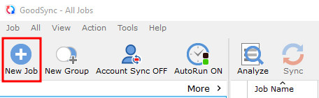
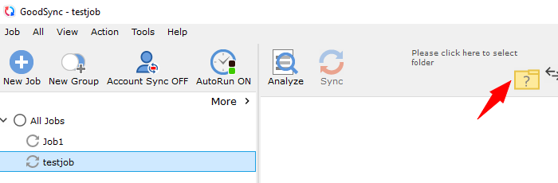
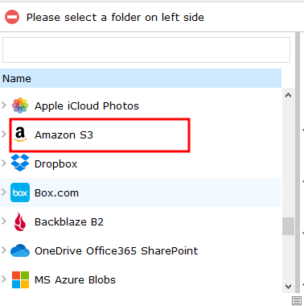
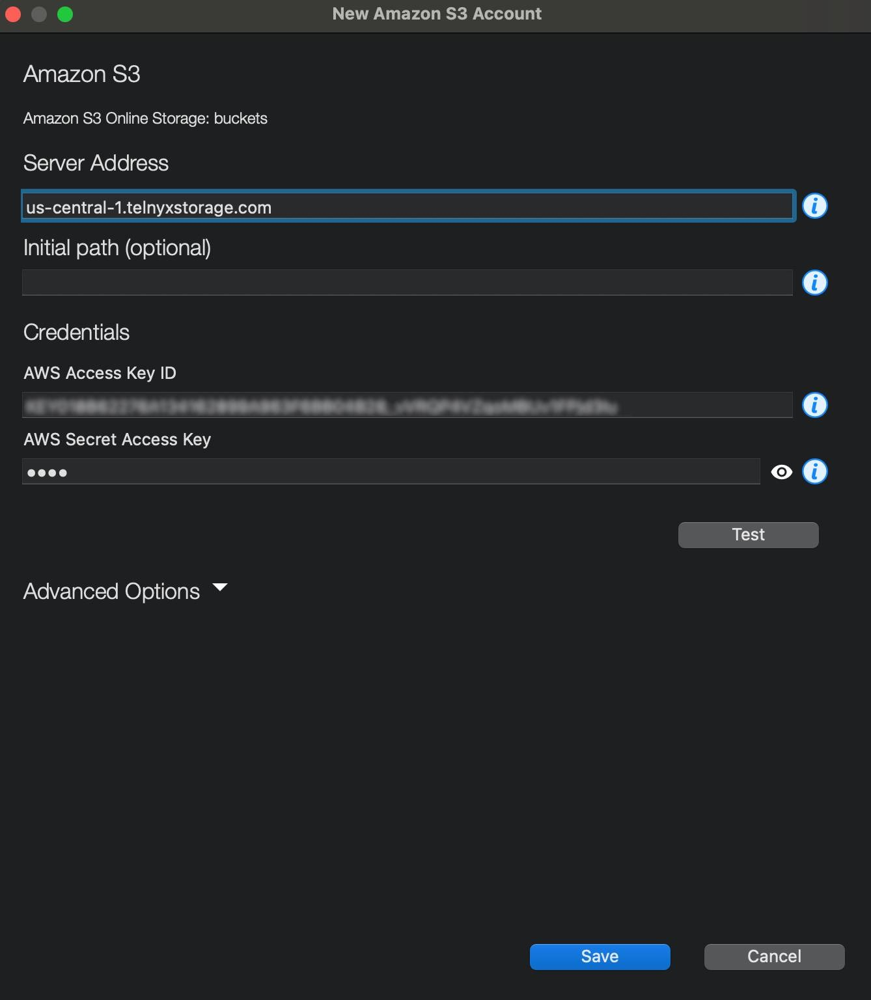

# Use GoodSync with Telnyx Storage

Learn how to set up GoodSync with Telnyx Storage to effortlessly synchronize and securely backup your files for… See Telnyx guidance and requirements.

[GoodSync](https://www.goodsync.com/) is a simple and secure file backup and synchronization software that helps users to manage their data across different platforms. It ensures data integrity and security during this process.

---

## **How to configure GoodSync to work with Telnyx Storage**

## Step 1

Download and install the latest version of GoodSync [here!](https://www.goodsync.com/download)

## Step 2

Sign up and create a GoodSync account

## Step 3

Click on ***New Job*** as shown below:
​

## Step 4

Enter a Job name, select the Job type as ***Synchronize***, then click on OK
​

## Step 5

Click on the folder icon, to choose a folder.
​

## Step 6

Select the ***Amazon S3*** folder from the list
​

## Step 7

Add the details for the S3 bucket, they include:

1. **Server address**: Copy and paste one of our available [API Endpoints](https://developers.telnyx.com/docs/cloud-storage/api-endpoints).
2. **AWS Access key:** Get the API key from your [Telnyx portal](https://portal.telnyx.com/#/app/api-keys)
3. **AWS Secret Access Key:** choose your secret key- the access key is not used by Telnyx Storage, but is needed by GoodSync. Type out anything you want here, as long as it doesn't include spaces, quoting, or special characters of any kind.
   ​
   You can then Test and Save
   ​

   

## Step 8

1. After saving it, you can see your bucket displayed on the dropdown for the Amazon S3 folder.
   ​

   

And that’s all there is to it! You have now connected GoodSync to Telnyx storage.

---

**Additional Resources**

For more information on how to use GoodSync, check out their guides for Windows, as well as their guides for Macs.
​

You can also refer to the GoodSync [Documentation](https://www.goodsync.com/goodsync-storage).

---

Related Articles

[Use Backup4all with Telnyx Storage](https://support.telnyx.com/en/articles/7869264-use-backup4all-with-telnyx-storage)[Use Duplicati with Telnyx Storage](https://support.telnyx.com/en/articles/7873510-use-duplicati-with-telnyx-storage)[Use Syncovery with Telnyx Storage](https://support.telnyx.com/en/articles/8047874-use-syncovery-with-telnyx-storage)[Use ODrive with Telnyx Storage](https://support.telnyx.com/en/articles/8047956-use-odrive-with-telnyx-storage)[Use AirExplorer with Telnyx Storage](https://support.telnyx.com/en/articles/8048045-use-airexplorer-with-telnyx-storage)

Did this answer your question?

😞😐😃
