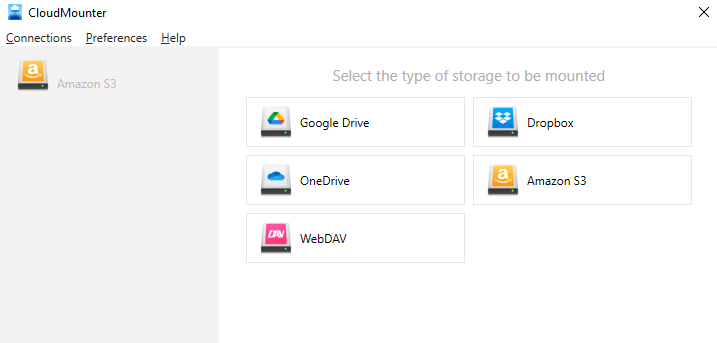
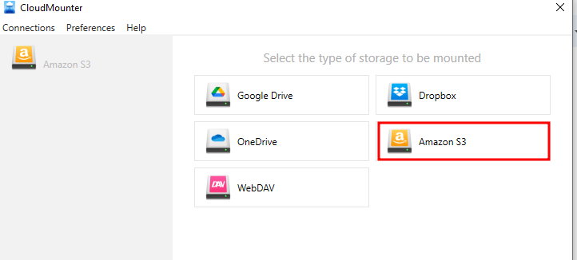

Use Cloudmounter with Telnyx Storage | Telnyx Help Center

[Skip to main content](#main-content)

# Use Cloudmounter with Telnyx Storage

Discover how to configure CloudMounter with Telnyx Storage to seamlessly access and manage your files across multiple cloud accounts

Written by Telnyx Engineering

June 6, 2024

Table of contents

[CloudMounter](https://cloudmounter.net/) is a powerful file management tool that allows you to mount various cloud storage services directly on your computer, providing seamless access and file synchronization across multiple platforms.

In this guide, we will walk you through the step-by-step process of integrating CloudMounter with [Telnyx Storage](https://telnyx.com/products/cloud-storage). This guide will help you effortlessly connect and manage your Telnyx storage within the CloudMounter application, enabling efficient file transfers and storage management.

---

# How to configure Cloudmounter to work with Telnyx Storage

## **Step 1**

Visit the Cloudmounter site and download the application for either Mac or Windows [here!](https://cloudmounter.net/)

## **Step 2**

Install CloudMounter on your computer, and launch the application.  
​

## **Step 3**

Select “**Amazon S3”** as the type of storage to be mounted.  
​

## **Step 4**

A window below will pop up, then fill in the details:

1. **Name:** Input your name
2. **Access Key:** Input your Telnyx API Key in the Access Key ID field. You can get this from your [Telnyx portal](https://portal.telnyx.com/#/app/api-keys).
3. **Secret Key:** The secret access key is not used by Telnyx Storage, but is needed by Cloudmounter. Type out anything you want here, as long as it doesn't include spaces, quoting, or special characters of any kind.
4. **Server Endpoint:** Copy and paste one of our available [API Endpoints](https://developers.telnyx.com/docs/cloud-storage/api-endpoints).
5. **Bucket:** Add a bucket name from your list of buckets on the [storage](https://portal.telnyx.com/#/app/storage/buckets) section of the Telnyx portal

## **Step 5**

After filling in all the details above, click on the “**Mount”** button to connect CloudMounter with Telnyx Storage.  
​

That's it! You have successfully configured CloudMounter with Telnyx storage, allowing you to conveniently access and manage your files stored in Telnyx from within the CloudMounter application. With this integration, you can enjoy seamless file synchronization, easy file transfers, and enhanced collaboration across different cloud storage platforms.

---

**Additional Resources**

For more detailed information and advanced features of CloudMounter, please refer to the CloudMounter [blog](https://cloudmounter.net/blog/).

If you have any further questions or need additional assistance, feel free to reach out. Happy file managing with CloudMounter and Telnyx Storage!  
​

---

Related Articles

[Use S3 Browser with Telnyx Storage](https://support.telnyx.com/en/articles/6965267-use-s3-browser-with-telnyx-storage)[Use ExpanDrive with Telnyx Storage](https://support.telnyx.com/en/articles/8047945-use-expandrive-with-telnyx-storage)[Use ODrive with Telnyx Storage](https://support.telnyx.com/en/articles/8047956-use-odrive-with-telnyx-storage)[Use NetDrive3 with Telnyx Storage](https://support.telnyx.com/en/articles/8048024-use-netdrive3-with-telnyx-storage)[Use AirExplorer with Telnyx Storage](https://support.telnyx.com/en/articles/8048045-use-airexplorer-with-telnyx-storage)

Did this answer your question?

😞😐😃

Table of contents
