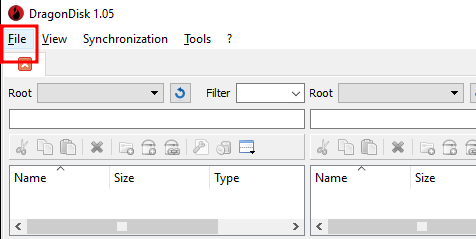
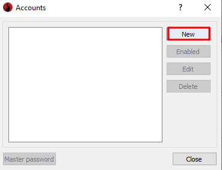
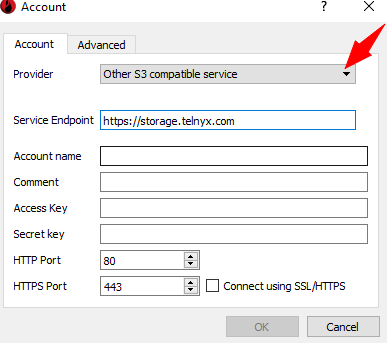

# Use DragonDisk with Telnyx Storage

Set up DragonDisk with your cloud storage provider for effortless file management and seamless access to your data… See Telnyx guidance and requirements.

In this guide, discover how to set up [DragonDisk](http://www.s3-client.com/), a client for S3-compatible storage with [Telnyx Storage](https://telnyx.com/products/cloud-storage) for secure and automated backup and recovery.

[DragonDisk](http://www.s3-client.com/) is a robust file manager for Amazon S3® and other S3 API-compatible cloud storage solutions. This guide provides a step-by-step process to integrate DragonDisk with Telnyx storage, enabling seamless data management and sharing. Experience the user-friendly interface and advanced features of DragonDisk while securely utilising Telnyx storage.

---

## **How to configure DragonDisk to work with Telnyx Storage**

## Step 1

Download and install the latest version of DragonDisk [here!](http://www.s3-client.com/download-s3-compatible-cloud-client.html)

## Step 2

Open the DragonDisk application

## Step 3

Click on **File**, and select **Accounts**.
​

## Step 4

1. The **Accounts** window will pop up, click on **New**.
   ​

   

## Step 5

1. Select **Other S3 compatible service**, from the dropdown on the **Provider** field. Then fill in the details.

   1. **Service Endpoint:** enter *<https://storage.telnyx.com>*
   2. **Account name: you can add your name/nickname here.**
   3. **Comment:** add a comment to recall this account.
   4. **Access Key:** copy and paste your [Telnyx API Key](https://portal.telnyx.com/#/app/api-keys) in this field.
   5. **Secret Key:** the secret key is not used by Telnyx Storage, but is needed by DragonDisk . You can type out anything you want here, as long as it doesn’t include spaces, quoting, or special characters of any kind.
      ​

      
2. Then click on **OK** to configure DragonDisk with Telnyx Storage

And that’s it! We have successfully configured DragonDisk with Telnyx Storage and unlocked powerful file management capabilities. Start maximizing productivity and efficiency with DragonDisk and Telnyx Storage today!

---

**Additional Resources**

For more information on how to use DragonDisk, check out their [FAQ page](http://www.s3-client.com/faq.html).
