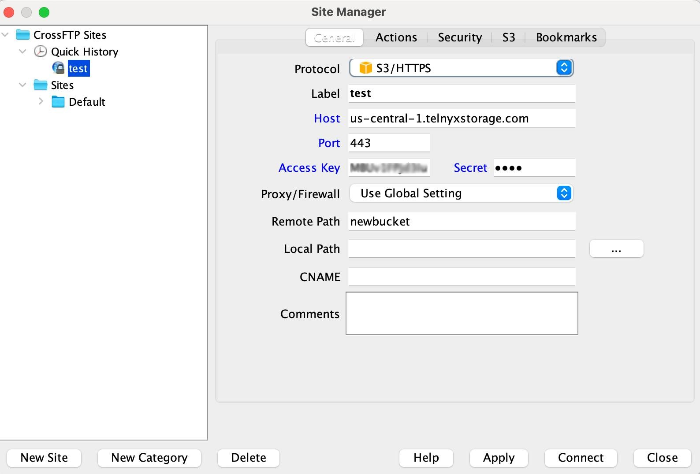

Use CrossFTP with Telnyx Storage | Telnyx Help Center

[Skip to main content](#main-content)

# Use CrossFTP with Telnyx Storage

Learn how to set up CrossFTP, a powerful FTP client, with Telnyx Storage for seamless file transfer and management.

Written by Telnyx Engineering

June 6, 2024

Table of contents

[CrossFTP](https://www.crossftp.com) is a feature-rich FTP client that lets users easily connect to FTP servers and transfer files. It provides a user-friendly interface, supports various file transfer protocols, and offers advanced features such as multi-threading, synchronization, and encryption.

---

# **How to configure CrossFTP to work with Telnyx Storage**

## Step 1

Download and install the latest version of CrossFTP [here!](https://www.crossftp.com/download.htm)

## Step 2

Launch the CrossFTP application and click on **"File"** and then **"Site Connect**" to open the Site Manager window.  
​

## Step 3

Select “**S3”** from the ***“Protocol”***dropdown and fill in the fields with the information below:

1. **Protocol:** S3/HTTPS
2. **Label:** You can use whatever name as the label, maybe your nickname.
3. **Host:** Copy and paste one of our available [API Endpoints](https://developers.telnyx.com/docs/cloud-storage/api-endpoints).
4. **Port:** 433
5. **Access Key:** Copy and paste your [Telnyx API Key](https://portal.telnyx.com/#/app/api-keys) in this field.
6. **Secret:** You can type out anything you want here, as long as it doesn’t include spaces, quoting, or special characters.
7. **Proxy/Firewall:** Select the “**Use Global Setting**” option from the dropdown.
8. **Remote Path:** Copy and paste the name of your bucket. You can get it [here.](https://portal.telnyx.com/#/app/storage/buckets)
9. **Local Path:** Choose a path from your local storage.
10. **CNAME:** Leave this field blank
11. **Comments:** You can add a comment to recall this connection.  
    ​

    

## Step 4

Click the **"Connect"** button to test the connection and verify the correct configuration.

Once the connection is successful, you can use CrossFTP to transfer files to and from Telnyx Storage.

And that’s all there is to it! We have successfully integrated CrossFTP to work with Telnyx storage for a seamless file transfer and storage experience.

---

## **Additional Resources**

For more information, you can check out CrossFTP features [here.](https://www.crossftp.com/features.htm)

---

Related Articles

[Use Cyberduck with Telnyx Storage](https://support.telnyx.com/en/articles/6964207-use-cyberduck-with-telnyx-storage)[Use WinSCP with Telnyx Storage](https://support.telnyx.com/en/articles/7903390-use-winscp-with-telnyx-storage)[Use WebDrive with Telnyx Storage](https://support.telnyx.com/en/articles/8047969-use-webdrive-with-telnyx-storage)[Use NetDrive3 with Telnyx Storage](https://support.telnyx.com/en/articles/8048024-use-netdrive3-with-telnyx-storage)[Use AirExplorer with Telnyx Storage](https://support.telnyx.com/en/articles/8048045-use-airexplorer-with-telnyx-storage)

Did this answer your question?

😞😐😃

Table of contents
