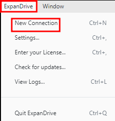
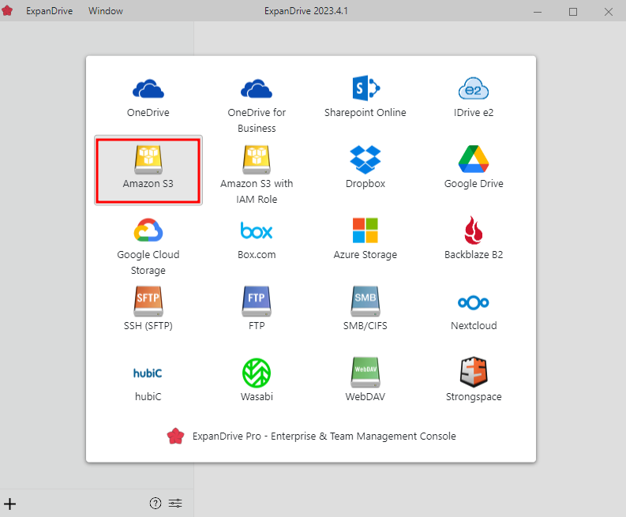
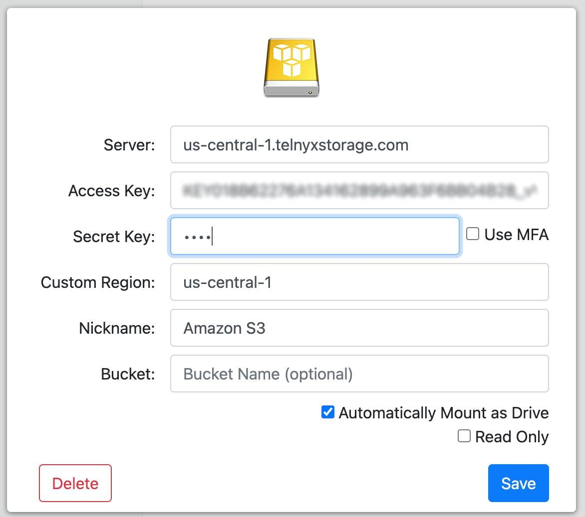
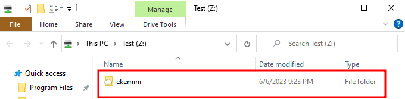

# Use ExpanDrive with Telnyx Storage

Learn how to integrate ExpanDrive, a powerful cloud storage client, with Telnyx Storage for seamless access and… See Telnyx guidance and requirements.

[ExpanDrive](https://www.expandrive.com/) is a versatile cloud storage client that allows you to mount cloud storage as a local drive on your computer. It provides a unified interface to access and manage files across multiple cloud storage providers, including Telnyx Storage. With ExpanDrive, you can easily navigate and interact with your Telnyx Storage files as if they were stored locally.

---

## **How to configure ExpanDrive to work with Telnyx Storage**

## Step 1

Download and install the latest version of ExpanDrive [here!](https://www.expandrive.com/desktop/)

## Step 2

Launch the ExpanDrive application click on **“ExpanDrive”** and then “**New Connection”.**
​

## Step 3

Select **"Amazon S3"** from the list of storage options.
​

## Step 4

Fill in the storage options with the information below:

1. **Server:** Copy and paste one of our available [API Endpoints](https://developers.telnyx.com/docs/cloud-storage/api-endpoints).
2. **Access Key:** Copy and paste your [Telnyx API Key](https://portal.telnyx.com/#/app/api-keys) in this field.
3. **Secret Key:** You can type out anything you want here, as long as it doesn’t include spaces, quoting, or special characters of any kind.
4. **Custom Region:** Copy and paste the matching region from [API Endpoints](https://developers.telnyx.com/docs/cloud-storage/api-endpoints). For example, if you chose the [https://us-central-1.telnyxstorage.com](https://us-central-1.telnyxstorage.com/) endpoint, you will use us-central-1 as the region.
5. **Nickname:** Use your nickname or whatever name you want.
6. **Bucket:** You can enter the bucket name on your Telnyx storage on leave it blank.
7. **Drive Letter:** Select the drive letter from your local storage. It could be any of the letters.
   ​

   

## Step 5

1. Click on the "**Save**" button to set up the connection. ExpanDrive will authenticate your Telnyx Storage account using the provided API Key.

Once the authentication is successful, you can access your Telnyx Storage files through the ExpanDrive interface, which will appear as a mounted drive on your computer.

---

**Additional Resources**

For more information on how to use ExpanDrive and its features, check out their [blog.](https://www.expandrive.com/)
