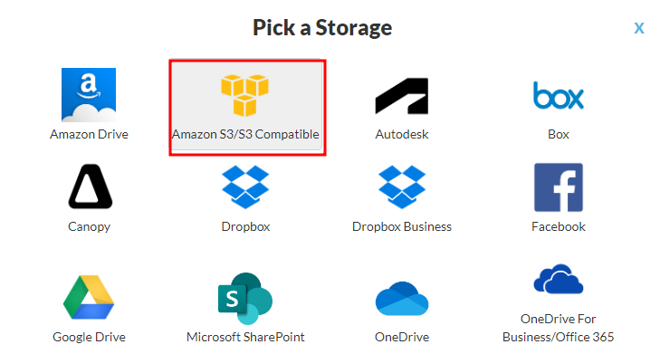
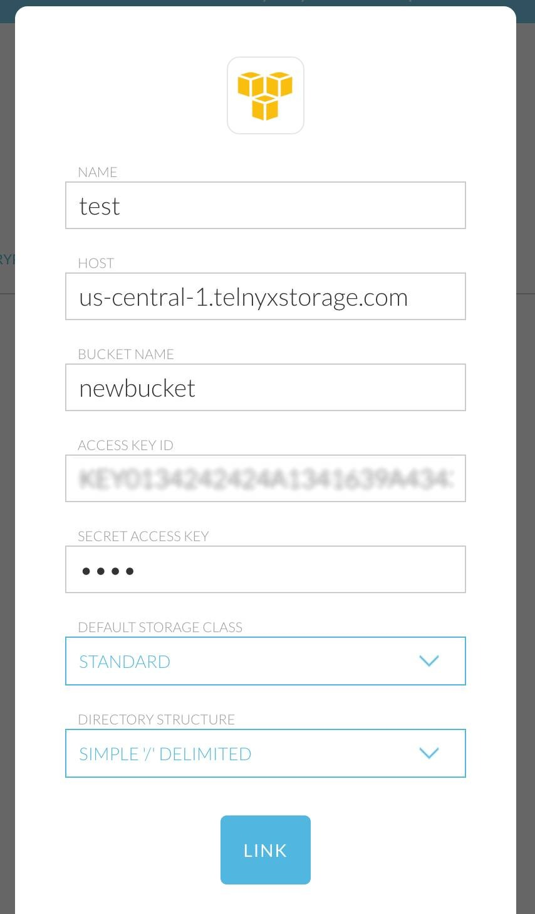
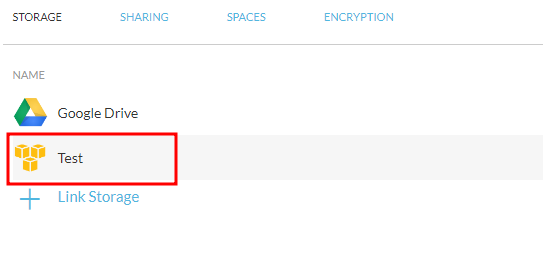

Use ODrive with Telnyx Storage | Telnyx Help Center

[Skip to main content](#main-content)

# Use ODrive with Telnyx Storage

Learn how to set up ODrive, a synchronization tool, with Telnyx Storage for seamless integration and synchronization of your files.

Written by Telnyx Engineering

June 6, 2024

Table of contents

[ODrive](https://www.odrive.com/) is a powerful synchronization tool that allows users to easily sync and access files across multiple devices and cloud storage services. It supports a wide range of cloud storage providers, including [Telnyx Storage](https://telnyx.com/products/cloud-storage), enabling you to integrate and synchronize your files effortlessly.

---

# **How to configure ODrive to work with Telnyx Storage**

## Step 1

Download and install the latest version of ODrive from [here!](https://docs.odrive.com/docs/odrive-usage-guide#install-desktop-sync)

## Step 2

Launch the application and click **"Link Storage"** to add Telnyx Storage as a storage provider.  
​

## Step 3

In the "Link Storage" window, select locate **"Amazon S3/S3 Compatible"** from the list of available storage providers. Click on it to proceed.  
​

## Step 4

Fill in the fields with the information below:

1. **Name:** Use a name to remember this connection, can be your nickname.
2. **Host:** Copy and paste one of our available [API Endpoints](https://developers.telnyx.com/docs/cloud-storage/api-endpoints).
3. **Bucket Name:** enter the name of the bucket you created in [Telnyx Storage](https://portal.telnyx.com/#/app/storage/buckets).
4. **Access Key ID:** copy and paste your [Telnyx API Key](https://portal.telnyx.com/#/app/api-keys) in this field.
5. **Secret Key ID:** You can type out anything you want here, as long as it doesn’t include spaces, quoting, or special characters.
6. **Default Storage Class:** leave it as “**Standard**”**.**

**Directory Structure:** leave it as “Simple’/’Delimited”.  
​

## Step 5

After authorizing ODrive, you'll be redirected back to the ODrive app, and Telnyx Storage will be successfully linked as a storage provider.  
​

Now, you can use the ODrive interface to browse and sync your files with Telnyx Storage. You can create folders, upload files, and manage your files' synchronization settings.

That's it! You have successfully integrated ODrive with Telnyx Storage, allowing you to sync and manage your files seamlessly across multiple devices and storage platforms.

---

**Additional Resources**

For further information and advanced usage of ODrive, you can refer to their [documentation](https://docs.odrive.com/docs).

​

---

Related Articles

[Use GoodSync with Telnyx Storage](https://support.telnyx.com/en/articles/8047898-use-goodsync-with-telnyx-storage)[Use CrossFTP with Telnyx Storage](https://support.telnyx.com/en/articles/8047941-use-crossftp-with-telnyx-storage)[Use ExpanDrive with Telnyx Storage](https://support.telnyx.com/en/articles/8047945-use-expandrive-with-telnyx-storage)[Use NetDrive3 with Telnyx Storage](https://support.telnyx.com/en/articles/8048024-use-netdrive3-with-telnyx-storage)[Use AirExplorer with Telnyx Storage](https://support.telnyx.com/en/articles/8048045-use-airexplorer-with-telnyx-storage)

Did this answer your question?

😞😐😃

Table of contents
