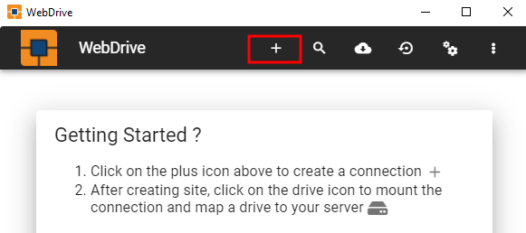

Use WebDrive with Telnyx Storage | Telnyx Help Center

[Skip to main content](#main-content)

# Use WebDrive with Telnyx Storage

Learn how to integrate WebDrive, a powerful file transfer client, with Telnyx Storage for seamless file management and storage.

Written by Telnyx Engineering

June 6, 2024

Table of contents

[WebDrive](https://southrivertech.com/) is a feature-rich file transfer client that enables users to easily access and manage files stored on various remote servers, including cloud storage services. It offers a user-friendly interface and supports a wide range of protocols, making it a versatile tool for file management and transfer.

---

# **How to configure WebDrive to work with Telnyx Storage**

## Step 1

Download and install the latest version of WebDrive [here!](https://southrivertech.com/webdrive/)

## Step 2

Launch the WebDrive application and click on the **"+"** button to create a new connection.  
​

## Step 3

Select “**Amazon S3”** as the connection type.  
​

## Step 4

In the connections settings window, enter the following information and then click “**Save”**.

1. **Connection Name:** Give the connection a name, which could be your nickname.
2. **Access Key:** Copy and paste your [Telnyx API Key](https://portal.telnyx.com/#/app/api-keys) in this field.
3. **Secret Key:** Although not used by Telnyx Storage, provide a value without spaces, quoting, or special characters.
4. **Bucket:** You can enter the bucket name on your [Telnyx storage](https://portal.telnyx.com/#/app/storage/buckets) or leave it blank.
5. **Drive Letter:** Enter the letter on your local storage drive.
6. **Advanced Settings:** Copy and paste one of our available [API Endpoints](https://developers.telnyx.com/docs/cloud-storage/api-endpoints) as the custom server URL.  
   ​

   

## Step 5

1. Once you have configured the settings, click on the **"Save"** button to save the connection.  
   ​

   

   ​
2. Select the newly created connection from the list and click on the ***box*** object button to connect with Telnyx Storage.  
   ​

   

Now you can easily manage your files stored in Telnyx Storage using WebDrive. Simply access the connected drive through WebDrive's interface, and you can perform various file operations such as uploading, downloading, renaming, and deleting files seamlessly.

---

**Additional Resources**

For more detailed information and advanced configurations, refer to the WebDrive [blog.](https://southrivertech.com/blog/)  
​

---

Related Articles

[Use Cyberduck with Telnyx Storage](https://support.telnyx.com/en/articles/6964207-use-cyberduck-with-telnyx-storage)[Use CrossFTP with Telnyx Storage](https://support.telnyx.com/en/articles/8047941-use-crossftp-with-telnyx-storage)[Use ExpanDrive with Telnyx Storage](https://support.telnyx.com/en/articles/8047945-use-expandrive-with-telnyx-storage)[Use NetDrive3 with Telnyx Storage](https://support.telnyx.com/en/articles/8048024-use-netdrive3-with-telnyx-storage)[Use AirExplorer with Telnyx Storage](https://support.telnyx.com/en/articles/8048045-use-airexplorer-with-telnyx-storage)

Did this answer your question?

😞😐😃

Table of contents
