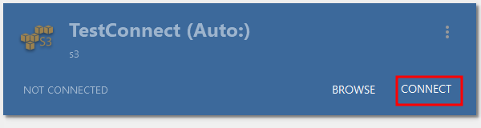
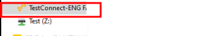

# Use NetDrive3 with Telnyx Storage

Learn how to integrate NetDrive3, a powerful remote storage mapping tool, See Telnyx guidance and requirements.

[NetDrive3](https://netdrive.net/) is a robust remote storage mapping tool that allows you to access and manage files stored on various cloud storage platforms, network drives, and FTP/SFTP servers. With NetDrive3, you can easily mount [Telnyx Storage](https://telnyx.com/products/cloud-storage) as a virtual drive on your computer for convenient file operations.

---

## **How to integrate NetDrive3 to work with Telnyx Storage:**

## Step 1

Download and install the latest version of NetDrive3 [here!](https://netdrive.net/)

## Step 2

Launch NetDrive3 and click on the **"+"** button to create a new connection.
​

## Step 3

In the “Add a Personal Drive” window, Select “**S3**” as the storage type from the dropdown and click on “**Connect**” to set up the connection.
​

## Step 4

Fill in these fields with the information below:

1. **Server Address:** Copy and paste one of our available [API Endpoints](https://developers.telnyx.com/docs/cloud-storage/api-endpoints).
2. **Access ID:** Copy and paste your [Telnyx API Key](https://portal.telnyx.com/#/app/api-keys) into this field.
3. **Secret Key:** Although Telnyx Storage does not use the secret key, input any value without spaces or special characters.
4. **Bucket name:** Enter the bucket name on your [Telnyx Storage](https://portal.telnyx.com/#/app/storage/buckets) that you want to connect.

## Step 5

After entering the information above, you’ll see **S3** added as a storage type.

1. You’ll also see the remote path which is based on the bucket name you entered above.
2. Click on **OK** to continue the setup.
   ​

   

## Step 6

After the setup above for the connection is completed, this window will pop up. Click on **Connect** to link NetDrive3 with Telnyx Storage.
​

## Step 7

Once connected, NetDrive3 will display the Telnyx Storage site as a virtual drive on your computer. You can now access and manage your files stored in Telnyx Storage seamlessly.
​

That's it! You have successfully integrated NetDrive3 with Telnyx Storage, allowing you to work with your files using a virtual drive interface conveniently.
​

Feel free to explore the capabilities of NetDrive3 and leverage the power of Telnyx Storage for your file management needs.

---

**Additional Resources**

If you need more information or assistance, you can refer to NetDrive3's [documentation.](https://netdrive.net/support/)

---

Related Articles

[Use CrossFTP with Telnyx Storage](https://support.telnyx.com/en/articles/8047941-use-crossftp-with-telnyx-storage)[Use ExpanDrive with Telnyx Storage](https://support.telnyx.com/en/articles/8047945-use-expandrive-with-telnyx-storage)[Use ODrive with Telnyx Storage](https://support.telnyx.com/en/articles/8047956-use-odrive-with-telnyx-storage)[Use WebDrive with Telnyx Storage](https://support.telnyx.com/en/articles/8047969-use-webdrive-with-telnyx-storage)[Use AirExplorer with Telnyx Storage](https://support.telnyx.com/en/articles/8048045-use-airexplorer-with-telnyx-storage)

Did this answer your question?

😞😐😃
