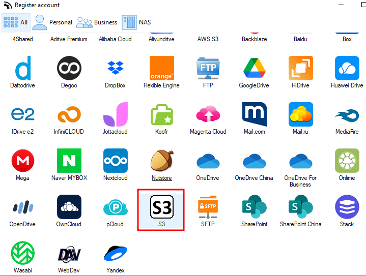
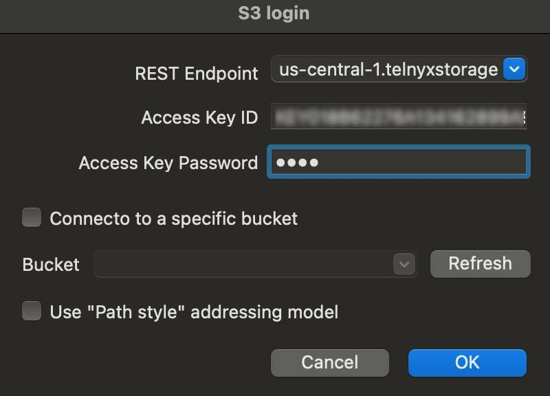

# Use AirExplorer with Telnyx Storage

Learn how to integrate AirExplorer, a powerful file management software, See Telnyx guidance and requirements.

[AirExplorer](https://www.airexplorer.net/en/) is a feature-rich file management software that allows users to easily manage and organize their files across multiple cloud storage providers. With AirExplorer, you can conveniently access, upload, download, and synchronize your files, providing a seamless file management experience.

---

## **How to configure AirExplorer to work with Telnyx Storage**

## Step 1

Download and install the latest version of AirExplorer [here.](https://www.airexplorer.net/en/)

## Step 2

Launch AirExplorer, and select **"S3"** from the list of available cloud storage options, to set up with Telnyx Storage.
​

## Step 3

In the configuration window, enter the following details:

1. **REST endpoint:** Copy and paste one of our available [API Endpoints](https://developers.telnyx.com/docs/cloud-storage/api-endpoints).
2. **Access Key ID:** Copy and paste your [Telnyx API Key](https://portal.telnyx.com/#/app/api-keys) as the Access Key.
3. **Secret Access Key:** The secret access key is not used by Telnyx Storage, but AirExplorer requires an entry. Type any value without spaces, quoting, or special characters.
4. **Bucket:** Enter the name of the [bucket on your Telnyx](https://portal.telnyx.com/#/app/storage/buckets) storage where you want to store your files.
   ​
   Once you have entered the required information, click on "**OK**" to verify the connection with Telnyx Storage, and save the configuration.
   ​

   

   ​

You can now access Telnyx Storage through AirExplorer and manage your files seamlessly

---

## **Additional Resources**

For more information on how to use AirExplorer and its advanced features, refer to their official [blog.](https://www.airexplorer.net/en/blog/)
