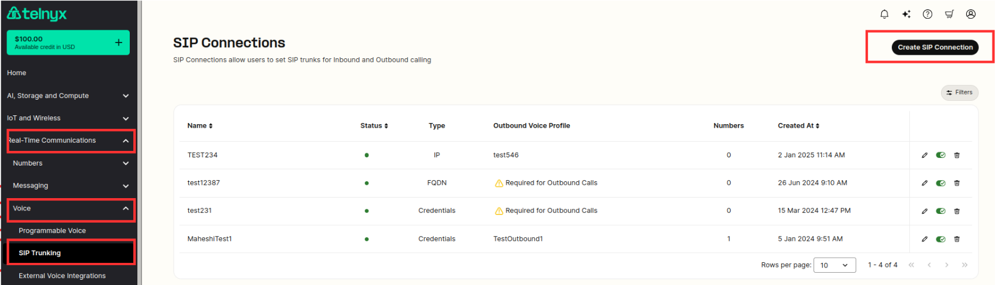
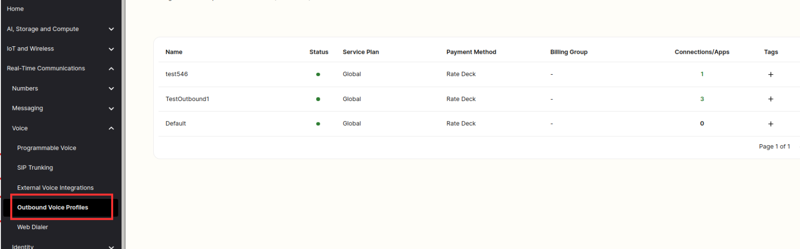
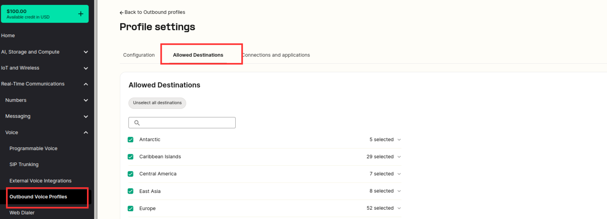
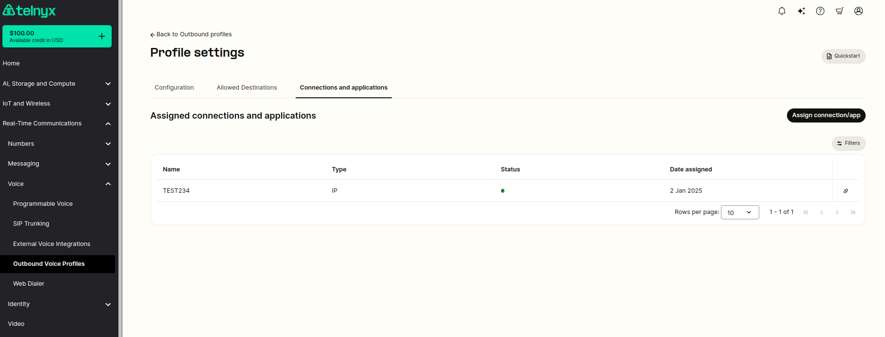
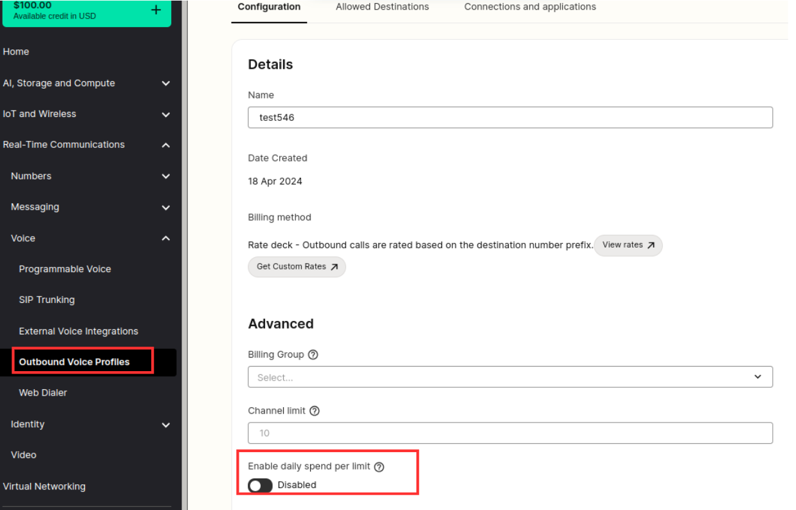

# How to Configure a SIP Trunk

Step-by-step guide on setting up a SIP Trunk with Telnyx using a compatible soft phone or system. See Telnyx guidance and requirements.

K

## How to Configure a SIP Trunk

Telnyx “[SIP Trunking](https://telnyx.com/products/sip-trunks)” is where you use Telnyx as your outbound and inbound voice carrier with the compatible softphone or system of your choice. To get started testing please follow this guide.

Step 0: Create a free account at [telnyx.com/sign-up](https://telnyx.com/sign-up) if you have not already or login at [portal.telnyx.com](https://portal.telnyx.com/#/login/sign-in) if you already have an account.

## Step 1: Add funds

Add funds by clicking the “+” green icon at the top of the Mission Control portal. For the purposes of this guide you can start with as little as $3 depending on the cost of the phone number you intend to purchase.

## Step 2: Purchase a phone number

Searching and purchasing numbers at Telnyx is simple, check out this [article](https://support.telnyx.com/en/articles/4380325-search-and-buy-numbers) for a detailed description but the main idea is to navigate to our [search section](https://portal.telnyx.com/#/voice/my-numbers/buy) and use the input fields or filters to narrow your search for the numbers you need!.

## Step 3: Choose your system

Identify and select the softphone, PBX, or other compatible system such as a CRM you will be using to make and receive calls. We have a strong pairing with [Zoiper](https://support.telnyx.com/en/articles/6133517-zoiper-communicator), Linphone

[MicroSIP](https://support.telnyx.com/en/articles/6133145-microsip-setup-with-telnyx), x-Lite, Twinkle, Blink, or MS Teams either Operator Connect or Direct Routing if you are looking for a recommendation.

Depending on your needs you may only need a softphone to pair with Telnyx Sip Trunks. A softphone is like a virtual phone that you can use on your computer or smartphone. It allows you to make and receive calls over the internet, similar to using a traditional phone. You can check [Configuration Guides](https://support.telnyx.com/en/collections/133118-configuration-guides) for existing documentation, but not all compatible systems are listed or documented.

If you have a team with more complex requirements than you are finding available with the softphones, for instance if you have many employees, then you may need a PBX. A PBX (Private Branch Exchange) is like a central telephone system for a business or organization. It manages and routes incoming and outgoing calls within the organization, allowing for internal communication between employees and external communication with the outside world. It helps streamline call management and can include features like voicemail, call forwarding, and call routing.

## Telnyx provides the behind the scenes connectivity

Telnyx does not provide the softphone or pbx system that you will need to utilize our sip trunking services, ultimately you will take your Telnyx details provided in the following steps and plug them into the compatible softphone or pbx of your choice.

There are many softphones and pbxs on the market so which one you choose depends on a) your requirements for your organization and b) compatibility with Telnyx services. Telnyx is compatible with many different softphone and pbx providers, many free and paid options, and there is currently not a comprehensive list. We do have many [configuration guides](https://support.telnyx.com/en/collections/133118-configuration-guides) for systems we have worked with in the past if you need inspiration. Once you have chosen a system then you will need to know what the requirements of your softphone or pbx are so that you can choose the best Telnyx authentication method.

You will essentially take your Telnyx authentication method and put it in your soft phone or pbx to actually make and receive calls. If you want to test a PBX then there is FreePBX which is thankfully also free. There are also other systems which are compatible such as CRMs or Softwares which can be paired with Telnyx as well. For example we have many Chiroproactors who use Telnyx combined with the practice management software Chiro8000 to automate sending out appointment reminders. If you have a software that isn’t but you need to be paired with Telnyx you can always request it at [community@telnyx.com](mailto:community@telnyx.com) as well, and we will evaluate options. Please take note of the authentication method that the system you select needs for use in the next step.

## Step 4: Configure your SIP Connection

There are two options to creating SIP Connections, we go through them below.

## 4A) Add your SIP Connection

Add your SIP Connection by going to [Voice -> SIP Trunking](https://portal.telnyx.com/#/voice/connections) and selecting the green “Create SIP Connection” button on the top right.

**Image description:** In <https://portal.telnyx.com/#/voice/connections> click “Add SIP Connection”.

Alternatively, in the “[My Numbers](https://portal.telnyx.com/#/voice/my-numbers)” section you can select or create a new sip connection and assign it to your number simultaneously.

**Image description:** In <https://portal.telnyx.com/#/voice/my-numbers> you can click the pencil icon in the SIP Connection column to select or add a new SIP Connection.

SIP Connections are used to configure inbound traffic and authentication. To put it simply, you need to establish a connection (like a virtual phone line) called a "sip connection" in order to connect your softphone, pbx, or system to Telnyx’s voice infrastructure.

[A more detailed walk through of the SIP Basic Connection settings.](https://support.telnyx.com/en/articles/4351104-sip-connection-settings)

[A guide for the SIP Connection: Inbound & Outbound Settings](https://support.telnyx.com/en/articles/4404448-sip-connection-inbound-outbound-settings).

## 4B) Choose your SIP Authentication method

Configuring your sip connection primarily consists of choosing how your connection is authenticated, meaning how we verify you are authorized to connect. Depending on the soft phone or pbx that you chose then you can choose between the following types of authentication depending on your system’s requirements:

1. Credentials (Username & Password): Inbound and Outbound
2. IP address : Inbound and Outbound
3. FQDN (Inbound) + Credentials (Outbound)
4. FQDN (Inbound) + IP address (Outbound)

## 4C) Next choose your AnchorSite

It is always good to minimize latency, which refers to the time it takes for packets to travel from one user to another over a network.You can minimize latency by anchoring your calls to a specific part of the Telnyx network located in global cities all over the world in order to ensure your packets get off the internet, and onto the Telnyx private network as fast as possible. Choose your own location by selecting a specific city or allow us to determine the location with the lowest latency for each call by selecting “Latency”.

**Image Description:** Select the “AnchorSite” city that best fits your needs based on the geography of your calls or select “Latency” for Telnyx to route calls for the lowest latency automatically.

## Step 5: Configure your Outbound Voice Profile

Your outbound voice profile (also known as OVP) configuration enables you to make outbound calls.

## 5A) Add New Profile

Go to <https://portal.telnyx.com/#/outbound-profiles> and select the green "Add New Profile" button and give the profile a name.

**Image Description:** In the Mission Control Portal go to Voice > Outbound Voice Profile and select the green “Add New Profile” button in the upper right.

## 5B) Select all the relevant OVP settings you’d like to use.

**Image description:** All of the OVP settings you can configure through the portal

You must add a sip connection to your outbound voice profile, don’t forget to hit save.

**Image description:** Add a sip connection to your OVP to enable two-way calls.

## 5C) OVP Spend Limits

Optionally but recommended you should set a daily spend limit in case your system is ever compromised, don’t forget to hit save.

It is wise to use these settings to select where you want to be able to send calls, specifying allowed destinations, max daily spends and max destination rates to keep your costs under control.

## Step 6: Select all the relevant OVP settings you’d like to use.

Plug your Telnyx authentication method from step 4 that you selected into the compatible system of your choice. We have [configuration guides](https://support.telnyx.com/en/collections/133118-configuration-guides) that have been used in the past available.

## Step 7: Start calling and receiving calls, the world is at your fingertips!

Start calling and receiving calls, the world is at your fingertips! Please remember to follow best practices around do not call lists and treat others how you would want to be treated. We take any complaints of repeated nuisance calls seriously and it is grounds to be asked to leave the Telnyx platform. Welcome to Telnyx, helping you connect - your way!

## More Sip Trunking Resources:

[Capabilites of the product discussed on Telnyx.com](https://telnyx.com/products/sip-trunks).

[API and Developer Documentation on Developers.telnyx.com.](https://developers.telnyx.com/docs/development/sip-trunking)

## Feedback for "How to Configure a SIP Trunk"

We love to get your feedback on this tutorial. If you have any then please message [community@telnyx.com](mailto:community@telnyx.com) and include the link to the article you are referencing along with any concerns or comments.

If you are stuck on any particular step then we would be happy to help, we have 24/7 world-class support available by phone at +18889809750 ext 2 or sending us an email at [support@telnyx.com](mailto:support@telnyx.com) or via chat by logging into your mission control portal account.

---

Related Articles

[Configuring a Cisco CUBE/CUCM SIP Trunk](https://support.telnyx.com/en/articles/1130673-configuring-a-cisco-cube-cucm-sip-trunk)[Grandstream UCM6xxx: SIP Trunks](https://support.telnyx.com/en/articles/5748258-grandstream-ucm6xxx-sip-trunks)[Xorcom PBX: SIP Trunk](https://support.telnyx.com/en/articles/5754127-xorcom-pbx-sip-trunk)[Wildix: SIP Trunk Setup](https://support.telnyx.com/en/articles/5799830-wildix-sip-trunk-setup)[Grandstream GRP260x: SIP Trunk](https://support.telnyx.com/en/articles/6169513-grandstream-grp260x-sip-trunk)

Did this answer your question?

😞😐😃
