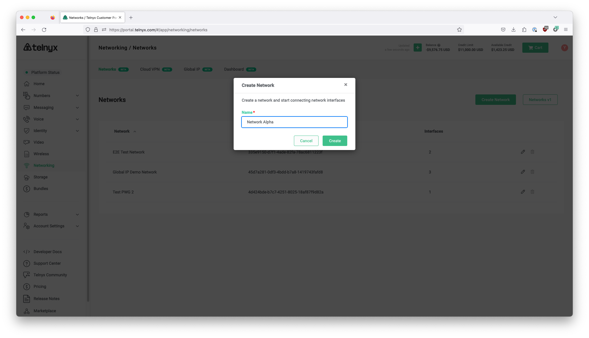
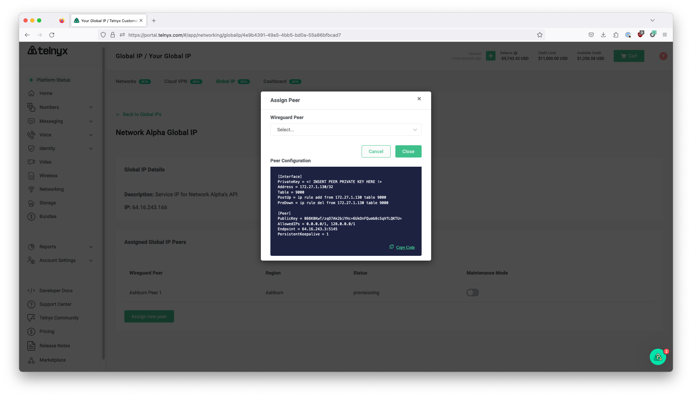
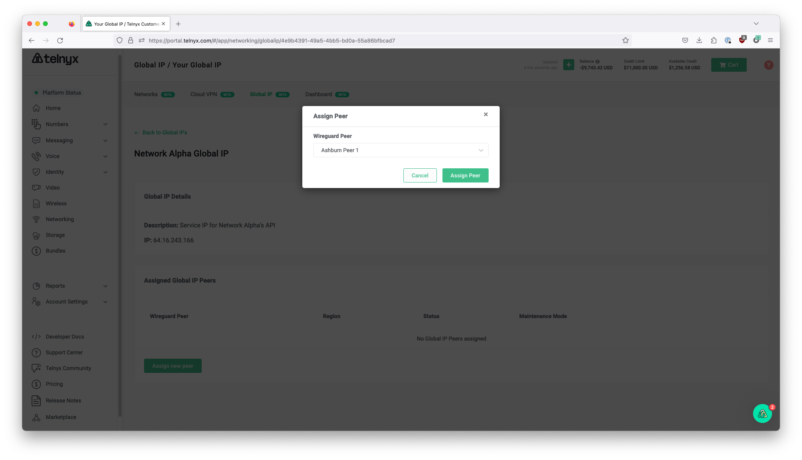
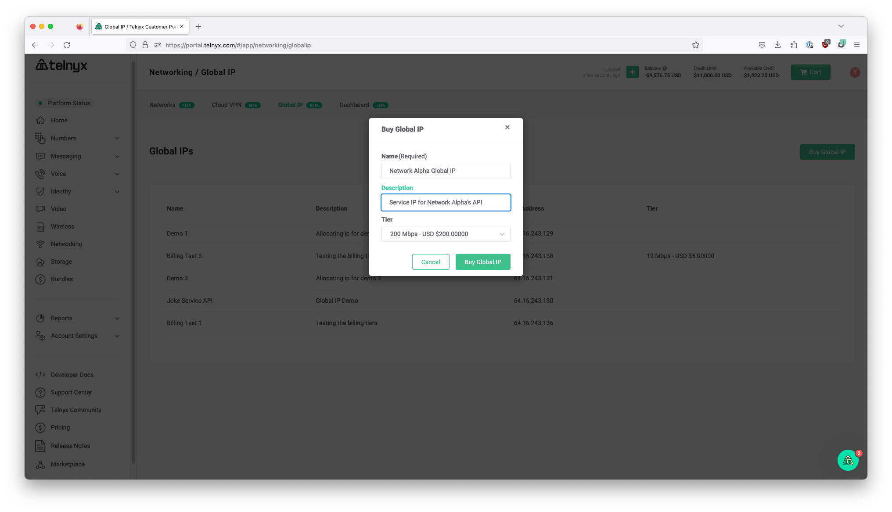
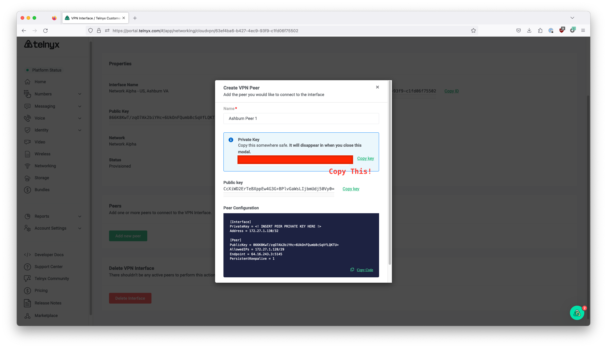
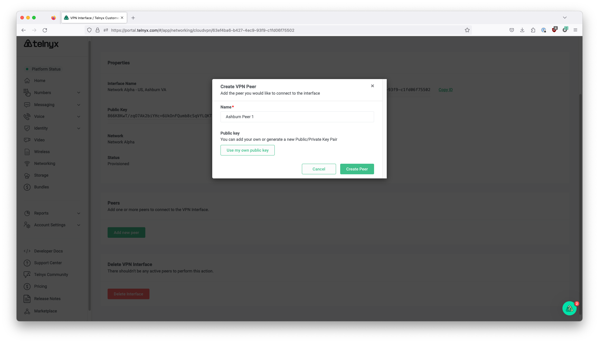
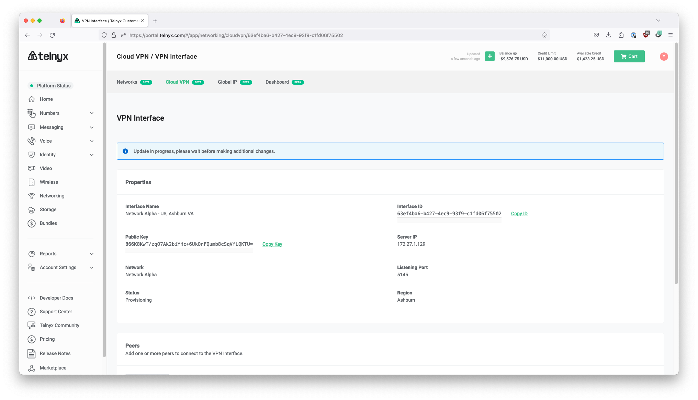
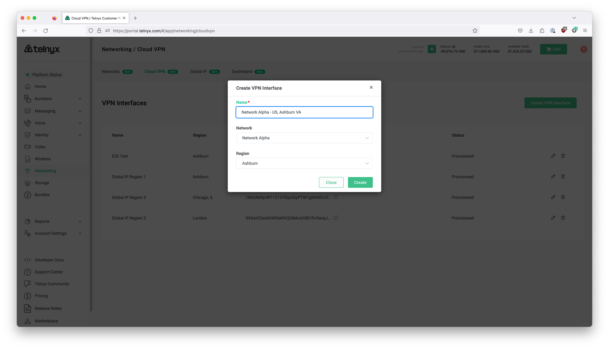

# Global IP & Edge Routing

Step by step process on how to get started with Telnyx Networking via procurement of Global IPs and setting up Global… See Telnyx guidance and requirements.

## Setting up Networking for Global Edge Routing

## **NOTE:** Please note that Global IP for customers is currently disabled. At present there are no plans to re-enable it in the near future. **Step 1. Create a Network**

## **Step 2. Create a WireGuard Interface**

## **Step 3: Wait for WireGuard Interface to finish provisioning**

## **Step 4: Create a WireGuard Peer**

## **Step 5: Make note of the Private Key returned**

## **Step 6: Acquire Global IP**

## **Step 7: Assign WireGuard Peer to Global IP**

## **Step 8: Copy and paste WireGuard config to service VM, using the Private Key in Step 5**

