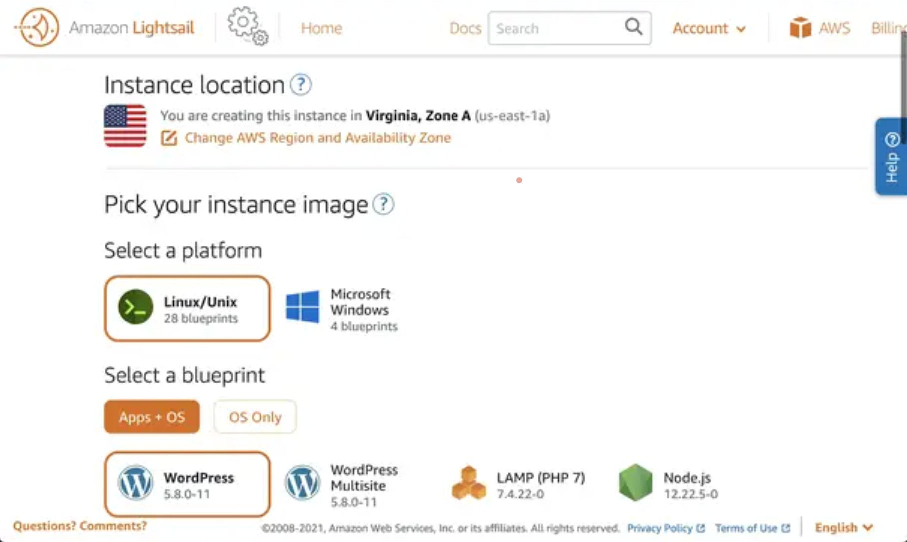
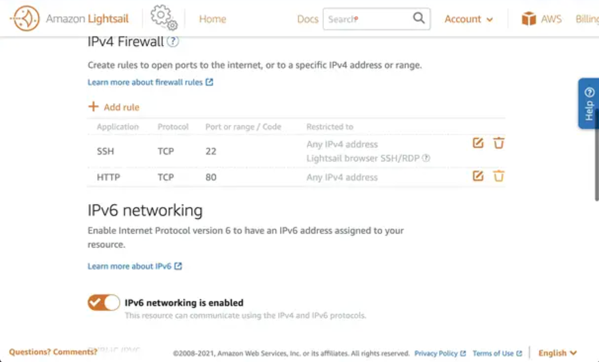
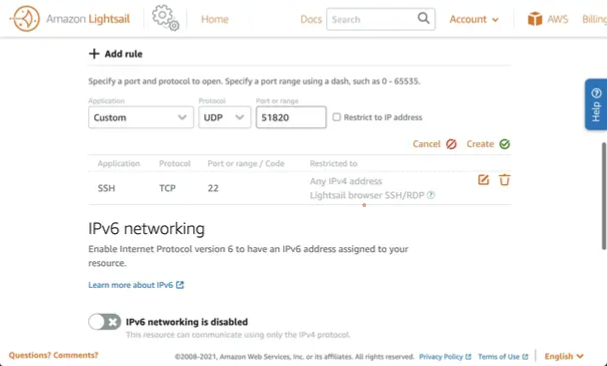

# Telnyx Networking on AWS Lightsail

This guide provides a step-by-step process to deploy a Lightsail Virtual Private Server (VPS) on Amazon AWS and… See Telnyx guidance and requirements.


## AWS Lightsail and the Telnyx Network

Here's an overview of what we will be going over:

* Deploying a Ubuntu 20.04 Lightsail VPS (or your preffered distribution)
* Installing WireGuard on the VPS
* Configuring WireGuard with Telnyx on the VPS

## Step 1: Configuring for Telnyx

Reference the introduction to Telnyx Networking section located here: [Telnyx Configuration](https://support.telnyx.com/en/articles/8103257-global-ip-edge-routing)

Copy and take note of the Peer Configuration file along with the private key that you got assigned from the above tutorial, it should look like the following:


## Step 2: Deploy an Amazon Lightsail VPS

Log in to Amazon Lightsail and click on "Create instance."


Choose a location by clicking on "Change AWS Region and Availability Zone."



Select "Linux/Unix" and choose "Ubuntu 20.04 LTS" as the operating system.

Give the instance a name and click "Create instance."

Take note of the public IP address of the instance as you will need it later for SSH connection and configuring the WireGuard VPN client.

Note: Telnyx Networking and Edge Routing works on any distro that supports WireGuard; as such a good place to start and reference is the [WireGuard installation site](<https://www.wireguard.com/install/>).

## **Step 3: Configuring Networking**

Now that your instance is running, you need to make some changes to the firewall rules to allow WireGuard clients to connect to the server.
Click on the instance name and go to the "Networking" section.



Delete the HTTP rule (since it's not a web server) by clicking on the recycle bin icon next to the HTTP rule.
Click

* "Add rule,"
* select "Custom,"
* choose "UDP,"
* assign port 51820
* click "Create."

This port will be used by the WireGuard service to connect to clients.

> Note: Disabling IPv6 is optional and depends on your usage preferences.

## **Step 4: Connecting to the VPS Instance with SSH**

Now it's time to establish an SSH connection to your VPS instance.

Navigate to the "Account" section, then click on "SSH keys.



Download the key assigned to your instance and save it on your computer.

Open a Terminal session (Unix-like operating systems) or Putty (Windows).

Make the key readable only by the current user:

```
chmod 600 ~/Desktop/vpn.cer
```

Connect to the VPS instance using the public IP address and the certificate path:

```
ssh -i ~/Desktop/vpn.cer ubuntu@[PUBLIC_IP_ADDRESS]
```

## **Step 5: Enabling Port Forwarding**

After connecting to the server, the next step is to enable port forwarding so that client traffic can access the internet.

Enable port forwarding by creating a file called `"10-wireguard.conf"` in the `"/etc/sysctl.d"` directory:

```
sudo vim /etc/sysctl.d/10-wireguard.conf
```

Add the following contents to the file:

```
net.ipv4.ip_forward=1
```

To enable port forwarding immediately, run the command:
​

```
sudo sysctl -p /etc/sysctl.d/10-wireguard.conf
```

## **Step 6: Installing WireGuard and Generating Keys**

Install WireGuard by running:

```
sudo apt update && sudo apt install wireguard -y
```

Generate the server and client keys using the following commands:

```
cd /etc/wireguard/
wg genkey | tee server.key | wg pubkey > server.pub
wg genkey | tee client.key | wg pubkey > client.pub
```

A list of files should now be created

```
/etc/wireguard# ls -ltotal 16
-rw------- 1 root root 45 Jun 29 10:32 client.key
-rw------- 1 root root 45 Jun 29 10:32 client.pub
-rw------- 1 root root 45 Jun 29 10:32 server.key
-rw------- 1 root root 45 Jun 29 10:32 server.pub
```

> Make sure to keep track of these files as they will be used if you want to connect multiple peers or manage this server remotely from a different WireGuard Client

## **Step 7: Creating the WireGuard Server Configuration**

We now need to create the config file for the WireGuard service before we start it
​

```
sudo vim wg0.conf
```

We can now copy/paste our configuration files we got from Step 1 inside here, from the Telnyx portal:


To enable the service when the server boots, simply run:
​

```
sudo systemctl enable wg-quick@wg0
```

To start the service now run:

```
sudo systemctl start wg-quick@wg0
```

## **Step 8: Test**

We can test to see if it's working by checking the [portal](https://portal.telnyx.com/#/app/networking/cloudvpn/) and seeing the last seen status change:


or you can curl/trace into your server to confirm the Global IP that is configured to it.

Example Response:

​

```
root@MacBook-Pro % ping 172.27.1.17
PING 172.27.1.17 (172.27.1.17): 56 data bytes
64 bytes from 172.27.1.17: icmp_seq=0 ttl=53 time=184.512 ms
64 bytes from 172.27.1.17: icmp_seq=1 ttl=53 time=183.202 ms
64 bytes from 172.27.1.17: icmp_seq=2 ttl=53 time=183.365 ms
64 bytes from 172.27.1.17: icmp_seq=3 ttl=53 time=183.040 ms
64 bytes from 172.27.1.17: icmp_seq=4 ttl=53 time=183.310 ms
64 bytes from 172.27.1.17: icmp_seq=5 ttl=53 time=183.980 ms
64 bytes from 172.27.1.17: icmp_seq=6 ttl=53 time=183.457 ms
64 bytes from 172.27.1.17: icmp_seq=7 ttl=53 time=183.097 ms
^C
--- 172.27.1.17 ping statistics ---
8 packets transmitted, 8 packets received, 0.0% packet loss
round-trip min/avg/max/stddev = 183.040/183.495/184.512/0.471 ms
```

## **Next Steps**

Congratulations! You have successfully connected an AWS Lightsail VPS instance to the Telnyx Edge Routing Network to the configured IP in your portal.

If you have any further questions or would like to see more tutorials, feel free to reach out to our support team or our external Slack channel for help!
​

---

Related Articles

[Telnyx Networking on Ubuntu](https://support.telnyx.com/en/articles/8104274-telnyx-networking-on-ubuntu)[Telnyx Networking on AWS VPC](https://support.telnyx.com/en/articles/8104309-telnyx-networking-on-aws-vpc)[Telnyx Networking on Azure Linux VMs](https://support.telnyx.com/en/articles/8104343-telnyx-networking-on-azure-linux-vms)[Telnyx Networking on Android/iOS](https://support.telnyx.com/en/articles/8104413-telnyx-networking-on-android-ios)[Telnyx Networking on Oracle VMs](https://support.telnyx.com/en/articles/8104436-telnyx-networking-on-oracle-vms)

Did this answer your question?

😞😐😃
