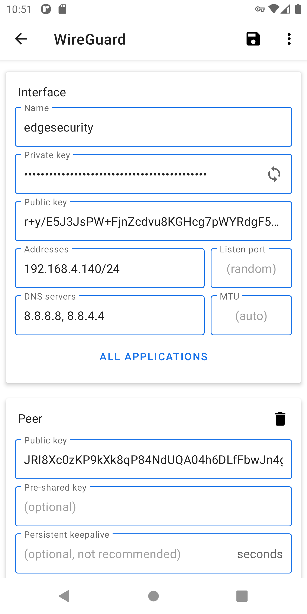
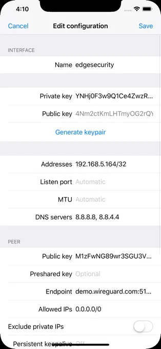

Telnyx Networking on Android/iOS | Telnyx Help Center

[Skip to main content](#main-content)

# Telnyx Networking on Android/iOS

Global Edge Router setup using the WireGuard App for the iOS and Android mobile platforms

Written by Telnyx Engineering

April 30, 2026

Table of contents

WireGuard has native client installations for both [Android](https://play.google.com/store/apps/details?id=com.wireguard.android) and [iOS](https://apps.apple.com/us/app/wireguard/id1441195209?ls=1) that we can use to test or monitor our Telnyx Edge instances.

# Android/iOS and the Telnyx Network

This is probably the easiest way to test out the service with a simple and effortless 3 steps to follow.

## Step 1: Telnyx Configuration for Android/iOS

Reference the introduction to Telnyx Networking section located here: [Telnyx Configuration](https://support.telnyx.com/en/articles/8103257-global-ip-edge-routing)

Copy and take note of the Peer Configuration file along with the private key that you got assigned from the above tutorial, it should look like the following:


## **Step 2: WireGuard Setup for Android/iOS**

Install the client on your preferred platform; [Android](https://play.google.com/store/apps/details?id=com.wireguard.android) or [iOS](https://apps.apple.com/us/app/wireguard/id1441195209?ls=1)

On the top right, there will be a + button for us to add a peer. Click on it.  
Here we can add the configuration settings that we generated from Step 1.

The interface should look like the following for Android and iOS respectively:





## **Step 3: Test**

We can test to see if it's working by checking the [portal](https://portal.telnyx.com/#/app/networking/cloudvpn/) and seeing the last seen status change:


or you can curl/trace into your server to confirm the Global IP that is configured to it.

Example Response:

```
root@MacBook-Pro % ping 172.27.1.17  
PING 172.27.1.17 (172.27.1.17): 56 data bytes  
64 bytes from 172.27.1.17: icmp_seq=0 ttl=53 time=184.512 ms  
64 bytes from 172.27.1.17: icmp_seq=1 ttl=53 time=183.202 ms  
64 bytes from 172.27.1.17: icmp_seq=2 ttl=53 time=183.365 ms  
64 bytes from 172.27.1.17: icmp_seq=3 ttl=53 time=183.040 ms  
64 bytes from 172.27.1.17: icmp_seq=4 ttl=53 time=183.310 ms  
64 bytes from 172.27.1.17: icmp_seq=5 ttl=53 time=183.980 ms  
64 bytes from 172.27.1.17: icmp_seq=6 ttl=53 time=183.457 ms  
64 bytes from 172.27.1.17: icmp_seq=7 ttl=53 time=183.097 ms  
^C  
--- 172.27.1.17 ping statistics ---  
8 packets transmitted, 8 packets received, 0.0% packet loss  
round-trip min/avg/max/stddev = 183.040/183.495/184.512/0.471 ms
```

**Next Steps**

Congratulations! You have successfully connected an Android and/or iOS instance to the Telnyx Edge Routing Network to the configured IP in your portal.

If you have any further questions or would like to see more tutorials, feel free to reach out to our support team or our external Slack channel for help!

---

Related Articles

[Telnyx Networking on AWS Lightsail](https://support.telnyx.com/en/articles/8103288-telnyx-networking-on-aws-lightsail)[Telnyx Networking on Ubuntu](https://support.telnyx.com/en/articles/8104274-telnyx-networking-on-ubuntu)[Telnyx Networking on AWS VPC](https://support.telnyx.com/en/articles/8104309-telnyx-networking-on-aws-vpc)[Telnyx Networking on Azure Linux VMs](https://support.telnyx.com/en/articles/8104343-telnyx-networking-on-azure-linux-vms)[Telnyx Networking on Oracle VMs](https://support.telnyx.com/en/articles/8104436-telnyx-networking-on-oracle-vms)

Did this answer your question?

😞😐😃

Table of contents
