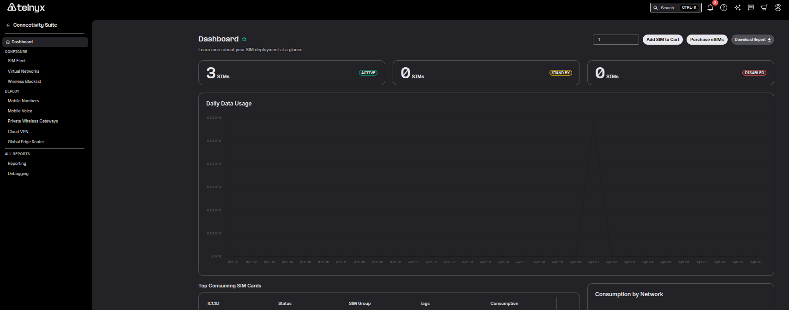
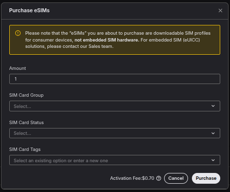
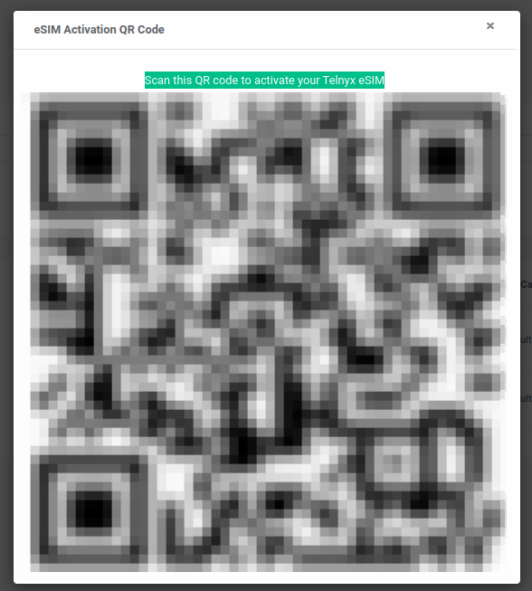

How to setup a Telnyx eSIM via QR code | Telnyx Help Center

[Skip to main content](#main-content)

# How to setup a Telnyx eSIM via QR code

Walkthrough on purchasing, activating, and using Telnyx eSIMs for seamless mobile connectivity.

Written by Telnyx Engineering

April 30, 2026

Table of contents

# Welcome to Telnyx eSIMs

Below we'll provide you with a walkthrough guide on how to purchase and activate your Telnyx eSim.

##

## Step 1: Visit the sim card page

Log into your account, and visit the [wireless dashboard](https://portal.telnyx.com/#/wireless/dashboard) page.

## Step 2: Purchase an eSIM

Click on the **purchase eSims** button on the top right. A window will pop up where you can:

1. Select the amount of eSims you like to purchase.
2. Select a SIM Card Group to associate the eSim with.
3. Set the SIM Card Status

   1. Disabled
   2. Enabled
   3. Standby
4. Add SIM Card Tags which are helpful for reporting segregation purposes

Note:

* You can see the activation fee cost and if you require bulk eSIMs please reach out to [sales@telnyx.com](mailto:sales@telnyx.com) to discuss potential bulk discount pricing.
* The status of the eSIM will need to be set to enabled in order to proceed with the activation in the next step but you can always access the QR code from the sim card settings within your account afterwards.

Once you are happy with your settings you can click the **purchase** button within the pop up window.

## Step 3: Activate eSIM with QR Code

Once you have clicked the purchase button, the current window will be replaced with a new window that contains the QR code. You will want to scan this QR code for the device you want to activate the eSIM on.

If you use a mobile phone that supports eSIMs, use your phones camera to scan the QR code. The camera will highlight "mobile plan" underneath the QR code which you can select to proceed with the activation through the phone.

Follow the on screen instructions, the activation process may take a few minutes to connect to the network.

Please make sure to verify that the apn has been set correctly to data00.telnyx.

---

Related Articles

[How to set up a Telnyx SIM Card](https://support.telnyx.com/en/articles/3269600-how-to-set-up-a-telnyx-sim-card)[Telnyx Global SIMs FAQs](https://support.telnyx.com/en/articles/3270136-telnyx-global-sims-faqs)[Manual eSIM activation guide](https://support.telnyx.com/en/articles/10067533-manual-esim-activation-guide)[Using Telnyx SIM with Ubiquiti UniFi LTE Pro](https://support.telnyx.com/en/articles/10164784-using-telnyx-sim-with-ubiquiti-unifi-lte-pro)[Using Telnyx SIM with InRouter300 Series Cellular Routers](https://support.telnyx.com/en/articles/10511105-using-telnyx-sim-with-inrouter300-series-cellular-routers)

Did this answer your question?

😞😐😃

Table of contents
