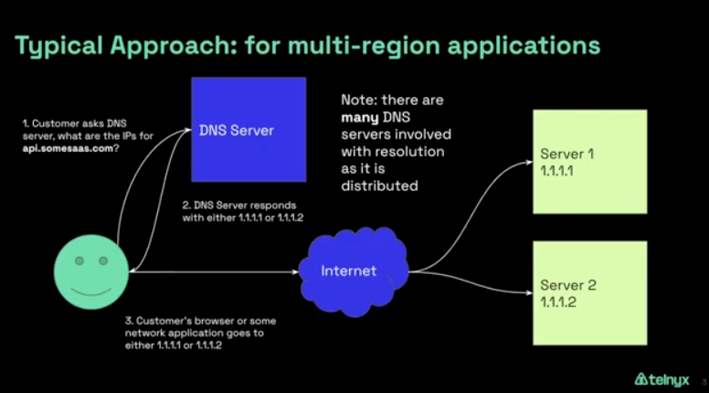
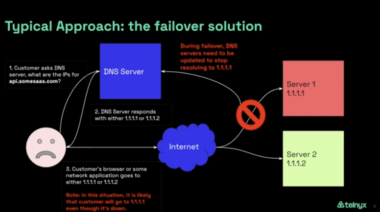
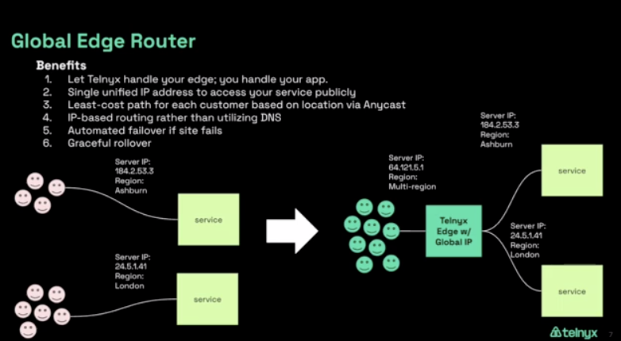

Intro to Telnyx Edge Router | Telnyx Help Center

[Skip to main content](#main-content)

# Intro to Telnyx Edge Router

Dive into the Telnyx Edge Router's functionalities and benefits. Get started now!

K

Written by Klane Pedrie

January 11, 2024

Table of contents

# Intro to Telnyx Edge Router

## What is the Telnyx Edge Router

Our [Telnyx Edge Router](https://telnyx.com/products/global-edge-router) allows you to operate in a [multi-cloud](https://telnyx.com/resources/multi-cloud-strategy-global-edge-router) and/or self-hosted environments using Telnyx's global, high-speed, high-bandwidth edge network to connect your customers and team members to your applications.

The Telnyx Edge Router utilizes Wireguard to connect users to applications globally. WireGuard is an open-source virtual private network (VPN) technology and protocol designed to provide secure, fast, and efficient communication across networks. WireGuard has gained popularity for its simplicity, security, and performance advantages. In the context of WireGuard, a "peer" refers to an endpoint that participates in the VPN network. Each device or system that connects to a WireGuard VPN is considered a peer. WireGuard follows a peer-to-peer model, where all connected devices are considered equal, and each peer can communicate directly with any other peer in the network.

Let's dive into how a WireGuard peer works and how it establishes secure communication with other peers in the network:

1. Key Generation: Each WireGuard peer generates a pair of cryptographic keys - a private key and a corresponding public key. These keys are essential for establishing secure connections and authenticating peers.
2. Configuration: The network administrator or user sets up the WireGuard configuration for each peer. This configuration includes the peer's public key, allowed IP addresses, and other parameters needed to establish the VPN connection.
3. Handshake: When a WireGuard peer wants to establish a connection with another peer, it initiates a handshake process. During the handshake, the peers exchange information about their public keys, initiate a secure session, and agree on a set of cryptographic parameters for encryption and authentication.
4. Encryption and Decryption: Once the handshake is completed successfully, the peers have established a secure communication channel. Any data sent between the peers is encrypted by the sender using the recipient's public key, and it can only be decrypted by the recipient using its private key. This encryption ensures that data exchanged between peers remains confidential and secure.
5. Allowed IPs: In the WireGuard configuration, each peer defines a list of allowed IP addresses for remote peers. This means that a peer will only accept incoming traffic from the specified IP addresses. It helps prevent unauthorized access to the peer and enhances security.
6. Routing: WireGuard operates at the kernel level, and when data is sent from one peer to another, the encrypted packets are passed to the kernel, which handles the routing of the traffic. The encrypted packets are encapsulated within UDP packets, making it easier to traverse firewalls and network address translation (NAT) devices.
7. Dynamic Roaming: WireGuard is designed to handle dynamic changes in network interfaces and IP addresses gracefully. If a peer switches networks or its IP address changes, the connection remains stable, and the VPN tunnel remains intact.
8. Keepalive: WireGuard peers send periodic keepalive packets to each other to ensure that the connection is still active and to detect if a peer becomes unreachable.

Overall, WireGuard's peer-to-peer model, strong cryptography, and efficient design contribute to its performance and security advantages. The protocol's simplicity and transparency have also made it an appealing choice for both individual users and organizations seeking a reliable and easy-to-configure VPN solution.

## Benefits of Telnyx Edge Router

Using the Telnyx Edge Router increases performance during a failover and decreases costs by allowing you to utilize multi-cloud and self-hosted environments. The difference between Edge Router and a typical approach are:

### Typical approach for multi-region applications using a DNS server

Image description: A routing example showing how DNS servers use static ips to route across the internet.

Downside to DNS server static routing

Image description: An image showing a DNS server failure to reroute when an application server has an unexpected or planned outage.

1. **Lookup**: The client's computer uses DNS to lookup the IP address of the domain name it's trying to reach (the failed server).
2. **Routing**: Once the IP address is found, the packet is sent on its way via the Internet, being routed by various routers along the way.
3. **Destination Unreachable**: However, when the packet arrives at the IP address, it finds that the server is down. It cannot establish a connection or receive a response from the server.
4. **Timeout**: After some time, the client's computer will register that the connection has timed out because it has not received a response.

This process will continue until the DNS server updates its records and stops sending traffic to the failed server. This takes time and creates a poor customer experience.

#### Typical Cloud Approach

Also, the typical cloud approach uses a single cloud provider causing a single point of failure and reducing options which you can leverage to decrease your cloud spend such as self-hosting some of your resources.

## Optimized Telnyx Edge Router Approach

We dynamically advertise a single global ip causing redundancy in your network across 25+ edge PoPs.

Image description: Image shows the how Telnyx advertises a single ip for multiple servers.

In the case of a failure the traffic reroutes to the working server using [BGP](https://telnyx.com/resources/what-is-bgp) Anycast.

Image description: Shows automatic failover to working server.

Video demo of instant failover routing:

Video description: A simulation that shows the taking down of a server in Toronto causing automatic re-routing to San Francisco in 5 seconds or less. Once the server is brought back up routing is automatically corrected back to Toronto.

This simplifies your global network by creating automatic redundancies and failovers which perform more highly during a crisis than competing technologies and providers.

## Optimized Telnyx Edge Router Multi-Cloud Approach

Most cloud providers use BGP-anycast on their own cloud networks in the event that one of their sites become overloaded or goes down entirely. But as more and more business move towards multi-cloud and self-hosted solutions, Telnyx realized there was no solution that provided instant failover between cloud providers.

That’s why we created Global Edge Router—so you can maintain the agility and cost-savings associated with multi-cloud or self-hosted solutions, but have confidence that there’s a resilient failover in place if a [provider or site goes offline](https://apnews.com/article/amazon-outage-aws-cloud-services-be93bc744e4e69d04055683830a409c3).

### **Increased cloud redundancy**

Every cloud service is prone to error—even the largest providers, like AWS and Google Cloud, have [reported complete outages](https://fortune.com/europe/2023/06/07/cloud-outages-on-the-rise-tech-geopolitics-internet/) on their services over the past couple of years.

To ensure applications and services stay online, available, and protected, businesses can host services on a diversified network that isn’t reliant on a single cloud provider.

At Telnyx, we’ve been running our services on [our private IP network](https://telnyx.com/our-network) and across multiple cloud providers for almost a decade for increased redundancy—resulting in minimal downtime for our users, even in the [event of large outages](https://telnyx.com/resources/why-a-multi-cloud-strategy-is-the-smart-solution).

Diversified infrastructure goes a long way in minimizing the risk of data loss and downtime due to outages beyond your control so your customers' data stays protected and your services remain online.

### **Increased cloud flexibility**

Using multiple providers means companies can change which cloud service suits their needs best based on available features. They’re not tied to one provider—who might not even offer what’s required—which allows businesses to quickly create and release new features, increasing GTM efficiency.

### **Controlling cloud costs**

One of the largest increases in costs for many businesses has been the increased cost associated with cloud storage—which has had a huge impact on the bottom line of many companies.

When businesses are tied to one cloud provider to host services, there can be little to no room to negotiate. By moving to a multi-cloud or self-hosting solution, a business can reduce their cloud spend and maintain some leverage over large cloud vendors.

<https://telnyx.com/resources/multi-cloud-strategy-global-edge-router>

Cloud vendors we support include:

* Microsoft Azure
* AWS
* Google Cloud
* IBM Softlayer

### **Telnyx Edge Router Use Case: Migrations**

Part of our inspiration for the Telnyx Edge Router was experiencing increased cloud costs. Because we have our own network and infrastructure we wanted to utilize it to save money and increase control and performance and still have a way to mesh our hybrid, self-hosted + cloud, resources. The Edge Router is perfect for migrating from a single cloud provider to a multi-cloud approach or for migrating from a cloud to hybrid or full self-hosted assets. While you are transitioning you can seamlessly bring your infrastructure up and down without experiencing a degradation of performance. Long term our global network and billing model of no data caps and no per seat license cost make the Telnyx Edge Router your network provider of choice at a scalable, low, flat monthly cost. Also, some contracts require that you have multiple vendors in certain areas and Telnyx can support that diversity.

### **Telnyx Edge Router Use Case: Mergers and Acquisitions**

In the case of a merger or acquisition there may be a forced addition of multi-cloud or hybrid infrastructure. It is important to be able to mesh the different technology platforms to be able to efficiently manage your team and resources. By meshing your infrastructure you can either a) reduce redundancies by sharing existing resources across applications, b) utilize previously unavailable feature sets from each cloud vendor, c) start to migrate from one cloud provider to another, or d) continue to operate in a multi-cloud approach. Using the Telnyx Edge Router gives you the flexibility to manage, grow, and shrink your infrastructure strategically while maintaining application availability for your customers and employees.

### **Telnyx Edge Router Use Case: Siloed Lines of Business**

Overtime different departments may spin up infrastructure from different vendors. These process are likely business critical so being able to mesh them is important from a management perspective. Telnyx Edge Router gives you the control to consolidate redundant operations.

### **Telnyx Edge Router Use Case: IoT and Wireless SIMs Data Control**

Using Telnyx global carrier partnerships with cell providers combined with our global edge network allows you to control your IoT and Wireless data from end-to-end. Our [Wireless SIMs](https://telnyx.com/products/iot-sim-card) offer data and text capabilities with voice soon to be added.

### **Telnyx Edge Router Use Case: Mid-Market Enterprise Cost Savings and Performance**

If you are a mid-market enterprise focused on growth and profitability then the Edge Router is extremely relevant to you. You have reached a stage where it may make sense to diversify your cloud portfolio and/or introduce or grow your self-hosted infrastructure. The automatic failover, global coverage, low and flat costs make it so that you can focus more on your core offering while protecting redundancy, resiliency, and performance which will delight your customers. This is even more relevant as you grow from a Small or Medium Enterprise and need to add to your infrastructure; or, as you grow from a Mid-Market Enterprise to a Large Enterprise and have higher needs around uptime and diversity in your technology assets.

## How to Deploy Telnyx Edge Router

[Please follow our guide to configure your Telnyx Edge Router network and Global IP.](https://support.telnyx.com/en/articles/8002565-how-to-configure-global-edge-router-with-telnyx)

## Cost of the Telnyx Edge Router

One low Monthly Recurring Cost based on the maximum speed [bandwidth tier](https://telnyx.com/pricing/global-edge-router) you select starting at $5 per month (please check our [pricing page](https://telnyx.com/pricing/global-edge-router) for the most up to date prices). There is no data cap to what you can transmit and receive!

## Feedback for "Intro to Telnyx Edge Router"

We love to get your feedback on this tutorial. If you have any then please message [community@telnyx.com](mailto:community@telnyx.com) and include the link to the article you are referencing along with any concerns or comments.

If you are stuck on any particular step then we would be happy to help, we have 24/7 world-class support available by phone at +18889809750 ext 2 or sending us an email at [support@telnyx.com](mailto:support@telnyx.com) or via chat by clicking the chat bubble in the bottom right of your [Mission Control Portal](https://portal.telnyx.com/) account.

For discussion purposes you can also join us on slack at <https://joinslack.telnyx.com/>.

---

Related Articles

[How to configure Global Edge Router with Telnyx](https://support.telnyx.com/en/articles/8002565-how-to-configure-global-edge-router-with-telnyx)[Telnyx Networking on Ubuntu](https://support.telnyx.com/en/articles/8104274-telnyx-networking-on-ubuntu)[Telnyx Networking on AWS VPC](https://support.telnyx.com/en/articles/8104309-telnyx-networking-on-aws-vpc)[Telnyx Networking on Oracle VMs](https://support.telnyx.com/en/articles/8104436-telnyx-networking-on-oracle-vms)[Telnyx Networking on PfSense](https://support.telnyx.com/en/articles/8201852-telnyx-networking-on-pfsense)

Did this answer your question?

😞😐😃

Table of contents
