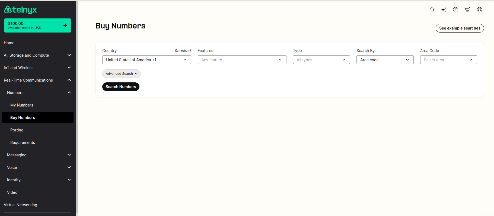

Messaging in Mission Control | Telnyx Help Center

[Skip to main content](#main-content)

# Messaging in Mission Control

Set up your Telnyx Mission Control for messaging. Step-by-step guide inside!

Written by David

January 2, 2025

Table of contents

This article lists the requirements needed to set up your Telnyx Mission Control Portal account so that it's ready to be configured with your messaging system.

# Telnyx Mission Control for Messaging

We recommend first reading on our [**Acceptable Use Policy for Messaging.**](https://support.telnyx.com/en/articles/1310359-acceptable-use-policy-for-messaging)

If you would prefer a guided setup and know some programming concepts check out our messaging ["Learn & Build"](https://portal.telnyx.com/#/app/programmable-messaging/learn-and-build) after steps 1 & 2.

Let's get you set up!, you will need:

## **1. [Level 1 Verification](https://portal.telnyx.com/#/app/account/verifications)**

In order to assign a connection/messaging profile on a DID or a connection on an outbound voice profile, you'll need to be Level 1 verified. More information on account verification can be found [here](https://support.telnyx.com/en/articles/1130595-account-verification).  
​

## **2. [Payments](https://portal.telnyx.com/#/app/billing/payment)**

You will need to add a payment method to your account in order to top up your balance. This will be necessary to purchase numbers, send messages, make/receive calls etc.   
​

Further details on how to add a payment method can be found in our Billing [support article.](https://support.telnyx.com/en/articles/4280500-billing-setup-billing-groups)

## **3. Messaging Profile Setup**

A messaging profile is a record that contains all the basic settings for your messages. Telnyx's messaging features are completely programmatic, as such you will need a webhook URL in order to receive inbound messages and track outbound messages. You can find how to create a messaging profile [here](https://support.telnyx.com/en/articles/3562059-setting-up-a-messaging-profile).  
​

## **4. [DIDs](https://portal.telnyx.com/#/app/numbers/my-numbers)**

A DID (or TN, telephone number) is required in order to send and receive messages. There are several types of numbers and requirements for each:

1. Regular number (a.k.a. 10-Digit Long Code): A regular number, such as your cellphone, including it's country code: +1 234 567 8910, +52 2345 1232, etc.
2. Toll free number: A national number that allows caller fees to be passed on to the receiver (except for messaging).
3. [Short code](https://telnyx.com/products/sms-short-code): An special type of number, you have probably received 2FA codes on your cellphone from these.

Numbers also need to explicitly be SMS and/or MMS enabled. Each of them has different requirements and pricing depending on their locations. Please note that if you acquire a number without SMS capabilities we will not be able to add them further on.

Alternatively you can port a number into Telnyx, learn how [here](https://support.telnyx.com/en/articles/1130634-port-numbers-to-telnyx).

Once you have added a DID on your account, you'll have to assign the messaging profile via the numbers main page or the number configuration page.

## **NOTES**

If you can't assign a messaging profile and you see the column showing **Not SMS Capable** this is likely because the number you have acquired is not capable of sending or receiving messages. Please make sure when searching and purchasing numbers that the messaging features icon shows SMS Available as seen in this picture.

If you come across the error: "**Could not enable messaging on the number.**" when assigning a messaging profile to a number that is SMS capable, this may be related to the underlying provisioning with the central authority that handles the carrier NetNumber ID routing updates across the industry. If this error persists, please contact our support team so they can assist you further.

More details on our number search feature can be found [here](https://support.telnyx.com/en/articles/4380325-search-and-buy-numbers).

1. **Determine your type of traffic.**

   Messaging is categorized in 2 types, A2P or Application-to-Person and P2P or Person-to-Person, more information [here](https://support.telnyx.com/en/articles/3199007-guide-to-using-our-traffic-type-feature).

   If your traffic is A2P, please check on the local regulations for messaging.

   In the US and Canada, we strongly recommend optionally registering for 10DLC (soon mandatory) or mandatory registering Toll-Free Messaging, for these there might be additional lead time of up to 4 weeks or more depending on your use case and required documents.

   Check these articles for more information: [10DLC](https://support.telnyx.com/en/articles/3679260-frequently-asked-questions-about-10dlc) - [Toll-Free messaging.](https://support.telnyx.com/en/articles/5353868-toll-free-messaging)
2. **Happy sending!**

## **We recommend that you also check out these related articles**

If you wish to increase your default sending rate, you will first need to obtain [Level 2 Verification](https://support.telnyx.com/en/articles/1130595-account-verification).

* Check [here](https://support.telnyx.com/en/articles/4380325-search-and-buy-numbers) for more information on purchasing TF and 10-digit numbers.
* Check [here](https://support.telnyx.com/en/collections/3731154-country-specific-sms-guidelines) for country specific guidelines for SMS.
* Check [here](https://support.telnyx.com/en/articles/4967485-short-code-supported-carriers) for information on Short Code.
* If you are looking for SMPP instead, check [here](https://support.telnyx.com/en/articles/1667062-short-message-peer-to-peer-set-up-guide).
* Check [here](https://support.telnyx.com/en/articles/4371498-sending-alphanumeric-sms-sender-id) for Alphanumeric sending (only available outside the US and Canada)

As always! Feel free to search our knowledge base or reach out to us via email, chat or telephone if you need additional assistance and/or have other questions.

---

Related Articles

[Get Started with a Mission Control Account](https://support.telnyx.com/en/articles/1176636-get-started-with-a-mission-control-account)[Short Message Peer-to-Peer Set-up Guide](https://support.telnyx.com/en/articles/1667062-short-message-peer-to-peer-set-up-guide)[Automated Replies for Messages using Zapier](https://support.telnyx.com/en/articles/3232529-automated-replies-for-messages-using-zapier)[Receiving SMS on your Telnyx number](https://support.telnyx.com/en/articles/4348981-receiving-sms-on-your-telnyx-number)[Telnyx Messaging Error Codes](https://support.telnyx.com/en/articles/6505121-telnyx-messaging-error-codes)

Did this answer your question?

😞😐😃

Table of contents
