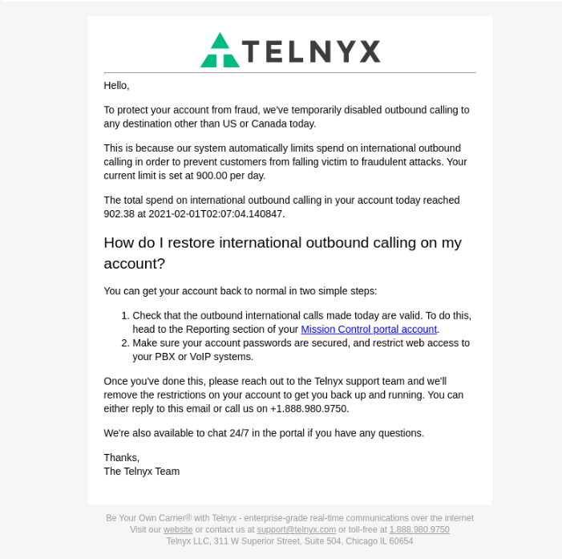

Email Notification: International Spend Limit | Telnyx Help Center

[Skip to main content](#main-content)

# Email Notification: International Spend Limit

In this article we will explain why you may have received this email. Start building on Telnyx today.

Written by Dillin

January 26, 2026

Table of contents

# Managing Your International Spend with Telnyx Notifications

## What is the international spend limit?

* During every **24-hour** period, Telnyx systems automatically monitor international voice spend.
* If your SIP Connections or Voice API Applications spend more than $**700** in international calling, Telnyx will send the account owner an email notification.
* This is a fraud preventative measure to notify you of potential high cost traffic terminating through your account.

## What is considered an international call?

* An outbound call.
* Where the destination number country is different from the origination number country.
* For example: Ireland +353 as the origination country and United States +1 as the destination country.

## What happens when the international spend limit is reached?

* Telnyx disables any further international calls from terminating on your account.
* Local calling is not disabled when the International Spend Limit is reached.

  + For example: Ireland +353 (origination) to Ireland +353 (destination).
  + Or: United States +1 (origination) to United States +1 (destination).
  + In other words, where the origination country and destination country are the same.   
    ​

## Will I see an error code that indicates the limit was reached?

* Yes the error we return is: ***403 International daily spent limit reached D39****.*
* A full list of our response codes can be viewed [here](https://support.telnyx.com/en/articles/4409457-telnyx-sip-response-codes).

## Does the limit reset?

* The international spend limit resets at **00:00 UTC** each day.
* This means if you incurred $7**00** in international traffic spend, until **00:00** of the next day, you won't be able to terminate further international calls.

## Can I adjust this limit?

This is a global default limit that applies to all Telnyx customers. You cannot adjust this limit from your account, but Telnyx Support can increase or decrease it for your use case.

## What does an example email look like?

## What can I do to identify the traffic?

Please visit your reporting section and run a [usage report](https://portal.telnyx.com/#/app/reporting/usage-reports) broken down by connection. This report shows which connections have the highest spend, allowing you to review the phone systems behind those connections and restrict traffic if needed.

Consider running a [detail records report](https://portal.telnyx.com/#/app/reporting/detailed-records) to see what numbers are making the calls and to what destinations.

You can then use some of those example numbers to check [call flows](https://portal.telnyx.com/#/app/next/debugging/sip-call-flow-tool) and determine the source IP addresses.

---

Related Articles

[Caller ID Number Policy](https://support.telnyx.com/en/articles/3546251-caller-id-number-policy)[Setting Up a Messaging Profile](https://support.telnyx.com/en/articles/3562059-setting-up-a-messaging-profile)[PSTN Replacement / Local Calling with Telnyx](https://support.telnyx.com/en/articles/6622229-pstn-replacement-local-calling-with-telnyx)[Verified Numbers FAQ](https://support.telnyx.com/en/articles/6790265-verified-numbers-faq)[Dialing Emergency Services](https://support.telnyx.com/en/articles/8712528-dialing-emergency-services)

Did this answer your question?

😞😐😃

Table of contents
