BYOC: Telnyx & Genesys | Telnyx Help Center

[Skip to main content](#main-content)

# BYOC: Telnyx & Genesys

This guide provides instructions and technical details for the configuration of SIP trunk connectivity between Genesys Cloud and Telnyx.

Written by Karl Hulse

December 11, 2023

Table of contents

# Genesys and Telnyx BYOC

Before you get started you'll have to have the following set up:

1. Have created an account with Telnyx
2. Completed L2 verification
3. Purchased a number to be used for voice calls.

## Creating a SIP connection

In the Telnyx Mission Control Portal navigate to the "Voice” tab on the left side menu and select "S[IP Trunking](https://telnyx.com/products/sip-trunks)". Click on the “Add SIP Connection” button.

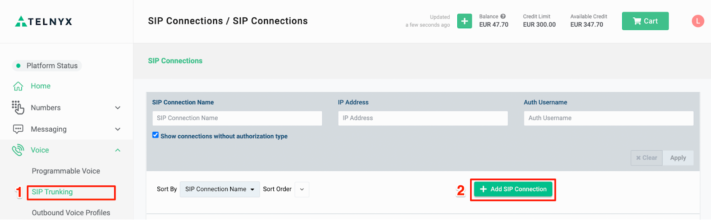

## ***Image 1 - Creating a SIP Trunk in Mission Control***

Name your SIP connection to make it easy to find.

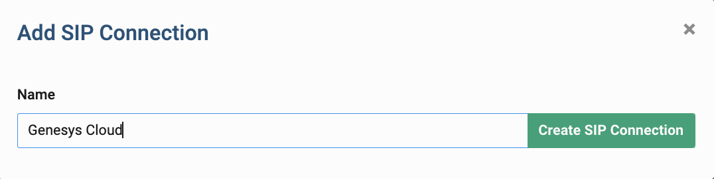

## *Naming your connection*

Choose “FQDN” as the SIP connection type and provide SIP URI to your Genesys Cloud organization. The domain should match the region of your Genesys Cloud deployment. Click the “have FQDN” button to update the FQDN setting.

In the “Outbound” section of the SIP connection settings, choose “Credentials” and provider user name and a password to be used for a digest authentication. Click “Save & Finish Editing” button to save your SIP Connection.

## ***Image 2 - Choosing a FQDN Connection type***

##

## **Creating an Outbound Voice Profile**

Navigate to the “Outbound Voice Profiles” tab in the "Voice" section. Click the “Add New Profile” button.

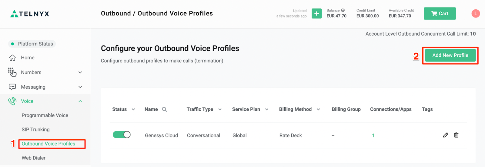

## **Image 3 - Setting up your Outbound Voice Profile**

Provide a name for your new Outbound Voice Profile and click "Create".  
​

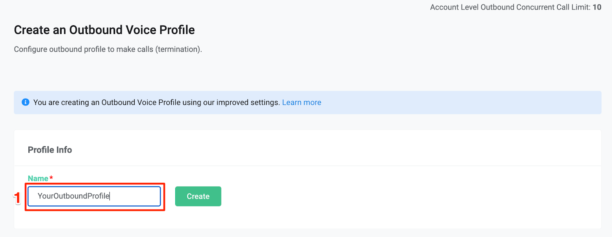

## **Image 4 - Naming your Outbound Voice Profile**

You can select individual countries or regions to be allowed for the voice calls. Once you have chosen where to allow calls to/ from click the “Save” button to confirm your configuration.

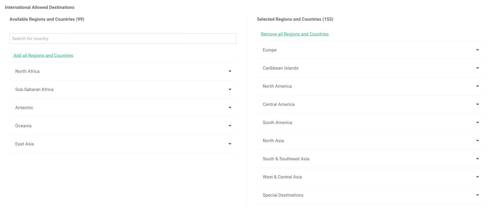

## **Image 5 - Outbound Voice Profile Settings**

Return to your SIP Connection and edit the configuration. Select “Outbound” tab and select your newly created Outbound Voice Profile from a dropdown list.

​

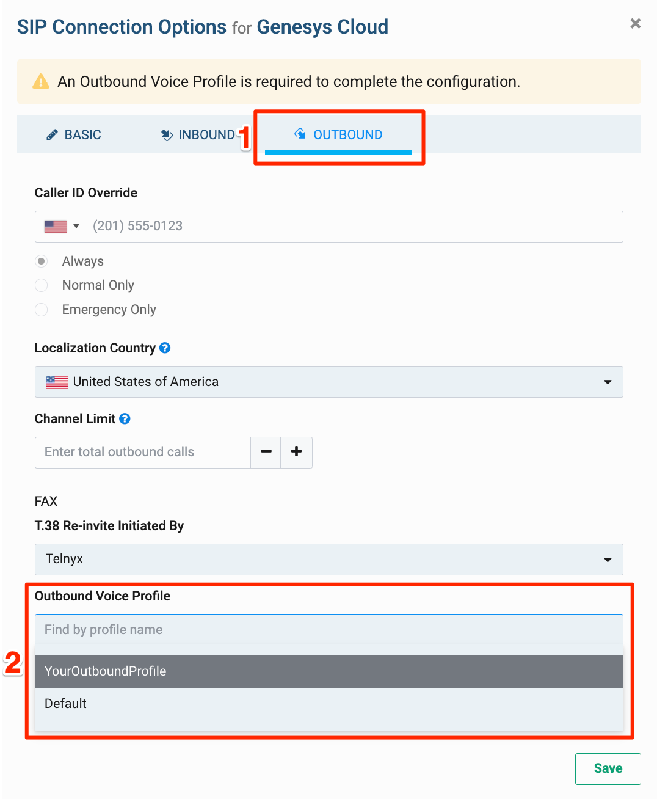

## **Image 6 - Add your Outbound Voice Profile to your SIP Connection**

Next, switch to the “Inbound” tab of your SIP connection. Adjust DNIS and ANI numbers format to your Genesys Cloud configuration and save the updated configuration.

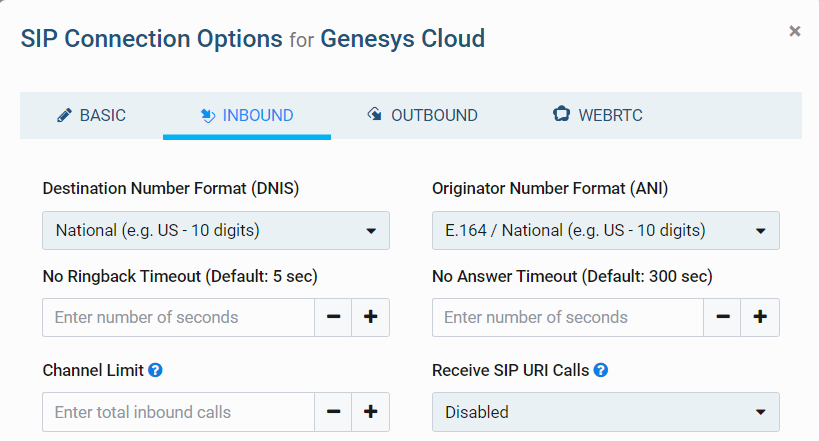

## **Image 7 - Inbound SIP Connection Settings**

## **Number Configuration**

On the left-side menu, select the “Numbers” section and navigate to “My Numbers” tab. For your number purchased select a configured SIP Connection from a dropdown list.

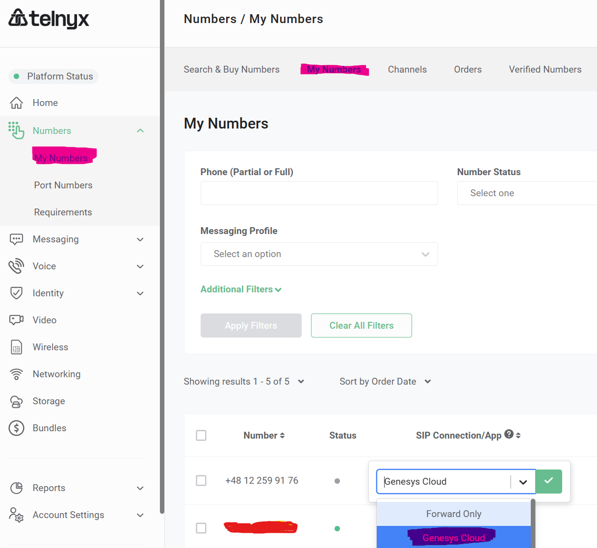

## **Image 8 - Navigating To My Numbers**

Note that you can assign the same SIP connection to multiple numbers.

##

## **Configuration in Genesys Cloud**

Follow the steps below to create a SIP connection to Genesys Cloud organization.

Before you get started you need to ensure that:

1. The BYOC option is enabled in your Genesys Cloud organization
2. You have admin rights to setup Trunks
3. You have a number purchased and added to "[DID Numbers](https://telnyx.com/resources/sip-did)" and routed correctly (for example to the Architect flow)

For assistance, refer to Genesys Resource Center on [help.mypurecloud.com](https://help.mypurecloud.com/) for all details about Genesys Cloud configuration.

## **Create a SIP Trunk**

Go to the Admin options and select "Trunks". Provide a name for your SIP trunk and choose “BYOC Carrier” a SIP trunk type.

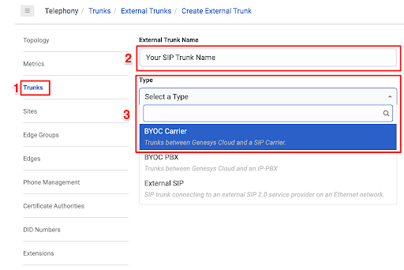

## **Image 9 - Creating a SIP Trunk in Genesys Cloud**

Select "Generic BYOC Carrier" as a subtype.

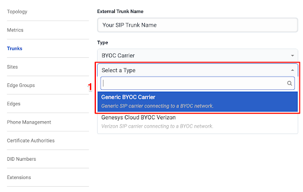

## **Image 10 - Selecting Generic BYOC Carrier**

Provide a name for your SIP Trunk and your Inbound SIP Termination Identifier. This name should match the one configured in the Telnyx SIP Connection for FQDN option.

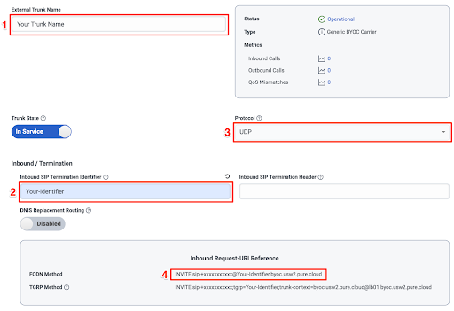

## **Image 11 - Naming your connection**

Provide Telnyx SIP interface URL in the “SIP Servers and Proxies” based on your chosen region like sip.telnyx.com, sip.telnyx.eu etc.

Enable “Digest Authentication” and provide in “Realm” field the same URL as used for SIP proxy.

Provide the “User Name” and “Password” which was configured in Telnyx SIP Connection . Setup “Caller ID” with a number purchased in Telnyx platform.

##

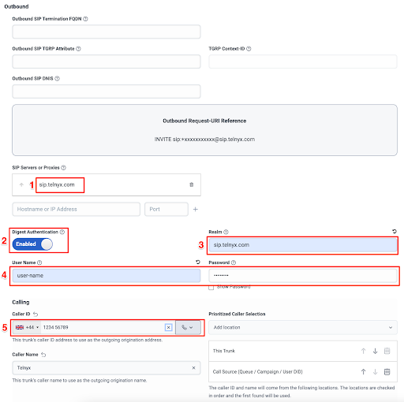

## **Image 12 - Manage your connection settings**

In the "SIP Access Control" Section, provide the IP addresses of your chosen Telnyx SIP endpoints (addresses are provided on sip.telnyx.com)  
​

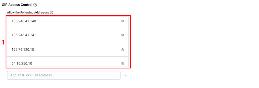

## **Image 13 - Add SIP Addresses**

Under the 'External Trunk Configuration' section expand the Protocol menu.

Scroll down to the 'Outbound' configuration and add a custom SIP header “X-Telnyx-Username” with the same value as set for a Digest Authentication.

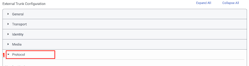

## **Image 14 - External Trunk Configuration**

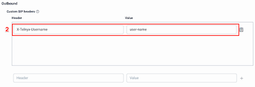

## **Image 15 - Outbound Trunk Settings**

## **Troubleshooting**

Debugging tools are available in the Telnyx Mission Control Portal where you can troubleshoot any issues with your SIP trunk communication checking SIP call flows, QoS stats and communication to a defined webhooks.

To find and use the debugging tools:

1. Navigate to the “Debugging” menu under “Reporting” in the sidebar
2. Select “SIP Call Flow Tool” in the top bar
3. Specify your search criteria and press “Search CDRs” button
4. From the list of listed calls select a one with “Call Data Debugging” button.

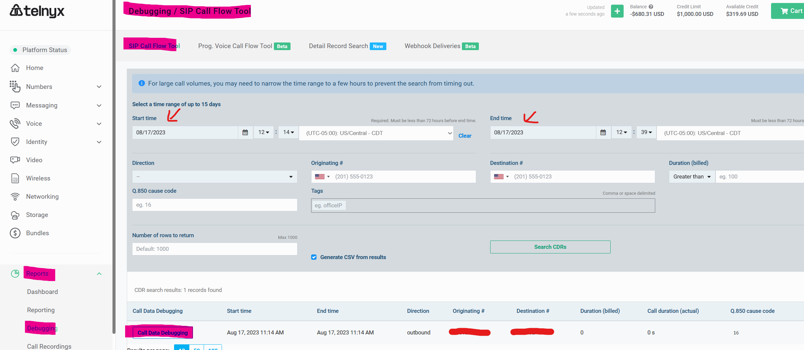

## **Image 16 - Mission Control Debugging Tools Overview**

This enables you to review a SIP Call Flow with the detailed data for each SIP Request:  
​  
​

## **Image 17 - Call Flow Debugging**

You can also check "Session Info" on the next tab or export PCAP data on the "Export" tab for sharing with your team.

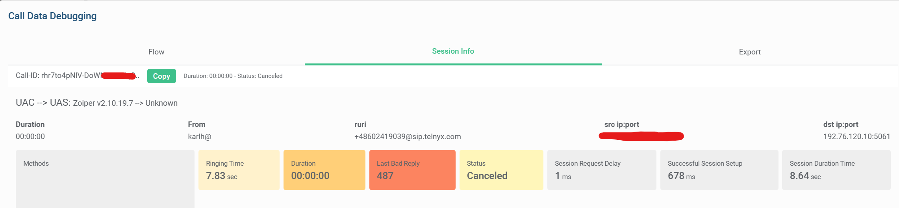

## **Image 18 - PCAP Inspection**

---

Related Articles

[Yeastar S-Series: Telnyx SIP](https://support.telnyx.com/en/articles/5748952-yeastar-s-series-telnyx-sip)[PBXes: Connecting a PBXes Trunk to Telnyx](https://support.telnyx.com/en/articles/5798240-pbxes-connecting-a-pbxes-trunk-to-telnyx)[3CX: Configuring a 3CX V18 PBX](https://support.telnyx.com/en/articles/6161111-3cx-configuring-a-3cx-v18-pbx)[How to Configure a SIP Trunk](https://support.telnyx.com/en/articles/8096455-how-to-configure-a-sip-trunk)[Telnyx + Vapi Integration](https://support.telnyx.com/en/articles/12538402-telnyx-vapi-integration)

Did this answer your question?

😞😐😃

Table of contents
