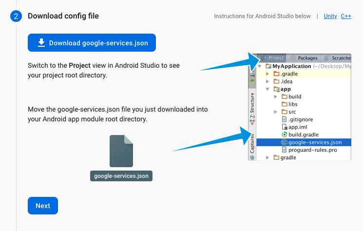
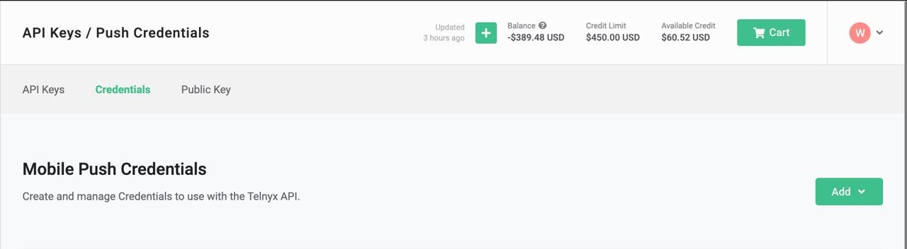
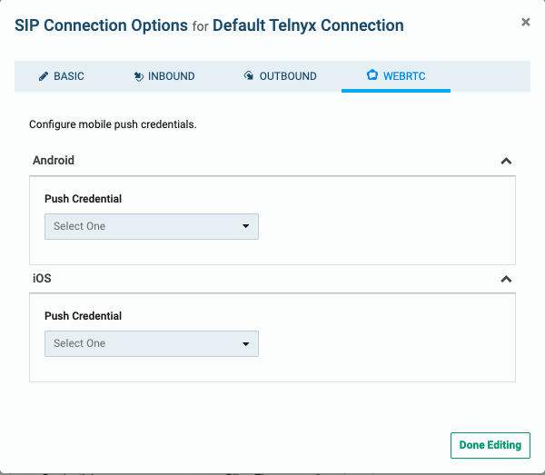

Android Push Notification Setup | Telnyx Help Center

[Skip to main content](#main-content)

# Android Push Notification Setup

Integrate Android push notifications with Telnyx's WebRTC SDK. Start here!

Written by David

May 20, 2026

Table of contents

# Android Push Notification Setup

The Telnyx Android Client WebRTC SDK makes use of Firebase Cloud Messaging in order to deliver push notifications. If you would like to receive notifications when receiving calls on your Android mobile device you will have to enable Firebase Cloud Messaging within your application.

## Requirements

* Set up a Firebase console account
* Create a Firebase project
* Add Firebase to your Android Application
* Setup a Push Credential within the Telnyx Portal
* Generate a Firebase Cloud Messaging instance token
* Send the token with your login message

Adding Firebase to your application is a simple process. Click on the Android icon on the home screen of the console to start:


## Register Application

Next, enter your application details and register your application


After your application is registered, Firebase will generate a google-services.json file for you which will need to be added to your project root directory:



## Firebase Configuration

After that, you can follow this guide on how to enable the firebase products within your application <https://firebase.google.com/docs/android/setup#add-config-file>

An alternative method is to add Firebase using the Firebase Assistant within Android Studio if it is setup within your IDE.

You can view steps on how to register via this option here: <https://firebase.google.com/docs/android/setup#assistant>

Once your application is set up within the Firebase Console, you will be able to access the server key required for portal setup.

You can access the server key by going into your project overview -> project settings and selecting Cloud Messaging. Once there, the project credentials will be visible for use in our portal setup.


## Android VoIP Credential Setup

The next step is to set up your Android VoIP credentials in the portal.

1. Go to [portal.telnyx.com](https://portal.telnyx.com/#/login/sign-in) and login.
2. Go to the [API Keys & Credentials](https://portal.telnyx.com/#/api-keys) section on the left panel under Account Settings.
3. From the top bar go to the [Credentials](https://portal.telnyx.com/#/api-keys/push-credentials) tab and select “Add” >> Android Credential



1. Enter the details required for your Android Push Credentials. This includes a Credential name and the server key from firebase mentioned in an earlier step.


Save the new push credential by pressing the Add Push Credential button

We can now attach this Android Push Credential to a SIP Connection:

1. go to **Voice Suite → SIP Trunking** section on the left panel.
2. Open the Settings menu of the SIP connection that you want to add a Push Credential to or [create a new SIP Connection](https://portal.telnyx.com/#/voice/connections) .
3. Select the WebRTC tab.
4. Go to the Android Section and select the PN credential you previously created.



## Final Steps

The portal setup is complete. Now when firebase is properly integrated within your application, you will be able to retrieve a token with a method such as this:

```
private fun getFCMToken() { FirebaseApp.initializeApp(this) FirebaseMessaging.getInstance().token.addOnCompleteListener { task -> if (!task.isSuccessful) { Timber.d("Fetching FCM registration token failed") } else if (task.isSuccessful){ // Get new FCM registration token try { token = task.result } catch (e: IOException) { Timber.d(e) } Timber.d("FCM token received: $token") } } }
```

Note: After pasting the above content, Kindly check and remove any new line added

The final step is to create a MessagingService for your application.

The MessagingService is the class that handles FCM messages and creates notifications for the device from these messages. You can read about the firebase messaging service class here: <https://firebase.google.com/docs/reference/android/com/google/firebase/messaging/FirebaseMessagingService>

We have a sample implementation for you to take a look at here: <https://github.com/team-telnyx/telnyx-webrtc-android/blob/main/app/src/main/java/com/telnyx/webrtc/sdk/utility/MyFirebaseMessagingService.kt>

Once this class is created, remember to update your manifest and specify the newly created service like so:

<https://firebase.google.com/docs/cloud-messaging/android/client#manifest>

You are now ready to receive push notifications via Firebase Messaging Service.

---

Related Articles

[MicroSIP: Setup with Telnyx](https://support.telnyx.com/en/articles/6133145-microsip-setup-with-telnyx)[Grandstream Wave Lite (Android)](https://support.telnyx.com/en/articles/6184897-grandstream-wave-lite-android)[Grandstream GXV3370](https://support.telnyx.com/en/articles/6187576-grandstream-gxv3370)[Telephony Credentials: Types](https://support.telnyx.com/en/articles/7029684-telephony-credentials-types)[How to Setup iOS Push Notifications](https://support.telnyx.com/en/articles/8268170-how-to-setup-ios-push-notifications)

Did this answer your question?

😞😐😃

Table of contents
