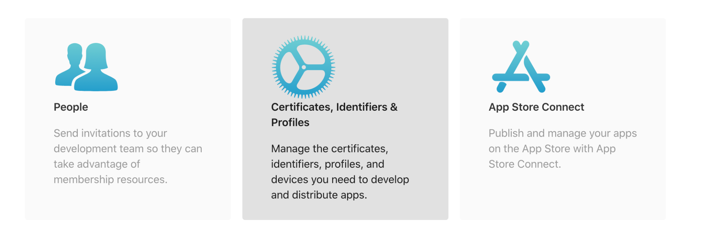
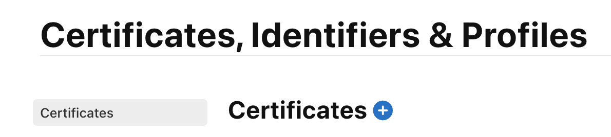
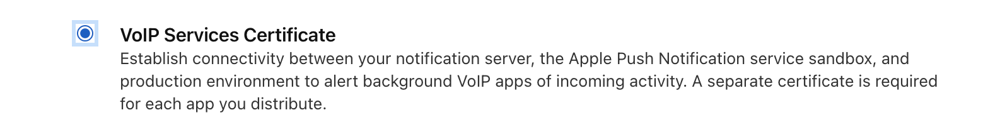
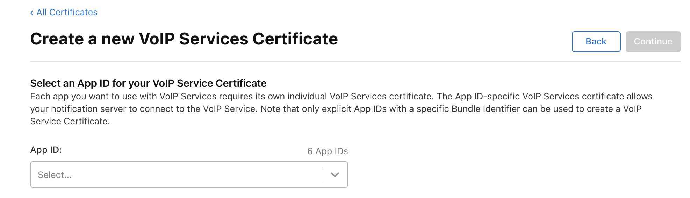
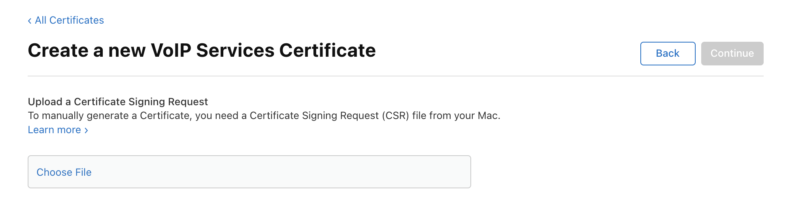
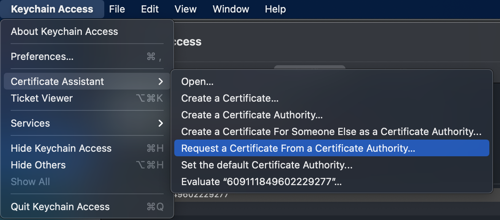
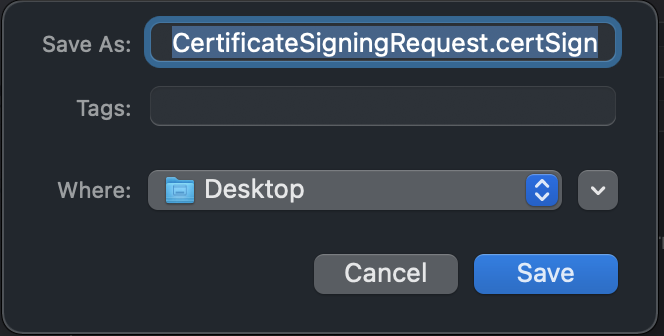
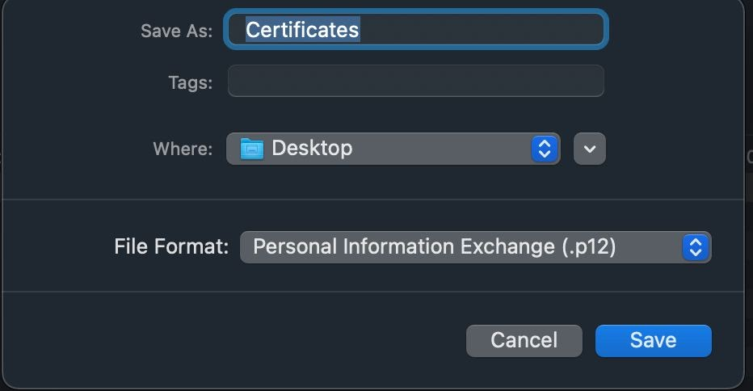
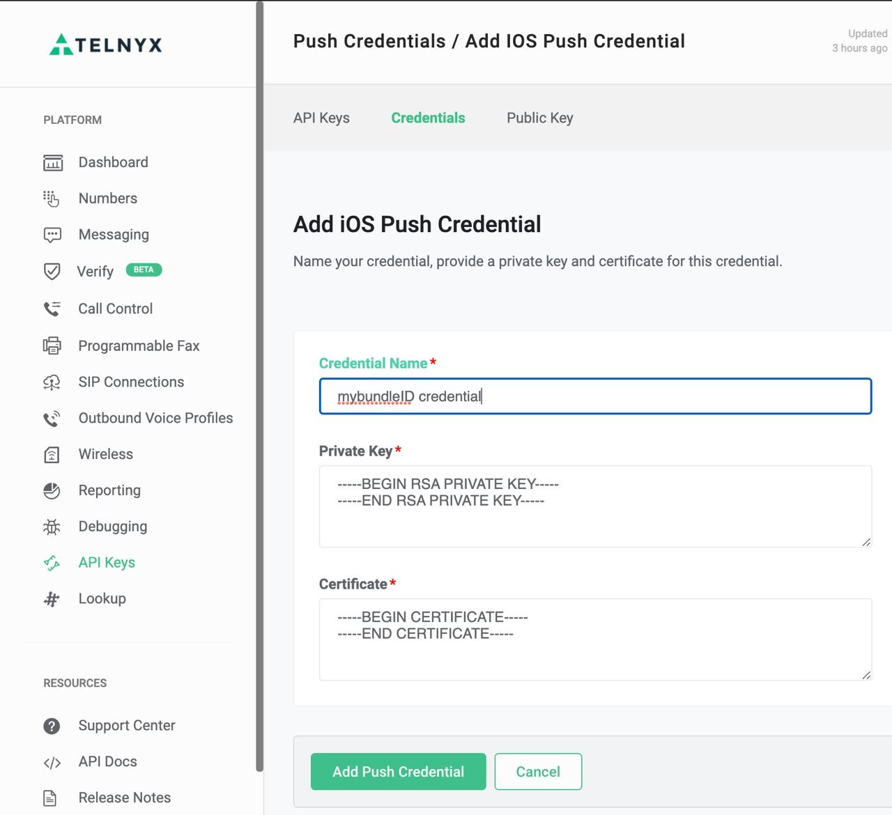
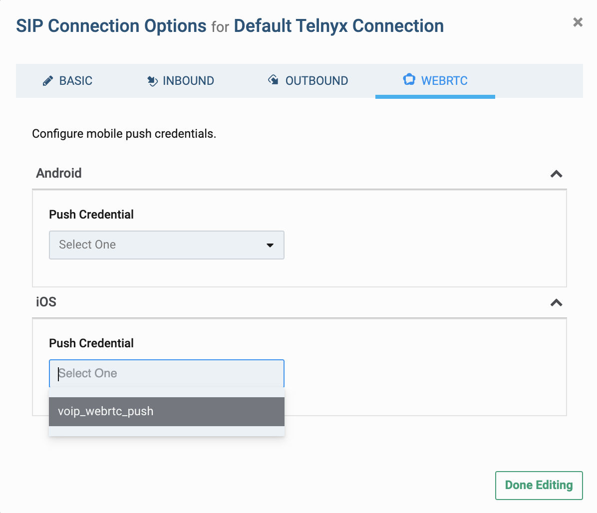

# How to Setup iOS Push Notifications

Resolve the CA error for your webhook URL. See Telnyx guidance and requirements Learn more about How to Setup iOS Push Notifications with Telnyx.


## How to Setup iOS Push Notifications

The Telnyx iOS Client WebRTC SDK makes use of APNS in order to deliver push notifications. If you would like to receive notifications when receiving calls on your iOS mobile device you will have to configure a VoIP push certificate.

## Creating a VoIP push certificate

In order to generate VoIP push certificates you will need:

* An Apple developer account
* App BundleID
* CSR (Certificate Signing Request): Explained on Step #7
* Go to <https://developer.apple.com/> and login with your credentials.
* In the **Overview** section, select **“Certificates, Identifiers & Profiles”**



## Certificates, Identifies & Profiles

Press the blue “+” button to add a new Certificate:



1. Search for “ **VoIP Services Certificate** ” and Click “ **Continue** ”:

   
2. Select the **BundleID** of the target application, and click “ **Continue** ”

   
3. Then, you will be requested to upload a CSR from your Mac.

   

## Generate CSR

In order to generate a CSR:

a. Open the KeyChain Access of your mac.

b. Go to Keychain Access >> Certificate Assistance > Request a Certificate from a Certificate Authority.



c. Add your email address and select “Save to disk” option, and click “**Continue**”


d. Save the Certificate Signing Request (CSR) into your Mac.



## Download Certificate

1. Once you have created your CSR, press “Choose File” and select the certSign created on step #7. Click “ **Continue** ” and you are done.

   
2. The new Certificate has been created. Now you need to download it:

   
3. Search for the downloaded file (usually named voip\_services.cer) and double click on it to install it on your Mac. And that’s all for now!

## Obtain your Cert.pem and Key.pem files

In order to allow the Telnyx VoIP push service to send notifications to your app, you will need to export the VoIP certificate and key:

1. Open Keychain Access on your Mac (where you have installed the VoIP certificate by following the “ **Creating a VoIP push certificate** ” instructions).
2. Search for “VoIP services” and verify that you have the certificate installed for the BundleID of your application.

   
3. Open the contextual menu and select “Export”:

   
4. Save the .p12 file (A password will be requested before saving it):

   
5. Once the certificate is created you will need to run the following commands to obtain the **cert.pem** and **key.pem** files:

   ```
   $ openssl pkcs12 -in PATH_TO_YOUR_P12 -nokeys -out cert.pem -nodes $ openssl pkcs12 -in PATH_TO_YOUR_P12 -nocerts -out key.pem -nodes $ openssl rsa -in key.pem -out key.pem
   ```

Note: After pasting the above content, Kindly check and remove any new line added

1. Now you can go to your Portal account and configure your PN credential.

## Setup your iOS VoIP credentials on your Portal

### Create an iOS Push Credential:

1. Go to portal.telnyx.com and login.
2. Go to the **[API Keys](https://portal.telnyx.com/#/api-keys)** section.
3. From the top bar go to the **Credentials** tab and select “ **Add** ” >> **iOS Credential**

   
4. Set a credential name (You can use your app bundle ID to easy identify your PN credential) and then copy and paste the contents of your **cert.pem** and **key.pem** files into the defined sections (Notice that you need to copy from ---BEGIN ####--- to ---END--- sections including those marks):

   
5. Save the new push credential by pressing the **Add Push Credential** button.

## Assign your iOS Push Credential to a SIP Connection:

1. Go to the **SIP Connections** section on the left panel.
2. Open the Settings menu of the SIP connection that you want to add a Push Credential or [create a new SIP Connection](https://portal.telnyx.com/#/voice/connections) .
3. Select the WEBRTC tab.
4. Go to the iOS Section and select the PN credential created on “ **Create an iOS Push Credential** ”



That’s done. You can now go to your code and start implementing **PushKit** and **Callkit** using the **TelnyxRTC SDK** and receive VoIP push notifications into your iOS device.

Did this answer your question?

😞😐😃
