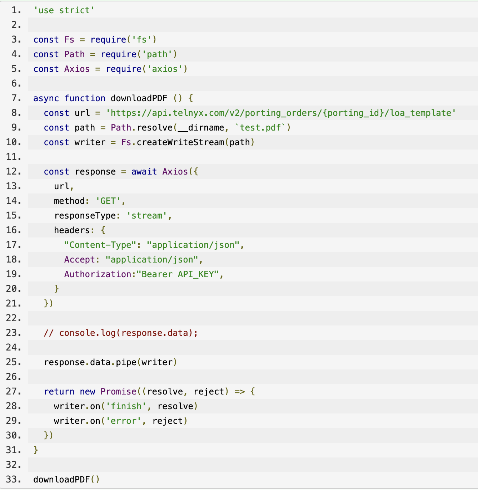

LOA Template Download | Telnyx Help Center

[Skip to main content](#main-content)

# LOA Template Download

Learn how to create a PDF in Node.js for Telnyx Porting LOA API. Download the LOA Template PDFs using the Telnyx API for porting numbers.

K

Written by Klane Pedrie

February 1, 2024

Table of contents

# How to Create a PDF in Node.js for Telnyx Porting LOA API

If you need to use the Telnyx API capabilities for porting then you will need to be able to download LOA Template PDFs. Here is an example of a request you can send you may start working on functionality for Porting numbers by API. A step you may run into



```
'use strict' const Fs = require('fs') const Path = require('path') const Axios = require('axios') async function downloadPDF () { const url = 'https://api.telnyx.com/v2/porting_orders/{porting_id}/loa_template' const path = Path.resolve(__dirname, `test.pdf`) const writer = Fs.createWriteStream(path) const response = await Axios({ url, method: 'GET', responseType: 'stream', headers: { "Content-Type": "application/json", Accept: "application/json", Authorization:"Bearer API_KEY", } }) // console.log(response.data); response.data.pipe(writer) return new Promise((resolve, reject) => { writer.on('finish', resolve) writer.on('error', reject) }) } downloadPDF()
```

---

Related Articles

[3CX: Configuring a 3CX V20 PBX 20.0 Update 5 (Build 20.0.5.551) (March 2025 Update)](https://support.telnyx.com/en/articles/8683996-3cx-configuring-a-3cx-v20-pbx-20-0-update-5-build-20-0-5-551-march-2025-update)

Did this answer your question?

😞😐😃

Table of contents
