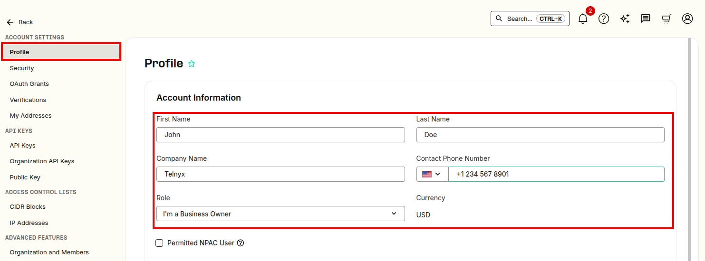
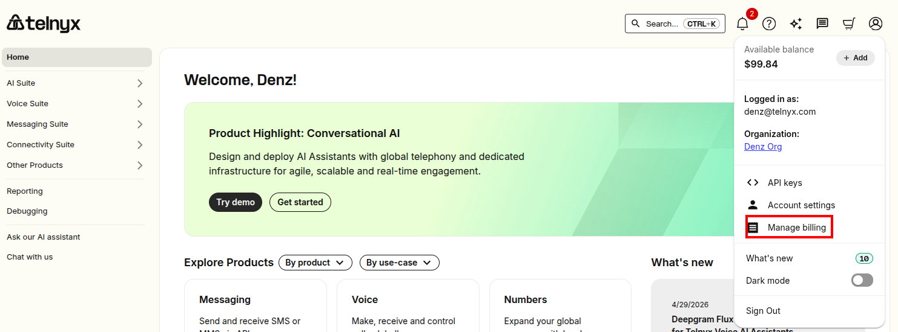
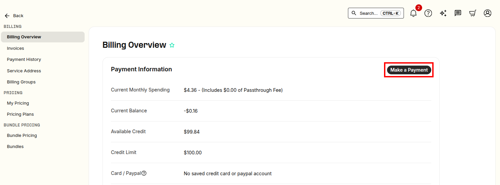
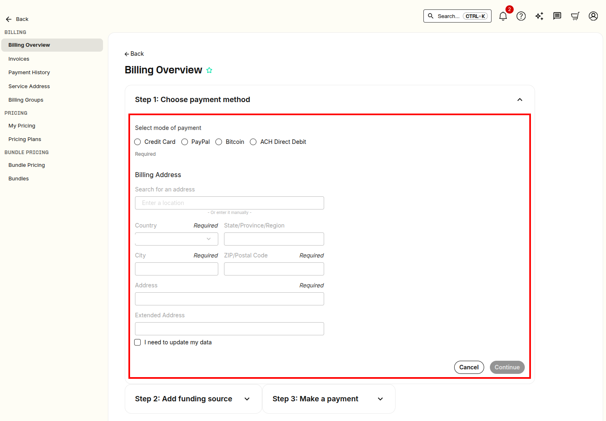

# Appeal Level 2 Verification Status

Unlock Telnyx platform potential with Level 2 Verification. See Telnyx guidance and requirements Learn more about Appeal Level 2 Verification Status with.

K

## Level 2 Verification Process and Appeal

**NOTE:** New users will be enabled with the [Trial-Paid-Verified-Enterprise (TPVE) Account Levels](https://developers.telnyx.com/docs/account-setup/levels-and-capabilities) framework and will not have access to the legacy L2 Verification section. For more info on TPVE, please check out our [article](https://support.telnyx.com/en/articles/1130595-account-verification).
​

We want to unlock all the potential of the Telnyx platform for you!

[Level 2 Verification](https://support.telnyx.com/en/articles/1130595-account-verification) is one way that Telnyx helps to protect the integrity of the Telnyx platform and consumers from spam or fraudulent calls and messages by making sure our users are legitimate. If you become L2 Verified then you will have more freedom to call certain international destinations, ​​send messages from your account at a higher rate, order SIM cards, and be able to use call forwarding.

## How to submit your L2 Verification:

1. Log in to your [Mission Control Portal](https://portal.telnyx.com/)
2. Navigate to the  ["Account Settings" section of the portal](https://portal.telnyx.com/#/account/general). You can do this by clicking on the Profile icon (in top right) > Account Settings
   ​

   
3. Within your "Account Settings", click on the "Profile" tab in the left navigation bar. Then update your Company Name and Address in the "Account Information" section.
   ​

   
4. Next, add a Payment Method. To do so, first navigate to the [Billing section of the portal](https://portal.telnyx.com/#/billing/payment). You can do this by clicking on the Profile icon (in top right) > Manage Billing
   ​

   

   From there, click on the "Billing Overview" tab on the left navigation bar. Then, click "Make a Payment".

   

   You will be redirected to a page where you can add a Payment method to your account. Fill out the form and then hit "Continue".

   
5. Finally, navigate to the [Verifications section of the portal to submit your Level 2 verification request](https://portal.telnyx.com/#/account/my-account/verifications). You can do this by clicking on the Profile icon (in top right) > Account Settings > Verifications. Once on the Verifications page, fill out your L2 verification request and hit submit! For more details, please visit [this support article](https://support.telnyx.com/en/articles/1130595-account-verification).

## How to check status of L2 Verification:

1. Log in to your [Mission Control Portal](https://portal.telnyx.com/) > Profile (in top right) > Account Settings > [Verifications](https://portal.telnyx.com/#/app/account/verifications)
2. If you have recently submitted your L2 Verification, please give us at least 48 hours to review your application.
3. If approved, it will say “Verified” in green, [here](https://portal.telnyx.com/#/app/account/verifications) next to Level 2 Verification.
4. If it has been more than 72 hours and your account is still unverified for L2, and you feel you have been denied in error please follow instructions below.

## What if my level 2 verification request has been denied / rejected?

If you have been denied L2 Verification and would like to appeal your verification status, please answer the following questions:

* What are you planning to use the Telnyx services for?
* Are you going to use Telnyx services for your business?
* What is your business’s website?
* Have you ensured your Telnyx account details match any payment methods used to make a payment? If you have not added a [payment method](https://portal.telnyx.com/#/app/account/billing), please do so now.

Please send your appeal and responses to [kyc.verifications@telnyx.com](mailto:kyc.verifications@telnyx.com) and we will be happy to review. In some circumstances, our review team may require scanned documentation in order to verify your account.

---

Related Articles

[Account Verification](https://support.telnyx.com/en/articles/1130595-account-verification)[Introducing the Verify API](https://support.telnyx.com/en/articles/5367966-introducing-the-verify-api)[Telnyx Verify: 2FA made easy](https://support.telnyx.com/en/articles/5701653-telnyx-verify-2fa-made-easy)[Verified Numbers FAQ](https://support.telnyx.com/en/articles/6790265-verified-numbers-faq)[Verified Numbers](https://support.telnyx.com/en/articles/6988813-verified-numbers)

Did this answer your question?

😞😐😃
