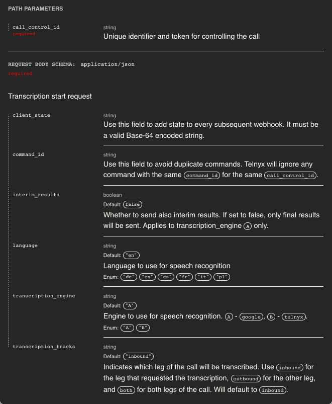
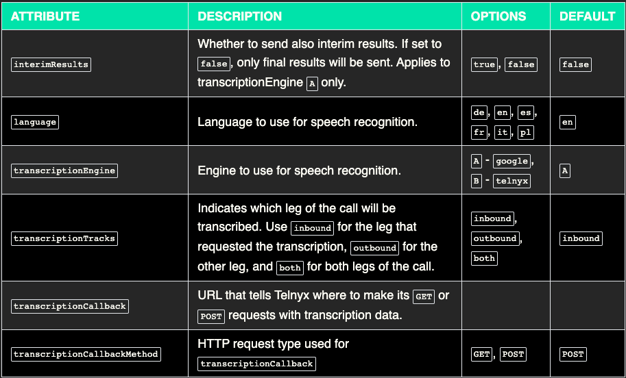
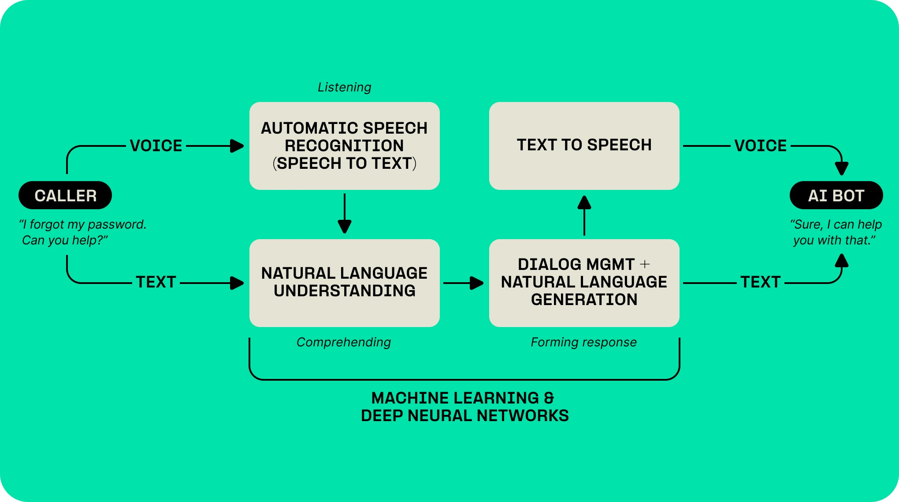
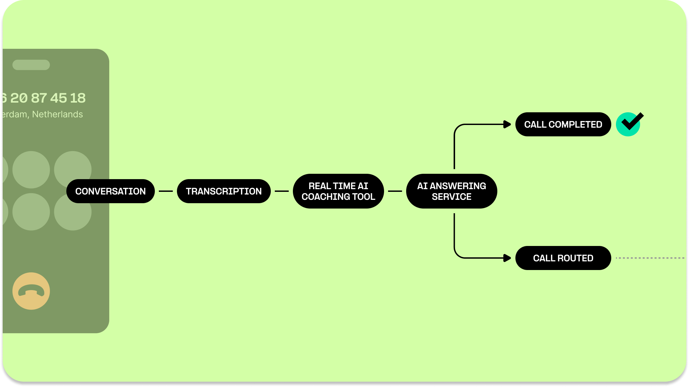

# Real-Time Transcription

Enable real-time transcription for calls with Telnyx. See Telnyx guidance and requirements Learn more about Real-Time Transcription with Telnyx.


## Real Time Transcription with Voice API and TeXML

Real-time transcription for a phone call refers to the process of converting spoken language into written text as the conversation is happening. Unlike traditional transcription services, which typically involve manually transcribing a recording after the call has ended, real-time transcription is automated and occurs instantaneously during the call. This allows participants to see a live, written version of the conversation as it unfolds.

## Key Features of Real-Time Transcription or Speech to Text:

1. **Instantaneous**: Text appears nearly simultaneously with the spoken words, offering immediate insights into the conversation.
2. **Automated**: Usually powered by advanced speech-to-text algorithms, the process doesn't require human intervention for transcription.
3. **Multi-Functional**: Real-time transcription can be useful for various applications such as accessibility for the hearing-impaired, legal compliance, documentation, or data analysis.
4. **Accuracy**: While generally very accurate, the quality of the transcription can vary based on the clarity of speech, background noise, and the sophistication of the transcription technology used.

   ### The Voice API parameters that you can select for Transcription are:

   call\_control\_id: Unique Id for controlling the call.

   client\_state: adds state of call to webhook.

   command\_id: Optional id you can set arbitrarily.

   interim\_results: Only available with Google, Engine A and returns transcription results more quickly but less accurately.

   language: Set language for transcription.

   transcription\_engine: Options are A or B. A is Google Transcription Engine and is the default, it is also the only engine which can use the feature `interim_results`. B is the Telnyx Transcription Engine which is more accurate and less costly.
   transcription\_tracks: Indicates which leg of the call to transcribe - `inbound`, `outbound` or `both`.

   

   ### The TeXML Attributes that you can select for Transcription are:

   

## Telnyx Real Time Transcription Product Options:

STT is available with the Telnyx Voice API or TeXML at this time. If you are a SIP Trunking user then you would have to convert to the one of the two programmatic voice options to use our Speech to Text capabilities.

## STT or Speech to Text Applications:

* **AI:** By using speech to text you can pass your call to an AI or LLM system to either evaluate, summarize, or participate in your calls. Read our [AI STT Blog](https://telnyx.com/resources/conversational-ai-speech-to-text) on this topic.

  

  
* **Voicemail**: it can save a lot of time to be able to read and share written transcripts of voicemails left by customers, employees, partners, and vendors.

  
* **Business Meetings**: Provides a written record that can be reviewed later, helps participants focus on the discussion instead of note-taking.
* **Legal Requirements**: May be used to provide a live transcript of important legal proceedings over the phone.
* **Accessibility**: Helps the hearing-impaired to fully participate in the conversation.
* **Customer Service**: Allows for real-time analytics and quality control.

## How to use Real Time Transcription using the Voice API:

[Transcription start](https://developers.telnyx.com/api-reference/call-commands/dial) for Voice API

[Transcription stop](https://developers.telnyx.com/api-reference/call-commands/dial) for Voice API

[Transcription Start from Dial Command](https://developers.telnyx.com/api-reference/call-commands/dial) for Voice API

## How to use Real Time Transcription using the TeXML:

[Start Transcription Verb](https://developers.telnyx.com/voice/texml/texml-translator) for TeXML

[Stop Verb with Transcription Noun](https://developers.telnyx.com/voice/texml/texml-translator#stop) for TeXML

## Costs of Real Time Transcription:

You have 2 options when it comes to the cost of Speech to Text. The Speech to Text engine that is built using Telnyx technology is **$0.025 (USD)** per minute, please check up to date pricing at <https://portal.telnyx.com/#/pricing/voice> under Voice > Speech to Text. The STT engine that utilizes Google Technology is **$0.050 (USD)** per minute at the time of printing but up to date prices can be located at <https://portal.telnyx.com/#/pricing/voice>under Voice > Speech to Text. The default STT engine is A) Google because it has more features such as interim results, and secondary is B) Telnyx with significantly better transcription accuracy and lower latency. You can select which STT you want to use by following this [guide](https://developers.telnyx.com/docs/development/programmable-voice/speech-to-text). A Voice API example would be to use the "transcription\_engine" parameter when using the Transcription command such as

```
"transcription_engine" =  "A/B "
```

## Automatic Transcription with Timeout of Call Recording:

1. If you've set a timeout for your call recording—meaning the recording stops after a certain period of silence—Telnyx uses transcription to detect that silence. This will automatically trigger Real-Time Transcription even if you didn't explicitly enable it.
2. If transcription is triggered due to the timeout setting, you will be billed for it. Make sure to account for this in your budget.
3. If you're trying to create a voicemail system using the call recording command then transcription is nice to have to track the length of the silence to be able to trigger the stop recording command at the end of the voicemail. Alternatively, if you can trust your callers to hang up at the end of the message then that will end the recording as well.


​

---

Related Articles

[What is Telnyx?](https://support.telnyx.com/en/articles/1130637-what-is-telnyx)[ElevateAI Proof-of-Concept Setup Guide](https://support.telnyx.com/en/articles/6837118-elevateai-proof-of-concept-setup-guide)[Key Configuration Notes for Noise Suppression](https://support.telnyx.com/en/articles/9260287-key-configuration-notes-for-noise-suppression)[TeXML Bin Simple Voicemail and Call Forwarding](https://support.telnyx.com/en/articles/13386198-texml-bin-simple-voicemail-and-call-forwarding)[Twilio TwiML Conference on Telnyx](https://support.telnyx.com/en/articles/13389311-twilio-twiml-conference-on-telnyx)

Did this answer your question?

😞😐😃
