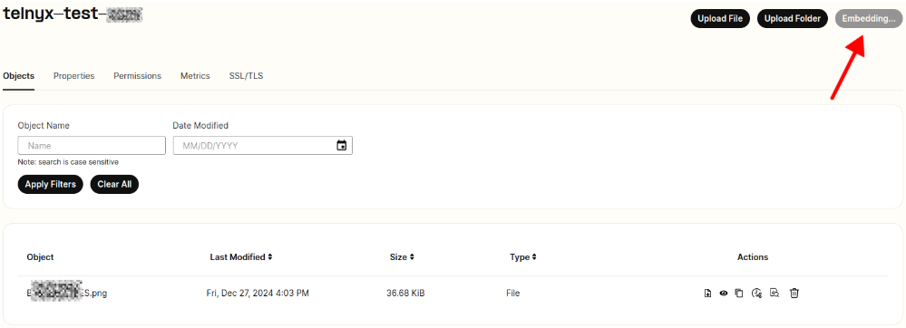

Get Started with Telnyx Storage & Inference Guide | Telnyx Help Center

[Skip to main content](#main-content)

# Get Started with Telnyx Storage & Inference Guide

This article provides you with a guide to setting up Telnyx Storage on your account

Written by Dillin

December 27, 2024

Table of contents

# What is Telnyx Storage?

Telnyx Storage is a high-performance cloud storage service that caters to the storage and management of vast quantities of unstructured data. It prides itself on speedy data retrieval and exceptional durability, with 11 nines of reliability. Telnyx Storage provides S3 compatible APIs to facilitate seamless integration with a variety of third-party tools and applications. The Telnyx Storage API allows you to seamlessly integrate with most popular third-party tools and applications.

The main difference between Telnyx Storage and other platforms like Google Cloud Storage is in pricing. Unlike Google Cloud Storage, Telnyx Storage does not charge egress fees. Regardless of whether they are Class A or B operations, Telnyx Storage is roughly 70% less expensive than Google Cloud Storage.

Telnyx Storage is built on distributed storage technology, which provides reliable and efficient data storage at the edge. It offers an S3-compatible API, so you can point your S3-centric applications at Telnyx endpoints for easy migration and a faster way to realize your cost savings.

For managed service providers and resellers, Telnyx Storage can be used to scale disaster recovery and backup and restore services across your client base.

## **What is a storage bucket?**

A storage bucket is a unit of storage that you can create within the Telnyx Storage service. You can create your first storage bucket with a few clicks or a simple API command. There is no additional cost for creating additional buckets.

Here are some key points about storage buckets:

1. Creation: You can create a storage bucket either through the Telnyx portal or by using an API command.
2. Additional Buckets: Telnyx allows you to create up to 100 storage buckets at no additional cost. If you require more than 100 individual buckets please contact sales.
3. S3-Compatible API: Telnyx has built its API to be S3-compatible. This means you can point your S3-centric applications at Telnyx endpoints for easy migration and a faster way to realize your cost savings.
4. Use Cases: You can use storage buckets to store your multi-modal, raw data for embeddings and fine-tuning your datasets. You can securely access that data with zero egress fees.

## Create a storage bucket

Once you are signed into your account, look for the [Storage](https://portal.telnyx.com/#/app/storage/buckets) section on the left navigation bar. If this is your first time creating a bucket, you can click the “Get Started” button to begin.

[Telnyx Storage](https://portal.telnyx.com/#/app/storage/buckets)


Give the bucket a unique name in the bucket name field (required). The name must be 3-65 characters long and can consist only of lowercase letters, numbers, dots (.), or hyphens.

If you give the bucket a name that's already been used, you will see the following error response:

***The requested bucket name is not available. The bucket namespace is shared by all users of the system. Specify a different name and try again.***

Then click create where you can start to add objects to your bucket.

### Adding an object to the bucket

When your bucket is created, you will see a row available with your bucket name to click into to access the bucket settings or upload an object.

Click the upload object or upload folder button in the middle of the page for the first time and the upload object on the top right for subsequent uploads.

Drag and drop the file or click the browse files button to search for the file you want to upload.


You can specify tags on the objects by setting key value pairs.

When you're ready, click the upload object button. You'll see a progress bar to let you know when the file is uploaded and can click done when it's finished.

You can upload virtually any type of file to your Telnyx Storage bucket. This includes but is not limited to:

* Text files (.txt, .csv, .json, .xml, etc.)
* Image files (.jpg, .png, .gif, etc.)
* Video files (.mp4, .mov, .avi, etc.)
* Audio files (.mp3, .wav, .aac, etc.)
* Document files (.pdf, .docx, .xlsx, etc.)
* Archive files (.zip, .tar, .rar, etc.)

There are no restrictions on the file types that can be uploaded. However, you should ensure that you have the necessary rights and permissions to store and distribute any data you upload to your bucket.

In my example I've uploaded a pdf file from the text that exists in this [support article](https://support.telnyx.com/en/articles/4409457-telnyx-sip-response-codes).

### Delete a bucket

You can delete your bucket by clicking the thrash icon below the actions column. Note, you can only delete a bucket when it's empty and any objects that were associated with it are deleted from it.

## What are these AI features I see?

You can click the "summarize file" button to get a summary of the contents.


Currently, these file types are the only file types support for using the AI features on the objects.

* pdf
* html
* txt/unstructured text files
* json
* csv
* audio / video (mp3, mp4, mpeg, mpga, m4a, wav, or webm ) - Max of 20mb file size.

When the summary is finished generating, a popup window will show up detailing the summary of the contents of your file as seen below:


You can also click the embed button to embed your content so it can be used within our AI playground (inference).



Remember, that only supported file type objects in the bucket will be embedded.

## **Visit the AI Playground**

When your files are embedded for AI use, click the [AI Playground](https://portal.telnyx.com/#/app/aiPlayground) sub tab button beside the bucket sub tab.

[AI Playground](https://portal.telnyx.com/#/app/aiPlayground)


You can select the different language models we support to run the inference on, there are several options available such as Open AI GPT 4 and open source models. If you're using Open AI, make sure to include your Open AI API Key in the field that will appear when you've selected an Open AI model.

## Language Models

* openai/gpt-3.5-turbo-0613
* openai/gpt-3.5-turbo-0125
* openai/gpt-4-turbo-preview
* openai/gpt-4-1106-preview
* openai/gpt-4-32k-0314
* openai/gpt-3.5-turbo-1106
* openai/gpt-4
* openai/gpt-4-0314
* openai/gpt-4-32k
* openai/gpt-3.5-turbo
* openai/gpt-3.5-turbo-16k
* openai/gpt-3.5-turbo-16k-0613
* openai/gpt-3.5-turbo-0301
* openai/gpt-4-0125-preview
* openai/gpt-4-32k-0613
* openai/gpt-4-0613
* NousResearch/Nous-Hermes-2-Mixtral-8x7B-DPO
* TheBloke/zephyr-7B-beta-GPTQ
* meta-llama/Llama-2-13b-chat-hf
* mistralai/Mistral-7B-Instruct-v0.1

## **Testing Inference**

If you want to run inference against content in your bucket, you can select the **bucket** that you desire. You can also specify a "system prompt" and a "user message".

In our example I select a bucket that has information on SIP Error responses, I set the model to Open AI's GPT Turbo Preview with the following system prompt and user message:   
​

**System Prompt**: You are a virtual assistant that specializes in Session Initiation Protocol (SIP), adept at handling a wide range of queries related to SIP functionalities, configurations, troubleshooting, and best practices. You are able to provide in-depth explanations, advice, and solutions for SIP-related issues, ranging from basic setup and operation to advanced network troubleshooting and optimization. You must interpret technical queries, clarify user intents, and offer concise, accurate, and actionable responses. You should also guide users through SIP protocol specifications, including signaling, session management, and integration with other protocols. You must stay updated with the latest SIP technologies, standards, and security practices to ensure reliable and up-to-date advice.

**User Message:** I'm having trouble with a SIP error I received through Telnyx. What is the error code D16 - 403 Connection is disabled D16?

You can add several user messages if you'd like and then click "send" to trigger the completion request.   
​

Setting **temperature** using the slider bar controls the quality of the output. The higher the value, the more random the output. The lower the value, the more focused the result.

Setting **max tokens** allows to generate the maximum number of tokens for the chat completion that's made.

This was the response:

```
D15 and D16 are error codes indicating different issues with call termination. D15 relates to the outbound voice profile used with the SIP Connection being inactive. If the outbound voice profile is not active, customers are advised to go to their outbound voice profile section and ensure the status of the profile is active, and if it is, refresh the status by toggling it off and back on again. On the other hand, D16 indicates that the SIP Connection used to place the termination call is inactive. In these cases, customers should go to their SIP Connections page and ensure the status of the SIP Connection is active, and refresh the status if needed by toggling it off and back on again(SOURCES: https://storage.telnyx.com/my-bucket-2/telnyx-sip-responses.pdf).
```

## Why would I want to embed and infer on my objects in my buckets?

We'll be releasing API endpoints that you can use to programmatically send requests to embed and infer on your objects.

Telnyx created an AI assistant to help provide support in answering frequently asked questions about our products through a combination of embedding our telnyx.com website, support center website and developer documentation website. You can read more about it [here](https://support.telnyx.com/en/articles/8020222-mission-control-portal-ai-chat-support).

Embedding and inferring on objects in your buckets, especially in cloud storage contexts like Telnyx Storage, can serve multiple valuable use cases like our AI Assistant above.

The term "objects" here refers to items stored in these buckets, which can range from text files, images, videos, and other forms of data.

Here's why you might want to embed and infer on these objects:

1. **Content-Based Recommendation:** Similar to the earlier example, if you have a catalog of products, movies, books, or any content represented as objects in your bucket, you can generate embeddings for each item. When a user interacts with one item, you can quickly recommend other items with similar embeddings.
2. **Semantic Search:** If your bucket contains text documents, embeddings can be used to enable semantic search. Traditional keyword search only matches exact phrases, but with embeddings, you can find documents that are semantically related to a query, even if they don't contain the exact keywords.
3. **Image or Video Recognition:** If your buckets contain images or videos, embeddings can represent the visual content. You can then use these embeddings for image classification, object detection, or even to find visually similar content.
4. **Data Clustering and Organization:** Especially in large buckets with varied content, embeddings can help cluster similar items together, making it easier to organize, manage, and retrieve related items.
5. **Anomaly Detection:** In scenarios like system logs or transaction records stored as objects in buckets, embeddings can capture the essence of each entry. You can then build models to detect anomalous entries that deviate significantly from the norm.
6. **Reduced Latency:** Inferring directly on objects within the buckets, especially when using cloud-native tools, can lead to reduced latency in predictions. You don't need to move data out of storage to a separate processing location; you can process it in place.

## Conversational AI

Want to learn more about who conversational AI can benefit your business?

Check out our latest [webinar here](https://telnyx.com/landing/webinar-conversational-ai) where our solutions engineers and product managers discuss in detail and review our [Inference Video](https://telnyx.com/landing/telnyx-ai-inference-changelog).

## How do I give sub members of my organisation access to my storage buckets?

At this moment in time, the organisation owners storage buckets can only be accessed by the organisation owner. Likewise, sub members of your organisation who create their own buckets can't be accessed by the organisation owner. In the near future we hope to expose access to the buckets.

---

Related Articles

[Use S3 Browser with Telnyx Storage](https://support.telnyx.com/en/articles/6965267-use-s3-browser-with-telnyx-storage)[Use Cloudmounter with Telnyx Storage](https://support.telnyx.com/en/articles/8047914-use-cloudmounter-with-telnyx-storage)[Use ODrive with Telnyx Storage](https://support.telnyx.com/en/articles/8047956-use-odrive-with-telnyx-storage)[Use NetDrive3 with Telnyx Storage](https://support.telnyx.com/en/articles/8048024-use-netdrive3-with-telnyx-storage)[Use AirExplorer with Telnyx Storage](https://support.telnyx.com/en/articles/8048045-use-airexplorer-with-telnyx-storage)

Did this answer your question?

😞😐😃

Table of contents
