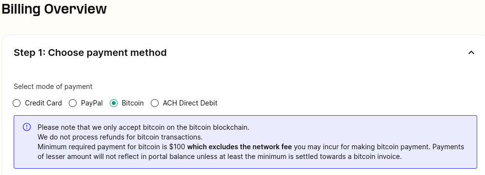
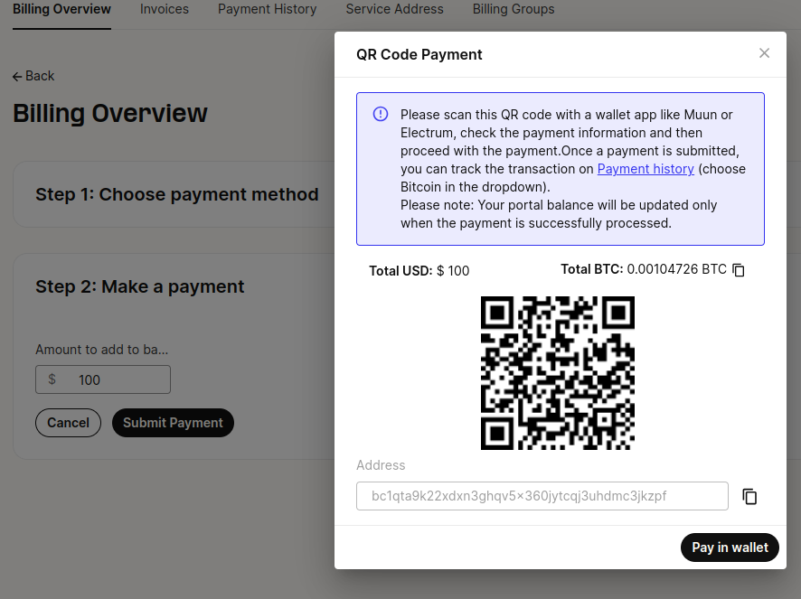

Bitcoin Payment Method | Telnyx Help Center

[Skip to main content](#main-content)

# Bitcoin Payment Method

Explore our comprehensive guide on using Bitcoin for payments on the Telnyx portal.

Written by Dillin

December 26, 2024

Table of contents

# Bitcoin Basics

Explore our comprehensive guide on using Bitcoin for payments on the Telnyx portal. Learn about Bitcoin basics, transaction times, refunds, payment statuses, and more. Dive in to understand the seamless integration of digital currency with our platform.

## What is Bitcoin?

Bitcoin is a decentralized digital currency. It operates on a global network of computers and uses a public ledger called the blockchain for transactions. Think of it as digital gold with a maximum supply of 21 million. You need a digital wallet to use Bitcoin.

## How does Bitcoin differ from traditional money?

Unlike traditional currencies, Bitcoin isn't governed by a central authority. It's purely digital, secured by cryptography, and has a finite supply, which makes it unique.

## How can I make a payment with Bitcoin on the Telnyx portal?

Choose Bitcoin on the [Payments](https://portal.telnyx.com/#/app/billing/payment) page.

* Please note that we only accept bitcoin on the bitcoin blockchain.
* We do not process refunds for bitcoin transactions.
* Minimum required payment for bitcoin is $100, and payment of lesser amount will not reflect in portal balance unless at least the minimum is settled towards a bitcoin invoice.

You can either scan the QR code or manually enter the payment amount and bitcoin address. Once confirmed, your portal balance updates. Note there is requirement for a minimum amount of $100 as a payment.

## How long do Bitcoin transactions take on Telnyx?

Most Bitcoin transactions on our platform confirm in about 10 minutes, as we rely on one confirmation for deposits capped at $1000. This duration can extend during high network activity.

## Can I request a refund for Bitcoin payments?

Unfortunately, we cannot refund Bitcoin payments at this time. So make sure you transfer only what you'll use in the Telnyx portal.

## What are the different Payment Statuses?

* No Payment: Payment not received.
* Processing: Payment made but awaiting confirmations.
* Settled: Payment confirmed and portal balance updated.
* Invalid: Payment not sufficiently confirmed.

## How does the Bitcoin QR code's expiration impact conversion rates?

Bitcoin QR codes have a 15-minute lifespan due to market fluctuations. The Bitcoin amount is locked based on the BTC value at that moment, but the settlement can occur later.

## Where can I check my Bitcoin payments on Telnyx?

Visit the [Payment History page](https://portal.telnyx.com/#/app/billing/history) to view your transactions.

## Do you accept other cryptocurrencies or Bitcoin via the lightning network?

Currently, we accept only Bitcoin. However, we're exploring lightning network options for the future.

---

Related Articles

[Billing Setup & Billing Groups](https://support.telnyx.com/en/articles/4280500-billing-setup-billing-groups)[Your Number Lookup Guide](https://support.telnyx.com/en/articles/4366901-your-number-lookup-guide)[Synway UC-200: Telnyx Setup](https://support.telnyx.com/en/articles/5800399-synway-uc-200-telnyx-setup)[Find GB Numbers on Telnyx Portal](https://support.telnyx.com/en/articles/5820047-find-gb-numbers-on-telnyx-portal)[ACH Direct Debit Payment Method](https://support.telnyx.com/en/articles/7045419-ach-direct-debit-payment-method)

Did this answer your question?

😞😐😃

Table of contents
