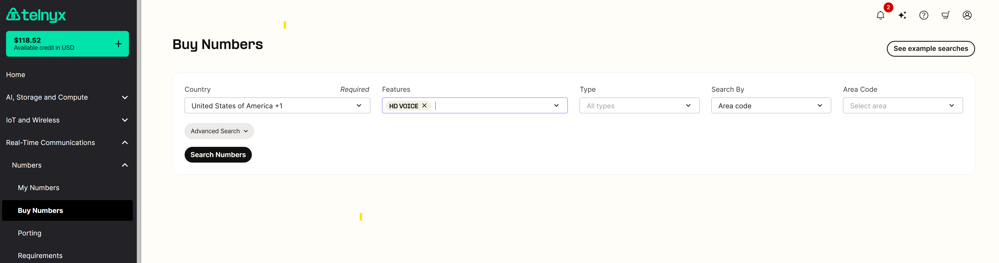

HD Voice - Number Feature | Telnyx Help Center

[Skip to main content](#main-content)

# HD Voice - Number Feature

Telnyx presents HD Voice, a number feature to enhance audio quality on PSTN calls made and received to eligible numbers within the US and supported countries.

Written by Dillin

November 25, 2025

Table of contents

# Overview

The HD Voice Number Feature enhances audio quality for PSTN calls made and received to and from eligible numbers within the United States and other supported countries.

## What is HD Voice? Feature Description

The HD Voice Number Feature enables customers to make and receive PSTN calls with high-definition (HD) audio quality.

In the context of HD Voice, which aims to enhance call quality by using wideband codecs, the codec negotiation process becomes even more crucial.

Unlike traditional PSTN calls that often use a fixed narrowband codec (such as G.711), HD Voice leverages wideband codecs like AMR-WB to deliver higher audio quality.

HD Voice calls require both endpoints to support and agree upon a compatible wideband codec during the negotiation process. This can be more complex when connection calls to PSTN, as not all networks or devices may be equipped to handle wideband codecs. Therefore, ensuring that both parties in a call support the same wideband codec is essential for a successful HD Voice call.

The negotiation process for HD Voice involves determining which wideband codec is supported by both ends of the call and selecting the highest quality option available. This negotiation considers factors like available bandwidth, device capabilities, and network conditions to optimize call quality.

While HD Voice offers superior audio quality, the challenge lies in ensuring that both ends of the call are equipped to handle wideband codecs.

This requires compatibility checks and, if necessary, fallback options to a suitable narrowband codec in case wideband support is not available.

## General Conditions for HD Voice Support

The call must be destined or originated from one of the following supported carriers:

US carriers;

* AT&T
* T-Mobile
* Verizon

Germany carriers;

* Outbox

Austria carriers;

* Yuutel

Australia;

* All Major carriers

The call must be destined or originated on a mobile phone device that supports wideband codecs and is registered on a local 5G/LTE network.

Within the Telnyx portal, your SIP connection must have one of the following wideband codecs enabled: OPUS, G.722, or AMR-WB. Additionally, the SIP device involved in the call must also support the selected codec.

## Importance of codecs on HD Voice

Codecs, short for coder-decoder, are essential tools in voice communication.

They encode and decode audio signals, compressing them for efficient transmission or storage.

In a voice call, a codec converts analog audio (what you hear during a call) into a digital format for network transmission, and then back to analog at the receiving end.

Different codecs have varying compression levels, audio quality, and bandwidth requirements. Some prioritize high-quality audio, while others are designed to conserve bandwidth for efficient transmission over networks.

**Opus Codec**: Opus is known for its adaptability and efficiency. It dynamically adjusts to varying network conditions, delivering exceptional audio quality even under less-than-ideal circumstances.

**AMR-WB Codec**: Adaptive Multi-Rate Wideband provides a broader frequency range, capturing more natural tonal nuances in speech for higher fidelity audio.

**G.722 Codec**: G.722 is a standard for high-quality speech and audio compression. It offers an extended frequency response range, ensuring crisp and clear voice reproduction even at lower bitrates.

Choosing the right codec ensures that audio quality matches the capabilities of HD voice technology.

This means experiencing conversations with utmost clarity, even in challenging network conditions.

***Please note:*** *While these conditions significantly increase the probability of experiencing HD audio, it's important to acknowledge that HD audio cannot be guaranteed due to the unpredictable nature of PSTN networks.*

## Receiving a call with HD Voice

For inbound calls to have HD voice support, the following conditions must be met:

The incoming call must originate on an AMR-WB-enabled device located in at least 4G/LTE coverage area from one of the following carriers:

US carriers;

* AT&T
* T-Mobile
* Verizon

Germany carriers;

* Outbox

Austria carriers;

* Yuutel

Australia;

* All Major carriers

The call must be routed to a Telnyx number with the HD voice feature enabled.

HD Voice feature can be enabled on the *Number Voice* settings as depicted below:

In the *My Numbers* overview page, the HD Voice option will be enabled for that Number and is visible under the services column.

Customers can also search for HD Numbers in the [Buy Numbers](https://portal.telnyx.com/#/numbers/buy-numbers) section of the portal.

The call must be routed to a SIP Connection configured with AMR-WB, G722, or Opus HD voice codecs.  
​  
You can configure SIP Connection codecs in the *SIP Trunking* > *SIP Connections* > *Inbound* configuration > *Expert Settings*:

The SIP device receiving the call must support one of the above-mentioned codecs.

## Making an Outbound Call with HD Voice

For outbound calls to have HD voice support, the following conditions must be met:

The SIP device initiating the call must use one of the following codecs: AMR-WB, G722, or Opus.

The call must be received on an AMR-WB-enabled device located in at least 4G/LTE coverage area from the list above.

The Telnyx number used to make the outbound call must have HD Voice-enabled (also applied to CLI override)  
​

Instructions on how to enable a Telnyx number with HD voice can be found [here](https://docs.google.com/document/d/1qBMtyraDDdZzCb7ED1GNeoK8jU9bIkeZOEW2qJk3z7s/edit#bookmark=id.ok6q60t9lgbx).

## Geographic Availability

This feature is restricted to numbers in the coverage area list above.

## Risks and Considerations

While the conditions specified significantly increase the likelihood of HD audio, it's important to note that HD audio is not guaranteed due to the inherent unpredictability of PSTN networks.

## Frequently Asked Questions

**I see a yellow banner above the toggle to enable the feature "This number is not HD Voice capable"?**

This banner will appear for International, toll-free, and also some +1 US longcode numbers that are not currently supported.

Currently, this feature is only supported on +1 US longcode numbers. However, there are some cases where the feature cannot currently be enabled on specific +1 area codes but will be in the near future as the product offering expands.

Please use the feature toggle in the number buy section of Mission Control to find numbers that are HD-Voice compatible at this time.

**What carriers support HD Voice?**

All calls in these regions that meet the conditions will have HD Voice.

* US carriers;

  + AT&T
  + T-Mobile
  + Verizon

  Germany carriers;

  + Outbox

  Austria carriers;

  + Yuutel

  Australia;

  + All Major Carriers

**Are there any recommended SIP devices that are best suited for the HD Voice feature?**

Any SIP device that supports one of the 3 supported HD Voice codecs are recommended.

**What happens if a codec mismatch occurs during a call?**

The call will be transcoded. If the mismatch is between two HD codecs (i.e. OPUS and AMR-WB) then the the audio quality will still be HD, but if the mismatch is between an HD codec and a non-HD codec (i.e. PCMU-AMR-WB) then the audio quality won’t be HD.

**How will the system handle fallback to a narrowband codec if wideband support is unavailable?**

By transcoding the audio.

**Will there be any interruptions or will it be seamless?**

Codecs are negotiated at the start of the call, so no interruptions.

**What kind of bandwidth is required to comfortably use the HD Voice Feature?**

HD Voice codecs have variable bit rates, but a high-speed internet connection is required for best results.

**Are there plans to extend the list of carriers that support the HD Voice Feature in the future?**

Yes.

**Will international numbers have the capability to use the HD Voice feature in the future or will it always be restricted to US numbers?**

We are expanding our support outside the US and more countries will be added to the list as they come online for HD voice.

**How can customers check if their mobile device supports wideband codecs?**

By reading the user manual and checking the section about supported codecs.

**Can the HD Voice feature be enabled mid-month and, if so, will the cost be prorated?**

As of July 2025, there are no MRC's (monthly recurring charges) associated with HD Voice, it's free!

**How will the billing be reflected on the customer's monthly statement, just an aggregate count of HD Voice-enabled?**

Since HD Voice is now free, it won't be charged on your monthly statement.

---

Related Articles

[Bulk Edit Numbers - Voice Settings](https://support.telnyx.com/en/articles/2807846-bulk-edit-numbers-voice-settings)[My Numbers Page](https://support.telnyx.com/en/articles/4349113-my-numbers-page)[Snom D7xx: Telnyx Setup](https://support.telnyx.com/en/articles/5822706-snom-d7xx-telnyx-setup)[Fanvil X2CP/X2C/X2P: Call Center IP](https://support.telnyx.com/en/articles/6206756-fanvil-x2cp-x2c-x2p-call-center-ip)[Fanvil XU Series: IP Phone](https://support.telnyx.com/en/articles/6210147-fanvil-xu-series-ip-phone)

Did this answer your question?

😞😐😃

Table of contents
