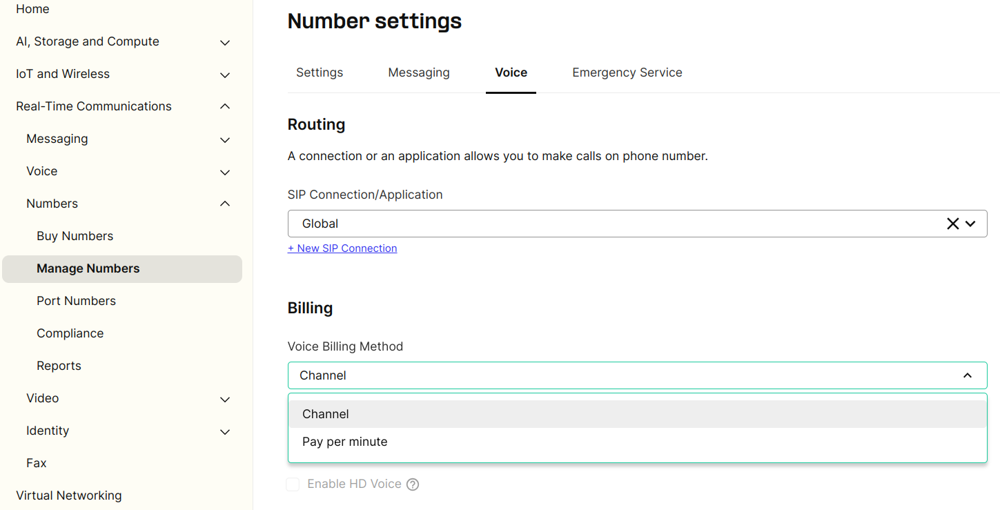
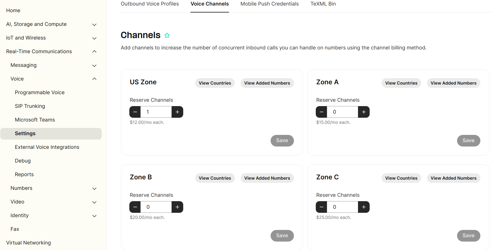

# Channel Billing

The Channel Billing feature is an enhancement to our services that allows customers to manage their voice channels in… See Telnyx guidance and requirements.

## **Introduction**

The Channel Billing feature is an enhancement to our services that allows customers to manage their voice channels in multiple regions. This document provides a comprehensive guide on how to utilize this feature effectively.

## Overview

### **What is Channel Billing?**

Channel Billing is a feature that allows customers to manage voice channels in multiple regions. Instead of being billed based on inbound minutes of usage, customers can select the number of concurrent calls they'd like to support for inbound traffic and pay per channel. This means calls themselves will come up with a charge of $0 and the actual cost will come up in your Monthly Recurring Charges (MRC) as a fixed per channel cost.

### **Benefits of Channel Billing**

* **Flexible Cost Management:** Customers can allocate channels based on their specific needs, optimizing costs.

## Getting Started

### **Eligibility and Availability**

* Channel Billing is available to all customers.

### **Accessing Channel Billing**

* To access Channel Billing, log in to your account and navigate to the [Channels Management section](https://portal.telnyx.com/#/app/numbers/channels). From there, you can configure your channels as per your requirements.

## **Configuring Channels**

### **Setting Voice Billing Method to "Channel"**

Channel billing is an alternative method that allows you to pay a flat fee for unlimited inbound minutes. Instead of being billed based on your inbound minutes of usage, you select the number of concurrent calls you would like to be able to support for your inbound traffic and pay per channel.

Each channel allows for one concurrent (or simultaneous) inbound call. You can use as many inbound minutes as you want with no additional charges; however, you

can only support one call at a time per channel provisioned.

To utilize Channel Billing, set the Voice Billing Method to "Channel" at the number level. This option will be available for numbers that support this feature. Only Telnyx numbers belonging to countries included in the Channel Zones will be eligible to be configured with Voice Billing Method as "Channel".

In the "Real-Time Communications" menu, go to "Numbers" > "Manage Numbers" and edit a Telnyx Number to configure Voice Billing Method in Voice tab. If number is eligible, you will be able to configure “Channel” as Voice Billing Method.

### **Reserving Channels in Different Zones**

When you enable channel billing for a specific number, the total channels provisioned forthat zone will be shared among all numbers in that zone where channel billing is enabled.

Additionally, Channels from the same zone can be shared across multiple numbers, even if they belong to different regions, as long as the country number is included in the zone.

Example:

You have the flexibility to distribute 5 channels among 10 numbers within the same

zone. This allows you to utilize unlimited inbound minutes on these 10 numbers without incurring any extra charges. However, it's important to note that you can only handle a maximum of 5 simultaneous calls across all 10 numbers at any given time.

Detailed instructions on reserving channels in different zones can be found below:

In the "Real-Time Communications" menu, go to "Voice" > "Settings", here you'll see the "Voice Channels" tab.

In the Voice Channels screen customers will be able to Reserve Channels on the respective Zone and View Countries associated with each zone.

### What happens if there is an inbound call when there are no more channels available?

Whenever all available channels are currently being used, any new inbound call will be rejected with a "User Busy" hangup cause.

## **Billing Details**

### **Understanding Channels Costs in Different Zones**

Channel Billing offers flexible pricing options for managing voice channels in different regions. Below is a summary of the pricing tiers and associated discounts for various channel ranges across different zones. The following are per channel costs, the more channels you have the lower the per channel cost is. Do note that you'll only see these in your MRC (Monthly Recurring Charges) section of the bill or invoice, the calls themselves will show up as $0.

### US Zone:

* 0-10 channels: $12
* 10-50 channels: $11
* 50-250 channels: $9.00
* 250+ channels: $8.00

### Zone A:

* 0-10 channels: $15
* 10-50 channels: $14
* 50-250 channels: $12
* 250+ channels: $10

### Zone B:

* 0-10 channels: $20
* 10-50 channels: $19
* 50-250 channels: $15
* 250+ channels: $14

### Zone C:

* 0-10 channels: $25
* 10-50 channels: $23
* 50-250 channels: $19
* 250+ channels: $17

## Supported countries per Zone

Channel Billing offers a comprehensive range of supported countries, categorized into distinct zones. Each zone encompasses specific countries, providing tailored solutions for voice channel management.

Below, we provide a summarized breakdown of the supported countries within each zone, ensuring that you have the information you need to make informed decisions regarding your channel configurations.

### **US Zone**

* United States (US)

### **Zone A**

* Argentina (AR)
* Austria (AT)
* Belgium (BE)
* Bosnia And Herzegovina (BA)
* Bulgaria (BG)
* Croatia (HR)
* Czech Republic (CZ)
* Denmark (DK)
* Estonia (EE)
* Finland (FI)
* France (FR)
* Georgia (GE)
* Germany (DE)
* Greece (GR)
* Hungary (HU)
* Ireland (IE)
* Italy (IT)
* Latvia (LV)
* Lithuania (LT)
* Luxembourg (LU)
* Netherlands (NL)
* Norway (NO)
* Poland (PL)
* Portugal (PT)
* Romania (RO)
* Serbia (RS)
* Spain (ES)
* Sweden (SE)
* Switzerland (CH)
* United Kingdom (UK)

### **Zone B**

* Australia (AU)
* Bahrain (BH)
* Brazil (BR)
* Canada (CA)
* Chile (CL)
* Colombia (CO)
* Costa Rica (CR)
* Cyprus (CY)
* Dominican Republic (DO)
* Ecuador (EC)
* Iceland (IS)
* Kazakhstan (KZ)
* Kenya (KE)
* Malta (MT)
* Mexico (MX)
* Nicaragua (NI)
* Panama (PA)
* Peru (PE)
* Puerto Rico (PR)
* Singapore (SG)
* Slovakia (SK)
* South Africa (ZA)
* Thailand (TH)
* Turkey (TR)
* U.S. Virgin Islands (VI)
* Uganda (UG)
* Ukraine (UA)
* Venezuela (VE)

### **Zone C**

* Israel (IL)
* Japan (JP)
* New Zealand (NZ)
* Slovenia (SI)

---

Related Articles

[Channel Billing and how to use it](https://support.telnyx.com/en/articles/1130678-channel-billing-and-how-to-use-it)[SIP Connection: Number Formats](https://support.telnyx.com/en/articles/1130706-sip-connection-number-formats)[Global Number Types](https://support.telnyx.com/en/articles/1458084-global-number-types)[Bulk Edit Numbers - Voice Settings](https://support.telnyx.com/en/articles/2807846-bulk-edit-numbers-voice-settings)[Telnyx Dashboards](https://support.telnyx.com/en/articles/4307059-telnyx-dashboards)

Did this answer your question?

😞😐😃
