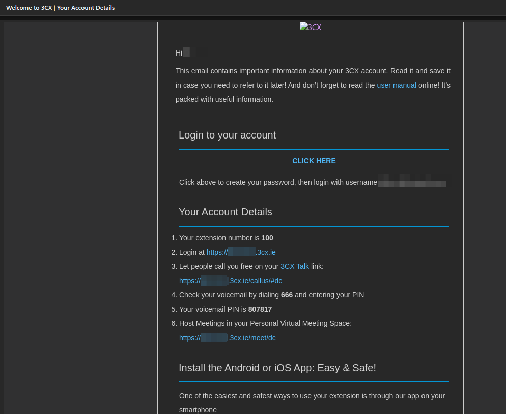
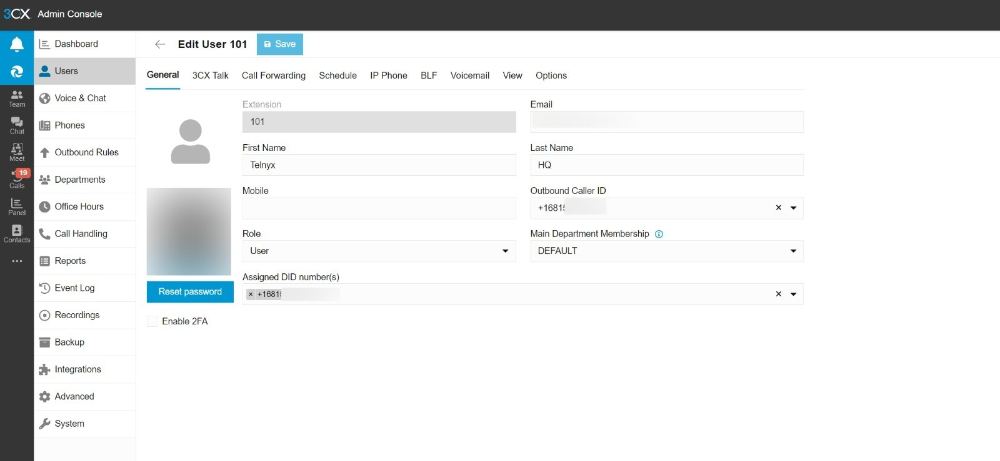
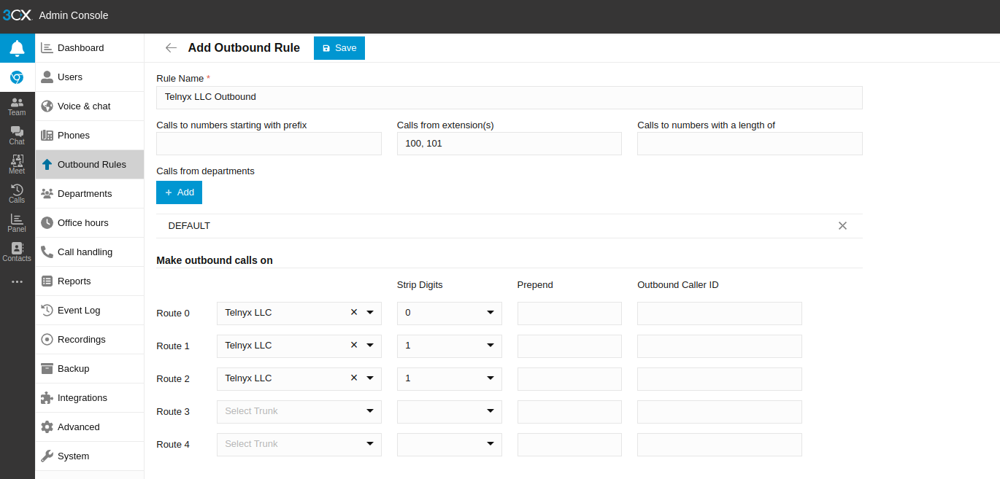
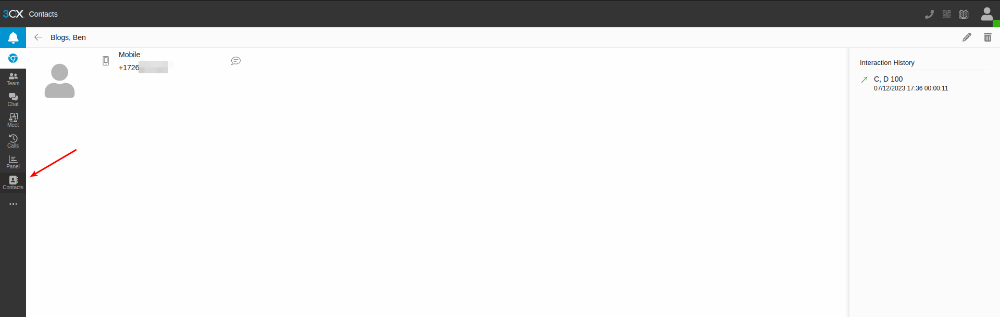
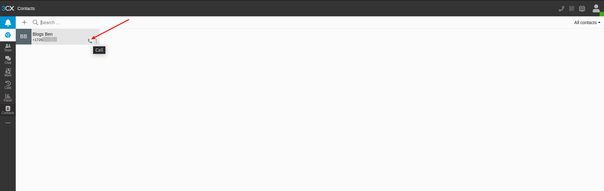
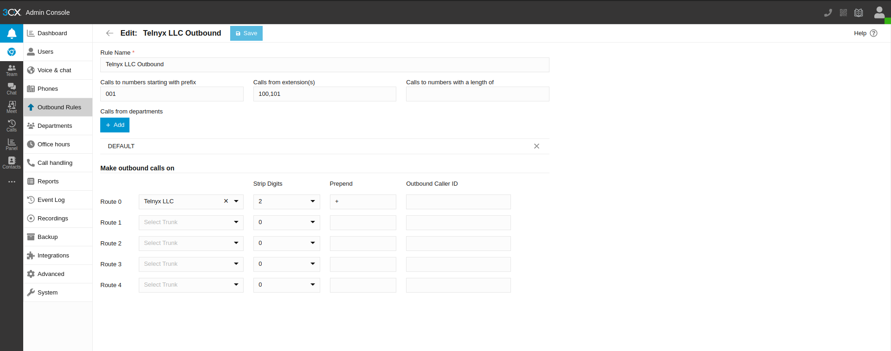
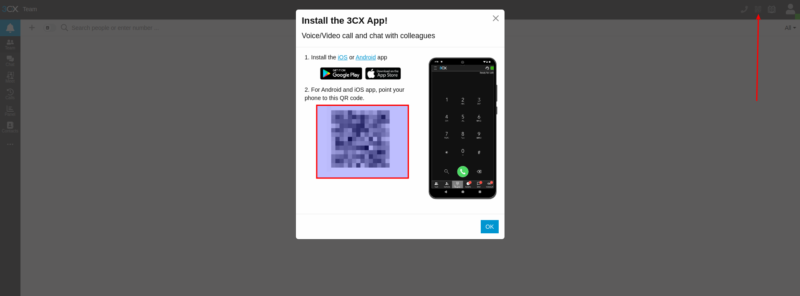
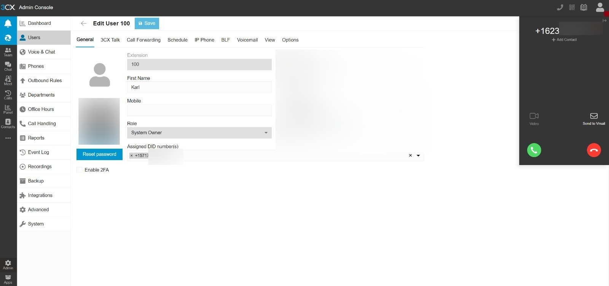
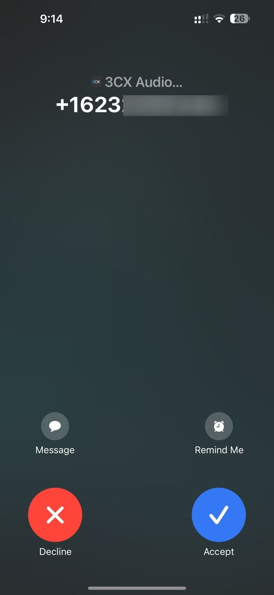
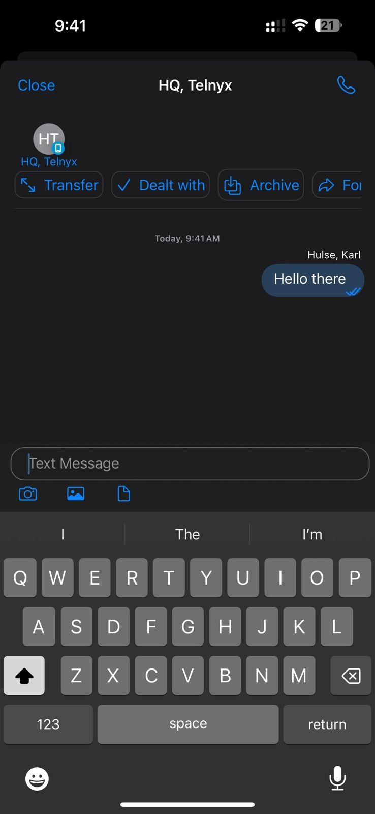

3CX: Configuring a 3CX V20 PBX 20.0 Update 5 (Build 20.0.5.551) (March 2025 Update) | Telnyx Help Center

[Skip to main content](#main-content)

# 3CX: Configuring a 3CX V20 PBX 20.0 Update 5 (Build 20.0.5.551) (March 2025 Update)

Learn how to configure a 3CX V20 PBX SIP Trunk (Calls & Messaging) with Telnyx using the Generic VoIP Provider Template (Built-In).

Written by Karl Hulse

March 13, 2025

Table of contents

[Jump to Instructions](https://support.telnyx.com/en/articles/6161111-3cx-configuring-a-3cx-v18-pbx#:~:text=Instructions%20for%20Configuring%20a%203CX%20V18%20PBX%20Trunk)

[3CX](https://www.3cx.com/) is an open standards IP PBX that offers complete Unified Communications out of the box. Suitable for any business size or industry 3CX can accommodate to your every need, from mobility and status to advanced contact center features and more.  
​  
3CX simplifies the installation, management, and maintenance of your PBX, making it easy for you to manage, whether on-premises or in the cloud. This article guides you on how to configure this PBX for making and receiving calls over the internet through a next generation carrier like Telnyx!

**Important Notes**

* You may need to acquire a license from 3CX when installing this version.
* [V20](https://www.3cx.com/blog/releases/v20-roadmap/) has an entirely new management console, named ‘Admin Console’, it is now part of the 3CX client. Users can switch to the admin console directly from the 3CX client without needing a separate login or URL.
* Telnyx is no longer a supported carrier on 3CX. 3CX has decided to shut down support for third party carriers altogether in some of their versions and to only offer their customers the option to connect with their supported carriers.
* Ensure that your 3CX version supports third-party vendors (providers not officially supported by 3CX).

  + In this example, we're using a hosted 3CX PRO instance.

---

# Instructions for Configuring a 3CX V20 PBX Trunk

## Pre-requisites

* [Set up and configure your Telnyx Mission Control Portal](https://support.telnyx.com/en/articles/5717957-zoiper-5-pro-telnyx-setup#h_dc5df9cfdf)
* Have created a credentials-based, IP or FQDN based [SIP connection](https://portal.telnyx.com/#/app/connections) on your Telnyx Mission Control Portal account, assigned this connection to purchased numbers (DIDs) to receive inbound calls and an outbound profile in order to make outbound calls.
* Have created a [messaging profile](https://portal.telnyx.com/#/app/programmable-messaging/profiles) on your Telnyx Mission Control Portal account, assigned this profile to purchased numbers (DIDs) in order to send and receive messages.
* [Download](https://www.3cx.com/phone-system/download-links/) and [install](https://www.3cx.com/docs/manual/) 3CX.

---

## 1. Performing the basic setup

In this step, you'll do a basic configuration before creating your Telnyx [SIP trunk](https://telnyx.com/products/sip-trunks).

1. Log into 3CX with the username and password provided to you during the installation process.

   
2. On the "**Extension Length"** tab, specify your extension length by choosing how many digits your extension should have (default is 3). Note that this CANNOT be changed later.  
   ​

   ## Extension Length Tab:

   
3. Click "**Next"**.
4. On the "**Admin Email"** tab and enter an email you want to use to receive system notifications and other important information.  
   ​

   ## Admin Email Tab:

   
5. Click "**Next"**.
6. On the "**Timezone"** tab, set your Time zone.

   ## Timezone Tab:

   
7. Click "**Next"**.
8. On the Operator tab, you can specify a default operator extension. This will be the default destination for all inbound calls, as well as a voicemail extension.

   ## Operator Tab:

   
9. Click "**Next"**.
10. On the "**Allowed Countries"** tab, you can select all regions permitted for outgoing call.

    
11. You can also configure this within the management console via **Admin -> Advanced** and selecting **Allowed Country Codes**.
12. Click "**Next"**.
13. On the "**Prompt set"** tab, you can select the language spoken by your automated prompts.

    
14. Click "**Next"**.
15. On the "**Registration"** tab, enter your personal detail to register your setup.

[Back to Top](https://support.telnyx.com/en/articles/6161111-3cx-configuring-a-3cx-v18-pbx#h_87213f8535)

## 2. Configure your PBX

In this step, you'll configure everything needed to start making and receiving calls with 3CX through Telnyx, including network settings, SIP trunks, inbound/outbound routes etc.

## 2.1. Confirm your Admin -> Advanced settings

1. Click on the admin cog on the bottom left-hand corner of the console and select **Advanced**.
2. Click on the **IP Blacklist** tab and ensure you allow the appropriate Telnyx [SIP Signaling](https://sip.telnyx.com/#signaling-addresses) & [Media IP Addresses](https://sip.telnyx.com/#media). At the end of the article, you'll find a .json file, which you can use to import all Signaling & Media IPs.
3. Click on the **Network** tab

   1. Choose which IP is the Default Internet facing IP Address (Default gateway) for the **Network Interface Card**.
   2. Set the **External IP Configuration** with either a static IP address or Dynamic IP Address. The IP address or FQDN of your instance will be required for your [SIP Connection](https://support.telnyx.com/en/articles/4245868-sip-connection-types) that you configure in your Telnyx Account.
   3. If you've selected the hosted instance, these settings will already be preconfigured.

## 2.2. Create Users | Admin -> Users

1. Click on the admin cog on the bottom left-hand corner of the console and select **Users.**
2. You'll want to create users so you can assign them DID's for inbound and outbound calls, as well as set their outbound caller ID and other important settings.
3. Click **Add User** - you will be brought to the **General** user settings where you can enter their first and last name for now, as seen below.
4. Click **Save**.
5. 
6. I've now created a dummy user called Telnyx HQ that I'll use in subsequent steps. Telnyx HQ has also been given extension 101.
7. **NOTE:** When user extensions are created, if an email is included, they will receive an email with their account details.

   1. 

## 2.3. Create a Telnyx SIP Trunk | Admin -> Voice & Chat

1. Click on the admin cog on the bottom left-hand corner of the console and select **Voice & Chat.**
2. Click on **Add SIP Trunk** → **Add Trunk**.
3. A new pop-up window will appear. Enter the following information:

   * **Name**: Enter the name of your trunk.
   * **Default Route**: By default, this will be set to the 3CX Owner. You can change this as needed.
4. Under **VoIP Provider**:

   * **Country**: Select the country corresponding to your location—**US**, **Europe**, **Australia**, or **Canada**.
   * **Provider**: Choose **Generic VoIP Provider**.
5. **Main Trunk Number**: Enter the Telnyx number you wish to use for your 3CX instance.
6. Since we're using credential-based authentication:

   * For **Authentication ID**, enter your trunk's username.

   1. For **Authentication Password**, enter your trunk's password.**"**
7. **Type of Authentication**: Select **Register/Account Based**.
8. **Server Details**:

   * **Server**: Enter `sip.telnyx.com` (or the appropriate server based on the signaling server you're connecting to: `sip.telnyx.com`, `sip.telnyx.ca`, `sip.telnyx.com.au`, `sip.telnyx.eu`).
   * Port 5060

**After configuring the trunk, it should appear in green, indicating that it’s up and running. However, you may see a warning message that says, “Untested provider: Quality and reliability not guaranteed.” Kindly note this message can be safely disregarded.**

## 2.3.1 Create a Telnyx SIP Trunk | Admin -> DIDs

1. Click the **DID Numbers** tab

   1. 
   2. These will be the other numbers that you purchased on your Telnyx account.

      1. You can import the numbers through a file.
      2. Or you can enter them in manually.
      3. Please take note of the error in the picture as you can't add DID equal to main trunk number.
      4. The trunk number will be automatically added once you save your first DID.

## 2.3.2 Create a Telnyx SIP Trunk | Admin -> Voice & Chat ->SMS

1. Click the **SMS** tab
2. **Enable Messaging**: You can enable messaging on the DID by entering your Telnyx account's API Key.

   1. **API Key**: Visit [Telnyx API Keys](https://portal.telnyx.com/#/app/api-keys) to generate a key, then paste it into the field.
3. **Copy Webhook URL**:

   * Visit [Telnyx Programmable Messaging Profiles](https://portal.telnyx.com/#/app/programmable-messaging/profiles).
   * Copy and paste the Webhook URL into the messaging profile you’ve created to enable inbound and outbound messaging.
4. **Provider URL**:

   * Enter Telnyx's Provider URL for SMS/MMS services: `https://api.telnyx.com/v2/messages`.
5. Click **Save.**
6. At this point you can go back to **Users** and configure the DID to your Telnyx HQ user, as seen below:

   1. 
   2. Telnyx HQ is now successfully assigned a DID to make and receive calls & messages.

      
7. Click back into **Voice & Chat**

   1. You'll see the Telnyx trunk is registered in green and ready to handle calls.

## 2.4. Configure Outbound Rules

1. **Click** on the **Admin** cog located in the bottom left corner of the console and select **Outbound Rules**.
2. **Calls to numbers starting with prefix**: <Leave this field empty>.
3. **Calls from extension(s)**: <Enter the specific extension numbers>.  
   ​**Note**: '100, 101' are examples of extension numbers.
4. **Calls to Numbers with a length of**: <Leave this field empty>.
5. **Make outbound calls on**:

   This is where you will configure your routes. You can configure up to 5 routes for calls. The second and third routes will serve as backups.

   * Route 1: Strip 0 digits.
   * Routes 2 & 3: Strip 1 digit.

     **Note:** The outbound rules may vary for each customer depending on their specific needs, such as dialing different countries or using different trunk configurations. Be sure to adjust the routes and strip digits accordingly to accommodate these variations.
6. **Outbound Caller ID**:

   This is one of the ways to apply an outbound caller ID within 3CX. If you apply an outbound caller ID to your outbound route, it will be used for all calls that follow this route.  
   ​

   
7. Click **Save.**

## 2.4.1. Outbound Call - Example

1. Visit the **Contacts** section on the left side bar of the management console and create a new contact with the number in +E.164 format.

   1. 
2. Use 3CX's built in WebRTC calling functionality and click the phone icon to call the test number. The WebRTC component will pop up on the right-hand side of the page to show you that the number is being dialed. Don't forget to allow the website access to your microphone and speaker!

   1. 
3. 3CX WebRTC client appears to change the + to 001 as the international exit code.

   1. You can see this with an error from the **Advanced -> Event Logs**.
   2. Call or Registration to 0017266002345@(Ln.10000@Telnyx LLC) has failed. sip:192.76.120.10:5060;lr replied: Not Found (404)
4. In this case, if your users want to dial internationally, you'll need to consider include a new outbound rule.

   1. 
   2. In this scenario, we're saying for calls prepended with 001, strip the first two digits 00 and replace with a +.
   3. Try testing the outbound call again and see how it works now!

## 2.4.2. Outbound Call - Important Notes

**Important Notes**

* If you choose not to add an outbound caller ID on your outbound route, you can apply it at the user level settings instead.
* If a caller ID is not set through 3CX, it is likely that the calls will reach us without a caller ID.

  + If this is the case, you may choose to apply a Caller ID Override from your SIP Connection’s outbound options in the Telnyx Portal.
  + Otherwise, your calls will be rejected. Please review our **[caller ID number policy](https://support.telnyx.com/en/articles/3546251-caller-id-number-policy)** for accepted number formats.
* 3CX typically requires number formats to be in +E.164 format. Ensure that your SIP Connections inbound **[ANI/DNIS number formats](https://support.telnyx.com/en/articles/1130706-sip-connection-number-formats)** are set to +E.164 to avoid rejection of inbound calls by the 3CX system.
* For additional outbound rule examples, which you may find useful for your own use cases, please see the following **[support article](https://www.3cx.com/blog/voip-howto/outbound-rules-a-complete-example/)** from 3CX.

## 2.4.2. Inbound Call Example

1. For testing purposes, I'll be using User extension 100.
2. I've downloaded the 3CX IOS app from the app store and opened it.
3. It's asked me to go back to the management console and click the **QR Code icon**, next to the phone icon, on the top right of your management console.

   1. 
   2. You can also find each users individual QR code within the Users section.
4. Then click scan QR code on your phone, allow the app access to your camera and point it at the QR code shown on the management console.
5. I want to make sure that calls to the main trunk number go to this user, so I went back to the Users section, clicked onto my original user, and assigned the main trunk number we configured at the beginning.
6. I've saved the settings so the changes apply and now I can ring my main trunk number and expect to receive the call on the 3CX app on my personal phone.
7. Two nice things to note here:

   1. The call comes into the management console

      1. 
   2. and into the mobile app on my phone.

      1. 
   3. If you miss the calls, the call will be directed to voicemail and if your User has an email set, they will receive an email as well.

## 2.5. Example Send & Receive Messages

1. For testing purposes, I'll use the mobile app to compose an SMS that I will send from user extension 100 to user extension 101. That way we can see inbound and outbound messages in one go!
2. Visit the **Chats** section on the mobile app and click the pencil square icon.
3. A menu will open where you can choose:

   1. Compose Chat
   2. Compose Group Chat
   3. Compose SMS
4. I've chosen to Compose SMS.
5. Make sure that you have user extension 101 added as a contact, as then it can be looked up on the phone.

   1. Alternatively, you may be prompted to allow the 3CX app access to your contacts within your phone.
6. Compose your message and send it!

   1. 
7. You'll also be able to these messages in the [Messaging Report](https://portal.telnyx.com/#/app/debugging/detail-records-search) section of your account.

   1. 
8. I logged in as user extension 101 in the management console, following earlier instructions I received via email to create a password and enable 2FA. Once I logged in I was able to see messages from user extension 100 and reply!

   1. 

That’s it! You’ve now completed the configuration of 3CX V20.0 Update 2 (Build 715) PBX. You can now make and receive calls and messages using Telnyx as your SIP provider!

[Back to Top](https://support.telnyx.com/en/articles/6161111-3cx-configuring-a-3cx-v18-pbx#h_87213f8535)

---

## Additional Resources

Review our [getting started with guide](https://support.telnyx.com/en/articles/1176636-get-started-with-a-mission-control-account) to make sure your Telnyx Mission Control Portal account is setup correctly!

Additionally, you can check out:

* 3CX's [help section](https://www.3cx.com/support/) for extra support!
* Latest information on [3CX V20 Updates](https://www.3cx.com/blog/releases/).

---

[Whitelisted Telnyx IPs.json](https://telnyx-48416ce2297b.intercom-attachments-1.com/i/o/1072601248/6bb94b7922f05459954df1b8/Whitelisted+Telnyx+IPs.json?expires=1783507500&signature=4401f513dce1b6afff261afce283d0936a487ab5fff674b6d60189823773444b&req=dSAgFM9%2BnINbUfMW1HO4zYR3olHI1InNEHiPSPKPjoeH5%2FXypb%2BlVKC3UZ5b%0Alj%2BzGqfdRBI%3D%0A)

---

Related Articles

[How to configure a Thirdlane PBX](https://support.telnyx.com/en/articles/1130631-how-to-configure-a-thirdlane-pbx)[Configuring an Elastix 4 PBX Trunk](https://support.telnyx.com/en/articles/1130654-configuring-an-elastix-4-pbx-trunk)[Elastix 5: FQDN Trunk Setup](https://support.telnyx.com/en/articles/3284033-elastix-5-fqdn-trunk-setup)[Xorcom PBX: SIP Trunk](https://support.telnyx.com/en/articles/5754127-xorcom-pbx-sip-trunk)[3CX: Configuring a 3CX V18 PBX](https://support.telnyx.com/en/articles/6161111-3cx-configuring-a-3cx-v18-pbx)

Did this answer your question?

😞😐😃

Table of contents
