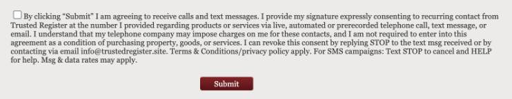

# Messaging - 10DLC Campaign Checklist

Telnyx Messaging - 10DLC Campaign Checklist. See Telnyx guidance and requirements Learn more about Messaging - 10DLC Campaign Checklist with Telnyx.

C

## 10DLC Campaign Review Checklist

When creating new campaigns, please review the following Checklist:

## Campaign Description:

* The campaign description should explain who the entity using the campaign is and what the campaign is intended for.

  + Ex: Appointment reminder and confirmation notifications for a dentist’s office to remind their patients of newly scheduled and upcoming appointments date and times.

## Message Flow:

* The Message flow must provide explicit information as to how the end user opts in to receive messaging traffic before the first message is sent.

  + If there is an opt in form on the website, please provide the link to the specific page where opt in is gathered.
  + Optional, but recommended, add in a picture (for example a publicly accessible google drive link to an uploaded image) of where the opt in happens.
  + Please include a link to the privacy policy.

    - Ex: Patient’s click “Book an appointment” on [www.example.com](http://www.example.com), then there is an sms opt in form which communicates clearly the purpose, frequency, and terms of joining this campaign. It is not required to accept sms notifications to submit the form. Screenshot of opt in: <https://imgur.com/a/4XCk7ga>. Privacy Policy which indicates no sharing or selling of PII with third parties for promotional or marketing purposes: [www.example2.com/privacy](http://www.example2.com/privacy).

## Sample Messages:

* Provide links if the link attribute for the campaign is checked off.
* Provide a variety of (up to 5) samples which characterizes the different content you would like to send using this campaign.
* Must be consistent with brand, campaign description, and website.
* Recommend to follow 160 character limit to correspond with industry best practice.

  + Ex: Upcoming Appointment: March 5, 2024 2pm w/ Dr. Crentist at 1725 Slough Avenue in Scranton, PA. Call 18005551234 to reschedule if needed.

## Website:

* Opt in forms on the website should contain the following:

  + Field for phone number
  + Checkbox
  + CTA connected to the checkbox containing the following:

    - Express Consent: “By clicking here you consent to receive messages from XXXX”
    - Explanation of terms: “Terms and Rates may apply.”
    - Links to Privacy Policy/T&C

      * Privacy Policy/T&C need to explicitly state how the end user data is used and more importantly, that it is not shared with third parties/affiliates for any marketing purposes.
    - Opt out language: “Text STOP to opt out”

## Privacy Policy:

* Needs compliant verbiage in the website’s privacy policy which prohibits the sharing of Personally Identifiable Information (specifically text opt in consent data such as phone number and name) with third parties for promotional or marketing purposes.

  + Ex: We do not sell, trade, or otherwise transfer to outside parties your personally identifiable information.

More details at <https://support.telnyx.com/en/articles/6339152-how-to-create-a-10dlc-campaign>.

---

Related Articles

[10DLC Campaign Approval Best Practices](https://support.telnyx.com/en/articles/7127078-10dlc-campaign-approval-best-practices)[10DLC Campaign Compliance Requirements](https://support.telnyx.com/en/articles/9940291-10dlc-campaign-compliance-requirements)[10DLC Carrier Error Codes Explanations](https://support.telnyx.com/en/articles/10547022-10dlc-carrier-error-codes-explanations)[Guide to 10DLC Message Flow Field](https://support.telnyx.com/en/articles/10562019-guide-to-10dlc-message-flow-field)[10DLC Privacy Policy](https://support.telnyx.com/en/articles/10645583-10dlc-privacy-policy)

Did this answer your question?

😞😐😃
