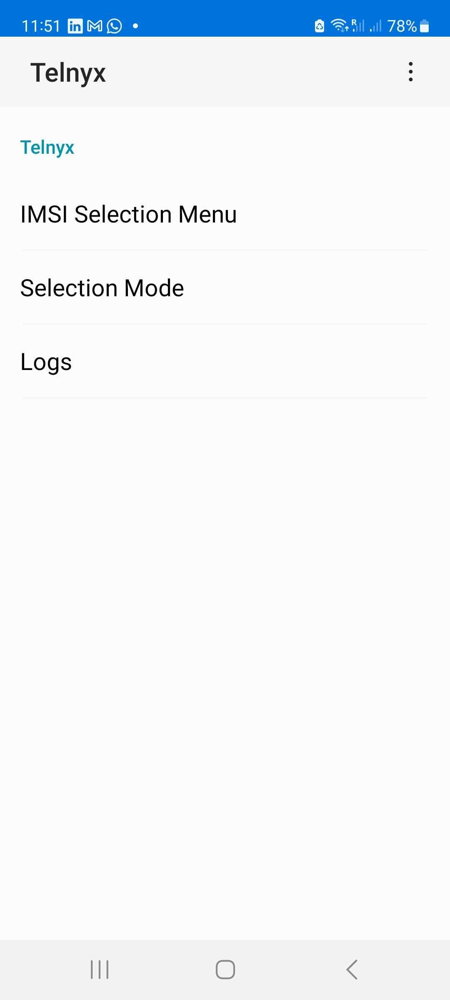

# Manual IMSI Selection on Telnyx SIM

⚠️ For engineering use only – perform only if instructed by Telnyx support. See Telnyx guidance and requirements.

This guide explains how to manually change the IMSI on a Telnyx IoT SIM using the SIM Toolkit on your device. Manual IMSI switching is intended for advanced troubleshooting and should only be used when explicitly directed by the Telnyx engineering team.

## Background

Telnyx SIM cards use Multi IMSI technology to maximise global coverage and resilience. By default, the SIM automatically selects the most appropriate IMSI (e.g. IMSI1, IMSI2, etc.) based on internal logic designed to optimize connectivity. Manual IMSI selection may be necessary in specific engineering scenarios for troubleshooting purposes.

A SIM Toolkit (STK) application is installed on the device when the Telnyx SIM is enabled. The STK displays a menu that allows the user to manually select the IMSI to use for mobile services.

---

## Changing IMSI on an Android Device

On Android devices, look for the “Telnyx” or “SIM Toolkit” app when your Telnyx SIM is active:

1. Open the **SIM Toolkit** or **Telnyx** app.
2. Click on **Roaming Services** or **Telnyx**.
3. Tap **IMSI Selection Menu** and select the desired IMSI (e.g. IMSI1, IMSI2, etc.) as instructed by Telnyx support.
4. Wait a few minutes: once the IMSI is selected, it may take a few minutes for the device to read the new IMSI and attempt to reconnect to the network.
5. Return to **Selection Mode** and switch back to **Automatic** for normal operation.

On Android devices, there will be an app called "**Telnyx UICC**" or "**SIM Toolkit**" that will appear when the Telnyx SIM is in use.

---

## Changing IMSI on an Apple (iOS) Device

On iOS devices:

1. Go to **Settings** → **Mobile Service** (or **Mobile Data**, or **Cellular**) → **SIM Applications**. (\*)
2. Tap **IMSI Selection Menu** and select the desired IMSI (e.g. IMSI1, IMSI2, etc.) as instructed by Telnyx support.
3. Wait a few minutes: once the IMSI is selected, it may take a few minutes for the device to read the new IMSI and attempt to reconnect to the network.
4. Return to **Selection Mode** and switch back to **Automatic** for normal operation.

(\*) On multi-SIM devices, make sure to select the Telnyx SIM from the list of available SIMs in order to access the SIM Toolkit (STK) associated with it.
​

---

## Engineering Tool Notice

Manual IMSI selection is strictly an engineering tool, to be used only under instruction from Telnyx support or engineering teams.

Always remember to switch back to Automatic once testing is complete (unless instructed otherwise by Telnyx support). Failure to do so may result in loss of connectivity when the device moves geographically.

---

## When to Use This

✅ **Only when:**

* Directed by Telnyx engineering for support/troubleshooting.
* Diagnosing connectivity issues with a specific IMSI.

❌ **Avoid use when:**

* Not under Telnyx instruction.
* Mobility and seamless coverage are required.

---

## Summary Checklist

|  |  |
| --- | --- |
| Step | Action |
| 1 | Open **Telnyx SIM Toolkit** (Android) or SIM Applications (iOS) |
| 2 | Select the desired IMSI via the **IMSI Selection Menu** |
| 3 | Wait a few minutes for data services |
| 4 | Switch back to **Automatic unless instructed to stay on Manual selection** |
