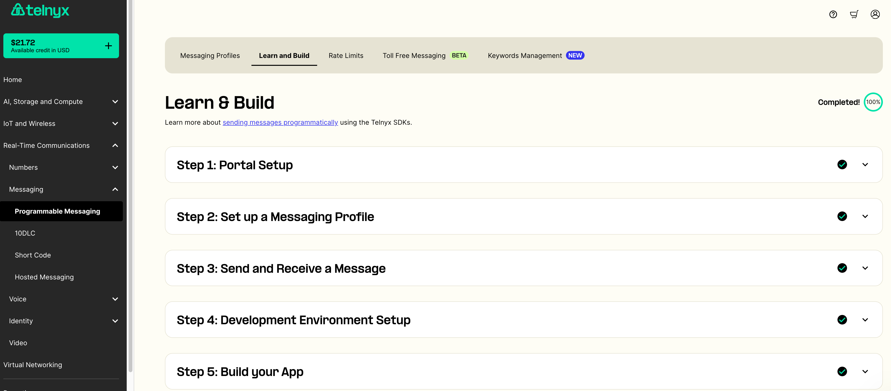
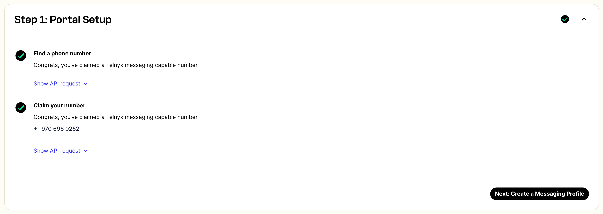
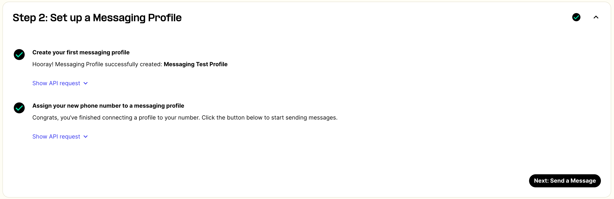
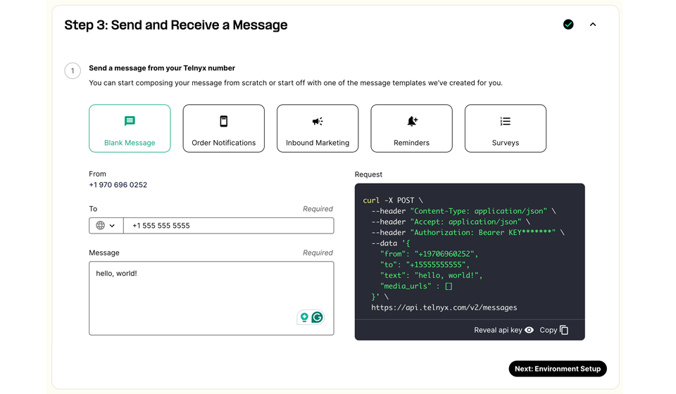
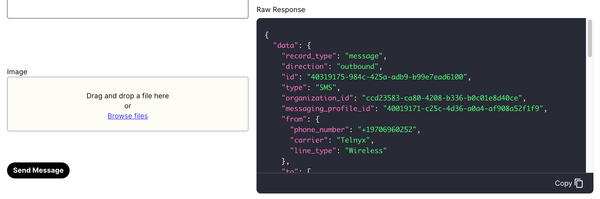
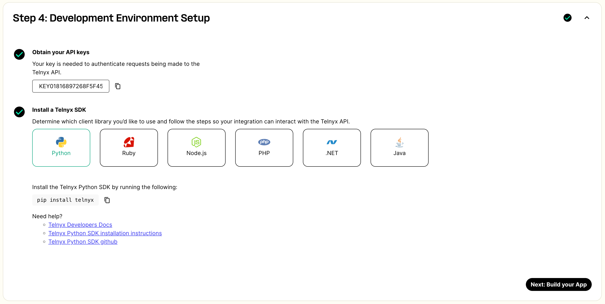
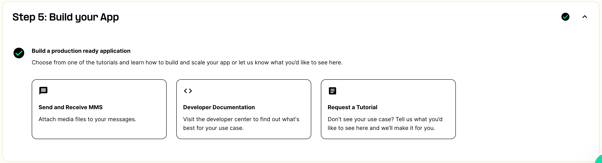

# Sending a Test Message with Learn and Build

Looking to send a test message in the Mission Control Portal? See Telnyx guidance and requirements Learn more about Sending a Test Message with Learn and Build.

Although using the Telnyx SMS API is required for you to scale your text messaging, the Learn and Build feature in the Mission Control Portal enables you to send a text message to test. Here's how:

[Log into your Mission Control Portal](https://portal.telnyx.com). Click on Programmable Messaging, under Messaging, under Real-Time Communications in the navigation menu on the left side of the portal. Then, click on the **[Learn and Build](https://portal.telnyx.com/#/programmable-messaging/learn-and-build)** tab at the top of the page.

### Step 1: Portal Setup

Before sending a test message, you need to have already:

* Found a phone number using the Telnyx Search & Buy numbers feature
* Purchased a phone number

If you haven't yet, check out our article on how to Search & Buy numbers below:

[Search & Buy Phone Numbers](https://support.telnyx.com/en/articles/4380325-search-and-buy-numbers)

### Step 2: Set up a Messaging Profile

Before sending a test message, you are required to:

* Set up a Messaging Profile
* Associate the Messaging Profile with a phone number

If you haven't done so, please check out our article on how to set up your Messaging Profile:

[Set up your Messaging Profile](https://support.telnyx.com/en/articles/3562059-setting-up-a-messaging-profile)

### Step 3: Send and Receive a Message

Once you have a phone number and a Messaging Profile, you can now send a test message.

* Compose your test message with a blank message or choose from a variety of templates (Order Notifications, Inbound Marketing, Reminders and Surveys)
* The **From** number will be the phone number you've assigned to the Messaging Profile
* Input a **To** number. We suggest using your mobile phone, so you can see the text message you sent
* If you chose **Blank Message**, type in a message in the box to send

* You can also include an image if you'd like
* Click on the **Send Message** button
* The **Raw Response** box will populate with the information from the webhook we sent to the URL you associated with your Messaging Profile.

If everything was set up properly, you should've received a text message from the phone number with the message you provided. You can also test receiving a message to your Telnyx phone number by responding to the text message on your mobile phone.

Happy with your testing? You might want to take it to the next stage and continue with steps 4 and 5:

### Step 4: Development Environment Setup

To build an application with the Telnyx SMS API, you need to:

* Obtain your API keys, which will be shown on this screen
* Install a Telnyx SDK. Choose the relevant SDK of your choice and install the SDK. We provide each option with additional support documentation to help.

### Step 5: Build your App

Choose from one of the tutorials and learn how to build and scale your app.

Can't find the use case for you? Support is available 24/7 in the Mission Control Portal. Don't hesitate to reach out! We're more than happy to help.

---

Related Articles

[Configuring Linphone with Telnyx](https://support.telnyx.com/en/articles/1130674-configuring-linphone-with-telnyx)[E911 Setup Guide](https://support.telnyx.com/en/articles/1130683-e911-setup-guide)[2FA / TOTP Setup](https://support.telnyx.com/en/articles/3739748-2fa-totp-setup)[Grandstream HT802: Telnyx Setup](https://support.telnyx.com/en/articles/5725071-grandstream-ht802-telnyx-setup)[Messaging in Mission Control](https://support.telnyx.com/en/articles/8219294-messaging-in-mission-control)

Did this answer your question?

😞😐😃
