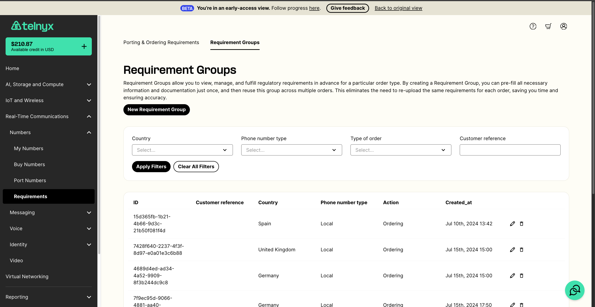
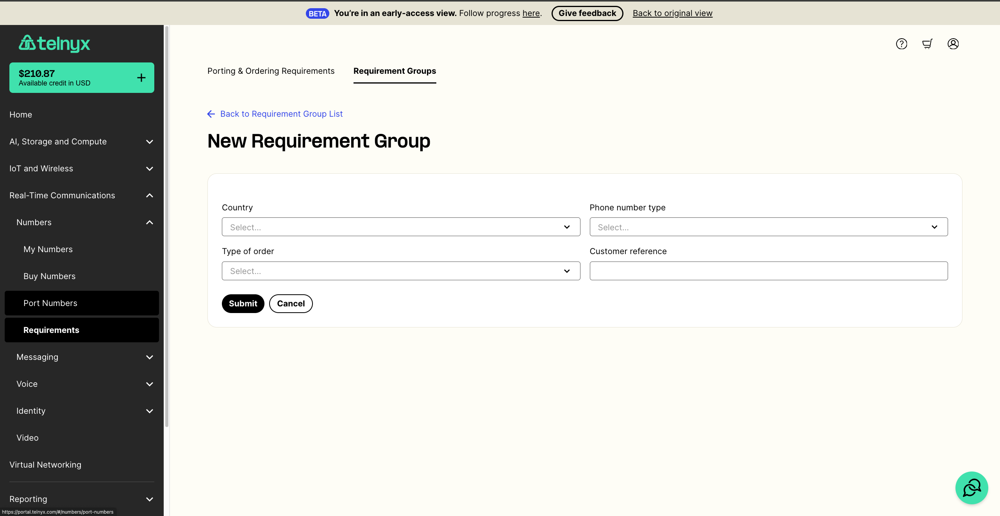
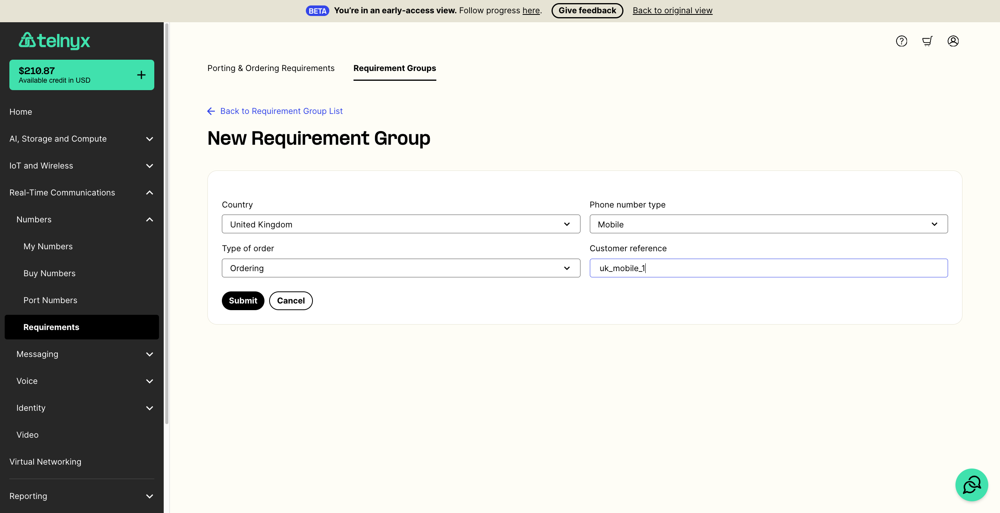
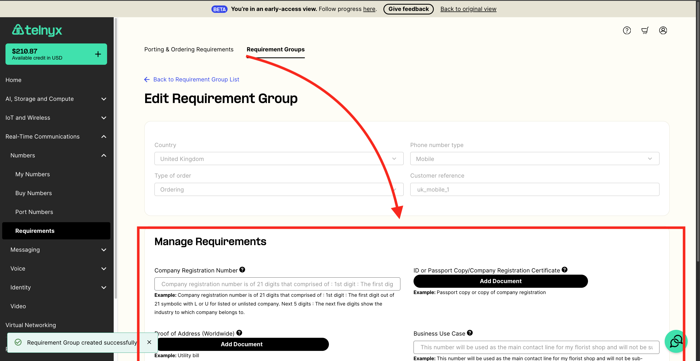
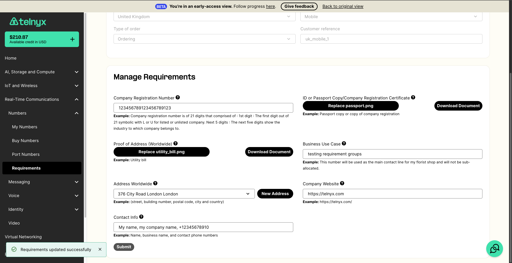
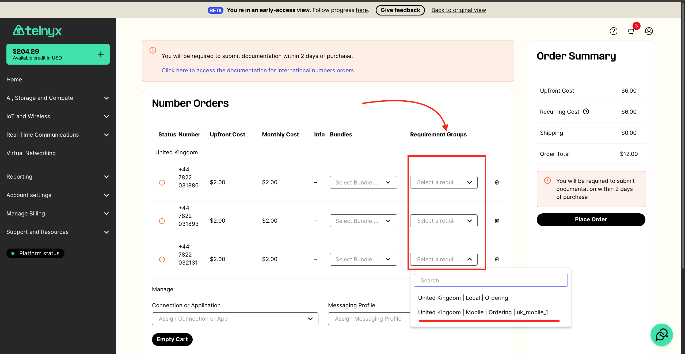
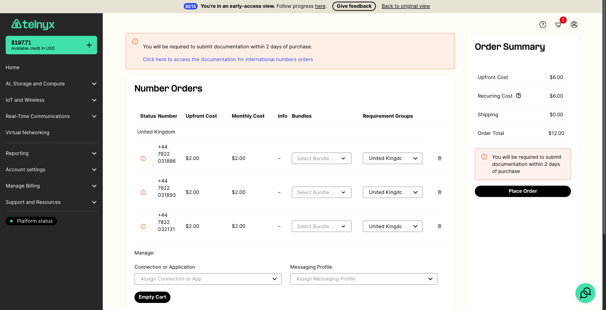
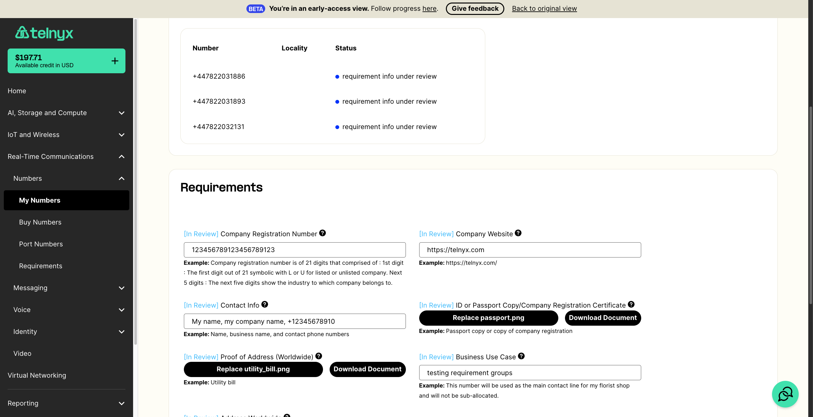

# Requirement Groups for Ordering Phone Numbers

Requirement Groups allow you to view, manage, and fulfill regulatory requirements in advance for a particular order… See Telnyx guidance and requirements.

Requirement Groups allow you to view, manage, and fulfill regulatory requirements in advance for a particular order type. By creating a Requirement Group, you can pre-fill all necessary information and documentation just once, and then reuse this group across multiple orders. This eliminates the need to re-upload the same requirements for each order, saving you time and ensuring accuracy.

Requirement Groups are optional in most countries. However, starting September 16, 2024, they will be required to order phone numbers in the following countries:

* CH (Switzerland)
* DK (Denmark)
* IT (Italy)
* NO (Norway)
* PT (Portugal)
* SE (Sweden)

This guide will walk you through how to use Requirement Groups on number orders. We also have a developer guide [here](https://developers.telnyx.com/docs/numbers/phone-numbers/requirement-groups) if you are interested in integrating with Requirement Groups.

---

## How it works:

1. Navigate to the `Requirement Groups` [page in the portal](https://portal.telnyx.com/#/numbers/requirements/requirement-groups).
   ​

   
2. Click on the `New Requirement Group` button. This will take you to a form where you can create your first requirement group.
   ​

   
3. Each Requirement Group is only valid for a particular combination of `Country`, `phone_number_type`, and `type of order`. For example a `Portugal` `local` `ordering` requirement group can only be associated with Portugal local number orders. It could not be associated with any other order.
   ​
   Please specify the country, phone number type, and order type that you would like to create a requirement group for. For this example, I know that I want to purchase UK mobile numbers, so I am going to create a `UK` `mobile` `ordering` requirement group. I am also going to add a customer reference (optional) so its easy to distinguish this requirement group from my other requirement groups.
   ​

   
4. Once the Requirement Group is created, it will show the expected requirements for the relevant order. So in this example, my Requirement Group shows the expected requirements for a `UK` `mobile` number order.
   ​

   
5. Fill out all of the requirements and click `Submit`.
   ​

   
6. Go to the `Buy Numbers` page ([here](https://portal.telnyx.com/#/numbers/buy-numbers)) and order the phone number(s) that match the Requirement Group you just created. Add the phone number(s) you would like to purchase to your cart.
   ​
   So in this example, I will search and add 3 `UK` `mobile` phone numbers to my cart.
   ​
7. In the cart, there is a `Requirement Groups` column in the phone number table. For each phone number in your cart, select the appropriate Requirement Group.
   ​

   

   In this example, I am selecting the `United Kingdom | mobile | Ordering | uk_mobile_1` requirement group for each of my phone numbers. Since that is the Requirement Group I created in steps 3-5 previously.
   ​

   
8. Place your order.
   ​
9. If you view your order, you will see that the requirements from the Requirement Group were automatically added to your order. At which point, your order will be under review by our Operations team.
   ​

   

   ​

And that's all there is to it! You can re-use each Requirement Group for as many orders as you would like (assuming it is the correct country + phone number type).

---

Related Articles

[Australia DID Requirements](https://support.telnyx.com/en/articles/3505912-australia-did-requirements)[Portugal DID Requirements](https://support.telnyx.com/en/articles/5466980-portugal-did-requirements)[International Number Requirements Tool](https://support.telnyx.com/en/articles/7003167-international-number-requirements-tool)[Zambia DID Requirements](https://support.telnyx.com/en/articles/10058901-zambia-did-requirements)[Phone Number Ordering Restrictions](https://support.telnyx.com/en/articles/10715715-phone-number-ordering-restrictions)

Did this answer your question?

😞😐😃
