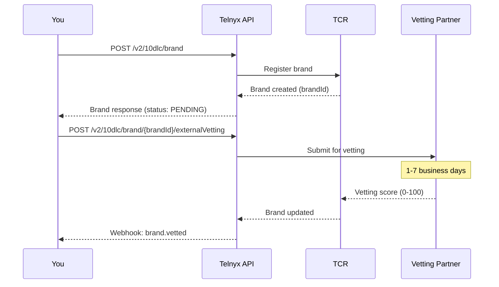

# 10DLC Brand Registration

Complete guide to registering your business as a 10DLC brand with Telnyx, including entity types, vetting scores, rejection troubleshooting, and SDK examples.

A **brand** is your registered business identity in the 10DLC ecosystem. Before you can create messaging campaigns or send A2P messages on US long codes, you must register your brand with [The Campaign Registry (TCR)](https://www.campaignregistry.com/) through the Telnyx API. Your brand's **vetting score** directly determines your messaging throughput limits.

## Prerequisites

* A [Telnyx account](https://telnyx.com/sign-up) with API access
* Your [API key](https://portal.telnyx.com/#/app/api-keys)
* Business information: legal name, EIN/Tax ID, address, phone, email, website

> **Note:** For **Sole Proprietor** registration (individuals without an EIN), see the [Sole Proprietor guide](sole-proprietor-10dlc-registration.md). This guide covers standard business brand registration.

***

## Brand entity types

TCR supports several entity types. Choose the one that matches your business structure:

| Entity Type        | API Value         | Description                         | Vetting Required |
| ------------------ | ----------------- | ----------------------------------- | ---------------- |
| Private for-profit | `PRIVATE_PROFIT`  | Private companies (LLC, Inc, etc.)  | Yes              |
| Public for-profit  | `PUBLIC_PROFIT`   | Publicly traded companies           | Yes              |
| Non-profit         | `NON_PROFIT`      | 501(c)(3) or equivalent             | Yes              |
| Government         | `GOVERNMENT`      | Federal, state, or local government | Yes              |
| Sole Proprietor    | `SOLE_PROPRIETOR` | Individuals without EIN             | OTP only         |

> **Warning:** Sole Proprietor brands have significant limitations: 1 campaign, 1 phone number, low throughput. Use standard registration if your business has an EIN.

***

## Registration flow



***

## Step 1: Create a brand

Register your business identity by providing company details, contact information, and entity type.

### Required fields

| Field         | Type   | Description                                                   |
| ------------- | ------ | ------------------------------------------------------------- |
| `entityType`  | string | Business entity type (see table above)                        |
| `displayName` | string | Brand display name (shown to carriers)                        |
| `companyName` | string | Legal company name (must match EIN records)                   |
| `ein`         | string | Federal Tax ID / EIN (format: `XX-XXXXXXX`)                   |
| `phone`       | string | Business phone in E.164 format                                |
| `street`      | string | Business street address                                       |
| `city`        | string | City                                                          |
| `state`       | string | State (2-letter abbreviation)                                 |
| `postalCode`  | string | ZIP code                                                      |
| `country`     | string | Country code (`US` or `CA`)                                   |
| `email`       | string | Business contact email                                        |
| `website`     | string | Business website URL                                          |
| `vertical`    | string | Industry vertical (see [verticals list](#industry-verticals)) |

### Optional fields

| Field               | Type   | Description                                      |
| ------------------- | ------ | ------------------------------------------------ |
| `altBusinessId`     | string | Alternative business ID (DUNS, GIIN, LEI)        |
| `altBusinessIdType` | string | Type of alternative ID: `DUNS`, `GIIN`, or `LEI` |
| `stockSymbol`       | string | Stock ticker (required for `PUBLIC_PROFIT`)      |
| `stockExchange`     | string | Exchange: `NYSE`, `NASDAQ`, `AMEX`, etc.         |

  ```bash
  curl -X POST https://api.telnyx.com/v2/10dlc/brand \
    -H "Content-Type: application/json" \
    -H "Authorization: Bearer YOUR_API_KEY" \
    -d '{
      "entityType": "PRIVATE_PROFIT",
      "displayName": "Acme Corp",
      "companyName": "Acme Corporation",
      "ein": "12-3456789",
      "phone": "+15551234567",
      "street": "123 Main St",
      "city": "New York",
      "state": "NY",
      "postalCode": "10001",
      "country": "US",
      "email": "admin@acmecorp.com",
      "website": "https://acmecorp.com",
      "vertical": "TECHNOLOGY"
    }'
  ```

  ```python
  import os
  import requests

  API_KEY = os.environ.get("TELNYX_API_KEY")
  headers = {
      "Authorization": f"Bearer {API_KEY}",
      "Content-Type": "application/json",
  }

  brand_data = {
      "entityType": "PRIVATE_PROFIT",
      "displayName": "Acme Corp",
      "companyName": "Acme Corporation",
      "ein": "12-3456789",
      "phone": "+15551234567",
      "street": "123 Main St",
      "city": "New York",
      "state": "NY",
      "postalCode": "10001",
      "country": "US",
      "email": "admin@acmecorp.com",
      "website": "https://acmecorp.com",
      "vertical": "TECHNOLOGY",
  }

  response = requests.post(
      "https://api.telnyx.com/v2/10dlc/brand",
      headers=headers,
      json=brand_data,
  )
  brand = response.json()
  brand_id = brand["data"]["brandId"]
  print(f"Brand created: {brand_id}")
  print(f"Status: {brand['data']['identityStatus']}")
  ```

  ```javascript
  const axios = require('axios');

  const API_KEY = process.env.TELNYX_API_KEY;
  const headers = {
    Authorization: `Bearer ${API_KEY}`,
    'Content-Type': 'application/json',
  };

  const brandData = {
    entityType: 'PRIVATE_PROFIT',
    displayName: 'Acme Corp',
    companyName: 'Acme Corporation',
    ein: '12-3456789',
    phone: '+15551234567',
    street: '123 Main St',
    city: 'New York',
    state: 'NY',
    postalCode: '10001',
    country: 'US',
    email: 'admin@acmecorp.com',
    website: 'https://acmecorp.com',
    vertical: 'TECHNOLOGY',
  };

  const { data: brand } = await axios.post(
    'https://api.telnyx.com/v2/10dlc/brand',
    brandData,
    { headers }
  );
  console.log(`Brand created: ${brand.data.brandId}`);
  console.log(`Status: ${brand.data.identityStatus}`);
  ```

  ```ruby
  require "net/http"
  require "json"
  require "uri"

  uri = URI("https://api.telnyx.com/v2/10dlc/brand")
  http = Net::HTTP.new(uri.host, uri.port)
  http.use_ssl = true

  request = Net::HTTP::Post.new(uri)
  request["Authorization"] = "Bearer #{ENV['TELNYX_API_KEY']}"
  request["Content-Type"] = "application/json"
  request.body = {
    entityType: "PRIVATE_PROFIT",
    displayName: "Acme Corp",
    companyName: "Acme Corporation",
    ein: "12-3456789",
    phone: "+15551234567",
    street: "123 Main St",
    city: "New York",
    state: "NY",
    postalCode: "10001",
    country: "US",
    email: "admin@acmecorp.com",
    website: "https://acmecorp.com",
    vertical: "TECHNOLOGY"
  }.to_json

  response = http.request(request)
  brand = JSON.parse(response.body)
  puts "Brand created: #{brand['data']['brandId']}"
  puts "Status: #{brand['data']['identityStatus']}"
  ```

  ```java
  import java.net.http.*;
  import java.net.URI;

  String apiKey = System.getenv("TELNYX_API_KEY");
  String body = """
    {
      "entityType": "PRIVATE_PROFIT",
      "displayName": "Acme Corp",
      "companyName": "Acme Corporation",
      "ein": "12-3456789",
      "phone": "+15551234567",
      "street": "123 Main St",
      "city": "New York",
      "state": "NY",
      "postalCode": "10001",
      "country": "US",
      "email": "admin@acmecorp.com",
      "website": "https://acmecorp.com",
      "vertical": "TECHNOLOGY"
    }
    """;

  HttpRequest request = HttpRequest.newBuilder()
      .uri(URI.create("https://api.telnyx.com/v2/10dlc/brand"))
      .header("Authorization", "Bearer " + apiKey)
      .header("Content-Type", "application/json")
      .POST(HttpRequest.BodyPublishers.ofString(body))
      .build();

  HttpClient client = HttpClient.newHttpClient();
  HttpResponse response = client.send(request, HttpResponse.BodyHandlers.ofString());
  System.out.println("Brand response: " + response.body());
  ```

  ```csharp .NET theme={null}
  using System.Net.Http.Headers;
  using System.Text;
  using System.Text.Json;

  var apiKey = Environment.GetEnvironmentVariable("TELNYX_API_KEY");
  var client = new HttpClient();
  client.DefaultRequestHeaders.Authorization =
      new AuthenticationHeaderValue("Bearer", apiKey);

  var brandData = new
  {
      entityType = "PRIVATE_PROFIT",
      displayName = "Acme Corp",
      companyName = "Acme Corporation",
      ein = "12-3456789",
      phone = "+15551234567",
      street = "123 Main St",
      city = "New York",
      state = "NY",
      postalCode = "10001",
      country = "US",
      email = "admin@acmecorp.com",
      website = "https://acmecorp.com",
      vertical = "TECHNOLOGY"
  };

  var content = new StringContent(
      JsonSerializer.Serialize(brandData),
      Encoding.UTF8,
      "application/json"
  );

  var response = await client.PostAsync(
      "https://api.telnyx.com/v2/10dlc/brand", content
  );
  var result = await response.Content.ReadAsStringAsync();
  Console.WriteLine($"Brand response: {result}");
  ```

  ```php
  <?php
  $apiKey = getenv('TELNYX_API_KEY');

  $brandData = [
      'entityType'  => 'PRIVATE_PROFIT',
      'displayName' => 'Acme Corp',
      'companyName'  => 'Acme Corporation',
      'ein'          => '12-3456789',
      'phone'        => '+15551234567',
      'street'       => '123 Main St',
      'city'         => 'New York',
      'state'        => 'NY',
      'postalCode'   => '10001',
      'country'      => 'US',
      'email'        => 'admin@acmecorp.com',
      'website'      => 'https://acmecorp.com',
      'vertical'     => 'TECHNOLOGY',
  ];

  $ch = curl_init('https://api.telnyx.com/v2/10dlc/brand');
  curl_setopt_array($ch, [
      CURLOPT_RETURNTRANSFER => true,
      CURLOPT_POST           => true,
      CURLOPT_HTTPHEADER     => [
          "Authorization: Bearer {$apiKey}",
          'Content-Type: application/json',
      ],
      CURLOPT_POSTFIELDS => json_encode($brandData),
  ]);

  $response = curl_exec($ch);
  curl_close($ch);

  $brand = json_decode($response, true);
  echo "Brand created: " . $brand['data']['brandId'] . "\n";
  echo "Status: " . $brand['data']['identityStatus'] . "\n";
  ```

  ```go
  package main

  import (
  	"bytes"
  	"encoding/json"
  	"fmt"
  	"io"
  	"net/http"
  	"os"
  )

  func main() {
  	brandData := map[string]string{
  		"entityType":  "PRIVATE_PROFIT",
  		"displayName": "Acme Corp",
  		"companyName":  "Acme Corporation",
  		"ein":          "12-3456789",
  		"phone":        "+15551234567",
  		"street":       "123 Main St",
  		"city":         "New York",
  		"state":        "NY",
  		"postalCode":   "10001",
  		"country":      "US",
  		"email":        "admin@acmecorp.com",
  		"website":      "https://acmecorp.com",
  		"vertical":     "TECHNOLOGY",
  	}

  	body, _ := json.Marshal(brandData)
  	req, _ := http.NewRequest("POST", "https://api.telnyx.com/v2/10dlc/brand", bytes.NewBuffer(body))
  	req.Header.Set("Authorization", "Bearer "+os.Getenv("TELNYX_API_KEY"))
  	req.Header.Set("Content-Type", "application/json")

  	resp, err := http.DefaultClient.Do(req)
  	if err != nil {
  		fmt.Printf("Error: %v\n", err)
  		return
  	}
  	defer resp.Body.Close()

  	result, _ := io.ReadAll(resp.Body)
  	fmt.Printf("Brand response: %s\n", result)
  }
  ```

### Brand creation response

```json theme={null}
{
  "data": {
    "brandId": "BXXXXXX",
    "entityType": "PRIVATE_PROFIT",
    "displayName": "Acme Corp",
    "companyName": "Acme Corporation",
    "ein": "12-3456789",
    "identityStatus": "VERIFIED",
    "cspId": "TELNYX",
    "brandRelationship": "BASIC_ACCOUNT",
    "vertical": "TECHNOLOGY",
    "phone": "+15551234567",
    "email": "admin@acmecorp.com",
    "website": "https://acmecorp.com",
    "country": "US",
    "state": "NY",
    "city": "New York",
    "street": "123 Main St",
    "postalCode": "10001"
  }
}
```

***

## Step 2: Retrieve brand details

After creation, check your brand status and details:

  ```bash
  curl -X GET https://api.telnyx.com/v2/10dlc/brand/BXXXXXX \
    -H "Authorization: Bearer YOUR_API_KEY"
  ```

  ```python
  response = requests.get(
      f"https://api.telnyx.com/v2/10dlc/brand/{brand_id}",
      headers=headers,
  )
  brand_details = response.json()
  print(f"Identity status: {brand_details['data']['identityStatus']}")
  ```

  ```javascript
  const { data: details } = await axios.get(
    `https://api.telnyx.com/v2/10dlc/brand/${brandId}`,
    { headers }
  );
  console.log(`Identity status: ${details.data.identityStatus}`);
  ```

  ```ruby
  uri = URI("https://api.telnyx.com/v2/10dlc/brand/#{brand_id}")
  request = Net::HTTP::Get.new(uri)
  request["Authorization"] = "Bearer #{ENV['TELNYX_API_KEY']}"

  response = http.request(request)
  details = JSON.parse(response.body)
  puts "Identity status: #{details['data']['identityStatus']}"
  ```

### Brand statuses

| Status            | Meaning                                                                          |
| ----------------- | -------------------------------------------------------------------------------- |
| `SELF_DECLARED`   | Brand created, not yet verified                                                  |
| `VERIFIED`        | Identity verified by TCR                                                         |
| `VETTED_VERIFIED` | Third-party vetting completed                                                    |
| `UNVERIFIED`      | Verification failed — see [troubleshooting](#common-rejection-reasons-and-fixes) |

***

## Step 3: Submit for external vetting

Vetting is performed by a third-party partner (e.g., Campaign Verify) and produces a **trust score from 0 to 100** that directly impacts your messaging throughput.

  ```bash
  curl -X POST https://api.telnyx.com/v2/10dlc/brand/BXXXXXX/externalVetting \
    -H "Content-Type: application/json" \
    -H "Authorization: Bearer YOUR_API_KEY" \
    -d '{
      "evpId": "AEGIS",
      "vettingClass": "STANDARD"
    }'
  ```

  ```python
  vetting_response = requests.post(
      f"https://api.telnyx.com/v2/10dlc/brand/{brand_id}/externalVetting",
      headers=headers,
      json={
          "evpId": "AEGIS",
          "vettingClass": "STANDARD",
      },
  )
  print(f"Vetting submitted: {vetting_response.json()}")
  ```

  ```javascript
  const { data: vetting } = await axios.post(
    `https://api.telnyx.com/v2/10dlc/brand/${brandId}/externalVetting`,
    { evpId: 'AEGIS', vettingClass: 'STANDARD' },
    { headers }
  );
  console.log('Vetting submitted:', vetting);
  ```

  ```ruby
  uri = URI("https://api.telnyx.com/v2/10dlc/brand/#{brand_id}/externalVetting")
  request = Net::HTTP::Post.new(uri)
  request["Authorization"] = "Bearer #{ENV['TELNYX_API_KEY']}"
  request["Content-Type"] = "application/json"
  request.body = { evpId: "AEGIS", vettingClass: "STANDARD" }.to_json

  response = http.request(request)
  puts "Vetting submitted: #{response.body}"
  ```

### Vetting classes

| Class      | Cost   | Use Case                             |
| ---------- | ------ | ------------------------------------ |
| `STANDARD` | \~\$4  | Default for most brands              |
| `ENHANCED` | \~\$40 | Higher trust scores, faster approval |

### Vetting score impact on throughput

Your vetting score directly controls your carrier-specific throughput. See the [10DLC Rate Limits guide](10dlc-rate-limits-throughput.md) for detailed carrier tables.

| Score Range | T-Mobile Throughput | AT\&T Throughput | Category   |
| ----------- | ------------------- | ---------------- | ---------- |
| 0–24        | 2,000/day           | 1 MPS            | Low        |
| 25–49       | 10,000/day          | 4 MPS            | Medium-Low |
| 50–74       | 50,000/day          | 10 MPS           | Medium     |
| 75–89       | 100,000/day         | 25 MPS           | High       |
| 90–100      | 200,000+/day        | 75 MPS           | Highest    |

> **Warning:** Without vetting, brands default to the **lowest throughput tier**. Always submit for vetting before creating campaigns.

***

## Step 4: Check vetting results

Vetting typically takes **1–7 business days**. You can poll or use webhooks to check the result.

  ```bash
  # List external vettings for a brand
  curl -X GET https://api.telnyx.com/v2/10dlc/brand/BXXXXXX/externalVetting \
    -H "Authorization: Bearer YOUR_API_KEY"
  ```

  ```python
  response = requests.get(
      f"https://api.telnyx.com/v2/10dlc/brand/{brand_id}/externalVetting",
      headers=headers,
  )
  vettings = response.json()
  for v in vettings.get("data", []):
      print(f"Score: {v.get('vettingScore')} | Status: {v.get('vettingStatus')}")
  ```

  ```javascript
  const { data: vettings } = await axios.get(
    `https://api.telnyx.com/v2/10dlc/brand/${brandId}/externalVetting`,
    { headers }
  );
  vettings.data.forEach(v => {
    console.log(`Score: ${v.vettingScore} | Status: ${v.vettingStatus}`);
  });
  ```

***

## Step 5: Update a brand

If your brand details change (address, phone, etc.), update them via the API:

  ```bash
  curl -X PUT https://api.telnyx.com/v2/10dlc/brand/BXXXXXX \
    -H "Content-Type: application/json" \
    -H "Authorization: Bearer YOUR_API_KEY" \
    -d '{
      "phone": "+15559876543",
      "email": "newemail@acmecorp.com",
      "website": "https://www.acmecorp.com"
    }'
  ```

  ```python
  response = requests.put(
      f"https://api.telnyx.com/v2/10dlc/brand/{brand_id}",
      headers=headers,
      json={
          "phone": "+15559876543",
          "email": "newemail@acmecorp.com",
          "website": "https://www.acmecorp.com",
      },
  )
  print(f"Brand updated: {response.json()['data']['brandId']}")
  ```

  ```javascript
  const { data: updated } = await axios.put(
    `https://api.telnyx.com/v2/10dlc/brand/${brandId}`,
    {
      phone: '+15559876543',
      email: 'newemail@acmecorp.com',
      website: 'https://www.acmecorp.com',
    },
    { headers }
  );
  console.log(`Brand updated: ${updated.data.brandId}`);
  ```

> **Note:** Updating certain fields (company name, EIN) may trigger re-verification. Contact support if you need to change core identity fields.

***

## List all brands

Retrieve all registered brands on your account:

  ```bash
  curl -X GET "https://api.telnyx.com/v2/10dlc/brand?page[size]=25" \
    -H "Authorization: Bearer YOUR_API_KEY"
  ```

  ```python
  response = requests.get(
      "https://api.telnyx.com/v2/10dlc/brand",
      headers=headers,
      params={"page[size]": 25},
  )
  brands = response.json()
  for b in brands.get("data", []):
      print(f"{b['brandId']}: {b['displayName']} ({b['identityStatus']})")
  ```

  ```javascript
  const { data: brands } = await axios.get(
    'https://api.telnyx.com/v2/10dlc/brand',
    { headers, params: { 'page[size]': 25 } }
  );
  brands.data.forEach(b => {
    console.log(`${b.brandId}: ${b.displayName} (${b.identityStatus})`);
  });
  ```

***

## Common rejection reasons and fixes

**EIN mismatch — company name doesn't match IRS records**

    **Cause:** The `companyName` field doesn't match what the IRS has on file for that EIN.

    **Fix:** Use your exact legal name as registered with the IRS. Check your EIN confirmation letter (CP 575) or search the [IRS tax-exempt organization database](https://www.irs.gov/charities-non-profits/tax-exempt-organization-search) for non-profits.

---

**Invalid EIN format**

    **Cause:** EIN must be in `XX-XXXXXXX` format (9 digits with a hyphen after the first 2).

    **Fix:** Double-check your EIN. It should look like `12-3456789`. Don't include spaces or extra characters.

---

**Website not accessible or doesn't match business**

    **Cause:** The vetting partner couldn't access your website, or the website content doesn't match the registered business.

    **Fix:** Ensure your website is live, publicly accessible (no authentication required), and has content that clearly identifies your business. The domain should ideally match your business email domain.

---

**Phone number not valid or not reachable**

    **Cause:** The business phone number provided is not a valid, reachable US/CA number.

    **Fix:** Provide a working business phone number in E.164 format (e.g., `+15551234567`). The number should be answerable during business hours.

---

**Address verification failed**

    **Cause:** The provided address doesn't match USPS records or can't be verified.

    **Fix:** Use your exact business address as registered. Verify it through [USPS address lookup](https://tools.usps.com/zip-code-lookup.htm).

---

**Duplicate brand — EIN already registered**

    **Cause:** A brand with this EIN is already registered (possibly by another CSP or a previous registration).

    **Fix:** You can only have one brand per EIN. If you previously registered through another provider, you may need to import or transfer the brand. Contact [Telnyx support](https://support.telnyx.com/) for assistance.

---

***

## Appeal process

If your brand is rejected or receives a low vetting score, you can appeal:

1. **Review the rejection reason**

    Check the brand's `identityStatus` and any associated error messages via the API or [Mission Control Portal](https://portal.telnyx.com/#/app/messaging/10dlc/brands).

2. **Fix the identified issues**

    Update your brand information to address the specific rejection reason using the [update brand API](#step-5-update-a-brand).

3. **Re-submit for vetting**

    After updating your brand, submit a new external vetting request. Each vetting submission incurs a fee.

4. **Contact support if needed**

    For complex cases (EIN transfers, duplicate brands, identity disputes), contact [Telnyx support](https://support.telnyx.com/) with your `brandId` and details.

> **Note:** Re-vetting after fixing issues often results in a higher score. The most common improvement is ensuring your website, company name, and EIN all align.

***

## Industry verticals

When creating a brand, specify your industry using one of these vertical values:

| Vertical              | API Value         |
| --------------------- | ----------------- |
| Professional Services | `PROFESSIONAL`    |
| Real Estate           | `REAL_ESTATE`     |
| Healthcare            | `HEALTHCARE`      |
| Human Resources       | `HUMAN_RESOURCES` |
| Energy                | `ENERGY`          |
| Entertainment         | `ENTERTAINMENT`   |
| Retail                | `RETAIL`          |
| Transportation        | `TRANSPORTATION`  |
| Agriculture           | `AGRICULTURE`     |
| Insurance             | `INSURANCE`       |
| Postal                | `POSTAL`          |
| Education             | `EDUCATION`       |
| Hospitality           | `HOSPITALITY`     |
| Financial             | `FINANCIAL`       |
| Political             | `POLITICAL`       |
| Gambling              | `GAMBLING`        |
| Legal                 | `LEGAL`           |
| Construction          | `CONSTRUCTION`    |
| NGO                   | `NGO`             |
| Manufacturing         | `MANUFACTURING`   |
| Government            | `GOVERNMENT`      |
| Technology            | `TECHNOLOGY`      |
| Communication         | `COMMUNICATION`   |

***

## Webhook notifications

Telnyx sends webhooks for brand lifecycle events. Configure your webhook URL on your [messaging profile](../concepts/messaging-profiles-overview.md) or via the API.

| Event           | Description                                 |
| --------------- | ------------------------------------------- |
| `brand.created` | Brand successfully registered with TCR      |
| `brand.updated` | Brand details updated                       |
| `brand.vetted`  | External vetting completed (includes score) |
| `brand.deleted` | Brand deleted                               |

See [10DLC Event Notifications](10dlc-event-notifications.md) for payload examples and webhook handling.

***

## Next steps

  - [Create a Campaign](../tutorial/getting-started-with-10dlc.md#step-3-create-a-campaign) — Register your messaging use case after your brand is vetted.

  - [10DLC Rate Limits](10dlc-rate-limits-throughput.md) — Understand how your vetting score impacts throughput.

  - [Sole Proprietor](sole-proprietor-10dlc-registration.md) — Registration guide for individuals without an EIN.

  - [Event Notifications](10dlc-event-notifications.md) — Track brand and campaign lifecycle via webhooks.


## Related Pages

- [10DLC Campaign Registration](../runbooks/10dlc-campaign-registration.md)
- [Sole Proprietor 10DLC Registration](../runbooks/sole-proprietor-10dlc-registration.md)
