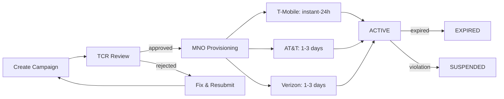

# 10DLC Campaign Registration

Register your 10DLC campaign with TCR, choose the right use case type, write sample messages that pass carrier review, and handle rejections programmatically.

A 10DLC campaign defines your messaging use case — what you're sending, who you're sending to, and how recipients opted in. Every campaign must be registered with The Campaign Registry (TCR) and approved by mobile carriers before you can send messages at scale.

This guide walks you through creating campaigns via API and Portal, choosing the right use case, writing sample messages that pass carrier review, and handling rejections.



  **Prerequisites:** You need an approved [brand](../tutorial/getting-started-with-10dlc.md#step-1-create-a-brand) before creating campaigns. Your brand's vetting score affects campaign throughput — see [10DLC Rate Limits](10dlc-rate-limits-throughput.md).

## Campaign use case types

Choose the use case that best describes your messaging. Carriers review this against your sample messages, so accuracy matters.

### Standard use cases

| Use Case                | Description                          | Example                                                  |
| ----------------------- | ------------------------------------ | -------------------------------------------------------- |
| `CUSTOMER_CARE`         | Support and service messages         | "Your ticket #4521 has been updated. View details at..." |
| `DELIVERY_NOTIFICATION` | Order and shipping updates           | "Your package shipped! Tracking: 1Z999..."               |
| `ACCOUNT_NOTIFICATION`  | Account alerts and changes           | "Your password was changed. If this wasn't you, call..." |
| `MARKETING`             | Promotional content                  | "Summer sale! 30% off all items this weekend..."         |
| `2FA`                   | Two-factor authentication codes      | "Your verification code is 847291. Expires in 10 min."   |
| `SECURITY_ALERT`        | Security-related notifications       | "New login detected from Chrome on Windows..."           |
| `POLLING_VOTING`        | Surveys and polls                    | "How was your experience? Reply 1-5."                    |
| `CHARITY`               | Nonprofit fundraising and awareness  | "Thanks for supporting Habitat! Text DONATE for..."      |
| `POLITICAL`             | Political campaigns and advocacy     | "Reminder: Vote on Nov 5th. Find your polling place..."  |
| `MIXED`                 | Multiple message types (most common) | Combination of the above                                 |

### Special use cases

| Use Case            | Description                           | Requirements                                                             |
| ------------------- | ------------------------------------- | ------------------------------------------------------------------------ |
| `LOW_VOLUME`        | Under 6,000 messages/month            | Simplified registration                                                  |
| `SOLE_PROPRIETOR`   | Individual/small business without EIN | See [Sole Proprietor](sole-proprietor-10dlc-registration.md) guide |
| `EMERGENCY`         | Life-threatening alerts               | Must demonstrate emergency nature                                        |
| `AGENTS_FRANCHISES` | ISVs sending on behalf of clients     | Additional compliance requirements                                       |
| `SWEEPSTAKES`       | Contests and giveaways                | Must include rules and terms                                             |

> **Warning:** **Choose carefully.** Changing a campaign's use case after registration requires creating a new campaign. Carriers reject campaigns where sample messages don't match the declared use case.

***

## Create a campaign

### API

    ### Required fields

    | Field            | Type   | Description                             |
    | ---------------- | ------ | --------------------------------------- |
    | `brandId`        | string | Your registered brand ID                |
    | `usecase`        | string | Use case type (see table above)         |
    | `description`    | string | What your campaign does (2-4 sentences) |
    | `sample1`        | string | First sample message                    |
    | `sample2`        | string | Second sample message                   |
    | `messageFlow`    | string | How users opt in to receive messages    |
    | `helpMessage`    | string | Response to HELP keyword                |
    | `optinKeywords`  | string | Comma-separated opt-in keywords         |
    | `optoutKeywords` | string | Comma-separated opt-out keywords        |
    | `helpKeywords`   | string | Comma-separated help keywords           |

    ### Optional fields

    | Field              | Type    | Default | Description                        |
    | ------------------ | ------- | ------- | ---------------------------------- |
    | `embeddedLink`     | boolean | `false` | Messages contain URLs              |
    | `embeddedPhone`    | boolean | `false` | Messages contain phone numbers     |
    | `numberPool`       | boolean | `false` | Using number pool for sending      |
    | `ageGated`         | boolean | `false` | Content requires age verification  |
    | `directLending`    | boolean | `false` | Related to direct lending          |
    | `subscriberOptin`  | boolean | `true`  | Subscribers have opted in          |
    | `subscriberOptout` | boolean | `true`  | Subscribers can opt out            |
    | `subscriberHelp`   | boolean | `true`  | Help keyword is supported          |
    | `sample3`          | string  | —       | Third sample message (recommended) |
    | `sample4`          | string  | —       | Fourth sample message              |
    | `sample5`          | string  | —       | Fifth sample message               |

      ```bash
      curl -X POST https://api.telnyx.com/v2/10dlc/campaignBuilder \
        -H "Content-Type: application/json" \
        -H "Authorization: Bearer YOUR_API_KEY" \
        -d '{
          "brandId": "BRAND_ID",
          "usecase": "DELIVERY_NOTIFICATION",
          "description": "Order confirmation and delivery status updates for e-commerce customers who purchase through our website.",
          "sample1": "Hi {{name}}, your order #{{orderId}} has been confirmed! Estimated delivery: {{date}}. Track at https://acme.com/track/{{orderId}} Reply STOP to opt out.",
          "sample2": "Great news! Your package is out for delivery and should arrive by 5 PM today. Driver: {{driverName}}. Reply STOP to unsubscribe.",
          "sample3": "Your order #{{orderId}} has been delivered to your front door. Rate your experience: https://acme.com/review/{{orderId}}",
          "messageFlow": "Customers opt in at checkout by checking a consent box that reads: I agree to receive order updates via SMS. Frequency varies. Msg & data rates may apply.",
          "helpMessage": "Acme Corp order updates. For help, visit https://acme.com/support or call +15551234567. Reply STOP to cancel.",
          "optinKeywords": "START, YES, SUBSCRIBE",
          "optoutKeywords": "STOP, UNSUBSCRIBE, CANCEL, QUIT",
          "helpKeywords": "HELP, INFO",
          "embeddedLink": true,
          "numberPool": false,
          "ageGated": false
        }'
      ```

      ```python
      import os
      import requests

      API_KEY = os.environ.get("TELNYX_API_KEY")
      headers = {
          "Authorization": f"Bearer {API_KEY}",
          "Content-Type": "application/json",
      }

      campaign_data = {
          "brandId": "BRAND_ID",
          "usecase": "DELIVERY_NOTIFICATION",
          "description": (
              "Order confirmation and delivery status updates for "
              "e-commerce customers who purchase through our website."
          ),
          "sample1": (
              "Hi {{name}}, your order #{{orderId}} has been confirmed! "
              "Estimated delivery: {{date}}. Track at "
              "https://acme.com/track/{{orderId}} Reply STOP to opt out."
          ),
          "sample2": (
              "Great news! Your package is out for delivery and should "
              "arrive by 5 PM today. Reply STOP to unsubscribe."
          ),
          "sample3": (
              "Your order #{{orderId}} has been delivered to your front "
              "door. Rate your experience: https://acme.com/review/{{orderId}}"
          ),
          "messageFlow": (
              "Customers opt in at checkout by checking a consent box."
          ),
          "helpMessage": (
              "Acme Corp order updates. For help, visit "
              "https://acme.com/support or call +15551234567. "
              "Reply STOP to cancel."
          ),
          "optinKeywords": "START, YES, SUBSCRIBE",
          "optoutKeywords": "STOP, UNSUBSCRIBE, CANCEL, QUIT",
          "helpKeywords": "HELP, INFO",
          "embeddedLink": True,
          "numberPool": False,
          "ageGated": False,
      }

      response = requests.post(
          "https://api.telnyx.com/v2/10dlc/campaignBuilder",
          headers=headers,
          json=campaign_data,
      )
      campaign = response.json()
      print(f"Campaign ID: {campaign['data']['campaignId']}")
      print(f"Status: {campaign['data']['status']}")
      ```

      ```javascript
      const axios = require('axios');

      const headers = {
        Authorization: `Bearer ${process.env.TELNYX_API_KEY}`,
        'Content-Type': 'application/json',
      };

      const campaignData = {
        brandId: 'BRAND_ID',
        usecase: 'DELIVERY_NOTIFICATION',
        description:
          'Order confirmation and delivery status updates for e-commerce customers.',
        sample1:
          'Hi {{name}}, your order #{{orderId}} has been confirmed! Track at https://acme.com/track/{{orderId}} Reply STOP to opt out.',
        sample2:
          'Great news! Your package is out for delivery and should arrive by 5 PM today. Reply STOP to unsubscribe.',
        sample3:
          'Your order #{{orderId}} has been delivered. Rate your experience: https://acme.com/review/{{orderId}}',
        messageFlow: 'Customers opt in at checkout by checking a consent box.',
        helpMessage:
          'Acme Corp order updates. For help, visit https://acme.com/support. Reply STOP to cancel.',
        optinKeywords: 'START, YES, SUBSCRIBE',
        optoutKeywords: 'STOP, UNSUBSCRIBE, CANCEL, QUIT',
        helpKeywords: 'HELP, INFO',
        embeddedLink: true,
        numberPool: false,
        ageGated: false,
      };

      const response = await axios.post(
        'https://api.telnyx.com/v2/10dlc/campaignBuilder',
        campaignData,
        { headers }
      );

      console.log(`Campaign ID: ${response.data.data.campaignId}`);
      console.log(`Status: ${response.data.data.status}`);
      ```

      ```ruby
      require "net/http"
      require "json"
      require "uri"

      uri = URI("https://api.telnyx.com/v2/10dlc/campaignBuilder")
      http = Net::HTTP.new(uri.host, uri.port)
      http.use_ssl = true

      request = Net::HTTP::Post.new(uri)
      request["Authorization"] = "Bearer #{ENV['TELNYX_API_KEY']}"
      request["Content-Type"] = "application/json"
      request.body = {
        brandId: "BRAND_ID",
        usecase: "DELIVERY_NOTIFICATION",
        description: "Order confirmation and delivery status updates.",
        sample1: "Hi {{name}}, your order #{{orderId}} confirmed! Reply STOP to opt out.",
        sample2: "Your package is out for delivery. Reply STOP to unsubscribe.",
        messageFlow: "Customers opt in at checkout.",
        helpMessage: "For help visit https://acme.com/support. Reply STOP to cancel.",
        optinKeywords: "START, YES, SUBSCRIBE",
        optoutKeywords: "STOP, UNSUBSCRIBE, CANCEL, QUIT",
        helpKeywords: "HELP, INFO",
        embeddedLink: true,
        numberPool: false,
        ageGated: false
      }.to_json

      response = http.request(request)
      campaign = JSON.parse(response.body)
      puts "Campaign ID: #{campaign['data']['campaignId']}"
      ```

      ```go
      package main

      import (
      	"bytes"
      	"encoding/json"
      	"fmt"
      	"net/http"
      	"os"
      )

      func main() {
      	campaignData := map[string]interface{}{
      		"brandId":        "BRAND_ID",
      		"usecase":        "DELIVERY_NOTIFICATION",
      		"description":    "Order confirmation and delivery status updates.",
      		"sample1":        "Hi {{name}}, your order #{{orderId}} confirmed! Reply STOP to opt out.",
      		"sample2":        "Your package is out for delivery. Reply STOP to unsubscribe.",
      		"messageFlow":    "Customers opt in at checkout.",
      		"helpMessage":    "For help visit https://acme.com/support. Reply STOP to cancel.",
      		"optinKeywords":  "START, YES, SUBSCRIBE",
      		"optoutKeywords": "STOP, UNSUBSCRIBE, CANCEL, QUIT",
      		"helpKeywords":   "HELP, INFO",
      		"embeddedLink":   true,
      		"numberPool":     false,
      		"ageGated":       false,
      	}

      	body, _ := json.Marshal(campaignData)
      	req, _ := http.NewRequest("POST", "https://api.telnyx.com/v2/10dlc/campaignBuilder", bytes.NewBuffer(body))
      	req.Header.Set("Authorization", "Bearer "+os.Getenv("TELNYX_API_KEY"))
      	req.Header.Set("Content-Type", "application/json")

      	resp, err := http.DefaultClient.Do(req)
      	if err != nil {
      		panic(err)
      	}
      	defer resp.Body.Close()

      	var result map[string]interface{}
      	json.NewDecoder(resp.Body).Decode(&result)
      	data := result["data"].(map[string]interface{})
      	fmt.Printf("Campaign ID: %s\n", data["campaignId"])
      }
      ```

      ```php
      <?php
      $apiKey = getenv('TELNYX_API_KEY');

      $campaignData = [
          'brandId' => 'BRAND_ID',
          'usecase' => 'DELIVERY_NOTIFICATION',
          'description' => 'Order confirmation and delivery status updates.',
          'sample1' => 'Hi {{name}}, your order #{{orderId}} confirmed! Reply STOP to opt out.',
          'sample2' => 'Your package is out for delivery. Reply STOP to unsubscribe.',
          'messageFlow' => 'Customers opt in at checkout.',
          'helpMessage' => 'For help visit https://acme.com/support. Reply STOP to cancel.',
          'optinKeywords' => 'START, YES, SUBSCRIBE',
          'optoutKeywords' => 'STOP, UNSUBSCRIBE, CANCEL, QUIT',
          'helpKeywords' => 'HELP, INFO',
          'embeddedLink' => true,
          'numberPool' => false,
          'ageGated' => false,
      ];

      $ch = curl_init('https://api.telnyx.com/v2/10dlc/campaignBuilder');
      curl_setopt_array($ch, [
          CURLOPT_POST => true,
          CURLOPT_RETURNTRANSFER => true,
          CURLOPT_HTTPHEADER => [
              "Authorization: Bearer {$apiKey}",
              'Content-Type: application/json',
          ],
          CURLOPT_POSTFIELDS => json_encode($campaignData),
      ]);

      $response = json_decode(curl_exec($ch), true);
      curl_close($ch);

      echo "Campaign ID: {$response['data']['campaignId']}\n";
      echo "Status: {$response['data']['status']}\n";
      ```

      ```csharp .NET theme={null}
      using System.Net.Http.Headers;
      using System.Text;
      using System.Text.Json;

      var apiKey = Environment.GetEnvironmentVariable("TELNYX_API_KEY");
      var client = new HttpClient();
      client.DefaultRequestHeaders.Authorization =
          new AuthenticationHeaderValue("Bearer", apiKey);

      var campaignData = new
      {
          brandId = "BRAND_ID",
          usecase = "DELIVERY_NOTIFICATION",
          description = "Order confirmation and delivery status updates.",
          sample1 = "Hi {{name}}, your order #{{orderId}} confirmed! Reply STOP to opt out.",
          sample2 = "Your package is out for delivery. Reply STOP to unsubscribe.",
          messageFlow = "Customers opt in at checkout.",
          helpMessage = "For help visit https://acme.com/support. Reply STOP to cancel.",
          optinKeywords = "START, YES, SUBSCRIBE",
          optoutKeywords = "STOP, UNSUBSCRIBE, CANCEL, QUIT",
          helpKeywords = "HELP, INFO",
          embeddedLink = true,
          numberPool = false,
          ageGated = false,
      };

      var json = JsonSerializer.Serialize(campaignData);
      var content = new StringContent(json, Encoding.UTF8, "application/json");
      var response = await client.PostAsync(
          "https://api.telnyx.com/v2/10dlc/campaignBuilder", content);
      var result = await response.Content.ReadAsStringAsync();

      using var doc = JsonDocument.Parse(result);
      var data = doc.RootElement.GetProperty("data");
      Console.WriteLine($"Campaign ID: {data.GetProperty("campaignId")}");
      ```

### Portal

1. **Navigate to Campaigns**

        Go to [Campaigns](https://portal.telnyx.com/#/messaging-10dlc/campaigns) in Mission Control and click **Create New Campaign**.

2. **Select your brand**

        Choose the brand this campaign belongs to. If you haven't created one yet, see the [Quickstart](../tutorial/getting-started-with-10dlc.md#step-1-create-a-brand).

3. **Choose use case**

        Select the use case that best describes your messaging purpose. See the [use case table](#campaign-use-case-types) above for guidance.

4. **Review terms and brand score**

        Review the carrier terms and your brand's vetting score. Click **Next** to continue.

5. **Configure campaign details**

        Fill in your campaign description, sample messages, message flow (opt-in process), and keyword responses (HELP, STOP). Set campaign attributes like embedded links and age gating.

6. **Submit**

        Accept the terms and conditions and click **Submit**. Your campaign enters carrier review.

***

## Writing sample messages that pass review

Carriers manually review your sample messages. Poorly written samples are the #1 reason campaigns get rejected.

**✅ Do: Include opt-out language**

    Every sample should include opt-out instructions:

    > "Your order #12345 has shipped! Track at [https://acme.com/track/12345](https://acme.com/track/12345). Reply STOP to unsubscribe."

---

**✅ Do: Make samples realistic and specific**

    Use real-looking content with your actual brand name:

    > "Hi Sarah, your Acme Corp appointment is confirmed for Tuesday at 2 PM. Reply YES to confirm or HELP for assistance."

---

**✅ Do: Match samples to your use case**

    If your use case is `DELIVERY_NOTIFICATION`, all samples should be about deliveries:

    > ✅ "Your package has shipped via FedEx. Tracking: 1Z999AA10123456784"
    >
    > ❌ "Check out our summer sale! 30% off everything!" (This is marketing, not delivery)

---

**❌ Don't: Use generic placeholder text**

    Carriers reject vague samples:

    > ❌ "This is a test message"
    >
    > ❌ "Hello, this is a message from our company"

---

**❌ Don't: Include prohibited content**

    Carriers prohibit or restrict:

    * Cannabis / CBD messaging
    * Gambling content (varies by state)
    * Firearms sales
    * Payday lending
    * Content targeting minors without age gate

---

**✅ Do: Describe your opt-in flow clearly**

    The `messageFlow` field should explain exactly how users consent:

    > "Users sign up on our website at [https://acme.com/signup](https://acme.com/signup) where they enter their phone number and check a box that reads: 'I agree to receive order updates via SMS from Acme Corp. Msg frequency varies. Msg & data rates may apply. Reply STOP to cancel.'"

---

***

## MNO provisioning timeline

After TCR approves your campaign, each carrier (MNO) provisions it on their network independently. This affects when you can send messages on each carrier.

| Carrier         | Typical Timeline    | Notes                                            |
| --------------- | ------------------- | ------------------------------------------------ |
| **T-Mobile**    | Instant to 24 hours | Usually the fastest                              |
| **AT\&T**       | 1-3 business days   | May require additional review for some use cases |
| **Verizon**     | 1-3 business days   | —                                                |
| **US Cellular** | 3-5 business days   | Smaller carrier, longer provisioning             |

> **Note:** You can check provisioning status per carrier via the API:
> 
>   ```bash theme={null}
>   curl -s https://api.telnyx.com/v2/10dlc/campaignBuilder/{campaignId} \
>     -H "Authorization: Bearer YOUR_API_KEY" | jq '.data.mnoMetadata'
>   ```

***

## Check campaign status

  ```bash
  # Get campaign details
  curl -s https://api.telnyx.com/v2/10dlc/campaignBuilder/{campaignId} \
    -H "Authorization: Bearer YOUR_API_KEY" | jq '{
      status: .data.status,
      usecase: .data.usecase,
      brandId: .data.brandId,
      createDate: .data.createDate
    }'
  ```

  ```python
  response = requests.get(
      f"https://api.telnyx.com/v2/10dlc/campaignBuilder/{campaign_id}",
      headers=headers,
  )
  campaign = response.json()["data"]
  print(f"Status: {campaign['status']}")
  print(f"Use case: {campaign['usecase']}")
  ```

  ```javascript
  const response = await axios.get(
    `https://api.telnyx.com/v2/10dlc/campaignBuilder/${campaignId}`,
    { headers }
  );

  console.log(`Status: ${response.data.data.status}`);
  console.log(`Use case: ${response.data.data.usecase}`);
  ```

### Campaign statuses

| Status      | Meaning                                |
| ----------- | -------------------------------------- |
| `ACTIVE`    | Approved and ready to send             |
| `EXPIRED`   | Campaign expired (renew required)      |
| `SUSPENDED` | Suspended by carrier — contact support |

***

## List all campaigns

  ```bash
  curl -s https://api.telnyx.com/v2/10dlc/campaignBuilder \
    -H "Authorization: Bearer YOUR_API_KEY" \
    -G -d "page[size]=20"
  ```

  ```python
  response = requests.get(
      "https://api.telnyx.com/v2/10dlc/campaignBuilder",
      headers=headers,
      params={"page[size]": 20},
  )
  campaigns = response.json()["data"]
  for c in campaigns:
      print(f"{c['campaignId']} | {c['usecase']} | {c['status']}")
  ```

  ```javascript
  const response = await axios.get(
    'https://api.telnyx.com/v2/10dlc/campaignBuilder',
    {
      headers,
      params: { 'page[size]': 20 },
    }
  );

  response.data.data.forEach((c) => {
    console.log(`${c.campaignId} | ${c.usecase} | ${c.status}`);
  });
  ```

***

## Handle campaign rejections

Campaigns can be rejected during carrier review. Common reasons and how to fix them:

| Rejection Reason                 | Fix                                                                                                        |
| -------------------------------- | ---------------------------------------------------------------------------------------------------------- |
| **Samples don't match use case** | Rewrite samples to match your declared use case exactly                                                    |
| **Missing opt-out language**     | Add "Reply STOP to unsubscribe" to every sample                                                            |
| **Vague message flow**           | Describe the exact opt-in mechanism (website form, checkout checkbox, etc.)                                |
| **Prohibited content**           | Remove restricted content (cannabis, gambling, etc.)                                                       |
| **Brand not vetted**             | Complete [brand vetting](../tutorial/getting-started-with-10dlc.md#step-2-vet-your-brand) before resubmitting |

### Resubmitting a rejected campaign

You cannot edit a rejected campaign. Instead, create a new campaign with corrected information:

1. Review the rejection reason (check [Event Notifications](10dlc-event-notifications.md) webhooks)
2. Fix the identified issues in your samples and description
3. Create a new campaign via the API or Portal
4. Reassign your phone numbers to the new campaign

> **Warning:** Each campaign submission incurs a TCR registration fee. Review your samples carefully before submitting to avoid repeated rejections and fees.

***

## Campaign compliance best practices

7. **Match content to use case**

    Only send messages that match your registered campaign use case. Sending marketing from a `CUSTOMER_CARE` campaign risks suspension.

8. **Honor opt-outs immediately**

    Process STOP requests within seconds. Carriers monitor compliance. See [Advanced Opt-In/Out](advanced-opt-in-out-management.md) for implementation.

9. **Keep records**

    Maintain proof of consent (opt-in records with timestamp, source, and phone number). Carriers may request this during audits.

10. **Monitor throughput**

    Don't exceed your campaign's allocated throughput. Check [10DLC Rate Limits](10dlc-rate-limits-throughput.md) for your brand score tier.

11. **Review Event Notifications**

    Set up [webhooks for 10DLC events](10dlc-event-notifications.md) to catch approval, rejection, and suspension events in real time.

***

## Competitor comparison

| Feature               | Telnyx                     | Twilio              | Vonage              |
| --------------------- | -------------------------- | ------------------- | ------------------- |
| Campaign creation     | API + Portal               | API + Console       | API + Dashboard     |
| Use case types        | 15+ standard types         | Similar TCR types   | Similar TCR types   |
| Sample messages       | 2 required, up to 5        | 2 required          | 2 required          |
| MNO status visibility | Per-carrier status via API | Per-carrier status  | Limited visibility  |
| Rejection handling    | Create new campaign        | Create new campaign | Create new campaign |

***

## Next steps

  - [Assign Phone Numbers](10dlc-phone-number-assignment.md) — Link phone numbers to your campaign to start sending.

  - [10DLC Rate Limits](10dlc-rate-limits-throughput.md) — Understand throughput based on your brand's vetting score.

  - [Event Notifications](10dlc-event-notifications.md) — Receive real-time webhooks for campaign status changes.

  - [Send Your First Message](send-your-first-message.md) — Start sending once your campaign is approved.


## Related Pages

- [10DLC Brand Registration](../runbooks/10dlc-brand-registration.md)
