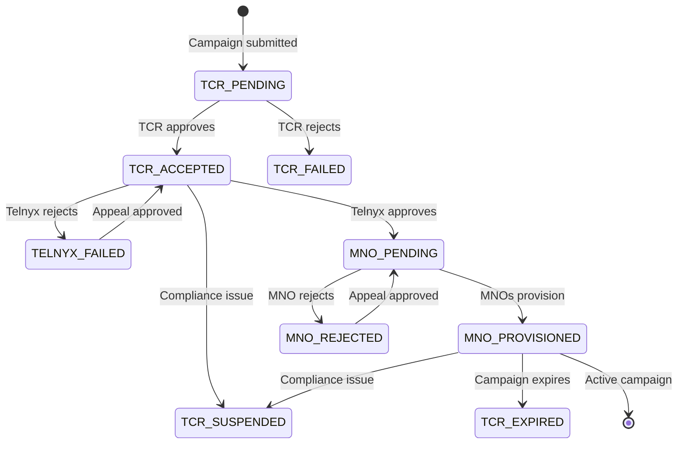

# 10DLC event notifications

Configure webhooks to receive real-time notifications about 10DLC brand registrations, campaign status changes, and phone number assignments.

You can choose to be notified about events on your 10DLC Brands, Campaigns and Phone Numbers by configuring webhooks.

For this mechanism to work, you'll need a publicly accessible HTTP server that can receive our webhook requests at one or more specified URLs. We highly recommend using HTTPS (instead of HTTP). [This tutorial](receive-sms-and-mms-messages.md) walks through setting up a basic application for receiving webhooks.

## Configuring webhooks

To receive notifications for brands you need to either provide the webhooks at the [creation](https://developers.telnyx.com/api-reference/brands/create-brand) of the brand or you may [update](https://developers.telnyx.com/api-reference/brands/update-brand) an existing brand. In both cases you have to pass your webhooks in the **webhookURL** and **webhookFailoverURL**.

**webhookFailoverURL** is optional. Here is an example of updating the webhooks of a brand:

<Callout type="info">
  *Don't forget to update `YOUR_API_KEY` here.*

```bash theme={null}
curl -X PUT https://api.telnyx.com/10dlc/brand/:brandid \
  -H 'Content-type: application/json' \
  -H 'Authorization: Bearer ' \
  -d '{"webhookURL":"https://mywebhooks.com/c5e5e598-95b3-4076-bfe2-c7d2c58ec57f", "webhookFailoverURL":"https://mywebhooks.com/ae20ec14-1c23-4275-add5-3290706b450f"}'
```

The same applies for campaign event notifications. Webhooks can be provided either upon campaign [creation](https://developers.telnyx.com/api-reference/campaign/submit-campaign) or through an [update](https://developers.telnyx.com/api-reference/campaign/update-campaign).

Webhooks configured for a campaign are also leveraged for event notifications with phone numbers associated with that campaign. Phone number notifications are triggered for shared campaigns as well.

## Types of events

### Overall structure of events

Here is an example of a webhook event:

```json theme={null}
{
  "data": {
    "event_type": "10dlc.brand.update",
    "id": "02d4f0e2-7a9d-4ebf-86b9-3df81e862d49",
    "occurred_at": "2024-08-07T17:22:37.328+00:00",
    "payload": {
      "brandId": "97091164-e814-435c-9c1b-14ab2d18e987",
      "brandName": "Some Brand LLC",
      "description": "Brand BBRAND1 is added",
      "eventType": "BRAND_ADD",
      "status": "success",
      "tcrBrandId": "BBRAND1",
      "type": "TCR_BRAND_UPDATE"
    },
    "record_type": "event"
  },
  "meta": {
    "attempt": 1,
    "delivered_to": "https://mywebhooks.com/310fda1a-d415-4827-837b-5f7e72657b65"
  }
}
```

Let's have a closer look at the data key:

| Field        | Description                                                                                                                                                                               |
| ------------ | ----------------------------------------------------------------------------------------------------------------------------------------------------------------------------------------- |
| event\_type  | We currently support 3 types of events: 10dlc.brand.update, 10dlc.campaign.update and 10dlc.phone\_number.update for updates related to brands, campaigns and phone numbers respectively. |
| id           | Unique ID of this event.                                                                                                                                                                  |
| occurred\_at | Timestamp of the event.                                                                                                                                                                   |
| payload      | The content of the payload varies according to the type of event. Below we listed the different payload types grouped by entity.                                                          |
| record\_type | Always `event` for webhook events.                                                                                                                                                        |

The `meta` object contains delivery metadata:

| Field         | Description                                                                 |
| ------------- | --------------------------------------------------------------------------- |
| attempt       | The delivery attempt number, starting at 1. Useful for identifying retries. |
| delivered\_to | The webhook URL where this event was sent.                                  |

### Brand events

| Payload type             | Description                                                                                                                               |
| ------------------------ | ----------------------------------------------------------------------------------------------------------------------------------------- |
| REGISTRATION             | Failures during the registration process. The payload will contain a field called reasons with more details about the errors encountered. |
| REVET                    | Success of the revetting request operation. See the [revet brand endpoint](https://developers.telnyx.com/api-reference/brands/revet-brand) for more details.           |
| ORDER\_EXTERNAL\_VETTING | Notification on the process of ordering an external vetting. The status field indicates if the order succeeded or failed.                 |
| TCR\_BRAND\_UPDATE       | Notifications received from TCR. The table below has a list of all TCR events that are included here.                                     |

Here is a list of all TCR events under the **TCR\_BRAND\_UPDATE** type:

| TCR Event               | Description                      |
| ----------------------- | -------------------------------- |
| BRAND\_ADD              | Brand successfully added on TCR. |
| BRAND\_APPEAL\_ADD      | A Brand appeal was added.        |
| BRAND\_APPEAL\_COMPLETE | The result of a brand appeal.    |
| BRAND\_REVET            | Result of a brand revet request. |

Here is an example of a **REGISTRATION** notification:

```json theme={null}
{
  "data": {
    "event_type": "10dlc.brand.update",
    "id": "456abc67-7a9d-4ebf-86b9-3df81e862d49",
    "occurred_at": "2024-08-07T17:22:37.328+00:00",
    "payload": {
      "brandId": "b0e2ec67-b26f-4c77-affc-d10f4d1780d3",
      "status": "failed",
      "type": "REGISTRATION",
      "reasons": [
        {
          "fields": [
            "ein"
          ],
          "description": "Invalid EIN - EIN is a nine-digit number. The format is XX-XXXXXXX. The \"-\" symbol is also accepted."
        }
      ]
    },
    "record_type": "event"
  },
  "meta": {
    "attempt": 1,
    "delivered_to": "https://mywebhooks.com/310fda1a-d415-4827-837b-5f7e72657b65"
  }
}
```

Here is an example of a **TCR\_BRAND\_UPDATE** notification:

```json theme={null}
{
  "data": {
    "event_type": "10dlc.brand.update",
    "id": "02d4f0e2-7a9d-4ebf-86b9-3df81e862d49",
    "occurred_at": "2024-08-07T17:22:37.328+00:00",
    "payload": {
      "brandId": "97091164-e814-435c-9c1b-14ab2d18e987",
      "brandName": "Some Brand LLC",
      "description": "Brand BBRAND1 is added",
      "eventType": "BRAND_ADD",
      "status": "success",
      "tcrBrandId": "BBRAND1",
      "type": "TCR_BRAND_UPDATE"
    },
    "record_type": "event"
  },
  "meta": {
    "attempt": 1,
    "delivered_to": "https://mywebhooks.com/310fda1a-d415-4827-837b-5f7e72657b65"
  }
}
```

Here is an example of an **ORDER\_EXTERNAL\_VETTING** notification:

```json theme={null}
{
  "data": {
    "event_type": "10dlc.brand.update",
    "id": "a1b2c345-6789-4def-a123-456789abcdef",
    "occurred_at": "2024-08-07T17:22:37.328+00:00",
    "payload": {
      "brandId": "97091164-e814-435c-9c1b-14ab2d18e987",
      "status": "success",
      "type": "ORDER_EXTERNAL_VETTING",
      "reasons": []
    },
    "record_type": "event"
  },
  "meta": {
    "attempt": 1,
    "delivered_to": "https://mywebhooks.com/310fda1a-d415-4827-837b-5f7e72657b65"
  }
}
```

Here is an example of a **REVET** notification:

```json theme={null}
{
  "data": {
    "event_type": "10dlc.brand.update",
    "id": "def45678-90ab-cdef-1234-567890abcdef",
    "occurred_at": "2024-08-07T17:22:37.328+00:00",
    "payload": {
      "brandId": "97091164-e814-435c-9c1b-14ab2d18e987",
      "status": "success",
      "type": "REVET",
      "reasons": []
    },
    "record_type": "event"
  },
  "meta": {
    "attempt": 1,
    "delivered_to": "https://mywebhooks.com/310fda1a-d415-4827-837b-5f7e72657b65"
  }
}
```

### Campaign events

| Payload type                | Description                                                                                                                                                                                                              |
| --------------------------- | ------------------------------------------------------------------------------------------------------------------------------------------------------------------------------------------------------------------------ |
| REGISTRATION                | Notifications about failures during the registration process. The errors will be listed in the reasons field of the payload.                                                                                             |
| TELNYX\_REVIEW              | Telnyx internal compliance review notification. Sent when Telnyx approves or rejects a campaign. The status field contains `ACCEPTED` or `REJECTED`. The description field contains the TCR campaign ID (e.g., C6X6M95). |
| NUMBER\_POOL\_PROVISIONED   | Success on provisioning a number pool.                                                                                                                                                                                   |
| NUMBER\_POOL\_DEPROVISIONED | Success on deprovisioning a number pool.                                                                                                                                                                                 |
| TCR\_EVENT                  | Notification received from TCR. See table below for specific event types.                                                                                                                                                |
| MNO\_REVIEW                 | MNO/DCA review results. The status field contains `ACCEPTED` or `REJECTED`. In case of rejection, the description field provides a reason.                                                                               |
| TELNYX\_EVENT               | Telnyx system events such as campaign suspension. The status field contains `DORMANT` for suspended campaigns.                                                                                                           |
| VERIFIED                    | Campaign has been successfully provisioned with MNOs. Sent when campaign reaches `MNO_PROVISIONED` status.                                                                                                               |

Here is a list of TCR events under the **TCR\_EVENT** type:

| TCR Event                             | Description                                                                              |
| ------------------------------------- | ---------------------------------------------------------------------------------------- |
| CAMPAIGN\_ADD                         | Campaign successfully added to TCR.                                                      |
| CAMPAIGN\_BILLED                      | Campaign billing event from TCR.                                                         |
| CAMPAIGN\_DCA\_COMPLETE               | DCA processing complete for campaign.                                                    |
| CAMPAIGN\_EXPIRED                     | Campaign has expired.                                                                    |
| CAMPAIGN\_NUDGE                       | Nudge event sent by partner CSP to trigger campaign re-review after appeal or rejection. |
| CAMPAIGN\_RESUBMISSION                | Campaign has been resubmitted.                                                           |
| CAMPAIGN\_UPDATE                      | Campaign has been updated.                                                               |
| MNO\_CAMPAIGN\_OPERATION\_APPROVED    | MNO has approved the campaign.                                                           |
| MNO\_CAMPAIGN\_OPERATION\_REJECTED    | MNO has rejected the campaign.                                                           |
| MNO\_CAMPAIGN\_OPERATION\_REVIEW      | Campaign is under MNO review.                                                            |
| MNO\_CAMPAIGN\_OPERATION\_SUSPENDED   | MNO has suspended the campaign.                                                          |
| MNO\_CAMPAIGN\_OPERATION\_UNSUSPENDED | MNO has unsuspended the campaign.                                                        |

Here is an example of a campaign **REGISTRATION** failure notification:

```json theme={null}
{
  "data": {
    "event_type": "10dlc.campaign.update",
    "id": "c3d4e567-8901-4bcd-ef23-456789012345",
    "occurred_at": "2024-08-07T17:22:37.328+00:00",
    "payload": {
      "campaignId": "751c6a5c-907b-43a9-8ada-ba1dc8335b07",
      "status": "failed",
      "type": "REGISTRATION",
      "reasons": [
        {
          "fields": ["sample1"],
          "description": "Sample message does not contain required opt-out language"
        }
      ]
    },
    "record_type": "event"
  },
  "meta": {
    "attempt": 1,
    "delivered_to": "https://mywebhooks.com/310fda1a-d415-4827-837b-5f7e72657b65"
  }
}
```

Here is an example of a **NUMBER\_POOL\_PROVISIONED** notification:

```json theme={null}
{
  "data": {
    "event_type": "10dlc.campaign.update",
    "id": "d4e5f678-9012-4cde-f345-678901234567",
    "occurred_at": "2024-08-07T17:22:37.328+00:00",
    "payload": {
      "brandId": "97091164-e814-435c-9c1b-14ab2d18e987",
      "campaignId": "751c6a5c-907b-43a9-8ada-ba1dc8335b07",
      "type": "NUMBER_POOL_PROVISIONED"
    },
    "record_type": "event"
  },
  "meta": {
    "attempt": 1,
    "delivered_to": "https://mywebhooks.com/310fda1a-d415-4827-837b-5f7e72657b65"
  }
}
```

Here is an example of a **NUMBER\_POOL\_DEPROVISIONED** notification:

```json theme={null}
{
  "data": {
    "event_type": "10dlc.campaign.update",
    "id": "e5f6a789-0123-4def-a456-789012345678",
    "occurred_at": "2024-08-07T17:22:37.328+00:00",
    "payload": {
      "brandId": "97091164-e814-435c-9c1b-14ab2d18e987",
      "campaignId": "751c6a5c-907b-43a9-8ada-ba1dc8335b07",
      "type": "NUMBER_POOL_DEPROVISIONED"
    },
    "record_type": "event"
  },
  "meta": {
    "attempt": 1,
    "delivered_to": "https://mywebhooks.com/310fda1a-d415-4827-837b-5f7e72657b65"
  }
}
```

Here is an example of a **VERIFIED** notification:

```json theme={null}
{
  "data": {
    "event_type": "10dlc.campaign.update",
    "id": "456abc67-7a9d-4ebf-86b9-3df81e862d49",
    "occurred_at": "2024-08-07T17:22:37.328+00:00",
    "payload": {
      "brandId": "97091164-e814-435c-9c1b-14ab2d18e987",
      "campaignId": "751c6a5c-907b-43a9-8ada-ba1dc8335b07",
      "createdDate": "2024-07-06T14:22:37.328+00:00",
      "cspId": "CSPID1",
      "type": "VERIFIED",
      "isTMobileRegistered": true
    },
    "record_type": "event"
  },
  "meta": {
    "attempt": 1,
    "delivered_to": "https://mywebhooks.com/310fda1a-d415-4827-837b-5f7e72657b65"
  }
}
```

Here is an example of a **TELNYX\_REVIEW** notification (approval):

```json theme={null}
{
  "data": {
    "event_type": "10dlc.campaign.update",
    "id": "789def12-3a4b-5c6d-7e8f-9a0b1c2d3e4f",
    "occurred_at": "2024-08-07T17:22:37.328+00:00",
    "payload": {
      "campaignId": "751c6a5c-907b-43a9-8ada-ba1dc8335b07",
      "description": "C6X6M95 approved by Telnyx",
      "status": "ACCEPTED",
      "type": "TELNYX_REVIEW"
    },
    "record_type": "event"
  },
  "meta": {
    "attempt": 1,
    "delivered_to": "https://mywebhooks.com/310fda1a-d415-4827-837b-5f7e72657b65"
  }
}
```

Here is an example of a **TELNYX\_EVENT** notification (campaign suspension):

```json theme={null}
{
  "data": {
    "event_type": "10dlc.campaign.update",
    "id": "a1b2c345-6789-4def-a123-456789abcdef",
    "occurred_at": "2024-08-07T17:22:37.328+00:00",
    "payload": {
      "campaignId": "751c6a5c-907b-43a9-8ada-ba1dc8335b07",
      "description": "Campaign has been marked as dormant",
      "status": "DORMANT",
      "type": "TELNYX_EVENT"
    },
    "record_type": "event"
  },
  "meta": {
    "attempt": 1,
    "delivered_to": "https://mywebhooks.com/310fda1a-d415-4827-837b-5f7e72657b65"
  }
}
```

Here is an example of an **MNO\_REVIEW** notification (rejection):

```json theme={null}
{
  "data": {
    "event_type": "10dlc.campaign.update",
    "id": "def45678-90ab-cdef-1234-567890abcdef",
    "occurred_at": "2024-08-07T17:22:37.328+00:00",
    "payload": {
      "campaignId": "751c6a5c-907b-43a9-8ada-ba1dc8335b07",
      "description": "Campaign rejected by T-Mobile due to insufficient opt-out instructions",
      "status": "REJECTED",
      "type": "MNO_REVIEW"
    },
    "record_type": "event"
  },
  "meta": {
    "attempt": 1,
    "delivered_to": "https://mywebhooks.com/310fda1a-d415-4827-837b-5f7e72657b65"
  }
}
```

Here is an example of a **TCR\_EVENT** notification:

```json theme={null}
{
  "data": {
    "event_type": "10dlc.campaign.update",
    "id": "fed98765-4321-dcba-9876-543210fedcba",
    "occurred_at": "2024-08-07T17:22:37.328+00:00",
    "payload": {
      "campaignId": "751c6a5c-907b-43a9-8ada-ba1dc8335b07",
      "type": "TCR_EVENT",
      "eventType": "CAMPAIGN_ADD",
      "description": "Campaign C6X6M95 successfully added to TCR"
    },
    "record_type": "event"
  },
  "meta": {
    "attempt": 1,
    "delivered_to": "https://mywebhooks.com/310fda1a-d415-4827-837b-5f7e72657b65"
  }
}
```

<Callout type="info">
  Note: The `campaignId` field in webhooks contains the Telnyx UUID, not the TCR campaign ID. The TCR campaign ID (e.g., C6X6M95) may appear in the `description` field.

### Phone number events

| Payload type   | Description                                                                                                                                                                              |
| -------------- | ---------------------------------------------------------------------------------------------------------------------------------------------------------------------------------------- |
| ASSIGNMENT     | Notifications about the phone number assignment process. In case of failure, an error message is displayed in the reasons field. That field is empty in case of a successful assignment. |
| DELETION       | Notifications about the phone number removal process. In case of failure, an error message is displayed in the reasons field. That field is empty in case of a successful removal.       |
| STATUS\_UPDATE | The status of the phone number was updated. The new status is shown in the status field.                                                                                                 |

<Callout type="info">
  Phone numbers in webhook payloads use E.164 format (e.g., `+16715455939`), which includes the country code prefix.

Here is an example of a successful **ASSIGNMENT** notification:

```json theme={null}
{
  "data": {
    "event_type": "10dlc.phone_number.update",
    "id": "123abc67-7a9d-4ebf-86b9-3df81e862d49",
    "occurred_at": "2024-08-07T17:22:37.328+00:00",
    "payload": {
      "campaignId": "751c6a5c-907b-43a9-8ada-ba1dc8335b07",
      "phoneNumber": "+16715455939",
      "status": "success",
      "type": "ASSIGNMENT",
      "reasons": []
    },
    "record_type": "event"
  },
  "meta": {
    "attempt": 1,
    "delivered_to": "https://mywebhooks.com/310fda1a-d415-4827-837b-5f7e72657b65"
  }
}
```

Here is an example of a **STATUS\_UPDATE** notification:

```json theme={null}
{
  "data": {
    "event_type": "10dlc.phone_number.update",
    "id": "789def12-3a4b-5c6d-7e8f-9a0b1c2d3e4f",
    "occurred_at": "2024-08-07T17:22:37.328+00:00",
    "payload": {
      "campaignId": "751c6a5c-907b-43a9-8ada-ba1dc8335b07",
      "tcrCampaignId": "C6X6M95",
      "phoneNumber": "+16715455939",
      "status": "ADDED",
      "type": "STATUS_UPDATE"
    },
    "record_type": "event"
  },
  "meta": {
    "attempt": 1,
    "delivered_to": "https://mywebhooks.com/310fda1a-d415-4827-837b-5f7e72657b65"
  }
}
```

<Callout type="info">
  The `status` field in STATUS\_UPDATE notifications can be: `ADDED`, `DELETED`, `PENDING`, or `FAILED`.

Here is an example of a **DELETION** notification:

```json theme={null}
{
  "data": {
    "event_type": "10dlc.phone_number.update",
    "id": "b2c3d456-7890-4abc-def1-234567890abc",
    "occurred_at": "2024-08-07T17:22:37.328+00:00",
    "payload": {
      "campaignId": "751c6a5c-907b-43a9-8ada-ba1dc8335b07",
      "phoneNumber": "+16715455939",
      "status": "success",
      "type": "DELETION",
      "reasons": []
    },
    "record_type": "event"
  },
  "meta": {
    "attempt": 1,
    "delivered_to": "https://mywebhooks.com/310fda1a-d415-4827-837b-5f7e72657b65"
  }
}
```

## Campaign Appeals and Nudging Mechanisms

When campaigns are rejected, there are different flows for getting them back into the compliance review queue depending on the campaign type and rejection reason.

### Native Campaign Appeals

For **native campaigns** rejected due to external factors (e.g., website compliance issues), customers can use the campaign appeal endpoint after addressing the issues:

**API Endpoint:**

```bash theme={null}
curl -X POST 'https://api.telnyx.com/10dlc/campaign/{campaignId}/appeal' \
  -H 'Authorization: Bearer YOUR_API_KEY' \
  -H 'Content-Type: application/json' \
  -d '{
    "appealReason": "The website has been updated to include the required privacy policy and terms of service."
  }'
```

This will update the campaign status from `TELNYX_FAILED` to `TCR_ACCEPTED` and re-enter the compliance review queue.

### Partner Campaign Nudging

For **partner campaigns**, the appeal process involves the CSP (Campaign Service Provider) sending a `CAMPAIGN_NUDGE` event after reviewing and approving customer changes:

**CAMPAIGN\_NUDGE Webhook Payload Example:**

```json theme={null}
{
  "data": {
    "event_type": "10dlc.campaign.update",
    "id": "example-event-id",
    "occurred_at": "2025-07-30T11:07:51.259711+00:00",
    "payload": {
      "campaignId": "C4D06C2F",
      "type": "CAMPAIGN_NUDGE",
      "nudgeIntent": "APPEAL_REJECTION",
      "description": "The campaign has been reviewed and approved after appeal.",
      "cspId": "TNX"
    },
    "record_type": "event"
  },
  "meta": {
    "attempt": 1,
    "delivered_to": "https://your-webhook-url.com"
  }
}
```

<Callout type="info">
  Note: `CAMPAIGN_NUDGE` events originate from TCR and use the TCR campaign ID format (e.g., `C4D06C2F`) in the `campaignId` field, unlike other campaign webhooks which use the Telnyx UUID.

### Campaign Appeal Scenarios

There are several specific scenarios where campaign appeals may be needed:

#### 1. Native Campaign Rejected for Content Issues

When a customer submits a native campaign and Telnyx rejects it due to issues with the campaign content (e.g., unclear sample messages), the customer can make adjustments to their campaign. Using the campaign update endpoint will automatically reset the campaign's status to `TCR_ACCEPTED` so it goes back into the compliance team's review queue.

#### 2. Native Campaign Rejected for External Factors

When a customer submits a native campaign and Telnyx rejects it due to factors outside the campaign object (e.g., website compliance requirements), the customer must:

* Fix the external issues (e.g., update website with required privacy policy).
* Use the appeal API endpoint to get their campaign back in the review queue.

**Example failure reason:**

```json theme={null}
{
  "reason": "Website does not meet compliance requirements."
}
```

**After fixes are made, the appeal request:**

```bash theme={null}
curl -X POST 'https://api.telnyx.com/10dlc/campaign/{campaignId}/appeal' \
  -H 'Authorization: Bearer YOUR_API_KEY' \
  -H 'Content-Type: application/json' \
  -d '{
    "appealReason": "The website has been updated to include the required privacy policy and terms of service."
  }'
```

#### 3. Partner Campaign Rejected (Any Reason)

For partner campaigns rejected for either content issues or external factors, the process involves the CSP:

* Customer makes required adjustments based on rejection reasons.
* CSP reviews the changes and approves them.
* CSP forwards a `CAMPAIGN_NUDGE` event to Telnyx.
* Campaign status changes from `TELNYX_FAILED` to `TCR_ACCEPTED` and re-enters compliance review.

<Callout type="warning">
  This nudging mechanism for partner campaigns cannot work with native campaigns.

#### 4. DCA Rejection for External Factors

When Telnyx accepts a campaign but the Direct Connect Aggregator (DCA) rejects it due to external factors:

* Customer makes required external changes (e.g., website updates).
* Customer notifies Telnyx via appropriate appeal mechanism (scenarios 2 or 3).
* Once Telnyx approves the changes, Telnyx generates a nudge webhook that the DCA receives.
* Campaign re-enters DCA review queue.

#### 5. DCA Rejection for Content Issues

When the DCA rejects a campaign due to campaign content issues:

* Customer updates campaign content (e.g., sample messages).
* Customer notifies Telnyx via appropriate appeal mechanism (scenarios 1 or 3).
* Once Telnyx approves the changes, Telnyx generates a nudge webhook that the DCA receives.
* Campaign re-enters DCA review queue.

### Campaign status flow

The following diagram shows the campaign lifecycle including both success and failure paths:



#### Success path statuses

| Status           | Description                                                            |
| ---------------- | ---------------------------------------------------------------------- |
| TCR\_PENDING     | Campaign is pending review at The Campaign Registry (TCR).             |
| TCR\_ACCEPTED    | Campaign has been accepted by TCR and is ready for Telnyx/MNO review.  |
| MNO\_PENDING     | Campaign is pending provisioning with Mobile Network Operators (MNOs). |
| MNO\_PROVISIONED | Campaign has been successfully provisioned with all MNOs.              |

#### Failure and suspension statuses

| Status         | Description                                                         |
| -------------- | ------------------------------------------------------------------- |
| TCR\_FAILED    | Campaign was rejected by TCR during initial registration.           |
| TELNYX\_FAILED | Campaign was rejected by Telnyx compliance review. Can be appealed. |
| MNO\_REJECTED  | Campaign was rejected by one or more MNOs. Can be appealed.         |
| TCR\_SUSPENDED | Campaign has been suspended due to compliance issues.               |
| TCR\_EXPIRED   | Campaign has expired and is no longer active.                       |

### Campaign appeal status flow

The typical status flow for campaign appeals is:

1. **Initial rejection**: Campaign status becomes `TELNYX_FAILED`.
2. **Customer action**: Customer addresses the rejection reasons.
3. **Appeal submission**:
   * Native campaigns: Use appeal API endpoint or campaign update.
   * Partner campaigns: CSP sends `CAMPAIGN_NUDGE`.
4. **Re-review**: Campaign status changes to `TCR_ACCEPTED` and re-enters compliance review.

<Callout type="info">
  The nudging mechanism for partner campaigns cannot be used with native campaigns. Native campaigns must use the direct appeal API endpoint or campaign update functionality.

## Process webhooks with SDK examples

Handle 10DLC event notifications in your application to track registration status, respond to failures, and automate workflows:

  ```python
  from flask import Flask, request, jsonify
  import logging

  app = Flask(__name__)
  logger = logging.getLogger(__name__)

  @app.route("/webhooks/10dlc", methods=["POST"])
  def handle_10dlc_webhook():
      """Process 10DLC event notifications."""
      event = request.json
      data = event["data"]
      event_type = data["event_type"]
      payload = data["payload"]
      event_id = data["id"]

      # Deduplicate — store processed event IDs
      if is_duplicate(event_id):
          return jsonify({"status": "already_processed"}), 200

      if event_type == "10dlc.brand.update":
          handle_brand_event(payload)
      elif event_type == "10dlc.campaign.update":
          handle_campaign_event(payload)
      elif event_type == "10dlc.phone_number.update":
          handle_phone_number_event(payload)

      mark_processed(event_id)
      return jsonify({"status": "ok"}), 200

  def handle_brand_event(payload):
      brand_id = payload["brandId"]
      event_type = payload["type"]
      status = payload.get("status", "")

      if event_type == "REGISTRATION" and status == "failed":
          reasons = payload.get("reasons", [])
          logger.error(f"Brand {brand_id} registration failed: {reasons}")
          alert_team(f"10DLC brand registration failed: {reasons}")

      elif event_type == "TCR_BRAND_UPDATE":
          tcr_event = payload.get("eventType", "")
          if tcr_event == "BRAND_ADD":
              logger.info(f"Brand {brand_id} added to TCR")
          elif tcr_event == "BRAND_REVET":
              logger.info(f"Brand {brand_id} revet completed: {status}")

      elif event_type == "ORDER_EXTERNAL_VETTING":
          logger.info(f"Brand {brand_id} vetting order: {status}")

  def handle_campaign_event(payload):
      campaign_id = payload.get("campaignId", "")
      event_type = payload["type"]
      status = payload.get("status", "")

      if event_type == "REGISTRATION" and status == "failed":
          reasons = payload.get("reasons", [])
          logger.error(f"Campaign {campaign_id} registration failed: {reasons}")

      elif event_type == "TELNYX_REVIEW":
          if status == "ACCEPTED":
              logger.info(f"Campaign {campaign_id} approved by Telnyx")
          elif status == "REJECTED":
              logger.warning(f"Campaign {campaign_id} rejected by Telnyx")

      elif event_type == "MNO_REVIEW":
          logger.info(f"Campaign {campaign_id} MNO review: {status}")

      elif event_type == "VERIFIED":
          logger.info(f"Campaign {campaign_id} fully provisioned!")
          # Campaign is ready — you can start sending messages

  def handle_phone_number_event(payload):
      phone = payload.get("phoneNumber", "")
      status = payload.get("status", "")
      logger.info(f"Phone number {phone} 10DLC status: {status}")
  ```

  ```javascript
  import express from 'express';

  const app = express();
  app.use(express.json());

  const processedEvents = new Set();

  app.post('/webhooks/10dlc', (req, res) => {
    const { data } = req.body;
    const { event_type, payload, id: eventId } = data;

    // Deduplicate
    if (processedEvents.has(eventId)) {
      return res.json({ status: 'already_processed' });
    }

    switch (event_type) {
      case '10dlc.brand.update':
        handleBrandEvent(payload);
        break;
      case '10dlc.campaign.update':
        handleCampaignEvent(payload);
        break;
      case '10dlc.phone_number.update':
        handlePhoneNumberEvent(payload);
        break;
    }

    processedEvents.add(eventId);
    res.json({ status: 'ok' });
  });

  function handleBrandEvent(payload) {
    const { brandId, type, status, reasons } = payload;

    if (type === 'REGISTRATION' && status === 'failed') {
      console.error(`Brand ${brandId} registration failed:`, reasons);
      alertTeam(`10DLC brand registration failed: ${JSON.stringify(reasons)}`);
    } else if (type === 'TCR_BRAND_UPDATE') {
      console.log(`Brand ${brandId} TCR event: ${payload.eventType} (${status})`);
    } else if (type === 'ORDER_EXTERNAL_VETTING') {
      console.log(`Brand ${brandId} vetting: ${status}`);
    }
  }

  function handleCampaignEvent(payload) {
    const { campaignId, type, status, reasons } = payload;

    if (type === 'REGISTRATION' && status === 'failed') {
      console.error(`Campaign ${campaignId} failed:`, reasons);
    } else if (type === 'TELNYX_REVIEW') {
      console.log(`Campaign ${campaignId} Telnyx review: ${status}`);
    } else if (type === 'VERIFIED') {
      console.log(`Campaign ${campaignId} fully provisioned — ready to send!`);
    }
  }

  function handlePhoneNumberEvent(payload) {
    console.log(`Phone ${payload.phoneNumber} status: ${payload.status}`);
  }

  app.listen(3000, () => console.log('Webhook server running on port 3000'));
  ```

  ```ruby
  require "sinatra"
  require "json"

  processed_events = Set.new

  post "/webhooks/10dlc" do
    event = JSON.parse(request.body.read)
    data = event["data"]
    event_type = data["event_type"]
    payload = data["payload"]
    event_id = data["id"]

    return { status: "already_processed" }.to_json if processed_events.include?(event_id)

    case event_type
    when "10dlc.brand.update"
      if payload["type"] == "REGISTRATION" && payload["status"] == "failed"
        puts "Brand #{payload['brandId']} registration failed: #{payload['reasons']}"
      else
        puts "Brand #{payload['brandId']} event: #{payload['type']} (#{payload['status']})"
      end
    when "10dlc.campaign.update"
      if payload["type"] == "VERIFIED"
        puts "Campaign #{payload['campaignId']} fully provisioned!"
      else
        puts "Campaign event: #{payload['type']} (#{payload['status']})"
      end
    when "10dlc.phone_number.update"
      puts "Phone #{payload['phoneNumber']} status: #{payload['status']}"
    end

    processed_events.add(event_id)
    { status: "ok" }.to_json
  end
  ```

  ```go
  package main

  import (
    "encoding/json"
    "fmt"
    "log"
    "net/http"
    "sync"
  )

  var (
    processed = make(map[string]bool)
    mu        sync.Mutex
  )

  type WebhookEvent struct {
    Data struct {
      EventType string                 `json:"event_type"`
      ID        string                 `json:"id"`
      Payload   map[string]interface{} `json:"payload"`
    } `json:"data"`
  }

  func handler(w http.ResponseWriter, r *http.Request) {
    var event WebhookEvent
    json.NewDecoder(r.Body).Decode(&event)

    mu.Lock()
    if processed[event.Data.ID] {
      mu.Unlock()
      json.NewEncoder(w).Encode(map[string]string{"status": "already_processed"})
      return
    }
    processed[event.Data.ID] = true
    mu.Unlock()

    p := event.Data.Payload
    switch event.Data.EventType {
    case "10dlc.brand.update":
      log.Printf("Brand %s event: %s (%s)", p["brandId"], p["type"], p["status"])
    case "10dlc.campaign.update":
      if p["type"] == "VERIFIED" {
        log.Printf("Campaign %s fully provisioned!", p["campaignId"])
      } else {
        log.Printf("Campaign %s event: %s (%s)", p["campaignId"], p["type"], p["status"])
      }
    case "10dlc.phone_number.update":
      log.Printf("Phone %s status: %s", p["phoneNumber"], p["status"])
    }

    w.Header().Set("Content-Type", "application/json")
    fmt.Fprintf(w, `{"status":"ok"}`)
  }

  func main() {
    http.HandleFunc("/webhooks/10dlc", handler)
    log.Println("Webhook server on :3000")
    log.Fatal(http.ListenAndServe(":3000", nil))
  }
  ```

  ```php
  <?php
  $processedEvents = [];

  $input = json_decode(file_get_contents('php://input'), true);
  $data = $input['data'];
  $eventType = $data['event_type'];
  $payload = $data['payload'];
  $eventId = $data['id'];

  header('Content-Type: application/json');

  if (in_array($eventId, $processedEvents)) {
      echo json_encode(['status' => 'already_processed']);
      exit;
  }

  switch ($eventType) {
      case '10dlc.brand.update':
          if ($payload['type'] === 'REGISTRATION' && $payload['status'] === 'failed') {
              error_log("Brand {$payload['brandId']} registration failed: " . json_encode($payload['reasons']));
          } else {
              error_log("Brand {$payload['brandId']} event: {$payload['type']} ({$payload['status']})");
          }
          break;

      case '10dlc.campaign.update':
          if ($payload['type'] === 'VERIFIED') {
              error_log("Campaign {$payload['campaignId']} fully provisioned!");
          } else {
              error_log("Campaign event: {$payload['type']} ({$payload['status']})");
          }
          break;

      case '10dlc.phone_number.update':
          error_log("Phone {$payload['phoneNumber']} status: {$payload['status']}");
          break;
  }

  echo json_encode(['status' => 'ok']);
  ```

> **Note:** **Important:** Always return a `200` response immediately, then process the webhook asynchronously. For production applications, use a message queue (Redis, RabbitMQ, SQS) to decouple webhook receipt from processing.

***

## Webhook delivery

### Retry policy

If your webhook endpoint returns a non-2xx HTTP status code or times out, Telnyx will retry delivery. The `meta.attempt` field in the webhook payload indicates which delivery attempt this is (starting at 1).

* **Default retry attempts:** 5
* **Default retry interval:** 30 seconds between attempts

After 5 failed attempts, the webhook will be marked as failed and no further retries will be made.

### Best practices

* **Return 2xx quickly**: Return a 200 response as soon as possible, then process the webhook asynchronously.
* **Handle duplicates**: Webhooks may be delivered more than once. Use the `id` field to deduplicate.
* **Use HTTPS**: Always use HTTPS endpoints to ensure webhook data is encrypted in transit.
* **Verify the source**: Consider implementing signature verification for added security.
* **Set up failover**: Configure a `webhookFailoverURL` to receive webhooks if your primary endpoint is unavailable.

### Testing webhooks locally

During development, you can use tunneling tools to expose your local server to the internet for webhook testing:

1. **ngrok**: Run `ngrok http 3000` to create a public URL that forwards to your local port 3000.
2. **Cloudflare Tunnel**: Use `cloudflared tunnel` for a similar tunneling solution.
3. **localtunnel**: Run `lt --port 3000` for a quick temporary URL.

Update your brand or campaign webhook URL to the tunnel URL, then monitor incoming webhooks as you trigger events in your 10DLC registration flow.

## Glossary

| Term  | Definition                                                                                                                         |
| ----- | ---------------------------------------------------------------------------------------------------------------------------------- |
| 10DLC | 10-Digit Long Code. Standard 10-digit phone numbers used for application-to-person (A2P) messaging.                                |
| CSP   | Campaign Service Provider. A company authorized to submit and manage campaigns on behalf of brands with The Campaign Registry.     |
| DCA   | Direct Connect Aggregator. An entity that has a direct connection to mobile carriers for message delivery.                         |
| MNO   | Mobile Network Operator. Wireless carriers such as T-Mobile, AT\&T, and Verizon that deliver SMS/MMS messages to end users.        |
| TCR   | The Campaign Registry. The central registry that manages brand and campaign registration for 10DLC messaging in the United States. |

## Related resources

  - [10DLC Quickstart](../tutorial/getting-started-with-10dlc.md) — Get started with 10DLC brand and campaign registration.

  - [10DLC Rate Limits](10dlc-rate-limits-throughput.md) — Understand throughput limits based on vetting scores.

  - [Receive Webhooks](receive-sms-and-mms-messages.md) — Set up a server to receive webhook notifications.

  - [Message Detail Records](message-detail-records.md) — Track delivery status and troubleshoot issues.


## Related Pages

- [Data Usage Notifications](../runbooks/data-usage-notifications.md)
- [React Native Push Notifications](../runbooks/react-native-push-notifications.md)
- [iOS Push Notifications](../runbooks/ios-push-notifications.md)
- [Android Push Notifications](../runbooks/android-push-notifications.md)
- [Flutter Push Notifications](../runbooks/flutter-push-notifications.md)
