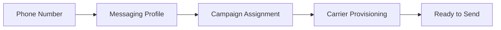

# 10DLC Phone Number Assignment

Assign phone numbers to 10DLC campaigns, manage bulk assignments, integrate with number pools, and troubleshoot common assignment failures.

After your [brand](../tutorial/getting-started-with-10dlc.md#step-1-create-a-brand) is registered and [campaign](10dlc-campaign-registration.md) is approved, you need to assign phone numbers to the campaign before sending messages. Only numbers assigned to an active campaign can send 10DLC A2P messages.

## How it works



| Requirement                 | Details                                                                                                            |
| --------------------------- | ------------------------------------------------------------------------------------------------------------------ |
| **Number type**             | US long code (10-digit) numbers only                                                                               |
| **Messaging profile**       | Number must be assigned to a [messaging profile](../concepts/messaging-profiles-overview.md) first |
| **Campaign status**         | Campaign must be `ACTIVE` (approved by carriers)                                                                   |
| **One campaign per number** | Each number can only be assigned to one campaign at a time                                                         |

> **Warning:** Numbers not assigned to an active 10DLC campaign will have messages filtered or blocked by carriers on AT\&T, T-Mobile, and other major US networks.

***

## Assign a number to a campaign

### API

      ```bash
      curl -X POST https://api.telnyx.com/v2/10dlc/phoneNumberCampaign \
        -H "Content-Type: application/json" \
        -H "Authorization: Bearer YOUR_API_KEY" \
        -d '{
          "phoneNumber": "+15551234567",
          "campaignId": "CAMPAIGN_ID"
        }'
      ```

      ```python
      import os
      import requests

      API_KEY = os.environ.get("TELNYX_API_KEY")
      headers = {
          "Authorization": f"Bearer {API_KEY}",
          "Content-Type": "application/json",
      }

      response = requests.post(
          "https://api.telnyx.com/v2/10dlc/phoneNumberCampaign",
          headers=headers,
          json={
              "phoneNumber": "+15551234567",
              "campaignId": "CAMPAIGN_ID",
          },
      )
      result = response.json()
      print(f"Number: {result['data']['phoneNumber']}")
      print(f"Status: {result['data']['status']}")
      ```

      ```javascript
      const axios = require('axios');

      const headers = {
        Authorization: `Bearer ${process.env.TELNYX_API_KEY}`,
        'Content-Type': 'application/json',
      };

      const response = await axios.post(
        'https://api.telnyx.com/v2/10dlc/phoneNumberCampaign',
        {
          phoneNumber: '+15551234567',
          campaignId: 'CAMPAIGN_ID',
        },
        { headers }
      );

      console.log(`Number: ${response.data.data.phoneNumber}`);
      console.log(`Status: ${response.data.data.status}`);
      ```

      ```ruby
      require "net/http"
      require "json"
      require "uri"

      uri = URI("https://api.telnyx.com/v2/10dlc/phoneNumberCampaign")
      http = Net::HTTP.new(uri.host, uri.port)
      http.use_ssl = true

      request = Net::HTTP::Post.new(uri)
      request["Authorization"] = "Bearer #{ENV['TELNYX_API_KEY']}"
      request["Content-Type"] = "application/json"
      request.body = {
        phoneNumber: "+15551234567",
        campaignId: "CAMPAIGN_ID"
      }.to_json

      response = http.request(request)
      result = JSON.parse(response.body)
      puts "Number: #{result['data']['phoneNumber']}"
      puts "Status: #{result['data']['status']}"
      ```

      ```go
      package main

      import (
      	"bytes"
      	"encoding/json"
      	"fmt"
      	"net/http"
      	"os"
      )

      func main() {
      	data := map[string]string{
      		"phoneNumber": "+15551234567",
      		"campaignId":  "CAMPAIGN_ID",
      	}

      	body, _ := json.Marshal(data)
      	req, _ := http.NewRequest("POST", "https://api.telnyx.com/v2/10dlc/phoneNumberCampaign", bytes.NewBuffer(body))
      	req.Header.Set("Authorization", "Bearer "+os.Getenv("TELNYX_API_KEY"))
      	req.Header.Set("Content-Type", "application/json")

      	resp, err := http.DefaultClient.Do(req)
      	if err != nil {
      		panic(err)
      	}
      	defer resp.Body.Close()

      	var result map[string]interface{}
      	json.NewDecoder(resp.Body).Decode(&result)
      	d := result["data"].(map[string]interface{})
      	fmt.Printf("Number: %s\nStatus: %s\n", d["phoneNumber"], d["status"])
      }
      ```

      ```php
      <?php
      $apiKey = getenv('TELNYX_API_KEY');

      $data = [
          'phoneNumber' => '+15551234567',
          'campaignId' => 'CAMPAIGN_ID',
      ];

      $ch = curl_init('https://api.telnyx.com/v2/10dlc/phoneNumberCampaign');
      curl_setopt_array($ch, [
          CURLOPT_POST => true,
          CURLOPT_RETURNTRANSFER => true,
          CURLOPT_HTTPHEADER => [
              "Authorization: Bearer {$apiKey}",
              'Content-Type: application/json',
          ],
          CURLOPT_POSTFIELDS => json_encode($data),
      ]);

      $response = json_decode(curl_exec($ch), true);
      curl_close($ch);

      echo "Number: {$response['data']['phoneNumber']}\n";
      echo "Status: {$response['data']['status']}\n";
      ```

      ```csharp .NET theme={null}
      using System.Net.Http.Headers;
      using System.Text;
      using System.Text.Json;

      var apiKey = Environment.GetEnvironmentVariable("TELNYX_API_KEY");
      var client = new HttpClient();
      client.DefaultRequestHeaders.Authorization =
          new AuthenticationHeaderValue("Bearer", apiKey);

      var data = new { phoneNumber = "+15551234567", campaignId = "CAMPAIGN_ID" };
      var json = JsonSerializer.Serialize(data);
      var content = new StringContent(json, Encoding.UTF8, "application/json");

      var response = await client.PostAsync(
          "https://api.telnyx.com/v2/10dlc/phoneNumberCampaign", content);
      var result = await response.Content.ReadAsStringAsync();

      using var doc = JsonDocument.Parse(result);
      var d = doc.RootElement.GetProperty("data");
      Console.WriteLine($"Number: {d.GetProperty("phoneNumber")}");
      Console.WriteLine($"Status: {d.GetProperty("status")}");
      ```

### Portal

1. **Open your campaign**

        Navigate to [Campaigns](https://portal.telnyx.com/#/messaging-10dlc/campaigns) and select the campaign you want to assign numbers to.

2. **Go to Assign Numbers**

        Click the **Assign Numbers** panel within your campaign details.

3. **Select messaging profile**

        Choose the messaging profile that contains the numbers you want to assign.

4. **Add numbers**

        Enter or select the phone numbers to assign to this campaign and click **Assign**.

***

## Bulk assignment

When assigning multiple numbers to the same campaign, loop through your numbers programmatically:

  ```python
  import os
  import requests
  import time

  API_KEY = os.environ.get("TELNYX_API_KEY")
  headers = {
      "Authorization": f"Bearer {API_KEY}",
      "Content-Type": "application/json",
  }

  campaign_id = "CAMPAIGN_ID"
  phone_numbers = [
      "+15551234567",
      "+15551234568",
      "+15551234569",
      "+15551234570",
      "+15551234571",
  ]

  results = {"success": [], "failed": []}

  for number in phone_numbers:
      try:
          response = requests.post(
              "https://api.telnyx.com/v2/10dlc/phoneNumberCampaign",
              headers=headers,
              json={"phoneNumber": number, "campaignId": campaign_id},
          )
          if response.status_code in (200, 201):
              results["success"].append(number)
              print(f"✓ {number} assigned")
          else:
              error = response.json().get("errors", [{}])[0].get("detail", "Unknown")
              results["failed"].append({"number": number, "error": error})
              print(f"✗ {number}: {error}")
      except Exception as e:
          results["failed"].append({"number": number, "error": str(e)})
      time.sleep(0.5)  # Rate limit safety

  print(f"\nAssigned: {len(results['success'])}, Failed: {len(results['failed'])}")
  ```

  ```javascript
  const axios = require('axios');

  const headers = {
    Authorization: `Bearer ${process.env.TELNYX_API_KEY}`,
    'Content-Type': 'application/json',
  };

  const campaignId = 'CAMPAIGN_ID';
  const phoneNumbers = [
    '+15551234567',
    '+15551234568',
    '+15551234569',
    '+15551234570',
    '+15551234571',
  ];

  const results = { success: [], failed: [] };

  for (const number of phoneNumbers) {
    try {
      await axios.post(
        'https://api.telnyx.com/v2/10dlc/phoneNumberCampaign',
        { phoneNumber: number, campaignId },
        { headers }
      );
      results.success.push(number);
      console.log(`✓ ${number} assigned`);
    } catch (err) {
      const detail = err.response?.data?.errors?.[0]?.detail || err.message;
      results.failed.push({ number, error: detail });
      console.log(`✗ ${number}: ${detail}`);
    }
    await new Promise((r) => setTimeout(r, 500)); // Rate limit safety
  }

  console.log(`\nAssigned: ${results.success.length}, Failed: ${results.failed.length}`);
  ```

  ```bash
  #!/bin/bash
  # Bulk assign numbers to a campaign
  CAMPAIGN_ID="CAMPAIGN_ID"
  NUMBERS=("+15551234567" "+15551234568" "+15551234569")

  for NUM in "${NUMBERS[@]}"; do
    RESULT=$(curl -s -w "\n%{http_code}" -X POST \
      https://api.telnyx.com/v2/10dlc/phoneNumberCampaign \
      -H "Content-Type: application/json" \
      -H "Authorization: Bearer $TELNYX_API_KEY" \
      -d "{\"phoneNumber\": \"$NUM\", \"campaignId\": \"$CAMPAIGN_ID\"}")

    HTTP_CODE=$(echo "$RESULT" | tail -1)
    if [ "$HTTP_CODE" = "200" ] || [ "$HTTP_CODE" = "201" ]; then
      echo "✓ $NUM assigned"
    else
      echo "✗ $NUM failed (HTTP $HTTP_CODE)"
    fi
    sleep 0.5
  done
  ```

***

## Number pool integration

If you're using [Number Pools](number-pool.md), numbers in the pool must also be assigned to a 10DLC campaign. The number pool distributes sending across multiple numbers, but each number still needs campaign registration.

5. **Create your campaign**

    Register your campaign via the [Campaign Registration](10dlc-campaign-registration.md) guide.

6. **Enable number pool on messaging profile**

    Configure your [messaging profile](../concepts/messaging-profiles-overview.md) with number pool enabled.

7. **Assign all pool numbers to the campaign**

    Every number in the pool must be assigned to the same campaign. Use the [bulk assignment](#bulk-assignment) method above.

8. **Verify assignments**

    List all numbers assigned to your campaign to confirm all pool numbers are included.

> **Warning:** If a number in your pool is **not** assigned to a campaign, messages sent from that number will be filtered by carriers. This creates inconsistent delivery — some messages succeed, others fail depending on which pool number is selected.

***

## List assigned numbers

  ```bash
  # List all numbers assigned to a campaign
  curl -s "https://api.telnyx.com/v2/10dlc/phoneNumberCampaign?filter[campaignId]=CAMPAIGN_ID" \
    -H "Authorization: Bearer YOUR_API_KEY" | jq '.data[] | {phoneNumber, status}'
  ```

  ```python
  response = requests.get(
      "https://api.telnyx.com/v2/10dlc/phoneNumberCampaign",
      headers=headers,
      params={"filter[campaignId]": campaign_id},
  )
  numbers = response.json()["data"]
  for n in numbers:
      print(f"{n['phoneNumber']} | {n['status']}")
  ```

  ```javascript
  const response = await axios.get(
    'https://api.telnyx.com/v2/10dlc/phoneNumberCampaign',
    {
      headers,
      params: { 'filter[campaignId]': campaignId },
    }
  );

  response.data.data.forEach((n) => {
    console.log(`${n.phoneNumber} | ${n.status}`);
  });
  ```

***

## Remove a number from a campaign

  ```bash
  curl -X DELETE "https://api.telnyx.com/v2/10dlc/phoneNumberCampaign/+15551234567" \
    -H "Authorization: Bearer YOUR_API_KEY"
  ```

  ```python
  response = requests.delete(
      "https://api.telnyx.com/v2/10dlc/phoneNumberCampaign/+15551234567",
      headers=headers,
  )
  print(f"Status: {response.status_code}")  # 200 = success
  ```

  ```javascript
  await axios.delete(
    'https://api.telnyx.com/v2/10dlc/phoneNumberCampaign/+15551234567',
    { headers }
  );
  console.log('Number removed from campaign');
  ```

> **Note:** Removing a number from a campaign means it can no longer send 10DLC messages. You can reassign it to a different campaign afterward.

***

## Troubleshooting

**Error: Number not found**

    **Cause:** The phone number isn't on your Telnyx account or isn't in E.164 format.

    **Fix:**

    * Verify the number is in your account: `GET /v2/phone_numbers?filter[phone_number]=+15551234567`
    * Ensure E.164 format: `+1` followed by 10 digits (e.g., `+15551234567`)

---

**Error: Number not assigned to a messaging profile**

    **Cause:** Numbers must be assigned to a messaging profile before campaign assignment.

    **Fix:**

    ```bash theme={null}
    # Assign number to a messaging profile first
    curl -X PATCH https://api.telnyx.com/v2/phone_numbers/+15551234567 \
      -H "Authorization: Bearer YOUR_API_KEY" \
      -H "Content-Type: application/json" \
      -d '{"messaging_profile_id": "PROFILE_ID"}'
    ```

---

**Error: Campaign not active**

    **Cause:** The campaign hasn't been approved by carriers yet.

    **Fix:**

    * Check campaign status: `GET /v2/10dlc/campaignBuilder/{campaignId}`
    * Wait for carrier approval (1-5 business days)
    * Set up [Event Notifications](10dlc-event-notifications.md) to get notified when the campaign is approved

---

**Error: Number already assigned to another campaign**

    **Cause:** Each number can only be assigned to one campaign at a time.

    **Fix:**

    1. Remove the number from the current campaign: `DELETE /v2/10dlc/phoneNumberCampaign/+15551234567`
    2. Assign it to the new campaign

---

**Messages still being filtered after assignment**

    **Cause:** Carrier provisioning takes time after assignment.

    **Fix:**

    * Wait 24-72 hours for all carriers to propagate
    * Check MNO metadata on the campaign for per-carrier status
    * Verify the number is sending the same type of content registered in the campaign
    * Check [Message Detail Records](message-detail-records.md) for specific error codes

---

**Bulk assignment partially failing**

    **Cause:** Some numbers may have issues while others succeed.

    **Fix:**

    * Check each error response for the specific reason
    * Common issues: number on different account, already assigned, not on messaging profile
    * Use the bulk assignment script above with error tracking to identify which numbers failed and why

---

***

## Next steps

  - [Campaign Registration](10dlc-campaign-registration.md) — Register your campaign use case before assigning numbers.

  - [Number Pool](number-pool.md) — Distribute sending across multiple numbers automatically.

  - [10DLC Rate Limits](10dlc-rate-limits-throughput.md) — Understand throughput per carrier and brand score.

  - [Send Your First Message](send-your-first-message.md) — Start sending once numbers are assigned and provisioned.


## Related Pages

- [Phone Number Reputation](../runbooks/phone-number-reputation.md)
